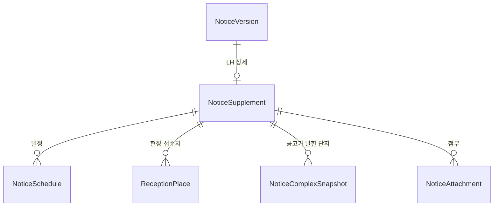
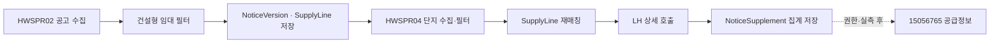

# 건설형 공공임대 원천 확장 설계

## 1. 목표

마이홈과 LH의 구조화 API에서 건설형 공공임대 단지와 임대 모집공고에 필요한 정보를 더 가져온다.
원천 API가 매입임대·전세임대·분양 데이터를 함께 주더라도 저장 경계에서 차단한다.

이번 변경은 다음 질문에 답할 수 있어야 한다.

- 이 단지와 공고가 건설형 공공임대인가?
- 신청·서류제출·계약은 언제 진행되는가?
- 현장 접수는 어디서 어떻게 하는가?
- 공고 당시 단지가 어떤 주소·난방·입주예정월로 안내됐는가?
- 적재하지 않은 행은 왜 제외됐으며, 다시 시도해야 하는 실패와 어떻게 다른가?

## 2. 원천 범위

| 데이터 | 공공데이터 번호 | 엔드포인트 | 역할 |
| --- | --- | --- | --- |
| 마이홈 단지 | `15110581` | `HWSPR04/rentalHouseGwList` | 단지·주택형 카탈로그 |
| 마이홈 공고 | `15108420` | `HWSPR02/rsdtRcritNtcList` | 공고버전·공급행 |
| LH 공고 상세 | `15057999` | `lhLeaseNoticeDtlInfo1/getLeaseNoticeDtlInfo1` | 일정·접수처·공고 단지·첨부·정정사유 |
| LH 공고별 공급정보 | `15056765` | `lhLeaseNoticeSplInfo1/getLeaseNoticeSplInfo1` | 주택형별 공급정보 후보 |

기존 문서의 LH 상세 번호 `15021183`은 현재 LH 입찰공고정보 번호이므로 `15057999`로 바로잡는다.

`15056765`는 공식 설명상 공공임대 주택형 목록을 제공하지만 현재 인증키에는 이용 권한이 없다.
권한을 받은 뒤 실제 임대 응답을 확인하기 전에는 도메인 엔티티나 컬럼을 만들지 않는다.

## 3. 적재 경계

### 3.1 허용 목록

`ConstructionRentalPolicy`가 적재 서비스보다 먼저 원천 행을 판정한다.

허용하는 공급유형은 다음 여덟 개다.

- 국민임대
- 영구임대
- 행복주택
- 통합공공임대
- 장기전세
- 5년임대
- 10년임대
- 50년임대

매입임대·전세임대·분양, 빈 공급유형, 처음 보는 공급유형은 저장하지 않는다. 새 원천 값은 자동 허용하지
않고 원문과 제외 사유를 남긴 뒤 허용 목록을 명시적으로 갱신한다.

### 3.2 단지 판정

단지 행은 공급유형 허용 목록을 통과한 뒤 다음 중 하나의 건설 흔적이 있어야 한다.

- 주택유형이 아파트다.
- 준공일이 있다.

이는 `10년임대`, `장기전세` 등으로 잘못 표시된 매입주택이 카탈로그에 들어오는 것을 한 번 더 막는다.

### 3.3 공고 판정

공고는 `pblancId`로 묶은 뒤 공고 단위로 판정한다.

1. 공고의 공급유형이 허용 목록에 있어야 한다.
2. `houseSn > 0`이며 단지명·주소·정상 PNU가 있는 공급행을 선별한다.
3. 유효한 공급행이 하나도 없으면 공고버전도 저장하지 않는다.
4. 일부 공급행만 잘못됐다면 잘못된 행은 제외하고 유효한 행으로 공고버전을 저장한다.

LH 상세와 향후 공급정보 API는 이미 저장된 허용 공고에 대해서만 호출한다. 보조 원천이 새로운 공고나
단지를 독자적으로 만들 수 없게 한다.

## 4. 도메인 모델

마이홈에서 만든 `NoticeVersion`은 계속 불변이다. LH가 나중에 알려 주는 값은 `NoticeVersion`을 수정하지
않고 별도의 불변 보충 스냅샷으로 저장한다.



### 4.1 `NoticeSupplement`

LH 상세 응답을 정상적으로 적재했다는 표식이자 자식들의 소유자다.

| 필드 | 필수 | 원천 | 의미 |
| --- | :---: | --- | --- |
| `id` | O | 내부 | PK |
| `noticeVersionId` | O | 연결 | 소유 공고버전, 유니크 |
| `sourceSystem` | O | 고정 | `LH_CHEONGYAK_PLUS` |
| `correctionReason` | X | `dsEtcInfo.CRC_RSN` | 정정·취소 사유 원문 |

정상 응답에 자식 행이 하나도 없어도 `NoticeSupplement`는 만든다. 이 행의 존재가 성공한 빈 응답과 아직
호출하지 않은 상태를 구분한다. 기존 `NoticeVersion.correctionReason`은 이 엔티티로 옮긴다.

### 4.2 `NoticeSchedule`

`dsSplScdl`의 한 행이다. 원천이 배열로 주므로 복수 행을 보존한다.

| 필드 | 원천 | 의미 |
| --- | --- | --- |
| `displayOrder` | 응답 순서 | 공고 상세 안 표시 순서 |
| `complexLabel` | `SBD_LGO_NM` | 일정에 붙은 원천 단지명 |
| `applicationPeriodText` | `ACP_DTTM` | 시간이 포함된 신청기간 원문 |
| `documentTargetAnnouncedOn` | `PPR_SBM_OPE_ANC_DT` | 서류제출대상자 발표일 |
| `documentSubmissionBeginOn` | `PPR_ACP_ST_DT` | 서류접수 시작일 |
| `documentSubmissionEndOn` | `PPR_ACP_CLSG_DT` | 서류접수 종료일 |
| `contractBeginOn` | `CTRT_ST_DT` | 계약 시작일 |
| `contractEndOn` | `CTRT_ED_DT` | 계약 종료일 |

마이홈에 이미 있는 접수 시작·종료일과 당첨자 발표일은 LH 값으로 덮어쓰거나 중복 저장하지 않는다.

### 4.3 `ReceptionPlace`

`dsCtrtPlc`의 한 행이다.

| 필드 | 원천 | 의미 |
| --- | --- | --- |
| `displayOrder` | 응답 순서 | 접수처 표시 순서 |
| `address` | `CTRT_PLC_ADR` | 접수처 주소 |
| `detailAddress` | `CTRT_PLC_DTL_ADR` | 건물·층·호 정보 |
| `operationBeginText` | `TSK_ST_DTTM` | 운영 시작 원문 |
| `operationEndText` | `TSK_ED_DTTM` | 운영 종료 원문 |
| `phone` | `SIL_OFC_TLNO` | 전화번호 |
| `guidance` | `SIL_OFC_GUD_FCTS` | 현장접수 대상·준비물 안내 |

운영기간은 날짜만 오거나 시간이 섞일 수 있으므로 원문을 보존한다.

### 4.4 `NoticeComplexSnapshot`

`dsSbd`의 한 행이다. 공고가 그 시점에 안내한 단지 정보이며 카탈로그 `HousingComplex`와 다르다.

| 필드 | 원천 | 의미 |
| --- | --- | --- |
| `displayOrder` | 응답 순서 | 단지 표시 순서 |
| `complexLabel` | `LCC_NT_NM` | 원천 단지명 |
| `lotAddress` | `LGDN_ADR` | 지번 기반 주소 |
| `lotDetailAddress` | `LGDN_DTL_ADR` | 상세주소 |
| `totalUnitCount` | `HSH_CNT` | 공고가 안내한 총세대수 |
| `heatingDescription` | `HTN_FMLA_DESC` | 난방 원문 |
| `exclusiveAreaRangeText` | `DDO_AR` | `55.83~55.99` 같은 전용면적 범위 |
| `expectedMoveInYearMonth` | `MVIN_XPC_YM` | 입주예정월, `YearMonth` |

LH 상세에는 PNU가 없고 주소·단지명 표기도 마이홈과 다르다. 따라서 `HousingComplex` FK를 두거나 이 값으로
카탈로그를 갱신하지 않는다.

### 4.5 `NoticeAttachment`

기존 필드 구조는 유지하되 소유 FK를 `NoticeVersion`에서 `NoticeSupplement`로 옮긴다. 공고문·카탈로그·
단지 이미지를 같은 테이블에 저장하고 이미지의 원천 단지명은 `complexLabel`로 남긴다.

### 4.6 유니크 제약

```text
notice_supplement          notice_version_id
notice_schedule            (notice_supplement_id, display_order)
reception_place            (notice_supplement_id, display_order)
notice_complex_snapshot    (notice_supplement_id, display_order)
notice_attachment          (notice_supplement_id, display_order)
```

## 5. 제외하는 원천 값

다음은 이번 데이터 이용 기준에 직접 쓰이지 않으므로 저장하지 않는다.

- `dsEtcInfo.ETC_CTS`: 공고문과 중복되는 비정형 일반 안내
- `SPL_INF_GUD_FCTS`: 비정형 공급 안내, 현재 표본에서 비어 있음
- `resHeader.RS_DTTM`: API 출력 시각
- `ds*Nm`: 값이 아니라 컬럼 설명을 담은 메타데이터 행
- `dsSplScdl`의 LH 접수 시작·종료일과 당첨자 발표일: 마이홈 공고버전에 이미 존재

## 6. 적재 흐름



LH 상세는 공고 하나마다 다음 순서로 처리한다.

1. DB 트랜잭션 밖에서 API를 호출한다.
2. 성공 코드를 확인하고 응답 전체를 자식 객체로 변환한다.
3. 값 대신 컬럼 설명을 담은 `ds*Nm`과 유효하지 않은 파일 URL을 제거한다.
4. `NoticeSupplement`와 모든 자식을 한 트랜잭션으로 저장한다.
5. 이미 `NoticeSupplement`가 있으면 API를 다시 호출하지 않는다.

선택 날짜 하나를 변환하지 못하면 그 필드만 비우고 원문 위치를 경고한다. 식별값이 없거나 유용한 값이 전혀
없는 자식 행은 그 행만 제외한다. 성공 코드가 아니거나 응답 구조 전체를 읽을 수 없으면 해당 공고는 아무것도
저장하지 않고 재시도 대상으로 남긴다.

## 7. 적재 결과

`IngestReport`는 의도적인 제외와 외부 실패를 분리한다.

```text
created
versioned
unchanged
failed
rejectedByReason
```

`IngestRejectionReason`은 최소한 다음 값을 갖는다.

- `UNKNOWN_SUPPLY_TYPE`
- `UNSUPPORTED_SUPPLY_TYPE`
- `NOT_CONSTRUCTION_HOUSING`
- `MISSING_IDENTITY`
- `INVALID_SOURCE_ROW`

각 제외 로그에는 원천 이름, 가능한 경우 원천 ID, 공급유형 원문, 제외 사유를 남긴다. 인증 실패·타임아웃·
비정상 응답은 `rejected`가 아니라 `failed`에 집계한다.

## 8. 날짜와 원문 보존

- 일정 날짜는 `yyyyMMdd`와 `yyyy.MM.dd`를 `LocalDate`로 변환한다.
- 입주예정월 `yyyy.MM`은 `YearMonth`와 JPA 변환기로 저장한다.
- 시간이 일정하지 않은 `ACP_DTTM`, `TSK_ST_DTTM`, `TSK_ED_DTTM`은 원문 문자열을 보존한다.
- 파싱할 수 없는 선택 날짜는 해당 필드를 비우고 행·필드명을 경고한다.

## 9. 검증 기준

- 허용된 여덟 공급유형만 정책을 통과한다.
- null·미등록 유형·매입·전세는 사유와 함께 제외된다.
- 허용 유형으로 잘못 표시된 비건설 주택은 건설 흔적 검사에서 제외된다.
- 유효한 공급행이 없는 공고는 저장되지 않는다.
- LH 상세를 두 번 적재해도 행이 늘지 않는다.
- 상세 호출이나 전체 파싱 실패 시 부분 데이터가 남지 않는다.
- 정상 빈 응답은 빈 `NoticeSupplement`로 완료 처리된다.
- 마이홈 값과 LH 값은 서로 덮어쓰지 않는다.
- 일정·접수처·공고 단지·첨부의 복수 행과 원천 순서가 보존된다.
- 전체 `./gradlew test`가 통과한다.

## 10. 이번 범위 밖

- `ApplicationOption`
- `SupplyLine → UnitType` FK
- 좌표와 외부 지오코딩
- 원천 JSON 전체 보관
- K-APT 등 이름·주소 추정 매칭이 필요한 외부 단지 정보
- 권한과 실제 응답이 확인되지 않은 `15056765` 도메인 적재

## 11. 기존 데이터

현재 프로젝트는 Flyway 없이 H2 `ddl-auto=update`를 사용한다. FK와 컬럼 소유권이 바뀌므로 기존 DB 파일을
자동 변환하지 않는다. 구현은 데이터 파일을 삭제하지 않으며, 변경 후 사용자가 빈 DB에서 원천을 다시 적재해야
한다는 절차를 문서에 남긴다.
