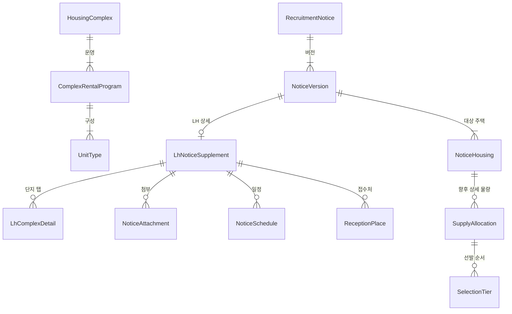

# 공공 건설임대주택 도메인 설계

> 상태: 설계 검토 중  
> 범위: 유저 도메인을 제외한 단지 카탈로그, 모집공고, 공고 내 공급주택, LH 보충정보  
> 기준일: 2026-08-12

## 1. 이 설계가 답하려는 질문

이 모델은 다음 질문을 서로 섞지 않고 답해야 한다.

1. 지금 존재하는 단지와 주택형은 무엇인가?
2. 특정 모집공고가 당시 어떤 단지에 몇 호를 공급한다고 발표했는가?
3. 정정공고가 나오기 전 원문은 무엇이었는가?
4. LH 상세 화면의 단지 탭에 어떤 주소·면적 범위·이미지·일정이 표시됐는가?
5. 서로 다른 원천의 단지 행을 결합했다면 어떤 근거로 결합했는가?
6. 신청 물량과 1순위·2순위 같은 선발 순서는 어떻게 구분할 것인가?

## 2. 범위

### 포함

- 공공이 건설한 뒤 임대하는 주택
- 영구임대, 국민임대, 50년임대, 장기전세, 행복주택, 통합공공임대
- 5년·10년 공공임대처럼 나중에 분양전환될 수 있는 건설임대
- 해당 건설임대의 모집공고와 정정·취소 이력
- LH 공고 상세가 제공하는 단지정보, 일정, 접수처, 첨부파일

### 제외

- 매입임대
- 전세임대
- 공공지원민간임대
- 공공분양
- 유저, 관심공고, 관심단지, 관심지역

공급유형 이름만 보고 `매입·전세가 아니면 포함`하지 않는다. API별 허용 코드 목록으로 판정하고 처음 보는 코드는 저장하지 않은 채 제외 사유를 남긴다. 서로 다른 API의 코드 체계도 공유하지 않는다.

## 3. 원천의 역할

| 원천 | 역할 | 이 설계에서의 시간 성격 |
| --- | --- | --- |
| 마이홈 단지정보 `15110581` | 단지·공급유형·주택형 카탈로그 | 재조회하면 최신 값으로 갱신 |
| 마이홈 모집공고 `15108420` | 정정 체인, 공고 기본정보, 대상 주택, 공급수, 최소 임대조건 | 공고버전별 불변 스냅샷 |
| LH 공고 상세 `15057999` | 단지 탭, 이미지, 일정, 접수처, 정정사유 | 공고버전에 딸린 불변 보충 스냅샷 |
| LH 단지·임대조건 `15059475` | 안정적인 단지 ID가 없는 관측값 | 현재 핵심 모델에는 자동 결합하지 않음 |

공식 문서:

- [국토교통부 마이홈포털 공공주택 모집공고 조회 서비스](https://www.data.go.kr/data/15108420/openapi.do)
- [한국토지주택공사 분양임대공고별 상세정보 조회 서비스](https://www.data.go.kr/data/15057999/openapi.do)

## 4. 승인된 큰 구조



관계도에서 생략했지만 `NoticeHousing`은 두 종류의 파생 연결을 가질 수 있다.

- 현재 카탈로그의 `HousingComplex`와 연결
- LH 보충 스냅샷의 `LhComplexDetail`과 연결

두 연결 모두 원천 사실이 아니라 애플리케이션이 계산한 결과다. 따라서 불변 공고 스냅샷의 FK를 나중에 수정하지 않고 별도 매칭 결과로 관리한다.

## 5. 엔티티의 의미

### `HousingComplex`

공고와 무관하게 유지되는 현재 단지 카탈로그다. 원천 `hsmpSn`으로 재조회·갱신한다.

### `ComplexRentalProgram`

한 단지 안의 공급유형 하나다. 원천 한 행이 `단지 × 공급유형 × 주택형`이고 `hshldCo`가 공급유형과 함께 갈리므로, 공급유형과 그 세대수를 단지나 주택형에 억지로 놓지 않는다.

### `UnitType`

특정 단지·공급유형 안의 형명, 면적, 기본 임대조건이다. 공고 원천에는 형명과 면적이 없으므로 `NoticeHousing`과 직접 연결하지 않는다.

### `RecruitmentNotice`

최초공고와 정정공고를 하나의 모집으로 묶는 안정적인 내부 식별자다. 향후 관심공고가 생기면 특정 버전이 아닌 여기에 연결한다.

### `NoticeVersion`

각 `pblancId`가 표현하는 불변 공고 스냅샷이다. 정정공고는 기존 버전을 수정하지 않고 새 버전을 만든다.

### `NoticeHousing`

마이홈 모집공고의 `pblancId × houseSn` 한 행이다. 현재 이름 `SupplyLine`보다 다음 의미를 더 정확히 드러낸다.

> 이 공고버전이 공급 대상으로 열거한 주택 또는 단지 한 항목

지금 원천에는 주택형별 물량이 없으므로 이것을 최종 세부 공급행이라고 부르지 않는다. 단지명·주소·PNU 같은 공고 시점 주택정보와 전체 공급수·최소 임대조건을 함께 가진다.

### `LhComplexDetail`

LH 상세 응답의 `dsSbd` 한 행이다. 사용자가 제시한 LH 화면의 단지 탭 하나와 대응한다. 현재 코드의 `NoticeComplexSnapshot`을 이 이름으로 명확히 한다.

### `SupplyAllocation`

PDF/HWP나 별도 구조화 원천에서 실제 배정표를 얻은 뒤 추가할 세부 공급물량이다. 주택형·공급대상·지역 구분 등에 따라 수량이 독립적으로 배정될 때만 행을 나눈다.

### `SelectionTier`

우선공급, 1순위, 2순위처럼 같은 물량을 어떤 순서와 자격으로 선발하는지를 나타낸다. 순위마다 공급수를 복사하지 않는다.

기존 `ApplicationOption`은 제거한다. 지원자가 임의로 고르는 옵션이 아니라 물량 배정과 선발 순서가 핵심이기 때문이다.

## 6. 화면의 단지 탭은 어디에서 오는가

사용자가 제시한 파주 공고 화면의 탭 한 개는 LH `15057999`의 `dsSbd` 한 행과 대응한다.

| 화면 | LH 필드 | 도메인 |
| --- | --- | --- |
| 탭 제목 | `LCC_NT_NM` | `LhComplexDetail.complexLabel` |
| 소재지 | `LGDN_ADR`, `LGDN_DTL_ADR` | 주소 원문 |
| 전용면적 범위 | `DDO_AR` | `exclusiveAreaRangeText` |
| 총세대수 | `HSH_CNT` | `totalUnitCount` |
| 난방방식 | `HTN_FMLA_DESC` | `heatingDescription` |
| 입주예정월 | `MVIN_XPC_YM` | `expectedMoveInYearMonth` |
| 단지 안내 | `SPL_INF_GUD_FCTS` | `guidanceText` |

탭 아래 이미지는 `dsSbdAhfl`에서 온다.

| 화면 | LH 필드 |
| --- | --- |
| 이미지가 속한 단지명 | `LCC_NT_NM` |
| 평면도·조감도·위치도 등 구분 | `LS_SPL_INF_UPL_FL_DS_CD_NM` |
| 파일명 | `CMN_AHFL_NM` |
| 다운로드 URL | `AHFL_URL` |

LH 내부에서는 같은 공고응답 안의 단지명으로 상세·이미지·일정을 묶을 수 있다. 현재 표본에서는 단지명이 있는 이미지 378개와 일정 92개가 모두 `dsSbd` 단지명 하나에 정확히 대응했다. 그래도 원천 ID가 아니라 문자열이므로 원문 단지명을 함께 보존하고, 중복 또는 불일치가 생기면 연결하지 않는다.

## 7. 마이홈 대상 주택과 LH 단지 탭의 공통 ID 조사

### 결론

현재 확인한 공식 명세와 실제 응답에는 두 행을 잇는 공통 단지 ID가 없다.

| 마이홈 `NoticeHousing` | LH `LhComplexDetail` |
| --- | --- |
| `pblancId`, `houseSn` | `PAN_ID`는 공고까지만 식별 |
| PNU | PNU 없음 |
| 단지명 | 단지명 |
| 전체주소 | 소재지주소·상세주소 |
| 총세대수 | 총세대수 |

2026-08-12에 파주 공고의 실제 LH 응답도 다시 조회했다. `dsSbd` 한 행은 다음 8개 필드만 가졌고 숨은 단지 일련번호나 `houseSn`은 없었다.

```text
DDO_AR
HSH_CNT
HTN_FMLA_DESC
LCC_NT_NM
LGDN_ADR
LGDN_DTL_ADR
MVIN_XPC_YM
SPL_INF_GUD_FCTS
```

`PAN_ID`는 마이홈 공고 URL에 들어 있어 `NoticeVersion ↔ LhNoticeSupplement`는 안전하게 연결한다. 하지만 그 아래 단지 행까지 식별하지는 않는다.

### 순서로 연결하면 안 되는 근거

파주 공고 `pblancId=20987`에는 양쪽 모두 6행이 있었지만 마지막 두 행의 순서가 달랐다.

```text
마이홈: 산내1 → 가람14 → 초롱꽃3 → 물향기7 → 초롱꽃10 → 노을빛16
LH:     산내1 → 가람14 → 초롱꽃3 → 물향기7 → 노을빛16 → 초롱꽃10
```

또한 부천 A5·A6 공고는 마이홈 공급대상 행이 각각 1개인데 LH 상세는 두 공고 모두 A5와 A6 단지행을 함께 반환했다. 행 개수가 같다는 조건도 조인 키가 될 수 없다.

## 8. 현재 표본의 추정 결합 결과

표본 기준:

- 전체 공고버전 68개
- `NoticeHousing` 137행
- LH 보충정보 65개
- `dsSbd` 보유 공고 63개
- `dsSbd` 130행
- `dsSbd`가 있는 공고에 속한 `NoticeHousing` 128행

같은 공고버전 안에서 공백을 제거한 LH 소재지주소가 마이홈 전체주소로 시작하고, 양쪽 후보가 정확히 하나씩일 때만 대응시켰다.

```sql
REPLACE(TRIM(lh.lot_address), ' ', '')
LIKE CONCAT(REPLACE(TRIM(myhome.full_address), ' ', ''), '%')
```

이 규칙의 실측 결과:

- `NoticeHousing` 128행 중 117행 연결 후보: 91.4%
- `LhComplexDetail` 130행 중 117행 연결 후보: 90.0%
- 이 117쌍 중 응답 순서가 서로 다른 쌍: 25개
- 정확한 단지명만 같은 행: 16개
- 현재 표본의 주소 후보 모호성: 0개

총세대수 교차검증:

| 결과 | 행 수 |
| --- | ---: |
| 양쪽 값이 있고 동일 | 51 |
| 양쪽 값이 있지만 충돌 | 3 |
| 마이홈 값만 누락 | 61 |
| LH 값만 누락 | 0 |
| 양쪽 모두 누락 | 2 |

충돌 사례:

- 영우예인촌: 280 대 21
- 진천대승산내들: 280 대 113
- 화성남양뉴타운 B-10블록: 696 대 1,778

따라서 주소 규칙은 현재 표본에서 유용하지만 원천 계약이 보장한 조인 키가 아니다. 총세대수가 충돌하는 경우에는 자동 결합하지 않는다.

## 9. 결합 실행 규칙

### 9.1 공통 원칙

1. 서로 다른 `NoticeVersion`의 행은 비교하지 않는다.
2. 원천 행은 수정하거나 합쳐서 덮어쓰지 않는다.
3. 매칭은 다시 계산할 수 있는 파생 결과다.
4. 응답 순서만으로 연결하지 않는다.
5. 연결하지 못한 데이터도 버리지 않는다.

### 9.2 `NoticeHousing ↔ LhComplexDetail` 매칭 v1

1. 같은 `NoticeVersion`에 속한 두 원천 행만 후보로 만든다.
2. 양쪽 주소에 `trim`을 적용하고 공백을 제거한다.
3. LH 주소가 마이홈 주소로 시작하는지 검사한다. LH가 뒤에 `(동명, 단지명)`을 덧붙이는 경우를 허용하기 위해서다.
4. 후보 그래프가 양쪽 모두 정확히 1:1일 때만 다음 단계로 간다.
5. 총세대수가 양쪽에 있고 다르면 `CONFLICT`로 판정하고 결합하지 않는다.
6. 총세대수가 같으면 `MATCHED_ADDRESS_AND_UNIT_COUNT`, 한쪽 값이 없으면 `MATCHED_ADDRESS_ONLY`로 판정한다.
7. 후보가 없으면 `UNMATCHED`, 후보가 둘 이상이면 `AMBIGUOUS`다.

주소 정규화 v1은 의도적으로 좁게 잡는다. 하이픈, 쉼표, 도로명, 지번, Unicode 공백 차이까지 임의 보정하거나 단지명 유사도·응답 순서를 fallback으로 사용하지 않는다.

### 9.3 조회 결과 조립

```text
NoticeComplexSection
├─ NoticeHousing                  기준 행
│  ├─ 공고 시점 단지명·주소·PNU
│  └─ 공급수·최소 임대조건
├─ matched HousingComplex?        현재 카탈로그 링크
└─ matched LhComplexDetail?       LH 단지 탭 보충
   ├─ 면적 범위·입주예정월·상세주소
   ├─ NoticeAttachment[]
   └─ NoticeSchedule[]
```

- LH 상세가 없거나 매칭되지 않아도 `NoticeHousing`만으로 단지 섹션을 표시한다.
- LH에만 남은 단지 상세는 버리지 않고 `공급대상 연결 안 됨` 상태로 별도 노출할 수 있다.
- 양쪽에 같은 의미의 값이 있으면 원문을 모두 보존한다.
- 자동 매칭이 `CONFLICT` 또는 `AMBIGUOUS`면 한 화면 섹션으로 합치지 않는다.

### 9.4 왜 결합됐는지 남기는 방법

불변 원천 엔티티에 nullable FK를 나중에 채우지 않고 별도 파생 레코드를 둔다.

```text
NoticeHousingLhMatch
- id
- noticeVersionId
- noticeHousingId nullable
- lhComplexDetailId nullable
- status
- method
- candidateCount
- matcherVersion
- evidence
- evaluatedAt
```

`evidence`에는 최소한 비교한 주소 원문·정규화값, 양쪽 총세대수, 거부 사유를 남긴다. 매칭 규칙이 바뀌면 원천 스냅샷을 건드리지 않고 새 `matcherVersion`으로 다시 계산한다.

상태 후보:

```text
MATCHED_ADDRESS_AND_UNIT_COUNT
MATCHED_ADDRESS_ONLY
UNMATCHED
AMBIGUOUS
CONFLICT_UNIT_COUNT
SOURCE_DETAIL_MISSING
```

이 테이블은 도메인의 원천 사실이 아니라 조회 조립을 위한 감사 가능한 파생 결과다.

## 10. 아직 열려 있는 결정

다음 항목은 모르는 값을 `???`인 채 구현에 넣지 않고, 명시적인 미확정 결정으로 관리한다.

1. LH 또는 마이홈이 앞으로 단지별 공통 ID를 추가하면 주소 매칭보다 우선할 것인가?  
   현재 답: 그렇다. `SOURCE_ID_EXACT`를 최우선 매칭 방법으로 추가한다.
2. `MATCHED_ADDRESS_ONLY`를 사용자 화면에서 확정 연결처럼 보여줄 것인가?  
   현재 권고: 화면 조립에는 사용하되 내부 상태를 보존하고, 운영 검수 대상에 포함한다.
3. 매칭 실패한 LH 단지 상세를 일반 사용자에게 별도 섹션으로 보여줄 것인가?  
   현재 권고: 데이터 유실은 막되 화면 정책은 조회 기능 설계에서 정한다.
4. PDF/HWP 공급표가 여러 주택형·대상·지역 물량을 제공할 때 `SupplyAllocation`의 정확한 자연키는 무엇인가?  
   현재 답: 실제 표본을 확보한 뒤 정한다. 지금 임의 컬럼으로 고정하지 않는다.

