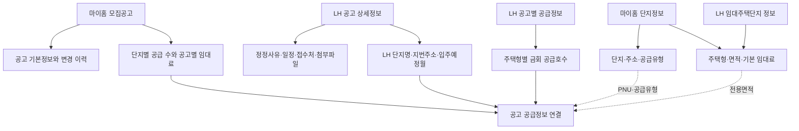

# 공공임대 원천 데이터 수집 가이드

공공임대주택 정보를 수집할 때 사용한 공공데이터 API와 요청·응답 항목을 팀에 공유하기 위한 문서다.

API 번호보다 제공하는 정보를 먼저 이해할 수 있도록 한글 서비스명을 기준으로 설명한다. 공공데이터 ID는 공식 문서를 다시 찾을 때 사용할 수 있도록 보조 정보로만 표시한다.

표의 예시 값은 공식 샘플과 실제 수집 응답의 형태를 이해하기 쉽도록 일부 줄여 적었다. 인증키는 문서에 남기지 않는다.

## 1. 수집 원천 한눈에 보기

| 원천 | 얻는 정보 | 사용 여부 |
| --- | --- | --- |
| 마이홈 공공임대주택 단지정보 | 단지, 주소, 공급유형, 주택형, 면적, 기본 임대료 | 사용 |
| LH 임대주택단지 정보 | 주택형별 전체 세대수와 현재 기준 임대료 | 사용 |
| 마이홈 공공주택 모집공고 | 공고 이력, 대상 단지, 공급 수, 공고별 임대료 | 사용 |
| LH 분양임대공고별 상세정보 | 정정사유, 일정, 접수처, 첨부파일, 공고 시점 단지정보 | 사용 |
| LH 분양임대공고별 공급정보 | 주택형별 금회 공급호수 | 사용 |
| 마이홈 예비입주자 대기현황 | 단지·주택형별 대기자 수와 퇴거 건수 | 미사용 |
| LH 분양임대공고문 | LH 공고 목록과 상세 URL | 미사용 |
| LH 공공임대주택 단지정보 | 단지와 주택형 정보 | 미사용·대체됨 |

## 2. 전체 수집 흐름



실제 수집 순서는 다음과 같다.

1. 마이홈 단지정보로 단지와 주택형 정보를 수집한다.
2. LH 임대주택단지 정보로 주택형별 전체 세대수와 현재 기준 임대료를 보강한다.
3. 마이홈 모집공고로 공고와 단지별 공급정보를 수집한다.
4. LH 공고 상세정보로 일정·접수처·첨부파일과 지번주소를 수집한다.
5. LH 공고별 공급정보로 공급 대상을 주택형 단위까지 세분화한다.
6. PNU, 공급유형, 주소, 전용면적을 이용해 원천 사이의 같은 대상을 연결한다.

## 3. 실제 사용하는 원천

### 마이홈 공공임대주택 단지정보 조회 서비스

> 공공데이터 ID: [`15110581`](https://www.data.go.kr/data/15110581/openapi.do)
> 제공기관: 국토교통부

공고와 상관없이 유지되는 단지·주택형 카탈로그를 제공한다. 응답 한 행의 단위는 `단지 × 공급유형 × 주택형`이다.

#### 요청 주소

```http
GET https://apis.data.go.kr/1613000/HWSPR04/rentalHouseGwList
```

#### 요청값

| 요청값 | 필수 | 예시 값 | 의미 |
| --- | --- | --- | --- |
| `serviceKey` | 필수 | 문서에 기록하지 않음 | 공공데이터포털 인증키 |
| `brtcCode` | 필수 | `43` | 광역시도 코드 |
| `signguCode` | 필수 | `750` | 시군구 코드 |
| `numOfRows` | 필수 | `200` | 페이지당 결과 수 |
| `pageNo` | 필수 | `1` | 페이지 번호 |

전국 수집에서는 공식 지역 코드 목록의 광역시도·시군구 조합을 순회한다. 이 API에는 공급유형 필터가 없다.

#### 응답 봉투

```json
{
  "response": {
    "header": {
      "resultCode": "00",
      "resultMsg": "NORMAL SERVICE"
    },
    "body": {
      "totalCount": "29",
      "item": []
    }
  }
}
```

#### 응답값

| 응답값 | 예시 값 | 의미 |
| --- | --- | --- |
| `hsmpSn` | `31106888` | 원천 단지 식별자 |
| `insttNm` | `SH공사` | 공급기관명 |
| `brtcCode` | `11` | 광역시도 코드 |
| `brtcNm` | `서울특별시` | 광역시도명 |
| `signguCode` | `140` | 시군구 코드 |
| `signguNm` | `중구` | 시군구명 |
| `hsmpNm` | `서울역 센트럴자이` | 단지명 |
| `rnAdres` | `서울특별시 중구 만리재로 175` | 도로명주소 |
| `pnu` | `1114017400100370002` | 19자리 필지고유번호 |
| `competDe` | `20170807` | 준공일자 |
| `hshldCo` | `192` | 해당 단지·공급유형의 전체 세대수 |
| `suplyTyNm` | `50년임대` | 공급유형명 |
| `styleNm` | `39.9541` | 주택형명 |
| `suplyPrvuseAr` | `39.9541` | 전용면적(㎡) |
| `suplyCmnuseAr` | `21.7274` | 주거공용면적(㎡) |
| `houseTyNm` | `아파트` | 주택유형명 |
| `heatMthdDetailNm` | `개별난방` | 난방방식 |
| `buldStleNm` | `복도식` | 건물형태 |
| `elvtrInstlAtNm` | `전체동 설치` | 승강기 설치 여부 |
| `parkngCo` | `183` | 주차 가능 대수 |
| `bassRentGtn` | `34700000` | 기본 임대보증금(원) |
| `bassMtRntchrg` | `149500` | 기본 월임대료(원) |
| `bassCnvrsGtnLmt` | `0` | 기본 전환보증금 한도(원) |

#### 수집하면서 확인한 점

같은 `hsmpSn`에도 50년임대와 행복주택처럼 서로 다른 공급유형이 존재한다. 공급유형별 세대수와 임대조건도 다르기 때문에 단지 ID만으로 데이터를 합치면 값이 뒤섞인다.

따라서 같은 원천 단지라도 공급유형이 다르면 별도의 단지·주택형 정보로 취급한다.

---

### LH 임대주택단지 조회 서비스

> 공공데이터 ID: [`15059475`](https://www.data.go.kr/data/15059475/openapi.do)
> 제공기관: 한국토지주택공사

전국 LH 임대단지의 주택형별 전체 세대수와 현재 기준 임대조건을 제공한다. 특정 모집공고의 조건이 아니라 현재 카탈로그 기준값이다.

#### 요청 주소

```http
GET https://apis.data.go.kr/B552555/lhLeaseInfo1/lhLeaseInfo1
```

#### 요청값

| 요청값 | 필수 | 예시 값 | 의미 |
| --- | --- | --- | --- |
| `serviceKey` | 필수 | 문서에 기록하지 않음 | 인증키 |
| `PG_SZ` | 필수 | `9999` | 페이지당 결과 수 |
| `PAGE` | 필수 | `1` | 페이지 번호 |
| `CNP_CD` | 선택 | `11` | 지역코드. 전국 수집에서는 생략 |
| `SPL_TP_CD` | 선택 | `07` | 공급유형 코드. 전체 수집에서는 생략 |

#### 응답값

| 응답값 | 예시 값 | 의미 |
| --- | --- | --- |
| `SS_CODE` | `Y` | 처리 결과 |
| `RS_DTTM` | `20260813153000` | 응답 시각 |
| `RNUM` | `1` | 응답 순번 |
| `ARA_NM` | `강원특별자치도 강릉시` | 지역명 |
| `AIS_TP_CD_NM` | `행복주택` | 공급유형명 |
| `SBD_LGO_NM` | `강릉교동 행복주택` | LH 단지명 |
| `SUM_HSH_CNT` | `180` | 단지·공급유형 전체 세대수 |
| `DDO_AR` | `36.97` | 전용면적(㎡) |
| `HSH_CNT` | `72` | 해당 주택형 전체 세대수 |
| `LS_GMY` | `19546000` | 현재 기준 임대보증금(원) |
| `RFE` | `195460` | 현재 기준 월임대료(원) |
| `MVIN_XPC_YM` | `2020.06` | 최초 입주년월 |

#### 수집하면서 확인한 점

이 원천에는 단지 ID, PNU, 도로명주소, 지번주소가 없다. 다음 값이 모두 일치하고 후보가 하나일 때만 기존 주택형 정보에 반영한다.

```text
지역명 + 단지명 + 공급유형 + 단지 전체 세대수 + 전용면적
```

후보가 없거나 여러 개면 값을 추정해서 넣지 않는다.

---

### 마이홈 공공주택 모집공고 조회 서비스

> 공공데이터 ID: [`15108420`](https://www.data.go.kr/data/15108420/openapi.do)
> 제공기관: 국토교통부

모집공고 기본정보와 공고가 공급하는 단지, 공급 수, 공고 시점 임대조건을 제공한다. 같은 공고 ID가 공급 대상 단지별로 여러 행에 반복된다.

#### 요청 주소

```http
GET https://apis.data.go.kr/1613000/HWSPR02/rsdtRcritNtcList
```

임대공고만 사용한다. 분양공고 조회 기능은 현재 수집 범위에서 제외한다.

#### 요청값

| 요청값 | 필수 | 실제 사용 | 예시 값 | 의미 |
| --- | --- | --- | --- | --- |
| `serviceKey` | 필수 | 사용 | 문서에 기록하지 않음 | 인증키 |
| `brtcCode` | 선택 | 미사용 | `43` | 광역시도 필터 |
| `signguCode` | 선택 | 미사용 | `750` | 시군구 필터 |
| `numOfRows` | 선택 | 사용 | `100` | 페이지당 결과 수 |
| `pageNo` | 선택 | 사용 | `1` | 페이지 번호 |
| `suplyTy` | 선택 | 사용 | `10` | 공급유형 코드 |
| `lfstsTyAt` | 선택 | 미사용 | `N` | 전세유형 모집 여부 |
| `bassMtRntchrgSe` | 선택 | 미사용 | `01` | 기본 월임대료 구분 |

#### 수집하는 공급유형

| 코드 | 공급유형 |
| --- | --- |
| `01` | 영구임대 |
| `02` | 국민임대 |
| `03` | 50년임대 |
| `05` | 10년임대 |
| `06` | 5년임대 |
| `10` | 행복주택 |
| `12` | 통합공공임대 |

장기전세(`07`)는 수집하지 않는다. 248단지 중 242가 SH공사이고 평균 135세대인데, 단지명이 "힐스테이트동작시그니처(동작하이팰리스지역주택조합)"처럼 민간 정비사업 단지에 몇십 세대씩 박힌 매입 물량이다.

#### 공고 공통 응답값

| 응답값 | 예시 값 | 의미 |
| --- | --- | --- |
| `pblancId` | `20989` | 공고 한 버전의 원천 ID |
| `sttusNm` | `정정공고` | 일반·정정·취소공고 상태 |
| `pblancNm` | `구리·남양주시 행복주택 예비입주자 모집` | 공고명 |
| `suplyInsttNm` | `LH` | 공급기관명 |
| `houseTyNm` | `아파트` | 주택유형명 |
| `suplyTyNm` | `행복주택` | 공급유형명 |
| `beforePblancId` | `20965` | 직전 공고의 원천 ID |
| `rcritPblancDe` | `20260801` | 모집공고일 |
| `beginDe` | `20260818` | 신청 시작일 |
| `endDe` | `20260820` | 신청 종료일 |
| `przwnerPresnatnDe` | `20260910` | 당첨자 발표일 |
| `refrnc` | `LH 콜센터 1600-1004` | 문의처 |
| `url` | `https://apply.lh.or.kr/...panId=...` | 공고 원문 URL |

#### 공급 대상별 응답값

| 응답값 | 예시 값 | 의미 |
| --- | --- | --- |
| `houseSn` | `1` | 공고 안 공급행 일련번호 |
| `pcUrl` | `https://www.myhome.go.kr/...` | PC 상세 URL |
| `mobileUrl` | `https://m.myhome.go.kr/...` | 모바일 상세 URL |
| `hsmpNm` | `구리수택 행복주택` | 단지명 |
| `fullAdres` | `경기도 구리시 체육관로74번길 67` | 공급 대상 전체 주소 |
| `pnu` | `4131010500100000000` | 필지고유번호 |
| `brtcNm` | `경기도` | 광역시도명 |
| `signguNm` | `구리시` | 시군구명 |
| `rnCodeNm` | `체육관로74번길` | 도로명 |
| `refrnLegaldongNm` | `수택동` | 참고 법정동명 |
| `heatMthdNm` | `지역난방` | 공고가 안내한 난방방식 |
| `totHshldCo` | `394` | 단지 전체 세대수 |
| `sumSuplyCo` | `20` | 이번 공고의 단지 공급 수 |
| `rentGtn` | `24000000` | 임대보증금(원) |
| `enty` | `1200000` | 계약금(원) |
| `surlus` | `22800000` | 잔금(원) |
| `mtRntchrg` | `165000` | 월임대료(원) |
| `suplyHoCo` | `0` 또는 `70` | 표본에서 의미가 불분명해 사용하지 않음 |
| `prtpay` | `0` | 중도금. 건설임대 표본에서 사용하지 않음 |

#### 수집하면서 확인한 점

마이홈의 공고별 임대조건은 단지 단위다. 한 단지에 주택형이 여러 개 있어도 어느 주택형에 적용되는 금액인지는 알 수 없다.

---

### LH 분양임대공고별 상세정보 조회 서비스

> 공공데이터 ID: [`15057999`](https://www.data.go.kr/data/15057999/openapi.do)
> 제공기관: 한국토지주택공사

마이홈 모집공고에 없는 정정사유, 일정, 접수처, 공고 시점 단지정보와 첨부파일을 제공한다.

#### 요청 주소

```http
GET https://apis.data.go.kr/B552555/lhLeaseNoticeDtlInfo1/getLeaseNoticeDtlInfo1
```

#### 요청값

| 요청값 | 필수 | 예시 값 | 값의 출처 |
| --- | --- | --- | --- |
| `serviceKey` | 필수 | 문서에 기록하지 않음 | 인증키 |
| `PAN_ID` | 필수 | `2015122300020476` | 마이홈 공고 URL의 `panId` |
| `CCR_CNNT_SYS_DS_CD` | 필수 | `03` | 공고 URL의 `ccrCnntSysDsCd` |
| `UPP_AIS_TP_CD` | 필수 | `06` | 공고 URL의 `uppAisTpCd` |
| `AIS_TP_CD` | 선택 | `10` | 공고 URL의 `aisTpCd` |
| `SPL_INF_TP_CD` | 필수 | `063` | 마이홈 공급유형명으로 계산 |
| `PG_SZ` | 사용 | `100` | 페이지 크기 |
| `PAGE` | 사용 | `1` | 페이지 번호 |

#### 공급정보구분코드

| 마이홈 공급유형 | 요청 코드 |
| --- | --- |
| 5년임대, 10년임대 | `060` |
| 50년임대 | `061` |
| 국민임대, 영구임대 | `062` |
| 행복주택 | `063` |
| 통합공공임대 | 확인되지 않아 호출 생략 |

#### 응답 데이터셋

| 데이터셋 | 제공 정보 |
| --- | --- |
| `resHeader` | 결과코드와 응답 시각 |
| `dsEtcInfo` | 정정·취소 사유와 기타 안내 |
| `dsSplScdl` | 서류 제출·계약 일정 |
| `dsCtrtPlc` | 현장 접수처 |
| `dsSbd` | 공고 시점 단지정보 |
| `dsAhflInfo` | 공고문 첨부파일 |
| `dsSbdAhfl` | 단지 이미지 |

#### 정정·기타사항 응답값

| 응답값 | 예시 값 | 의미 |
| --- | --- | --- |
| `CRC_RSN` | `신청 일정 변경` | 정정·취소 사유 |
| `ETC_CTS` | `세부사항은 공고문 참조` | 기타 안내 원문 |

#### 일정 응답값

| 응답값 | 예시 값 | 의미 |
| --- | --- | --- |
| `SBD_LGO_NM` | `구리수택 행복주택` | 일정 대상 단지명 |
| `ACP_DTTM` | `2026.08.18 10:00 ~ 08.20 17:00` | 접수 기간 원문 |
| `PPR_SBM_OPE_ANC_DT` | `2026.08.28` | 서류제출 대상자 발표일 |
| `PPR_ACP_ST_DT` | `2026.09.01` | 서류 접수 시작일 |
| `PPR_ACP_CLSG_DT` | `2026.09.03` | 서류 접수 종료일 |
| `CTRT_ST_DT` | `2026.10.12` | 계약 시작일 |
| `CTRT_ED_DT` | `2026.10.14` | 계약 종료일 |

#### 접수처 응답값

| 응답값 | 예시 값 | 의미 |
| --- | --- | --- |
| `CTRT_PLC_ADR` | `경기도 구리시 건원대로 44` | 접수처 주소 |
| `CTRT_PLC_DTL_ADR` | `LH 주거복지지사 2층` | 상세주소 |
| `TSK_ST_DTTM` | `2026.08.18 10:00` | 운영 시작 |
| `TSK_ED_DTTM` | `2026.08.20 17:00` | 운영 종료 |
| `SIL_OFC_TLNO` | `1600-1004` | 전화번호 |
| `SIL_OFC_GUD_FCTS` | `방문 전 예약 필요` | 방문·접수 안내 |

#### 공고 시점 단지정보 응답값

| 응답값 | 예시 값 | 의미 |
| --- | --- | --- |
| `LCC_NT_NM` | `구리수택 행복주택` | LH 단지명 |
| `LGDN_ADR` | `경기도 구리시 수택동` | 지번주소 |
| `LGDN_DTL_ADR` | `상세 번지` | 상세 지번주소 |
| `HSH_CNT` | `394` | 총세대수 |
| `HTN_FMLA_DESC` | `지역난방` | 난방방식 |
| `DDO_AR` | `26.70~36.32` | 전용면적 범위 |
| `MVIN_XPC_YM` | `2026.12` | 입주예정월 |
| `SPL_INF_GUD_FCTS` | `단지 안내문 참조` | 단지 안내 |

#### 첨부파일 응답값

| 데이터셋 | 응답값 | 예시 값 | 의미 |
| --- | --- | --- | --- |
| `dsAhflInfo` | `SL_PAN_AHFL_DS_CD_NM` | `공고문(PDF)` | 공고 첨부 구분 |
| 공통 | `CMN_AHFL_NM` | `입주자모집공고.pdf` | 파일명 |
| 공통 | `AHFL_URL` | `https://apply.lh.or.kr/files/notice.pdf` | 다운로드 URL |
| `dsSbdAhfl` | `LS_SPL_INF_UPL_FL_DS_CD_NM` | `단지조감도` | 단지 이미지 구분 |
| `dsSbdAhfl` | `LCC_NT_NM` | `구리수택 행복주택` | 이미지 대상 단지명 |

원천은 URL 자리에 `다운로드`처럼 컬럼 제목을 넣은 행도 반환한다. 실제 HTTP URL인 행만 첨부파일로 사용한다.

---

### LH 분양임대공고별 공급정보 조회 서비스

> 공공데이터 ID: [`15056765`](https://www.data.go.kr/data/15056765/openapi.do)
> 제공기관: 한국토지주택공사

특정 공고가 어느 단지의 어떤 주택형을 몇 호 공급하는지 제공한다.

#### 요청 주소

```http
GET https://apis.data.go.kr/B552555/lhLeaseNoticeSplInfo1/getLeaseNoticeSplInfo1
```

#### 요청값

LH 공고 상세정보와 같은 요청값을 사용한다.

| 요청값 | 필수 | 예시 값 |
| --- | --- | --- |
| `serviceKey` | 필수 | 문서에 기록하지 않음 |
| `PAN_ID` | 필수 | `2015122300020476` |
| `CCR_CNNT_SYS_DS_CD` | 필수 | `03` |
| `UPP_AIS_TP_CD` | 필수 | `06` |
| `AIS_TP_CD` | 선택 | `10` |
| `SPL_INF_TP_CD` | 필수 | `063` |
| `PG_SZ` | 사용 | `100` |
| `PAGE` | 사용 | `1` |

#### 공급정보 응답값

실제 공급정보는 `dsList01` 데이터셋에 들어 있다.

| 응답값 | 예시 값 | 의미 |
| --- | --- | --- |
| `SBD_LGO_NM` | `울산구영1BL 국민임대` | LH 단지명 |
| `HTY_NNA` | `59㎡` | LH 주택형명 |
| `DDO_AR` | `59.94` | 전용면적(㎡) |
| `SPL_AR` | `82.1224` | 공급면적(㎡) |
| `HSH_CNT` | `235` | 해당 주택형 전체 세대수 |
| `NOW_HSH_CNT` | `20` | 이번 공고의 주택형 공급 수 |
| `LS_GMY` | `공고문 참조` | 임대보증금 원문 |
| `RFE` | `공고문 참조` | 월임대료 원문 |

#### 수집하면서 확인한 점

`LS_GMY`와 `RFE`는 숫자 대신 `공고문 참조`가 올 수 있어 문자열 그대로 보존한다.

주택형명도 `59`와 `59㎡`처럼 원천마다 표기가 다르다. 주택형명은 연결 기준으로 사용하지 않고 양쪽이 숫자로 제공하는 전용면적을 `±0.05㎡` 범위에서 비교한다.

## 4. 원천 사이의 연결 방법

마이홈과 LH 사이에는 공통으로 사용할 수 있는 단지 ID가 없다. 다음 경로로 같은 대상을 찾는다.

```text
LH 공급정보의 단지명
→ LH 상세정보의 단지명
→ LH 상세정보의 지번주소
→ 마이홈 공고의 공급 대상 주소
→ 마이홈 공고의 PNU
→ 마이홈 단지정보의 PNU·공급유형
→ 마이홈 단지정보의 전용면적
```

| 연결 구간 | 비교값 | 예시 |
| --- | --- | --- |
| LH 공급정보 → LH 상세정보 | LH 단지명 | `구리수택 행복주택` |
| LH 상세정보 → 마이홈 공고 | 지번주소·총세대수 | `수택동 ...`, `394세대` |
| 마이홈 공고 → 마이홈 단지정보 | PNU·공급유형 | `413101...`, `행복주택` |
| 공고 주택형 → 카탈로그 주택형 | 전용면적 | `36.32㎡` |

각 구간에서 후보가 하나로 확정될 때만 연결한다. 연결되지 않은 원천 데이터도 버리지 않고 실패 이유를 별도로 기록한다.

## 5. 승인받았지만 사용하지 않은 원천

### 마이홈 예비입주자 대기현황 조회 서비스

> 공공데이터 ID: [`15108378`](https://www.data.go.kr/data/15108378/openapi.do)
> 제공기관: 국토교통부

#### 요청 주소

```http
GET https://apis.data.go.kr/1613000/HWSPR03/moveWaitStsList
```

#### 요청값

| 요청값 | 필수 | 예시 값 | 의미 |
| --- | --- | --- | --- |
| `serviceKey` | 필수 | 문서에 기록하지 않음 | 인증키 |
| `brtcCode` | 필수 | `11` | 광역시도 코드 |
| `signguCode` | 선택 | `350` | 시군구 코드 |
| `numOfRows` | 선택 | `10` | 페이지당 결과 수 |
| `pageNo` | 선택 | `1` | 페이지 번호 |
| `suplyTy` | 선택 | `01` | 임대종류 코드 |
| `houseTy` | 선택 | `11` | 주택유형 코드 |

#### 응답값

| 응답값 | 예시 값 | 의미 |
| --- | --- | --- |
| `resultCode` | `00` | 처리 결과 |
| `resultMsg` | `NORMAL SERVICE` | 처리 메시지 |
| `totalCount` | `10` | 전체 결과 수 |
| `numOfRows` | `10` | 페이지당 결과 수 |
| `pageNo` | `1` | 페이지 번호 |
| `rtsInsttNm` | `한국토지주택공사` | 임대사업자명 |
| `brtcNm` | `서울특별시` | 광역시도명 |
| `signguNm` | `노원구` | 시군구명 |
| `rnAdres` | `서울특별시 노원구 ...` | 도로명주소 |
| `hsmpSn` | `31100001` | 단지 일련번호 |
| `hsmpNm` | `중계주공단지` | 단지명 |
| `houseTyNm` | `아파트` | 주택유형명 |
| `suplyTyNm` | `영구임대` | 공급유형명 |
| `styleNm` | `26` | 주택형명 |
| `drwtUnit` | `단지` | 추첨단위 |
| `waitCo` | `35` | 입주대기자 수 |
| `trmnatCo` | `4` | 퇴거 건수 |

#### 사용하지 않은 이유

대기자 수와 퇴거 건수는 조회 시점마다 변한다. 현재 수집 중인 단지 카탈로그나 공고 스냅샷과 갱신 주기가 달라 별도 이력 설계가 필요하다.

또한 이 API의 공급유형 코드는 모집공고 API의 공급유형 코드와 일부 번호가 다르므로 같은 코드표를 공유할 수 없다.

---

### LH 분양임대공고문 조회 서비스

> 공공데이터 ID: [`15058530`](https://www.data.go.kr/data/15058530/openapi.do)
> 제공기관: 한국토지주택공사

#### 요청 주소

```http
GET https://apis.data.go.kr/B552555/lhLeaseNoticeInfo1/lhLeaseNoticeInfo1
```

#### 요청값

| 요청값 | 필수 | 예시 값 | 의미 |
| --- | --- | --- | --- |
| `ServiceKey` | 필수 | 문서에 기록하지 않음 | 인증키 |
| `PG_SZ` | 필수 | `10` | 페이지 크기 |
| `PAGE` | 필수 | `1` | 페이지 번호 |
| `PAN_NM` | 선택 | `대전` | 공고명 검색어 |
| `UPP_AIS_TP_CD` | 선택 | `06` | 공고유형 코드 |
| `CNP_CD` | 선택 | `11` | 지역코드 |
| `PAN_SS` | 선택 | `공고중` | 공고상태 |
| `PAN_NT_ST_DT` | 필수 | `2019.07.23` | 공고 게시 시작일 |
| `CLSG_DT` | 필수 | `2019.08.22` | 공고 마감일 |

#### 응답값

| 응답값 | 예시 값 | 의미 |
| --- | --- | --- |
| `SS_CODE` | `Y` | 처리 결과 |
| `RS_DTTM` | `20190723054417` | 응답 시각 |
| `RNUM` | `1` | 순번 |
| `UPP_AIS_TP_NM` | `임대주택` | 공고유형명 |
| `AIS_TP_CD_NM` | `행복주택` | 공고 세부유형명 |
| `PAN_NM` | `행복도시 10년 공공임대주택` | 공고명 |
| `CNP_CD_NM` | `전국` | 지역명 |
| `PAN_SS` | `공고중` | 공고상태 |
| `ALL_CNT` | `21710` | 전체 조회 건수 |
| `DTL_URL` | `https://apply.lh.or.kr/...PAN_ID:...` | 공고 상세 URL |

#### 사용하지 않은 이유

공고 목록 검색에는 사용할 수 있지만 정정공고의 이전 버전, PNU, 공급 수, 공고별 임대조건을 제공하지 않는다. 마이홈 모집공고가 더 많은 연결 정보를 제공하므로 별도로 수집하지 않는다.

---

### LH 공공임대주택 단지정보 조회 서비스

> 공공데이터 ID: [`15058476`](https://www.data.go.kr/data/15058476/openapi.do)
> 제공기관: 한국토지주택공사
> 상태: 마이홈 공공임대주택 단지정보로 대체됨

#### 요청 주소

```http
GET https://data.myhome.go.kr/rentalHouseList
```

#### 요청값

| 요청값 | 필수 | 예시 값 | 의미 |
| --- | --- | --- | --- |
| `ServiceKey` | 필수 | 문서에 기록하지 않음 | 인증키 |
| `brtcCode` | 필수 | `11` | 광역시도 코드 |
| `signguCode` | 필수 | `140` | 시군구 코드 |
| `numOfRows` | 선택 | `10` | 페이지당 결과 수 |
| `pageNo` | 선택 | `1` | 페이지 번호 |

#### 응답값

| 응답값 | 예시 값 | 의미 |
| --- | --- | --- |
| `code` | `000` | 처리 결과 코드 |
| `msg` | `OK` | 처리 메시지 |
| `numOfRows` | `10` | 페이지당 결과 수 |
| `pageNo` | `1` | 페이지 번호 |
| `totalCount` | `29` | 전체 결과 수 |
| `hsmpSn` | `31106888` | 단지 식별자 |
| `insttNm` | `SH공사` | 공급기관명 |
| `brtcCode` / `brtcNm` | `11` / `서울특별시` | 광역시도 코드·명 |
| `signguCode` / `signguNm` | `140` / `중구` | 시군구 코드·명 |
| `hsmpNm` | `서울역 센트럴자이` | 단지명 |
| `rnAdres` | `서울특별시 중구 만리재로 175` | 도로명주소 |
| `pnu` | `1114017400100370002` | 필지고유번호 |
| `competDe` | `20170807` | 준공일자 |
| `hshldCo` | `192` | 세대수 |
| `suplyTyNm` | `50년임대` | 공급유형명 |
| `styleNm` | `39.9541` | 주택형명 |
| `suplyPrvuseAr` | `39.9541` | 전용면적 |
| `suplyCmnuseAr` | `21.7274` | 공용면적 |
| `houseTyNm` | `아파트` | 주택유형명 |
| `heatMthdDetailNm` | `개별난방` | 난방방식 |
| `buldStleNm` | `복도식` | 건물형태 |
| `elvtrInstlAtNm` | `전체동 설치` | 승강기 설치 여부 |
| `parkngCo` | `183` | 주차수 |
| `bassRentGtn` | `34700000` | 기본 임대보증금 |
| `bassMtRntchrg` | `149500` | 기본 월임대료 |
| `bassCnvrsGtnLmt` | `0` | 기본 전환보증금 한도 |

#### 사용하지 않은 이유

현재 사용하는 마이홈 단지정보와 응답 항목이 같다. 공식 포털도 인증키 오류를 개선한 마이홈 단지정보 서비스로 제공 중이라고 안내하므로 새로운 원천만 사용한다.

## 6. 수집 과정에서 확인한 데이터 차이

### 같은 단지와 주택형에도 공급유형이 여러 개 존재한다

같은 물리적 단지와 같은 주택형이 50년임대와 행복주택으로 각각 제공될 수 있다. 공급유형별 세대수와 임대조건도 다르므로 공급유형을 무시하고 합치지 않는다.

### 기본 임대료와 공고별 임대료는 다른 값이다

마이홈 단지정보와 LH 임대주택단지 정보가 제공하는 금액은 현재 기준 기본 임대조건이다. 마이홈 모집공고가 제공하는 금액은 특정 공고에 적용된 임대조건이다.

기본 임대료를 새로운 공고의 임대료로 덮어쓰거나, 공고별 임대료를 단지의 고정 속성으로 취급하지 않는다.

### 주택형별 임대료를 항상 숫자로 받을 수 없다

LH 공고별 공급정보는 주택형별 임대료 항목을 가지고 있지만 실제 값으로 `공고문 참조`가 올 수 있다. 숫자로 변환하거나 0으로 바꾸지 않고 원문을 남긴다.

### API마다 정보의 단위가 다르다

| 원천 | 응답 한 행의 단위 |
| --- | --- |
| 마이홈 단지정보 | 단지 × 공급유형 × 주택형 |
| LH 임대주택단지 정보 | 지역 × 공급유형 × 단지 × 전용면적 |
| 마이홈 모집공고 | 공고 × 공급 대상 단지 |
| LH 공고 상세정보 | 공고 × 단지 또는 일정·접수처·첨부파일 |
| LH 공고별 공급정보 | 공고 × 단지 × 주택형 |

행의 단위가 다르므로 API 응답을 단순히 1:1로 합칠 수 없다.

### 원천마다 공급 세대수 합계가 다를 수 있다

마이홈은 단지별 공급 수를 제공하고 LH는 주택형별 공급 수를 제공한다. 같은 공고라도 두 합계가 일치하지 않는 경우가 있어 서로 섞어서 하나의 합계를 만들지 않는다.

- 단지별 공급 현황은 마이홈 값을 기준으로 본다.
- 주택형별 공급 현황은 LH 값을 기준으로 본다.

### 제공되지 않는 정보는 추측해서 채우지 않는다

현재 원천에서 안정적으로 얻지 못한 정보는 다음과 같다.

- 단지 대표 조감도
- 주택형 평면도
- 기타공용면적
- 계약면적
- 일부 공고의 주택형별 확정 임대료

원천을 확보하기 전까지 비슷한 값으로 대신 채우지 않는다.

## 7. 인증키와 오류 처리

공공데이터포털은 Encoding 키와 Decoding 키를 모두 제공한다.

- Encoding 키는 이미 URL 인코딩되어 있으므로 그대로 사용한다.
- Decoding 키는 요청 전에 한 번만 URL 인코딩한다.

Encoding 키를 다시 인코딩하면 `%`가 `%25`로 바뀌어 인증에 실패한다.

### 공통 인증 오류 예시

```json
{
  "OpenAPI_ServiceResponse": {
    "cmmMsgHeader": {
      "errMsg": "SERVICE_KEY_IS_NULL",
      "returnAuthMsg": "서비스 접근거부",
      "returnReasonCode": "20"
    }
  }
}
```

| 오류코드 | 의미 |
| --- | --- |
| `01` | 애플리케이션 오류 |
| `02` | 데이터베이스 오류 |
| `03` | 데이터 없음 |
| `10` / `11` | 잘못된 요청값·필수 요청값 누락 |
| `20` | 인증키 누락·접근 권한 없음 |
| `22` / `23` | 일일·초당 호출 한도 초과 |
| `30` / `31` / `32` | 미등록·만료 인증키, 미등록 IP·도메인 |

### 원천별 정상 응답 판정

| 원천 | 정상 판정 | 예시 |
| --- | --- | --- |
| 마이홈 계열 | `response.header.resultCode`가 `00` 또는 `03` | `00` 정상, `03` 데이터 없음 |
| LH 계열 | `resHeader.SS_CODE`가 `Y` | `Y` 정상 |

`03`은 데이터가 없는 정상 응답으로 처리한다. 인증 실패나 잘못된 요청과 구분해야 한다.
