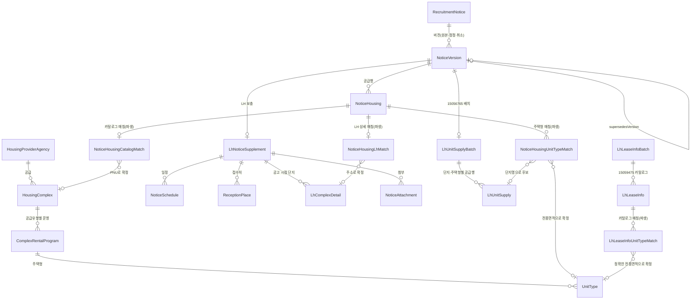

# 도메인 설계

**공공이 지어서 임대하는 단지**와 **거기 들어갈 사람을 뽑는 모집공고**를 담는다.

원천 API 자체의 요청/응답 필드는 [원천-API-데이터-사전.md](원천-API-데이터-사전.md)에 있다. 이 문서는 **모델이 왜 이 모양인가**만 다룬다. `main` 브랜치 실제 엔티티 기준(2026-08-13, `codex/construction-rental-reimplementation` 병합 직후).

---

## 1. 경계

| | 담나 | 왜 |
| --- | :---: | --- |
| 건설임대 단지 | **○** | 공공이 직접 지은 단지. 이름·주소·준공일·주택형이 있다 |
| 매입임대 | ✕ | 민간주택을 한 채씩 사들인 것. "단지"라는 게 없다 — 단지명 칸에 "경기도 수원시" 같은 지역명이 온다 |
| 전세임대 | ✕ | 세입자가 직접 구해온 집. 대상 주택 자체가 우리 쪽에 없다 |
| 임대 모집공고 | **○** | 위 단지에 들어갈 사람을 뽑는다 |
| 분양 공고 | ✕ | 파는 것이지 빌려주는 게 아니다 |

`SupplyType.isConstructionRental()`이 이 경계를 코드로 고정한다. [SupplyType.java:34](../src/main/java/test/domain/housing/SupplyType.java)

```java
case NATIONAL_RENTAL, PERMANENT_RENTAL, HAPPY_HOUSE, INTEGRATED_PUBLIC_RENTAL,
     LONG_TERM_JEONSE, FIVE_YEAR_RENTAL, TEN_YEAR_RENTAL, FIFTY_YEAR_RENTAL -> true;
case PURCHASED_RENTAL, JEONSE_RENTAL -> false;
```

공급유형 이름만 보고 판정하지 않는다. `ConstructionRentalPolicy`가 두 단계로 거른다 — 원문이 이 10개 라벨 중 하나가 아니면 `UNKNOWN_SUPPLY_TYPE`으로, 매입·전세면 `UNSUPPORTED_SUPPLY_TYPE`으로 제외한다. 라벨 판정을 통과해도 준공일이 파싱되지 않고 주택유형도 아파트가 아니면 `NOT_CONSTRUCTION_HOUSING`으로 한 번 더 거른다 — "행복주택"이라는 라벨을 달고 있어도 실체가 매입주택인 행이 있기 때문이다. [ConstructionRentalPolicy.java:24](../src/main/java/test/domain/ingest/ConstructionRentalPolicy.java)

실측: 전국 256개 시군구를 돌린 결과 단지 2,969개가 만들어졌고, 121,746건이 `UNSUPPORTED_SUPPLY_TYPE`(매입·전세 등)으로, 248건이 `NOT_CONSTRUCTION_HOUSING`(라벨은 건설임대인데 준공일·주택유형 증거가 없음)으로 걸러졌다.

## 2. 모델

세 층으로 나뉜다. **바뀌지 않는 카탈로그**, **공고 시점의 불변 이력**, 그리고 그 둘을 잇는 **재계산 가능한 파생 매칭**이다.



### 층 1 — 변하지 않는 주택 카탈로그

```
HousingProviderAgency ──< HousingComplex ──< ComplexRentalProgram ──< UnitType
```

### 층 2 — 공고 시점의 불변 이력

```
RecruitmentNotice ──< NoticeVersion ──< NoticeHousing
                              └── 1:1 LhNoticeSupplement ──< NoticeSchedule / ReceptionPlace / LhComplexDetail / NoticeAttachment
```

### 층 2.5 — 15056765 전용 배치 (LhNoticeSupplement와 별개)

```
NoticeVersion ──1:1── LhUnitSupplyBatch ──< LhUnitSupply
```

### 층 2.6 — 15059475 전국 카탈로그 스냅샷

```
LhLeaseInfoBatch ──< LhLeaseInfo ──< LhLeaseInfoUnitTypeMatch ──> UnitType
```

15059475는 공고버전에 종속되지 않는다. `LhLeaseInfo`에 원천 `HSH_CNT`를 그대로 남기고,
지역·단지명·공급유형·`SUM_HSH_CNT`·정확한 `DDO_AR`가 유일하게 맞는 경우에만
`UnitType.totalUnitCount`를 갱신한다.

### 층 3 — 파생 매칭 (재계산 가능, 원천 aggregate가 아니다)

```
NoticeHousing ──< NoticeHousingCatalogMatch  >── HousingComplex   (PNU 비교)
NoticeHousing ──< NoticeHousingLhMatch       >── LhComplexDetail  (주소·세대수 비교)
NoticeHousing ──< NoticeHousingUnitTypeMatch >── UnitType         (단지 확정 후 전용면적 비교)
LhLeaseInfo ──< LhLeaseInfoUnitTypeMatch >── UnitType              (전국 카탈로그 정확 매칭)
```

## 3. 엔티티

### `HousingProviderAgency`

LH·SH처럼 여러 단지가 반복 참조하는 공급기관이다. 원천이 기관 코드를 안 줘서 이름을 `code`와 `name`에 똑같이 넣는다 — 지금은 사실상 문자열 한 칸과 다르지 않지만, 나중에 코드 체계가 확인되면 여기만 고치면 되도록 엔티티로 미리 분리해 뒀다. 실데이터에 LH서울·LH경기남부·LH경기북부처럼 LH가 지역본부 단위로 쪼개져 나온다. [HousingProviderAgency.java:14](../src/main/java/test/domain/housing/HousingProviderAgency.java), [MyHomeComplexIngestService.java:368](../src/main/java/test/domain/ingest/myhome/MyHomeComplexIngestService.java)

### `HousingComplex`

공고와 무관하게 유지되는 단지 카탈로그의 기준점이다. 원천의 `hsmpSn`(→`sourceComplexId`)을 유니크 키로 삼는다.

`hsmpSn`이 식별자로 성립하는 근거를 실측으로 남겼다 — 23개 시군구 7,317행에서 단지명·주소·PNU·공급기관·준공일 등 11개 속성이 같은 `hsmpSn` 안에서 갈리는 경우가 0건이었다. [HousingComplex.java:26](../src/main/java/test/domain/housing/HousingComplex.java)

단지명(`hsmpNm`)은 건설임대일 때만 진짜 이름이고 매입임대는 지역명이 온다는 사실이 이름을 식별자로 못 쓰는 이유다. 주소는 단지 없이 독립적으로 쓰이지 않으므로 `Address`를 별도 테이블이 아니라 `@Embedded` 값으로 묻었다.

재조회 시 이름·주소·공급기관(단지의 정체성)은 건드리지 않고, `CatalogDetails`(준공일·난방·주차·복도·승강기·주택유형)만 통째로 비교해 바뀐 게 있을 때만 UPDATE를 보낸다 — 원천 한 행이 주택형 하나라 같은 단지가 수십 번 다시 들어오기 때문이다.

### `ComplexRentalProgram`

단지가 공급유형별로 운영하는 프로그램이다. 처음 설계에는 없었다. 원천 `hshldCo`(세대수)가 단지 단위가 아니라 **(단지, 공급유형) 단위** 값이라, 세대수를 놓을 자리가 필요해서 단지와 주택형 사이에 새로 넣었다. [ComplexRentalProgram.java:22](../src/main/java/test/domain/housing/ComplexRentalProgram.java)

### `UnitType`

한 단지·한 공급유형 안에서 면적·구조·평면을 공유하는 카탈로그 항목이다. 자연키가 `(complexRentalProgram, 주택형명, 전용면적, 공용면적)`인 이유를 실측으로 남겼다.

```
(단지, 주택형명)                        고유 6,063 / 충돌 768
(단지, 주택형명, 전용, 공용)             고유 7,308 / 충돌   9
(단지, 공급유형, 주택형명, 전용, 공용)    고유 7,317 / 충돌   0
```

면적이 필요한 건 매입임대가 호마다 따로 사들인 집이라 같은 "39형" 안에 39.27㎡와 39.57㎡가 섞여 있어서고, 공급유형이 필요한 건 같은 평면이라도 국민임대냐 행복주택이냐에 따라 기본 임대조건이 달라서다 — 실제로 같은 단지·같은 51A형·같은 전용면적인데 국민임대는 보증금 1.25억, 행복주택은 1.97억으로 갈린 사례가 있다. [UnitType.java:23](../src/main/java/test/domain/housing/UnitType.java), [BaseRentTerms.java:15](../src/main/java/test/domain/housing/BaseRentTerms.java)

`UnitType`은 공고 원천에 직접 FK를 두지 않는다. 공고 주택형 연결은 `NoticeHousingUnitTypeMatch`가,
공고와 무관한 15059475 카탈로그 보강은 `LhLeaseInfoUnitTypeMatch`가 별도 판단으로 남긴다.
`totalUnitCount`는 후자의 `HSH_CNT`가 유일하게 검증된 경우에만 채워진다.

### `LhLeaseInfoBatch` / `LhLeaseInfo`

15059475의 전국 LH 임대단지 카탈로그 스냅샷이다. `LhLeaseInfoBatch` 한 건이 한 번에
받은 응답을 나타내고, `LhLeaseInfo` 한 행이 지역·공급유형·단지명·전용면적 원천행이다.
공고버전에 종속되지 않으며, 원천 `HSH_CNT`와 `SUM_HSH_CNT`를 각각 보존한다.
원천에 단지 ID·PNU·상세주소가 없으므로 `LhLeaseInfoUnitTypeMatch`에서 이름·공급유형·
프로그램 총세대수·정확한 전용면적을 함께 검증한다. 원천행이 모호하면 `UnitType`을 갱신하지 않는다.

### `RecruitmentNotice`

원공고와 정정 체인 전체를 묶는 루트다. 마이홈은 정정공고를 낼 때마다 **새 `pblancId`**를 발급하고 `beforePblancId`로 이전 공고를 가리킨다. 즉 `pblancId`는 "공고"가 아니라 "공고의 한 버전"이다. 실데이터에서 4단계 체인(`21001 ← 20942 ← 20893 ← 20680`)까지 나왔다. `RecruitmentNotice`는 이 체인 전체를 하나로 묶는 안정적인 내부 식별자다. [RecruitmentNotice.java:20](../src/main/java/test/domain/notice/RecruitmentNotice.java)

### `NoticeVersion`

원본·정정·취소 시점의 내용을 보존하는 불변 스냅샷이다. PK는 버전 자신의 `id`이고 `(recruitmentNoticeId, versionNumber)`에 유니크를 건다 — `noticeId`를 PK로 두면 공고당 행이 하나뿐이라 버전 번호와 이전 버전 FK가 애초에 존재할 수 없다.

수정자를 두지 않은 것도 의도다. 내용이 바뀌면 고치는 게 아니라 `nextVersion()`으로 새 행을 쌓는다. 정정 체인이 batch 안에서 순서가 뒤섞여 와도(숫자가 작다고 먼저 온다는 보장이 없다) 저장 순서를 의존관계 그래프로 위상 정렬해서 정한다. [NoticeVersion.java:27](../src/main/java/test/domain/notice/NoticeVersion.java), [MyHomeNoticeIngestService.java:227](../src/main/java/test/domain/ingest/myhome/MyHomeNoticeIngestService.java)

### `NoticeHousing`

이 공고버전이 어느 주택에 몇 호를 배정했는지, 원천 응답의 한 행이 그대로 한 줄이 된다(이전 이름 `SupplyLine`).

**카탈로그 FK를 두지 않는다.** 공고가 가리키는 주택을 `SuppliedHousing`(주소·PNU 등 공고 시점 원문)에 그대로 보존할 뿐, 단지 카탈로그(`housing_complex`)와 잇는 일은 이 aggregate의 책임이 아니다 — 그 매칭은 4장의 파생 matcher가 한다.

**주택형 FK도 두지 않는다.** 원천이 "이 단지에 몇 호"까지만 말하고 주택형별 배분(몇 호가 39형이고 몇 호가 51A형인지)은 안 준다. 5장에서 이 공백을 메우는 작업을 다룬다. [NoticeHousing.java:22](../src/main/java/test/domain/notice/NoticeHousing.java)

자연키는 `(noticeVersion, houseSn)`이다. `houseSn`은 원천이 공급행마다 매기는 일련번호로 한 공고버전 안에서 유일하다. 화면 표시 순서(`displayOrder`)를 따로 둔 건 이 순서가 `houseSn` 순서와 항상 같지는 않아서다.

### `LhNoticeSupplement`

마이홈 공고에 LH 상세가 나중에 보태는 불변 aggregate다(이전 이름 `NoticeSupplement`). 모든 공고가 LH 상세를 갖는 건 아니라서(공고버전 68건 중 65건만 LH 건) `NoticeVersion`에 LH 전용 컬럼을 두지 않고 1:1 자식으로 분리했다.

정정 사유(`correctionReason`), 공고문 원문, 단지 이미지처럼 마이홈이 안 주는 것을 채우는 보조 원천이다 — 기준 공고 원천을 바꾸는 게 아니라 마이홈이 비운 칸만 채운다. [LhNoticeSupplement.java:29](../src/main/java/test/domain/notice/LhNoticeSupplement.java)

`complexDetailDatasetPresent`는 "행 개수 0건"과 "원천이 이 데이터셋 자체를 안 줌"을 구분하는 칸이다. 키가 없으면 원천이 아예 안 준 것이고, 키는 있는데 빈 배열이면 조회는 됐지만 값이 없다는 뜻이라 의미가 다르다.

### `NoticeSchedule` / `ReceptionPlace` / `LhComplexDetail` / `NoticeAttachment`

모두 `LhNoticeSupplement`의 자식이다. 일정·접수처·공고 시점 단지정보·첨부파일은 각각 여러 건일 수 있고 표시 순서도 보존해야 해서 각각 테이블로 분리했다.

`LhComplexDetail`(이전 이름 `NoticeComplexSnapshot`)은 카탈로그 단지를 억지로 FK로 연결하지 않는다. "LH가 공고 시점에 뭐라고 안내했는지"를 남기는 스냅샷이고, 현재 카탈로그는 나중에 갱신되기 때문이다. [LhComplexDetail.java:19](../src/main/java/test/domain/notice/LhComplexDetail.java)

`NoticeAttachment`는 공고문 원문(hwp/PDF)과 단지 이미지(조감도·배치도)를 한 테이블에 담는다. 원천에서 서로 다른 데이터셋(`dsAhflInfo`, `dsSbdAhfl`)으로 오지만 (구분, 파일명, URL) 모양이 같고, 둘 다 "이 공고에 딸린 파일"이라는 성격이 같아서다. [NoticeAttachment.java:20](../src/main/java/test/domain/notice/NoticeAttachment.java)

`LhSupplementComplexAssembler`는 이 넷 중 일정·첨부를 `LhComplexDetail`과 원문 단지명(`complexLabel`)으로 조회 시점에 묶어 준다. PNU가 없어 이름으로만 이을 수 있는데, 같은 응답 안에서 이름이 정확히 한 번만 겹칠 때만 묶고 0건이거나 2건 이상이면 어느 쪽에도 붙이지 않는다 — DB에 FK를 저장하는 게 아니라 매번 다시 계산하는 조회 전용 조립이다. [LhSupplementComplexAssembler.java:15](../src/main/java/test/domain/notice/LhSupplementComplexAssembler.java)

## 4. 파생 매칭 — 왜 FK 대신 별도 테이블인가

`NoticeHousing`이 가리키는 주택을 우리 카탈로그·LH 상세·카탈로그 주택형과 잇는 매칭은 전부, **원천이 준 사실이 아니라 우리가 계산한 결과**다. 그래서 불변 원천 aggregate에 nullable FK를 나중에 채우는 대신, 별도 파생 테이블에 `matcherVersion`과 함께 남긴다. 매칭 규칙이 바뀌면 원천 스냅샷은 그대로 두고 새 `matcherVersion`으로 다시 계산한다.

### `NoticeHousingCatalogMatch` — PNU로 단지 카탈로그와 매칭

`NoticeHousing.suppliedHousing.pnu`로 `HousingComplex`를 찾는다. 후보가 정확히 1개면 `MATCHED_PNU`, 0개면 `UNMATCHED`, 2개 이상이면 `AMBIGUOUS`다. **이름 fallback은 두지 않는다** — 매입임대는 단지명 칸에 지역명이 오기 때문에, 매칭 안 된 행에 이름으로 비슷한 단지를 붙이면 틀린 연결이 사실처럼 보인다. [NoticeHousingCatalogMatchService.java:36](../src/main/java/test/domain/match/NoticeHousingCatalogMatchService.java)

### `NoticeHousingLhMatch` — 주소·세대수로 LH 상세와 매칭

같은 공고버전 안에서 `NoticeHousing`과 `LhComplexDetail`을 정규화한 주소 접두어 일치로 후보를 좁힌다(LH 주소가 공고 주소로 시작하면 후보). 후보가 서로 1:1일 때만 확정하고, 세대수까지 같으면 `MATCHED_ADDRESS_AND_UNIT_COUNT`, 한쪽이 없으면 `MATCHED_ADDRESS_ONLY`, 있는데 다르면 `CONFLICT_UNIT_COUNT`로 갈라 둔다 — 세대수가 어긋나면 주소가 맞아도 확정 연결로 쓰지 않는다.

`NoticeHousingLhMatchEvidence`에 원문·정규화값·후보 ID 목록·판정 사유를 전부 남긴다. 나중에 이 matcher를 의심할 때 정규화가 뭘 지웠는지 바로 보기 위해서다. [NoticeHousingLhMatchService.java:51](../src/main/java/test/domain/match/NoticeHousingLhMatchService.java)

## 5. `NoticeHousing`을 `UnitType`까지 잇는 매칭

`NoticeHousing`은 "이 공고가 이 단지에 몇 호를 공급한다"까지만 말하고, **어느 주택형에 몇 호**인지는 마이홈(15108420)에도 LH 상세(15057999)에도 없다. 이 공백을 15056765(LH 분양임대공고별 공급정보)로 메운다. 2026-08-13에 실제 호출해 확인했다.

```
SBD_LGO_NM(단지명) · HTY_NNA(주택형) · DDO_AR(전용면적) · NOW_HSH_CNT(이번 회차 공급 세대수)
```

`PAN_ID`는 마이홈 `detail_url`에 이미 있어 새로 알아낼 값이 없고(`LhNoticeRequest`가 이미 뽑는 것과 동일), `SPL_INF_TP_CD`도 `LhSupplyInfoTypeResolver`가 이미 계산한다 — 15057999와 파라미터가 완전히 같다. 다만 **엔드포인트와 응답이 다른 별도 호출**이라 `LhNoticeSupplement`에 얹지 않고 `LhUnitSupplyBatch`(1:1 `NoticeVersion`) + `LhUnitSupply`(자식)로 따로 뒀다. `LhNoticeSupplement`는 "저장 후 자식을 추가할 수 없다"는 불변식이 있어서, 같이 묶으면 한쪽 호출 실패가 이미 성공한 다른 쪽 데이터까지 날린다. `LhUnitSupplyIngestService.ingest()`가 `/admin/ingest/unit-supplies`로 독립 실행된다.

이 원천의 전체 요청/응답 필드는 [원천-API-데이터-사전.md](원천-API-데이터-사전.md) 5장에 있다.

### `NoticeHousingUnitTypeMatch` — LH 이름끼리 이어서 주택형까지

**단지명을 카탈로그와 직접 대조하지 않는다.** 마이홈은 동네 통칭(`하나로아파트`), LH는 사업지구명+블록(`군산조촌부향`)이라 명명 체계가 다르고, 실측 85쌍 중 16쌍(19%)만 맞았다. 정규화로 좁힐 수 있는 차이가 아니다.

대신 **LH가 붙인 이름끼리** 잇는다. 15056765의 `SBD_LGO_NM`과 15057999의 `LCC_NT_NM`은 같은 조직의 명명이라 실측 290행이 전부 맞았다.

```
LhUnitSupply ─LH단지명─> LhComplexDetail ─주소─> NoticeHousing ─PNU─> HousingComplex ─전용면적─> UnitType
              290/290      (LhMatch 95건)     (CatalogMatch 97건)
```

가운데 `NoticeHousing`을 거치는 게 우회처럼 보이지만 필연이다 — **LH 계열에는 PNU가 없고 카탈로그에는 LH 이름이 없다.** 주소와 PNU를 둘 다 가진 행은 공고 공급행뿐이라, 그것만이 두 세계를 잇는 다리다. 앞의 두 구간은 이미 계산된 매칭을 그대로 타므로 이 matcher 는 그 둘의 `matcherVersion`을 입력으로 받는다.

주택형명(`HTY_NNA`)은 매칭 키로 쓰지 않는다 — "59㎡"처럼 단위가 붙어 카탈로그 `styleNm`("59")과 표기가 갈린다. 두 원천 다 ㎡ 소수로 주는 **전용면적**(허용오차 0.05㎡)을 근거로 삼고, 원문 주택형명은 `sourceTypeName`에 증거로만 남긴다.

**주어가 `LhUnitSupply`다.** 공급행 하나가 결과 한 줄이고, 못 맞춘 것도 어느 구간에서 끊겼는지 `reason`에 달아 남긴다.

실측(공급행 290): `MATCHED` 202(70%, 8,872호) · `AMBIGUOUS` 30 · `NO_CATALOG_PATH` 58(주소 37, PNU 21) · `UNMATCHED` 0. 단지만 확정되면 면적 매칭은 100% 후보를 찾으므로, 남은 손실은 전부 앞 단계 문제다. `AMBIGUOUS`는 LH가 `26A(청년)`·`26B(고령자)`처럼 공급대상까지 쪼개는데 카탈로그는 `26` 하나라서 생긴다.

`/admin/ingest/matches/lh`와 `/matches/catalog`를 먼저 돌린 뒤 `/matches/unit-type`을 돌린다. [NoticeHousingUnitTypeMatchService.java](../src/main/java/test/domain/match/NoticeHousingUnitTypeMatchService.java)

### `LhLeaseInfoUnitTypeMatch` — 15059475 카탈로그 보강

공고 주택형 matcher와 별개로 `/admin/ingest/lease-infos`가 전국 15059475 스냅샷을 읽는다.
이 원천의 `HSH_CNT`는 이번 공고 공급 수가 아니라 전용면적 주택형의 단지 전체 세대수다.
지역·단지명·공급유형·`SUM_HSH_CNT`가 하나의 `ComplexRentalProgram`으로 좁혀지고,
`DDO_AR`가 `UnitType.exclusiveArea`와 `BigDecimal` 기준으로 정확히 하나 일치할 때만
`UnitType.totalUnitCount`를 갱신한다. ±0.05㎡ 근사 매칭은 사용하지 않으며, 같은 주택형을
여러 원천행이 가리키면 모두 `AMBIGUOUS`로 남긴다.

`LhLeaseInfo` 원천행과 `LhLeaseInfoUnitTypeMatch` 판정은 스냅샷 교체 때 함께 보존한다.
응답에 `dsList`가 없거나 전체 행이 비어 있으면 기존 스냅샷과 주택형 총세대수를 유지한다.

## 6. 값 객체

엔티티에 묻어 두되, 통째로 비교하거나 통째로 다루려고 따로 뺀 것들이다.

| | 어디에 | 왜 묶었나 |
| --- | --- | --- |
| `Address` | `HousingComplex` | 주소는 단지 없이 존재할 이유가 없다. PNU 검증과 법정동코드 파생이 한자리에 모인다 |
| `CatalogDetails` | `HousingComplex` | 재조회 시 덮어쓰는 부분만 묶었다. 통째로 비교해 안 바뀌면 UPDATE를 안 보낸다 |
| `BaseRentTerms` | `UnitType` | 공고와 무관한 카탈로그 기준 임대조건 |
| `NoticeSnapshot` | `NoticeVersion`(record) | 한 버전이 담는 공고 단위 내용 전부. 재수집 시 내용이 바뀌었는지 통째로 비교한다 |
| `SuppliedHousing` | `NoticeHousing` | 공고가 그 시점에 말한 대상 주택 원문. 카탈로그 매칭 여부와 무관하게 남긴다 |
| `RentTerms` | `NoticeHousing` | 이번 공고의 실제 임대조건. `BaseRentTerms`와는 다른 값이다 |
| `NoticeHousingLhMatchEvidence` | `NoticeHousingLhMatch` | 매칭 판정 근거(원문·정규화값·후보 목록·사유) |

## 7. enum — 원문을 함께 남기는 이유

`SupplyType`, `HouseType`, `HeatingType`은 전부 enum과 원문 문자열 컬럼을 같이 둔다(`heating_type` 옆에 `heating_type_name`). 원천이 새 제도를 추가해도 매핑 실패로 행이 죽지 않고, enum이 버리는 세부 정보(난방의 열원 — 가스·전기·폐열)도 원문에 남는다.

`NoticeChangeStatus`는 반대로 예외를 던진다 — 마이홈 `sttusNm`이 "일반공고"/"정정공고"/"취소공고" 외의 값을 주면 원문 그대로 보존할 enum 값이 없다는 뜻이라 조용히 넘기지 않는다.

`IngestRejectionReason`(적재 제외 사유), `NoticeHousingCatalogMatchStatus`, `NoticeHousingLhMatchStatus`(매칭 판정)는 도메인 데이터가 아니라 우리 파이프라인의 판단 결과를 남기는 enum이다.

## 8. 이전 설계안과 달라진 점

`docs/superpowers/specs/2026-08-12-public-construction-rental-domain-design.md`(검토용 중간 설계안)에 있었지만 실제로 만들지 않은 것들이다.

| 설계안의 이름 | 실제 상태 |
| --- | --- |
| `SupplyAllocation` | 5장의 작업이 이 자리를 대신한다 |
| `SelectionTier` | 미구현. 1순위·2순위 등 선발 순서 원천을 아직 확보하지 못했다 |
| `NoticeHousingLhMatch` | **구현됨.** 설계안의 제안과 상태값(`MATCHED_ADDRESS_AND_UNIT_COUNT` 등)까지 거의 그대로 적용됐다 |

이름이 바뀐 것: `SupplyLine → NoticeHousing`, `NoticeSupplement → LhNoticeSupplement`, `NoticeComplexSnapshot → LhComplexDetail`. `RecruitmentNotice`, `ComplexRentalProgram`, `NoticeHousingCatalogMatch`는 설계안 이후 새로 생겼다.
