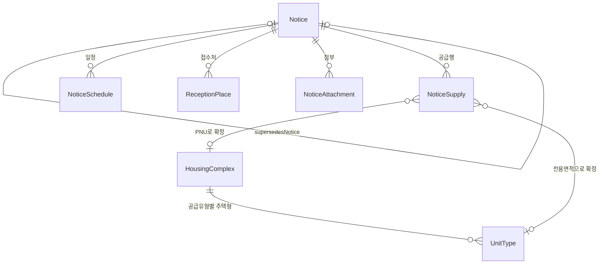

# 도메인 설계

**공공이 지어서 임대하는 단지**와 **거기 들어갈 사람을 뽑는 모집공고**를 담는다.

원천 API 자체의 요청/응답 필드는 [원천-API-데이터-사전.md](원천-API-데이터-사전.md)에, 컬럼 단위 사전은
[테이블-설계-사전.md](테이블-설계-사전.md)에 있다. 이 문서는 **모델이 왜 이 모양인가**만 다룬다.
2026-08-14에 테이블 18개를 7개로 합친 뒤의 실제 엔티티 기준이다.

---

## 1. 경계

| | 담나 | 왜 |
| --- | :---: | --- |
| 건설임대 단지 | **○** | 공공이 직접 지은 단지. 이름·주소·준공일·주택형이 있다 |
| 매입임대 | ✕ | 민간주택을 한 채씩 사들인 것. "단지"라는 게 없다 — 단지명 칸에 "경기도 수원시" 같은 지역명이 온다 |
| 전세임대 | ✕ | 세입자가 직접 구해온 집. 대상 주택 자체가 우리 쪽에 없다 |
| 임대 모집공고 | **○** | 위 단지에 들어갈 사람을 뽑는다 |
| 분양 공고 | ✕ | 파는 것이지 빌려주는 게 아니다 |

`ConstructionRentalPolicy`가 이 경계를 코드로 고정한다. 예전에는 `SupplyType` enum의
`isConstructionRental()`이 했는데, **이건 저장하는 값이 아니라 적재 시점의 필터**라서 enum 없이
허용 이름 집합 하나면 같은 일을 한다. [ConstructionRentalPolicy.java:22](../src/main/java/test/domain/ingest/ConstructionRentalPolicy.java)

```java
private static final Set<String> CONSTRUCTION_RENTAL = Set.of(
        "영구임대", "국민임대", "행복주택", "통합공공임대",
        "5년임대", "10년임대", "50년임대");
```

공급유형 이름만 보고 판정하지 않는다. 두 단계로 거른다 — 원문이 아는 라벨 10개 중 하나가 아니면
`UNKNOWN_SUPPLY_TYPE`으로, 매입·전세·장기전세면 `UNSUPPORTED_SUPPLY_TYPE`으로 제외한다. 라벨 판정을 통과해도
준공일이 파싱되지 않고 주택유형도 아파트가 아니면 `NOT_CONSTRUCTION_HOUSING`으로 한 번 더 거른다 —
"행복주택"이라는 라벨을 달고 있어도 실체가 매입주택인 행이 있기 때문이다.

실측: 전국 256개 시군구를 돌린 결과 단지 2,837개가 만들어졌고, 123,986건이
`UNSUPPORTED_SUPPLY_TYPE`(매입·전세 등)으로, 248건이 `NOT_CONSTRUCTION_HOUSING`(라벨은 건설임대인데
준공일·주택유형 증거가 없음)으로 걸러졌다.

## 2. 모델

두 층이다. **바뀌지 않는 카탈로그**와 **공고 시점의 불변 이력**. 예전에 있던 세 번째 층(파생 매칭)은
테이블이 아니라 공급행의 FK 두 칸으로 줄었다.



### 층 1 — 변하지 않는 주택 카탈로그

```
HousingComplex ──< UnitType
```

15110581이 만들고, 15059475가 주택형의 전체 세대수·기준 임대조건을 보강한다.

### 층 2 — 공고 시점의 불변 이력

```
Notice ──< NoticeSupply
   └────< NoticeSchedule / ReceptionPlace / NoticeAttachment
```

15108420이 공고와 단지 단위 공급행을 만들고, 15057999 + 15056765가 공급행을 주택형 단위로 다시 쓰면서
일정·접수처·첨부를 붙인다.

### 연결은 층이 아니라 칸이다

```
NoticeSupply.housing_complex_id   ← supplied_pnu + 공급유형명으로 확정
NoticeSupply.unit_type_id         ← 위 단지 + 전용면적 ±0.05㎡ 유일 후보
NoticeSupply.unmatched_reason     ← 못 붙었을 때 그 이유
```

## 3. 엔티티

### `HousingComplex`

공고와 무관하게 유지되는 단지 카탈로그의 기준점이다. 원천의 `hsmpSn`(→`sourceComplexId`)과
공급유형명을 함께 유니크 키로 삼는다.

같은 `hsmpSn`에서 공급유형이 다르면 별도 `HousingComplex` 행을 만든다. 두 행에는 같은 이름·주소·PNU·
준공·기관을 그대로 중복 저장하고, 각 행에 `supplyTypeName`과 `unitCount`를 붙인다. 공급유형별로
임대조건과 총세대수가 달라 하나의 단지 행으로 합칠 수 없기 때문이다.

**자연키가 한글 문자열이다.** 공급유형 enum을 없애서 `(source_complex_id, supply_type_name)`이
유니크가 됐다. 그래서 이 값은 반드시 앞뒤 공백을 지운 상태로만 저장한다 — 안 그러면 "국민임대"와
"국민임대 "가 서로 다른 단지가 된다. [HousingComplex.java:36](../src/main/java/test/domain/housing/HousingComplex.java)

단지명(`hsmpNm`)은 건설임대일 때만 진짜 이름이고 매입임대는 지역명이 온다는 사실이 이름을 식별자로
못 쓰는 이유다. 주소는 단지 없이 독립적으로 쓰이지 않으므로 `Address`를 별도 테이블이 아니라
`@Embedded` 값으로 묻었다.

재조회 시 이름·주소·PNU는 원천 식별 정보로 유지하고, 기관·세대수와 `CatalogDetails`(준공일·난방·주차·
복도·승강기·주택유형)는 변경될 때만 갱신한다. 공급기관은 별도 FK 없이 `supplyInstitutionName`
문자열로 단지 행에 직접 저장한다.

### `UnitType`

한 `HousingComplex`(즉 한 단지·한 공급유형) 안에서 면적·구조·평면을 공유하는 카탈로그 항목이다.
자연키가 `(housingComplex, 주택형명, 전용면적, 공용면적)`인 이유를 실측으로 남겼다.

```
(단지, 주택형명)                        고유 6,063 / 충돌 768
(단지, 주택형명, 전용, 공용)             고유 7,308 / 충돌   9
(단지, 공급유형, 주택형명, 전용, 공용)    고유 7,317 / 충돌   0
```

면적이 필요한 건 매입임대가 호마다 따로 사들인 집이라 같은 "39형" 안에 39.27㎡와 39.57㎡가 섞여
있어서고, 공급유형이 필요한 건 같은 평면이라도 국민임대냐 행복주택이냐에 따라 기본 임대조건이
달라서다 — 실제로 같은 단지·같은 51A형·같은 전용면적인데 국민임대는 보증금 1.25억, 행복주택은
1.97억으로 갈린 사례가 있다. [UnitType.java:22](../src/main/java/test/domain/housing/UnitType.java),
[BaseRentTerms.java:14](../src/main/java/test/domain/housing/BaseRentTerms.java)

`UnitType`은 공고 쪽에 FK를 두지 않는다. 방향이 반대다 — 공급행이 `unit_type_id`로 이쪽을 가리킨다.

`totalUnitCount`·`baseDeposit`·`baseMonthlyRent`는 15059475가 엄격하게 검증된 경우에만 갱신한다
(6.2 참고). `baseConvertibleDepositLimit`은 15059475가 주지 않아 마이홈 값을 유지한다.

### `Notice`

원본·정정·취소 시점의 내용을 보존하는 불변 스냅샷이다. 마이홈은 정정공고를 낼 때마다
**새 `pblancId`**를 발급하고 `beforePblancId`로 이전 공고를 가리킨다. 즉 `pblancId`는 "공고"가 아니라
"공고의 한 버전"이다. 실데이터에서 4단계 체인(`21001 ← 20942 ← 20893 ← 20680`)까지 나왔다.

**루트 테이블을 없앴다.** 예전에는 체인 전체를 묶는 `RecruitmentNotice` 행을 따로 뒀는데, 실측 49개
공고 중 40개가 버전 1개·9개가 2개라 테이블 하나를 유지할 깊이가 아니었다. 컬럼 둘이 그 자리를 대신한다.

- `supersedesNotice` — 직전 버전 self FK. 한 칸 위로 올라간다
- `rootSourceNoticeId` — 체인 뿌리의 `pblancId`. 원공고는 자기 자신이다. "이 공고의 모든 버전"이 인덱스 한 방

정정공고가 원공고보다 먼저 들어오면 스스로를 뿌리로 두고 시작하고, 나중에 원공고가 들어오면
`rebaseOnto`가 뿌리·순번·FK를 옮긴다(뒷 버전까지 따라 내려간다). 루트 테이블을 뒀어도 두 루트를
병합해야 했을 문제라 없앤다고 새로 생긴 비용이 아니다.
[Notice.java:44](../src/main/java/test/domain/notice/Notice.java)

수정자를 두지 않은 것도 의도다. 내용이 바뀌면 고치는 게 아니라 `nextVersion()`으로 새 행을 쌓는다.
정정 체인이 batch 안에서 순서가 뒤섞여 와도(숫자가 작다고 먼저 온다는 보장이 없다) 저장 순서를
의존관계 그래프로 위상 정렬해서 정한다.
[MyHomeNoticeIngestService.java:214](../src/main/java/test/domain/ingest/myhome/MyHomeNoticeIngestService.java)

LH 호출 흔적(`sourcePanId`, `lhSupplyInfoTypeCode`, `lhFetchedAt`, `correctionReason`)은 별도
1:1 자식(`LhNoticeSupplement`) 대신 이 엔티티의 컬럼 네 개로 흡수했다. `lhFetchedAt`이 차 있으면
공고가 불변이므로 LH를 다시 부르지 않는다.

### `NoticeSupply`

**이 공고가 공급하는 한 덩어리.** 예전에 나뉘어 있던 `NoticeHousing`(마이홈 15108420),
`LhUnitSupply`(LH 15056765), `LhComplexDetail`(LH 15057999 `dsSbd`), 그리고 match 3개를 한 행으로
합친 자리다.

**행의 알갱이가 두 가지다.** LH가 주택형을 쪼개 주면 `공고 × 단지 × 주택형`이고, 안 주면
(SH·GH 공고, 또는 주소가 안 맞아 못 붙인 단지) `공고 × 단지` 한 줄이다. `typeName`이 있는지로 구분한다.

**그래서 합계는 한쪽 기준으로만 낸다.** 2026-08-14 실측에서 주택형 행 256개 중 24개가 마이홈
공급행을 못 만났고, 마이홈 공급행 중 15개가 주택형 행으로 안 쪼개졌다. 이 둘 중 일부는 주소가 안 맞아
서로를 못 찾은 **같은 단지**라 한 테이블에서 두 줄로 보인다. 두 원천이 말하는 총 공급 호수도 애초에
다르다(LH 11,513호 vs 마이홈 11,266호). [NoticeSupply.java:31](../src/main/java/test/domain/notice/NoticeSupply.java)

**돈이 반복된다.** 마이홈은 임대조건을 단지 단위(`houseSn`)로만 준다. 한 단지에 주택형이 5개면 같은
보증금이 5줄에 들어간다. 주택형별 임대료를 진짜로 주는 건 15056765의 `LS_GMY`·`RFE`뿐인데 값이
숫자로 온다는 보장이 없어(6.1 참고) 문자열로만 받아 둔다.

`displayOrder`가 유니크 키인 이유는 원천마다 자연키가 달라서다 — LH 행은 단지명+주택형, 마이홈 행은
`houseSn`인데 둘이 한 테이블에 섞인다. 그래서 재적재는 행 단위 upsert가 아니라 **공고 단위 통째 교체**다.

### `NoticeSchedule` / `ReceptionPlace` / `NoticeAttachment`

모두 `Notice`의 자식이다(예전에는 `LhNoticeSupplement`의 자식이었다). 일정·접수처·첨부파일은 각각
여러 건일 수 있고 표시 순서도 보존해야 해서 각각 테이블로 남았다 — 공급행과 알갱이가 달라 거기 넣을 수 없다.

`NoticeAttachment`는 공고문 원문(hwp/PDF)과 단지 이미지(조감도·배치도)를 한 테이블에 담는다. 원천에서
서로 다른 데이터셋(`dsAhflInfo`, `dsSbdAhfl`)으로 오지만 (구분, 파일명, URL) 모양이 같고, 둘 다
"이 공고에 딸린 파일"이라는 성격이 같아서다. 원천이 값 대신 컬럼 이름을 담은 행("첨부파일명", "다운로드")을
섞어 줘서 URL이 http(s)인지로 걸러낸다.
[NoticeAttachment.java:17](../src/main/java/test/domain/notice/NoticeAttachment.java)

`LhComplexDetail`(15057999 `dsSbd`)은 테이블에서 사라졌다. 하던 일이 둘이었는데 하나는 저장할 값이
아니었다 — 지번주소는 공급행을 잇는 **중간 계산**이고, 남길 값은 입주예정월뿐이라
`NoticeSupply.moveInYearMonth`로 옮겼다.

## 4. 매칭 — 왜 별도 테이블을 없앴나

`NoticeSupply`가 가리키는 주택을 우리 카탈로그와 잇는 일은 **원천이 준 사실이 아니라 우리가 계산한
결과**다. 그래서 예전에는 `matcherVersion`과 후보 수·상태·근거를 담은 파생 테이블 4개에 남겼다.

지금은 그 판정이 **결과 두 칸**(`housing_complex_id`, `unit_type_id`)과 **이유 한 칸**
(`unmatched_reason`)으로 줄었다. 매칭 규칙이 바뀌면 결과를 두 벌 비교하는 게 아니라 그냥 다시 돌려서
덮는다 — 버전을 남기려면 결과를 여러 벌 보관해야 하는데, 그게 match 테이블이 있던 이유다.

**무엇을 잃었나.** `AMBIGUOUS`(면적이 같은 주택형이 둘)와 `NO_CATALOG_PATH`(주소·PNU 구간에서 끊김)가
둘 다 `unit_type_id IS NULL`이 된다. 실측이 확정 216 / 경로 단절 44 / 면적 모호 30이었으니 74건의
원인이 통째로 사라지는데, 그게 규칙을 고칠 유일한 근거라 `unmatchedReason` 한 칸으로 남겼다.

### `NoticeSupplyCatalogLinker` — PNU와 전용면적

`NoticeSupply.suppliedPnu`로 같은 공급유형의 `HousingComplex`를 찾는다. 후보가 정확히 1개일 때만
확정한다. **이름 fallback은 두지 않는다** — 매입임대는 단지명 칸에 지역명이 오기 때문에, 매칭 안 된
행에 이름으로 비슷한 단지를 붙이면 틀린 연결이 사실처럼 보인다.

단지가 확정되면 그 단지의 `UnitType` 중 전용면적 차이가 0.05㎡ 이내인 것을 고른다. 후보가 하나면 그걸로
확정하고, 여럿이면 **면적이 정확히 같은 것이 하나뿐일 때** 그걸 고른다. 부산정관 행복주택은 카탈로그에
26.75㎡와 26.78㎡가 둘 다 `26`이라는 이름으로 있어 26.75㎡ 공급행이 ±0.05 안에 둘 다 걸린다. 이름으로는
못 가른다 — LH는 `26형(고령자)`, 마이홈은 `26`이라 표기 체계가 다르다(실측 29건 중 이름으로 풀리는 건 0건,
면적 완전일치로는 21건). 그래도 못 정하면 이유를 남긴다.
[NoticeSupplyCatalogLinker.java:32](../src/main/java/test/domain/ingest/NoticeSupplyCatalogLinker.java)

**적재와 분리된 단계인 이유.** 공고와 단지 카탈로그는 서로 다른 원천에서 다른 시점에 들어온다. 공고를
먼저 받으면 붙일 단지가 아직 없고, 카탈로그를 다시 받으면 이미 붙인 결과가 낡는다. 그래서 두 적재가
끝난 뒤에 `/admin/ingest/links`로 한 번 돈다. **원천 재호출 없이 다시 돌려도 된다** — 그러려고
공급행에 `suppliedPnu`를 남겼다.

## 5. 공고를 `UnitType`까지 잇는 길

마이홈(15108420)은 "이 공고가 이 단지에 몇 호를 공급한다"까지만 말하고, **어느 주택형에 몇 호**인지는
LH 상세(15057999)에도 없다. 이 공백을 15056765가 메운다.

```
SBD_LGO_NM(단지명) · HTY_NNA(주택형) · DDO_AR(전용면적) · NOW_HSH_CNT(금회 공급호수)
```

`PAN_ID`는 마이홈 `detail_url`에 이미 있고 `SPL_INF_TP_CD`도 공급유형명에서 나온다 — 15057999와
파라미터가 완전히 같다. 그래서 두 호출을 `LhNoticeIngestService` 하나가 이어서 부른다. 예전에는
`LhNoticeSupplement`의 "저장 후 자식을 추가할 수 없다"는 불변식 때문에 배치를 나눠야 했는데,
그 aggregate가 사라지면서 나눌 이유도 사라졌다.

### 단지명을 카탈로그와 직접 대조하지 않는다

마이홈은 동네 통칭(`하나로아파트`), LH는 사업지구명+블록(`군산조촌부향`)이라 명명 체계가 다르고,
실측 85쌍 중 16쌍(19%)만 맞았다. 정규화로 좁힐 수 있는 차이가 아니다.

대신 **LH가 붙인 이름끼리** 잇는다. 15056765의 `SBD_LGO_NM`과 15057999의 `LCC_NT_NM`은 같은 조직의
명명이라 실측 290행이 전부 맞았다.

```
dsList01 ─LH단지명─> dsSbd ─지번주소─> 마이홈 공급행 ─PNU─> HousingComplex ─전용면적─> UnitType
         290/290       95건            97건
```

가운데 **마이홈 공급행을 거치는 게 우회처럼 보이지만 필연**이다 — LH 계열에는 PNU가 없고 카탈로그에는
LH 이름이 없다. 주소와 PNU를 둘 다 가진 행은 공고 공급행뿐이라, 그것만이 두 세계를 잇는 다리다.
그래서 공급행에 남은 주소 계열 컬럼이 `suppliedPnu`와 `suppliedAddress` 둘뿐이고, 둘 다 매칭 키다.

주택형명(`HTY_NNA`)은 매칭 키로 쓰지 않는다 — "59㎡"처럼 단위가 붙어 카탈로그 `styleNm`("59")과
표기가 갈린다. 두 원천 다 ㎡ 소수로 주는 **전용면적**(허용오차 0.05㎡)을 근거로 삼고, 원문 주택형명은
`typeName`에 그대로 남긴다.

### 앞 두 구간은 행을 만들 때 결정된다

지번주소 매칭은 사후 재계산이 안 된다. **어느 LH 주택형 행과 어느 마이홈 공급행이 한 줄이 되는가**를
정하기 때문이다. 규칙을 바꾸면 행 구성 자체가 달라지므로 재적재해야 한다. 양쪽에서 후보가 하나씩일
때만 확정하고, 세대수가 둘 다 있는데 다르면 주소가 유일해도 확정하지 않는다.
[LhNoticeIngestService.java:35](../src/main/java/test/domain/ingest/lh/LhNoticeIngestService.java)

닿지 못한 `dsList01` 행도 버리지 않는다 — 금회 공급호수는 원천 사실이다. 마이홈 값이 없는 채로
`NoticeSupply` 행으로 남고, 어떤 주택형 행도 못 만든 마이홈 공급행은 단지 단위 그대로 남는다.

실측(공급행 290): 주택형 확정 216 · 면적 후보 다수 30 · 앞 구간 단절 44 · 단지는 맞는데 면적 없음 0.
단지만 확정되면 면적 후보는 100% 찾으므로 남은 손실은 전부 앞 단계 문제다. 면적 후보가 여럿인 건
LH가 `26A(청년)`·`26B(고령자)`처럼 공급대상까지 쪼개는데 카탈로그는 `26` 하나라서 생긴다.

## 6. 돈과 세대수 — 어느 원천이 무엇을 주나

### 6.1 15056765의 `LS_GMY`·`RFE`를 문자열로 받는 이유

API는 같은 응답의 `dsList01Nm`에 "임대보증금(원)"·"월임대료(원)"이라고 스스로 써 준다. 그런데
2026-08-14 전국 적재에서 **주택형 공급행 256행 전부가 `"공고문 참조"` 문자열이었다. 숫자는 0건이다.**
파싱해 버렸으면 이 사실 자체를 셀 수 없었다.

이 두 값은 알갱이로만 보면 **주택형별 임대료를 줄 수 있는 유일한 원천**이었다.

| 원천 | 돈 | 채워진 비율 | 알갱이 |
| --- | --- | --- | --- |
| 마이홈 15108420 | 보증금·계약금·잔금·월임대료 | 113 / 113 | 공고 × **단지** |
| LH 15059475 | `LS_GMY`·`RFE` | 6,710 / 6,710 전부 숫자 | 현재 카탈로그 (**공고 시점 아님**) |
| LH 15056765 | `LS_GMY`·`RFE` | **0 / 256** | 공고 × 단지 × **주택형** |

숫자 컬럼으로 승격하지 않는다 — 승격할 값이 없다. 문자열 칸은 LH가 나중에 숫자를 주기 시작하면
그때 드러나게 하려고 남겨 둔다. 결론은 **"이번 공고의 주택형별 임대료"를 주는 원천이 없다**는 것이고,
`NoticeSupply.rentTerms`는 단지 단위 값을 주택형 행마다 복사한 것이라 주택형별로 구분되지 않는다.

### 6.2 15059475는 카탈로그 본체로 직행

이 원천의 `HSH_CNT`는 이번 공고 공급 수가 아니라 전용면적 주택형의 **단지 전체 세대수**다.
지역·단지명·공급유형이 하나의 `HousingComplex`로 좁혀지고, `SUM_HSH_CNT`가 그 단지 세대수와 같고,
`DDO_AR`가 `UnitType.exclusiveArea`와 `BigDecimal` 기준으로 정확히 하나 일치할 때만 반영한다.
±0.05㎡ 근사는 쓰지 않으며, 같은 주택형을 여러 원천행이 가리키면 마지막 값이 앞 값을 덮어쓰지 못하도록
아무것도 반영하지 않는다.

**원천행을 저장하지 않는다.** 예전에는 `LhLeaseInfoBatch` + `LhLeaseInfo`(6,710행) + 매칭 테이블에
스냅샷을 남겼는데, 이 원천은 공고와 무관한 전국 카탈로그고 `PG_SZ=9999` 한 번이면 전부 받는다.
재적재 비용이 원천행을 남길 값보다 작다. 유효한 전국 응답을 받으면 반영 전에 모든 `totalUnitCount`를
비워, 이번 응답이 말하지 않는 값이 남지 않게 한다. `dsList`가 없거나 전부 비면 아무것도 바꾸지 않는다.
[LhLeaseInfoIngestService.java:31](../src/main/java/test/domain/ingest/lh/LhLeaseInfoIngestService.java)

## 7. 값 객체

엔티티에 묻어 두되, 통째로 비교하거나 통째로 다루려고 따로 뺀 것들이다.

| | 어디에 | 왜 묶었나 |
| --- | --- | --- |
| `Address` | `HousingComplex` | 주소는 단지 없이 존재할 이유가 없다. PNU 검증과 법정동코드 파생이 한자리에 모인다 |
| `CatalogDetails` | `HousingComplex`(record) | 재조회 시 덮어쓰는 부분만 묶었다. 통째로 비교해 안 바뀌면 UPDATE를 안 보낸다 |
| `BaseRentTerms` | `UnitType` | 공고와 무관한 카탈로그 기준 임대조건 |
| `NoticeSnapshot` | `Notice`(record) | 한 버전이 담는 공고 단위 내용 전부. 재수집 시 내용이 바뀌었는지 통째로 비교한다 |
| `RentTerms` | `NoticeSupply` | 이번 공고의 실제 임대조건. `BaseRentTerms`와는 다른 값이다 |
| `LhUnitSupplyValues` | (저장 안 함, record) | 15056765 한 행에서 뽑은 값 묶음. 마이홈 행에 붙느냐 마느냐로 두 경로가 있어 인자를 아홉 개씩 두 번 나열하지 않으려고 묶었다 |

`SuppliedHousing`은 없앴다. 담고 있던 7개 칸 중 5개(시군구명·도로명·광역시도명·참고 법정동명·난방
원문)를 지웠고 남은 건 단지명·PNU·주소·세대수라 `NoticeSupply`의 평범한 컬럼으로 충분하다.

## 8. enum을 없앤 자리

`SupplyType`, `HouseType`, `HeatingType`, `NoticeChangeStatus`, `SourceSystem`을 전부 지웠다.
원문 `*_name` 컬럼만 남는다.

원래는 enum과 원문을 **둘 다** 두는 구조였다(`heating_type` 옆에 `heating_type_name`). 원천이 새 제도를
추가해도 매핑 실패로 행이 죽지 않고 enum이 버리는 세부 정보도 남는다는 게 이유였는데, 그러면 조회마다
어느 쪽을 봐야 하는지 정해야 한다. 원문만 남겨도 화면 분기는 문자열 비교로 된다.

enum에 기대던 세 군데는 이렇게 바뀌었다.

1. **`housing_complex` 자연키** — 한글 문자열이 키가 됐다. 적재가 앞뒤 공백을 지우는 게 필수 조건이 됐다.
2. **건설임대 필터** — 저장이 아니라 적재 시점 필터라 허용 이름 집합으로 대체됐다(1장).
3. **LH 호출 코드 변환** — `LhSupplyInfoTypeResolver`가 `Map<String, String>` 상수가 됐다. 저장되지 않고 요청 파라미터로만 쓰이는 값이다.

받는 대가도 분명하다. "취소 공고 제외" 같은 조회 조건이 `notice_change_status_name <> '취소공고'`
같은 문자열 비교가 되고, 원천 표기가 바뀌면 조용히 빗나간다.

`IngestRejectionReason`(적재 제외 사유)은 남았다. 원천 데이터가 아니라 **우리 파이프라인의 판단 결과**를
남기는 enum이라 원문이라는 게 존재하지 않는다.

## 9. 이전 설계에서 사라진 것

| 이전 이름 | 지금 |
| --- | --- |
| `RecruitmentNotice` | 삭제. `Notice.rootSourceNoticeId` 컬럼이 대신한다 |
| `NoticeVersion` | `Notice`로 이름이 바뀌었다 |
| `NoticeHousing`(← `SupplyLine`) | `NoticeSupply`에 흡수 |
| `LhUnitSupplyBatch` / `LhUnitSupply` | `NoticeSupply`에 흡수. 배치 메타는 `Notice`의 컬럼 3개로 |
| `LhNoticeSupplement` | 삭제. 자식 셋은 `Notice` 직속, 메타는 `Notice` 컬럼으로 |
| `LhComplexDetail`(← `NoticeComplexSnapshot`) | 삭제. 저장 안 하고 적재 시점 중간 계산으로만 쓴다 |
| `LhLeaseInfoBatch` / `LhLeaseInfo` | 삭제. `UnitType`에 직접 반영 |
| match 테이블 4개 | 삭제. FK 두 칸 + `unmatchedReason` 한 칸 |
| `LhSupplementComplexAssembler` | 삭제. 조회 시점 이름 조립이 필요 없어졌다 |
| `SelectionTier` | 여전히 미구현. 1순위·2순위 등 선발 순서 원천을 아직 확보하지 못했다 |
