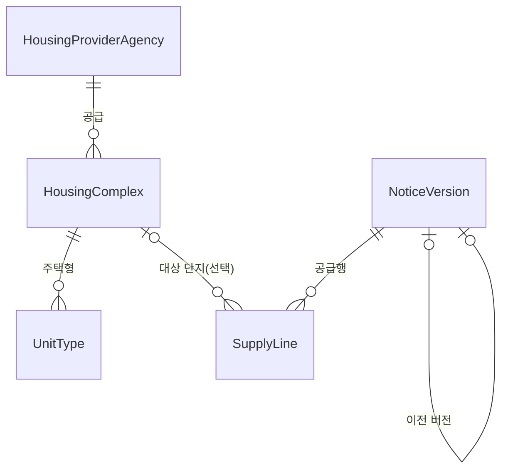

# 도메인 설계

**공공이 지어서 임대하는 단지**와 **거기 들어갈 사람을 뽑는 모집공고**를 담는다.

원천이 왜 그렇게 생겼는지와 실제 적재 수치는 [원천-매핑.md](원천-매핑.md)에 있다. 이 문서는 **모델이 왜 이 모양인가**만 다룬다.

---

## 1. 경계

| | 담나 | 왜 |
| --- | :---: | --- |
| 건설임대 단지 | **○** | 공공이 직접 지은 단지. 이름·주소·준공일·주택형이 있다 |
| 매입임대 | ✕ | 민간주택을 한 채씩 사들인 것. **"단지"라는 게 없다** |
| 전세임대 | ✕ | 세입자가 직접 구해온 집. **대상 주택 자체가 없다** |
| 임대 모집공고 | **○** | 위 단지에 들어갈 사람을 뽑는다 |
| 분양 공고 | ✕ | 파는 것이지 빌려주는 게 아니다. 붙을 단지도 없다 |

이 경계가 모델의 전제다 — **"이름 있는 단지가 있고, 그 안에 주택형이 있다."** 매입임대·전세임대에서는 이 문장이 거짓이라 담는 순간 모델이 무너진다.

## 2. 모델



### 엔티티

| | 무엇인가 | 한 줄로 |
| --- | --- | --- |
| `HousingComplex` | 단지 | 공고와 무관하게 존재하는 카탈로그의 기준점 |
| `UnitType` | 주택형 | 한 단지 안에서 면적·구조·공급조건을 공유하는 항목 |
| `NoticeVersion` | 공고버전 | 최초·정정·취소 **시점의 내용을 보존한 불변 스냅샷** |
| `SupplyLine` | 공급행 | 이 공고버전이 어느 주택에 몇 호를 배정했는가 |
| `HousingProviderAgency` | 공급기관 | LH·SH·지방도시공사 |

### 값 객체

엔티티에 묻어 두되, **묶어서 통째로 다루려고** 따로 뺀 것들이다.

| | 어디에 | 왜 묶었나 |
| --- | --- | --- |
| `Address` | 단지 | 주소는 단지 없이 존재할 이유가 없다. PNU 검증과 법정동코드 파생이 한자리에 모인다 |
| `CatalogDetails` | 단지 | **다시 읽을 때 덮어쓰는 부분.** 통째로 비교해 안 바뀌면 UPDATE 를 안 보낸다 |
| `BaseRentTerms` | 주택형 | 공고와 무관한 **카탈로그 기준** 임대조건 |
| `NoticeSnapshot` | 공고버전 | **한 버전이 담는 내용 전부.** 내용이 바뀌었는지 통째로 비교한다 |
| `SuppliedHousing` | 공급행 | **공고가 말한** 대상 주택. 공고 시점 그대로 얼려 둔다 |
| `RentTerms` | 공급행 | **이번 공고의 실제** 임대조건 |

### enum

| | 값 |
| --- | --- |
| `SupplyType` | 매입임대 · 국민임대 · 영구임대 · 행복주택 · 통합공공임대 · 전세임대 · 장기전세 · 5년/10년/50년임대 |
| `HouseType` | 아파트 · 연립 · 다세대 · 다가구 · 단독 · 오피스텔 |
| `HeatingType` | 개별 · 중앙 · 지역 |
| `NoticeChangeStatus` | 원본 · 정정 · 취소 |
| `SourceSystem` | 마이홈포털 · LH청약플러스 |

**enum 은 원문과 함께 둔다.** `heating_type` 옆에 `heating_type_name`, `house_type` 옆에 `house_type_name` 이 있는 식이다. 원천이 새 제도를 추가해도 매핑 실패로 행이 죽지 않고, enum 이 버리는 정보(난방의 열원 — 가스·전기·폐열)가 원문에 남는다.

---

## 3. 이 설계를 지배하는 결정 네 개

### 3.1 카탈로그와 스냅샷을 나눈다

**테이블이 넷인데 성격은 둘이다.**

| | 단지 · 주택형 | 공고버전 · 공급행 |
| --- | --- | --- |
| 무엇인가 | **카탈로그** — 지금 세상에 뭐가 있는가 | **기록** — 그때 뭐라고 공고했는가 |
| 시간 | 원천이 갱신되면 **계속 바뀐다** | **안 바뀐다** |
| 다시 읽으면 | 덮어쓴다 | 새 행을 쌓는다 |

"중계센트럴파크는 **지금** 어떤 단지인가"와 "2026년 8월 공고가 그 단지를 **그때** 뭐라고 불렀는가"는 다른 질문이고, 답을 같은 자리에 두면 하나가 다른 하나를 덮는다.

그래서 공급행은 단지가 붙어도 `SuppliedHousing`(공고가 말한 이름·주소·PNU)을 **지우지 않는다.** 단지명이 나중에 바뀌어도 그때 공고 내용은 그대로 남아야 한다.

### 3.2 공고는 고치지 않고 쌓는다

원천이 정정공고를 낼 때 원래 공고를 고치지 않고 **새 ID를 발급하고 이전 것을 가리킨다.** 그 성질을 그대로 모델에 옮겼다.

```
notice_id = 20680 ─┬─ v1  source=20680  ORIGINAL
                   ├─ v2  source=20893  CORRECTION  supersedes=v1
                   ├─ v3  source=20942  CORRECTION  supersedes=v2
                   └─ v4  source=21001  CORRECTION  supersedes=v3
```

| 칸 | 무엇인가 |
| --- | --- |
| `noticeId` | **모집 하나**의 식별자. 모든 버전이 공유한다 (체인 맨 앞의 원천 ID) |
| `sourceNoticeId` | **이 버전 자신**의 원천 ID. 다음 정정공고가 여기를 가리킨다 |
| `versionNumber` | 체인 안의 순서 |
| `supersedesVersion` | 바로 이전 버전 |

`NoticeVersion` 에 **수정자(setter)가 없다.** 내용이 바뀌면 `nextVersion()` 으로 새 행을 만들고 기존 행은 그대로 둔다. 그래서 공고버전은 만들어진 뒤 절대 안 바뀐다.

같은 원천 ID를 다시 읽었을 때는 `hasSameContentAs()` 로 내용을 통째로 비교한다. 여기서 다르다고 나오면 **원천이 새 ID 없이 제자리에서 고쳤다**는 뜻이라 우리 스냅샷이 조용히 낡는다. 버전을 함부로 만들지 않되 경고를 남긴다.

### 3.3 공급유형은 단지가 아니라 주택형에 산다

"이 단지는 국민임대"라고 단지에 적고 싶어지는데, 그러면 값이 하나로 안 정해진다.

원천에서 단지 식별자 안의 값들을 세어 보면 **단지의 성질은 전부 안 갈리고 공급유형과 세대수 둘만 갈린다. 그리고 그 둘이 정확히 같이 갈린다.** 세대수가 단지 전체가 아니라 **(단지, 공급유형)별 세대수**이기 때문이다 — 한 단지에 행복주택 20세대 + 5년임대 2세대면 20과 2가 따로 온다.

즉 공급유형은 **주택형으로 내려간 게 아니라 원래부터 단지의 성질이 아니었다.**

같은 이유로 두 가지가 따라온다.

**주택형 자연키에 공급유형과 면적이 들어간다.**

```
(단지, 주택형명)                        → 충돌한다
(단지, 공급유형, 주택형명, 전용, 공용)   → 유일
```

같은 `49A`, 같은 면적인데 국민임대와 장기전세로 두 번 오고 보증금이 6,385만 원과 3억 1,122만 원으로 갈린다. 이때 **`supplyTypeName` 은 enum 이 아니라 원문 문자열이 주인**이다 — enum 으로 두면 모르는 값이 null 이 되어 유니크 제약이 무너진다. 여기만 원문이 주인이고 enum 이 파생이다.

**단지의 세대수 칸은 이름이 `maxSupplyTypeUnitCount` 다.** 총 세대수가 아니라 가장 큰 공급유형의 세대수다. 행 순서대로 덮어쓰면 다시 적재할 때마다 값이 뒤집혀서 큰 값만 남긴다. 이름이 그 사실을 숨기지 않게 `totalUnitCount` 에서 바꿨다. 진짜 합계가 필요하면 주택형에서 공급유형별로 중복 제거해 더하면 된다.

### 3.4 확실하지 않으면 잇지 않는다

공고와 단지를 잇는 키는 **PNU(필지고유번호) 하나뿐**인데, 한 필지에 단지가 여럿 달린다.

그래서 `SupplyLine.complex` 는 **선택**이고, **후보가 정확히 하나일 때만** 붙인다. 잘못 붙은 단지를 화면에 보여 주는 것보다 안 붙은 채로 두는 게 낫다. 안 붙어도 `SuppliedHousing` 이 있어서 "공고가 말한 단지명·주소"는 화면에 쓸 수 있다.

`attachComplex()` 는 불변인 공급행에서 **유일한 예외**다. 예외인 이유가 있다 — `complex` 는 원천이 말한 내용이 아니라 **우리가 만든 연결**이다. 공고가 뭐라고 했는지는 `SuppliedHousing` 에 그대로 남고 이 메서드가 건드리지 않는다.

늦게 붙일 일이 생기는 건 순서 때문이다. 단지를 어느 지역까지 받을지가 공고에서 나오므로 **공고가 먼저, 단지가 나중**에 들어오고, 그 사이에 저장된 공급행은 매칭 기회를 놓친다.

---

## 4. 식별자 세 층

| 층 | 무엇 | 어디에 |
| --- | --- | --- |
| **내부 id** | 우리 PK. 원천과 무관하게 안정적이다 | 모든 엔티티 |
| **원천 id** | 재적재의 기준점. 같은 걸 두 번 담지 않게 한다 | `sourceComplexId`(단지) · `sourceNoticeId`(공고버전) |
| **자연키** | 원천 id 가 없는 것들의 정체성 | 주택형 5칸 · 공급행 `(공고버전, 표시순서)` |

유니크 제약은 넷이다.

```
housing_complex   source_complex_id
unit_type         (complex_id, supply_type_name, type_name, exclusive_area, residential_common_area)
notice_version    (notice_id, version_number)  ·  source_notice_id
supply_line       (notice_version_id, display_order)
```

**공급행의 순서를 원천 `houseSn` 으로 쓰지 않는다.** 한 공고 안에서 중복될 수 있어 순서가 되지 못한다. 응답 순서를 쓴다.

## 5. 항상 참인 것

- 단지의 **이름·주소·공급기관·원천 ID는 생성 후 안 바뀐다.** 갱신은 `CatalogDetails` 안쪽만 닿는다.
- 단지의 `maxSupplyTypeUnitCount` 는 **줄지 않는다.** 항상 큰 값을 남긴다.
- `Address` 의 PNU 는 **19자리 숫자이거나 null** 이다. 형식이 깨지면 통째로 버린다.
- `Address` 의 법정동코드는 **PNU 앞 10자리**다. PNU 가 없으면 없다.
- 도로명주소는 **비어 있을 수 없다.** 생성자가 막는다.
- 주택형의 `supplyTypeName` 은 **항상 원문**이다. enum 은 못 읽으면 null 이 되지만 원문은 남는다.
- 공고버전은 **만들어진 뒤 안 바뀐다.** 버전 1은 `noticeId == sourceNoticeId` 다.
- 공급행은 `attachComplex()` 를 빼면 **안 바뀐다.**

## 6. 안 만든 것

원천이 안 주는 것으로 칸을 만들면 **영영 비는 칸**이 된다. 지금은 안 만들고, 되살릴 조건만 적어 둔다.

| 안 만든 것 | 왜 | 언제 |
| --- | --- | --- |
| `SupplyLine → UnitType` FK | 공고가 "이 단지에 몇 호"까지만 말한다. **어느 주택형에 몇 호인지는 어느 API에도 없다** | 원천이 주택형별 배정을 주거나, 공고문 파싱 경로가 생기면 |
| 신청 자격·순위 테이블 | 공고문 본문에만 있다 | 상동 |
| 좌표 | 원천에 위경도가 없다. 지오코딩은 **약관** 문제라 저장 가능 여부부터 정해야 한다 | 확인되면 |
| 평면도·조감도 URL | 마이홈 원천에 없다 | LH 상세 원천을 붙이면 |
| `created_at` / `updated_at` | 아직 안 아프다 | 원천이 조용히 바뀐 걸 추적해야 할 때 |

## 7. 지금 불편한 곳

- **`HousingProviderAgency` 가 값을 못 하고 있다.** 원천이 기관 코드를 안 줘서 `code` 에 기관명을 그대로 넣었다. 문자열 한 칸과 다를 게 없고 조인만 하나 는다. 게다가 단지는 지역본부(`LH서울`), 공고는 본사(`LH`) 단위라 둘을 이을 수도 없다. **`LH ─┬ LH서울 └ LH경기북부` 계층이 생겨야 이 엔티티가 값을 한다.**
- **세대수가 주택형마다 중복 저장된다.** 원천의 `단지 ─< 공급유형(세대수) ─< 주택형` 3단계를 2단계로 눌러서다. 단지의 92%는 공급유형이 하나뿐이라 지금은 손해가 작다. 공급유형별 화면이 필요해지면 중간 테이블을 넣는다.
- **최신 공고버전 조회가 매번 서브쿼리다.** 공고가 수십 건인 지금은 문제없다. 목록이 느려지면 `is_latest` 를 고민한다.
