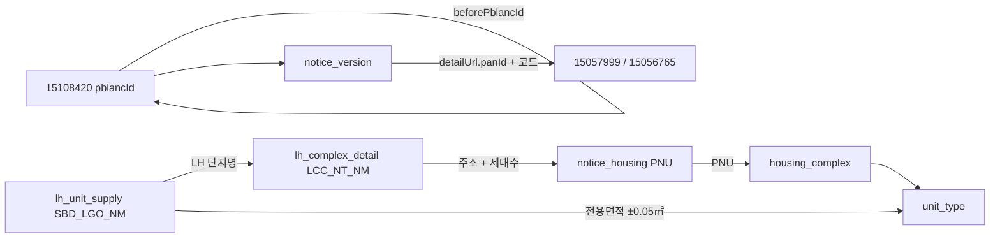

# 원천 API 명세

이 문서는 이 프로젝트가 실제 적재에 쓰는 외부 API 네 개를 설명한다.
처음 보는 개발자가 요청을 재현하고, 응답 필드가 어느 테이블로 가며,
서로 다른 원천이 어떤 키로 이어지는지 파악하는 데 필요한 범위만 담았다.

테이블의 컬럼·제약·생명주기는 [테이블 설계 사전](테이블-설계-사전.md)을 함께 본다.

## 1. 한눈에 보기

적재 서비스가 고정 호출하는 외부 경로는 아래 네 개뿐이다.
호출은 스케줄러가 아니라 `/admin/ingest/*` 관리 엔드포인트로 명시적으로 시작한다.
따라서 이 목록은 자동 실행 주기나 운영 스케줄을 뜻하지 않는다.

| API ID | 이름 | 고정 경로 | 응답 행의 알갱이 | 주로 받는 정보 | 주요 저장 테이블 |
| --- | --- | --- | --- | --- | --- |
| 15110581 | 마이홈 공공임대주택 단지정보 | `HWSPR04/rentalHouseGwList` | 단지 × 공급유형 × 주택형 | 단지, 주소, PNU, 주택형, 기준 임대조건 | `housing_provider_agency`, `housing_complex`, `complex_rental_program`, `unit_type` |
| 15108420 | 마이홈 공공주택 모집공고 | `HWSPR02/rsdtRcritNtcList` | 공고버전 × 공급행 | 공고 이력, 정정 체인, 공급 대상, 공고 임대조건 | `recruitment_notice`, `notice_version`, `notice_housing` |
| 15057999 | LH 분양임대공고별 상세정보 | `lhLeaseNoticeDtlInfo1/getLeaseNoticeDtlInfo1` | 공고버전 한 건 아래 여러 데이터셋 | 정정사유, 일정, 접수처, 단지 상세, 첨부 | `lh_notice_supplement`와 네 자식 테이블 |
| 15056765 | LH 분양임대공고별 공급정보 | `lhLeaseNoticeSplInfo1/getLeaseNoticeSplInfo1` | 공고버전 × 단지 × 주택형 | 주택형별 전체·금회 공급 세대수 | `lh_unit_supply_batch`, `lh_unit_supply` |

API가 네 개인데 정보 종류가 더 많아 보이는 이유는 15057999 때문이다.
이 API 한 번의 응답에 일정, 접수처, 단지 상세, 공고 첨부, 단지 이미지가
각각 별도 데이터셋으로 함께 들어온다.

## 2. 공통 호출 규칙

### 2.1 HTTP와 base URL

모든 원천은 `GET`이고 같은 공공데이터포털 `serviceKey`를 쓴다.

| 구분 | base URL | 사용하는 API |
| --- | --- | --- |
| 마이홈 단지 | `https://apis.data.go.kr/1613000/HWSPR04` | 15110581 |
| 마이홈 공고 | `https://apis.data.go.kr/1613000/HWSPR02` | 15108420 |
| LH | `https://apis.data.go.kr/B552555` | 15057999, 15056765 |

`serviceKey`는 URL 쿼리의 첫 파라미터로 붙는다.
포털의 Encoding 키처럼 이미 `%`가 들어 있는 값은 그대로 쓰고,
Decoding 키는 한 번만 URL 인코딩한다. 나머지 파라미터는 URI 빌더가 인코딩한다.
이 규칙은 `%2B` 같은 문자열을 다시 `%252B`로 바꾸는 이중 인코딩을 막는다.

### 2.2 두 응답 봉투

마이홈 계열은 객체 안의 `response.header/body`를 쓴다.

```json
{
  "response": {
    "header": {"resultCode": "00", "resultMsg": "NORMAL SERVICE"},
    "body": {"totalCount": 1, "item": [{"...": "..."}]}
  }
}
```

LH 계열은 최상위 배열 안에 `resHeader`와 여러 데이터셋을 나눠 담는다.

```json
[
  {"resHeader": [{"SS_CODE": "Y", "RS_MSG": "정상", "RS_DTTM": "20260813120000"}]},
  {"dsList01": [{"...": "..."}]}
]
```

마이홈은 `resultCode=00`을 성공, `03`을 자료 없음으로 받아들인다.
LH는 `resHeader[0].SS_CODE=Y`만 성공이다.
자료 없음은 빈 행 목록으로 처리하고, 그 밖의 원천 오류나 빈 응답은 실패로 기록한다.

## 3. 15110581 — 마이홈 단지 카탈로그

### 3.1 목적과 요청

이 원천은 현재 알려진 공공임대 단지 카탈로그를 만든다.
한 `item`은 **단지 × 공급유형 × 주택형** 한 줄이다.
같은 `hsmpSn`이 여러 번 나오는 것이 정상이다.

```http
GET https://apis.data.go.kr/1613000/HWSPR04/rentalHouseGwList
```

| 파라미터 | 필수 | 값/출처 | 설명 |
| --- | --- | --- | --- |
| `serviceKey` | O | 환경변수 `DATA_GO_KR_SERVICE_KEY` | 공공데이터포털 인증키 |
| `brtcCode` | O | 지역 카탈로그 | 광역시도 코드 2자리 |
| `signguCode` | O | 지역 카탈로그 | 시군구 코드 3자리 |
| `numOfRows` | O | 관리 요청의 `pageSize` | 페이지 크기 |
| `pageNo` | O | 1부터 증가 | 페이지 번호 |

서비스는 `myhome-region-codes.csv`의 시군구 조합 256개를 모두 순회한다.
이 API에는 공급유형 필터가 없으므로 `suplyTy` 같은 조건을 보내지 않는다.

```text
GET /1613000/HWSPR04/rentalHouseGwList
  ?serviceKey=<REDACTED>&brtcCode=43&signguCode=750&numOfRows=200&pageNo=1
```

### 3.2 응답 모양

```json
{
  "response": {
    "header": {"resultCode": "00", "resultMsg": "NORMAL SERVICE"},
    "body": {
      "totalCount": 1,
      "item": [{
        "hsmpSn": 12345,
        "hsmpNm": "예시단지",
        "suplyTyNm": "국민임대",
        "styleNm": "46",
        "suplyPrvuseAr": 46.90
      }]
    }
  }
}
```

### 3.3 `MyHomeComplexItem` 필드

| 필드 | 의미 | 저장 위치/처리 |
| --- | --- | --- |
| `hsmpSn` | 마이홈 단지 식별자 | `housing_complex.source_complex_id` |
| `insttNm` | 공급기관명 | `housing_provider_agency.code/name` |
| `brtcCode` / `brtcNm` | 광역시도 코드/명 | `housing_complex.province_code/province_name` |
| `signguCode` / `signguNm` | 시군구 코드/명 | `housing_complex.district_code/district_name` |
| `hsmpNm` | 단지명 | `housing_complex.name` |
| `rnAdres` | 도로명주소 | `housing_complex.road_address` |
| `pnu` | 19자리 필지고유번호 | `housing_complex.pnu`; 앞 10자리는 법정동코드로도 저장 |
| `competDe` | 준공일 | 날짜로 변환해 `housing_complex.completion_date` |
| `hshldCo` | 해당 단지·공급유형 전체 세대수 | `complex_rental_program.unit_count` |
| `suplyTyNm` | 공급유형명 | `complex_rental_program.supply_type_name/supply_type` |
| `styleNm` | 주택형명 | `unit_type.type_name` |
| `suplyPrvuseAr` / `suplyCmnuseAr` | 전용면적/주거공용면적 | `unit_type.exclusive_area/residential_common_area` |
| `houseTyNm` | 주택유형명 | `housing_complex.house_type_name/house_type` |
| `heatMthdDetailNm` | 난방방식 상세 | `housing_complex.heating_type_name/heating_type` |
| `buldStleNm` | 복도식 등 건물 형태 | `housing_complex.corridor_type` |
| `elvtrInstlAtNm` | 승강기 설치 여부 | `housing_complex.elevator_installation` |
| `parkngCo` | 주차 가능 대수 | `housing_complex.parking_spaces` |
| `bassRentGtn` / `bassMtRntchrg` | 기준 임대보증금/월임대료 | `unit_type.base_deposit/base_monthly_rent` |
| `bassCnvrsGtnLmt` | 기준 전환보증금 한도 | `unit_type.base_convertible_deposit_limit` |

응답 자체는 공급유형으로 거르지 않는다.
받은 뒤 `SupplyType`으로 해석해 건설형 공공임대 8종만 남기며,
매입임대·전세임대와 알 수 없는 유형은 저장 경계에서 제외한다.
주택유형이 아파트이거나 유효한 준공일이 있어야 건설형 근거가 있는 것으로 본다.

## 4. 15108420 — 마이홈 임대 모집공고

### 4.1 목적과 요청

이 원천은 모집공고의 버전 이력과 공고가 대상으로 삼은 주택 행을 준다.
한 `item`의 알갱이는 **공고버전(`pblancId`) × 공급행(`houseSn`)**이다.

```http
GET https://apis.data.go.kr/1613000/HWSPR02/rsdtRcritNtcList
```

| 파라미터 | 필수 | 값/출처 | 설명 |
| --- | --- | --- | --- |
| `serviceKey` | O | 환경변수 | 공공데이터포털 인증키 |
| `suplyTy` | O | 아래 8개 코드를 순회 | 공급유형 필터 |
| `numOfRows` | O | 관리 요청의 `pageSize` | 페이지 크기 |
| `pageNo` | O | 1부터 증가 | 페이지 번호 |

| `suplyTy` | 이름 |
| --- | --- |
| `01` | 영구임대 |
| `02` | 국민임대 |
| `03` | 50년임대 |
| `05` | 10년임대 |
| `06` | 5년임대 |
| `07` | 장기전세 |
| `10` | 행복주택 |
| `12` | 통합공공임대 |

```text
GET /1613000/HWSPR02/rsdtRcritNtcList
  ?serviceKey=<REDACTED>&suplyTy=02&numOfRows=100&pageNo=1
```

### 4.2 응답 모양

```json
{
  "response": {
    "header": {"resultCode": "00", "resultMsg": "NORMAL SERVICE"},
    "body": {
      "item": [{
        "pblancId": "20260001",
        "houseSn": 1,
        "pblancNm": "국민임대 예비입주자 모집",
        "hsmpNm": "예시단지",
        "sumSuplyCo": 20
      }]
    }
  }
}
```

### 4.3 공고 공통 필드

같은 `pblancId`에서 반복되며 값이 갈리지 않는 필드다.

| 필드 | 의미 | 저장 위치/처리 |
| --- | --- | --- |
| `pblancId` | 공고버전 ID | `notice_version.source_notice_id`; 첫 버전이면 루트도 생성 |
| `sttusNm` | 일반/정정/취소 상태명 | `notice_version.change_status` |
| `pblancNm` | 공고명 | `notice_version.title` |
| `suplyInsttNm` | 공급기관명 | `notice_version.supply_institution_name` |
| `houseTyNm` | 주택유형명 | `notice_version.house_type_name/house_type` |
| `suplyTyNm` | 공급유형명 | `notice_version.supply_type_name/supply_type` |
| `beforePblancId` | 바로 이전 공고 ID | `notice_version.before_source_notice_id`와 이전 버전 연결 |
| `rcritPblancDe` | 모집공고일 | `notice_version.published_at` |
| `przwnerPresnatnDe` | 당첨자 발표일 | `notice_version.winner_announced_on` |
| `beginDe` / `endDe` | 신청 시작일/종료일 | `notice_version.application_begin_on/application_end_on` |
| `refrnc` | 문의처 | `notice_version.contact` |
| `url` | 공고 원문 상세 URL | `notice_version.detail_url`; LH 요청 파라미터의 출발점 |

### 4.4 공급행 필드

| 필드 | 의미 | 저장 위치/처리 |
| --- | --- | --- |
| `houseSn` | 공고 안 공급행 일련번호 | `notice_housing.house_sn` |
| `pcUrl` / `mobileUrl` | PC/모바일 행별 상세 URL | `notice_housing.detail_url/mobile_detail_url` |
| `hsmpNm` | 공고가 적은 단지명 | `notice_housing.supplied_complex_name` |
| `brtcNm` / `signguNm` | 광역시도/시군구명 | `notice_housing.supplied_province_name/district_name` |
| `fullAdres` | 공고가 적은 전체 주소 | `notice_housing.supplied_full_address` |
| `rnCodeNm` | 도로명 | `notice_housing.supplied_road_name` |
| `refrnLegaldongNm` | 참고 법정동명 | `notice_housing.supplied_reference_legal_dong_name` |
| `pnu` | 필지고유번호 | `notice_housing.supplied_pnu`; 카탈로그 연결 키 |
| `heatMthdNm` | 난방방식 원문 | `notice_housing.supplied_heating_type_name` |
| `totHshldCo` | 대상 주택 전체 세대수 | 숫자로 변환해 `notice_housing.supplied_total_unit_count` |
| `sumSuplyCo` | 이번 공고 공급 수 | `notice_housing.supply_count` |
| `rentGtn` | 임대보증금 | `notice_housing.deposit` |
| `enty` / `surlus` | 계약금/잔금 | `notice_housing.down_payment/balance` |
| `mtRntchrg` | 월임대료 | `notice_housing.monthly_rent` |

원천에는 `suplyHoCo`와 `prtpay`도 보이지만 현재 수신 레코드에는 넣지 않는다.
건설임대 실측에서 `suplyHoCo`는 0 또는 의미 없는 상수였고 `prtpay`는 항상 0이었다.

같은 서비스의 분양 목록 `ltRsdtRcritNtcList`는 사용하지 않는다.
현재 모델은 건설형 임대의 보증금·월임대료와 임대 단지 카탈로그를 경계로 삼으며,
분양대금 필드는 같은 의미로 저장할 수 없기 때문이다.

## 5. LH 공통 요청 파생 규칙

LH 두 API는 먼저 저장된 `notice_version.detail_url`에서 요청 값을 얻는다.

```text
...selectWrtancInfo.do
  ?panId=2015122300020476
  &ccrCnntSysDsCd=03
  &uppAisTpCd=06
  &aisTpCd=10
```

| `detailUrl` 쿼리 | LH 요청 파라미터 | 필수 | 처리 |
| --- | --- | --- | --- |
| `panId` | `PAN_ID` | O | LH 공고와 호출 대상을 식별 |
| `ccrCnntSysDsCd` | `CCR_CNNT_SYS_DS_CD` | O | 연결 시스템 구분 |
| `uppAisTpCd` | `UPP_AIS_TP_CD` | O | 상위 공고유형 |
| `aisTpCd` | `AIS_TP_CD` | X | 링크에 없으면 요청에서도 생략 |
| `NoticeVersion.supplyType` | `SPL_INF_TP_CD` | O | 아래 resolver 표로 계산 |
| 고정값 | `PG_SZ` / `PAGE` | O | `100` / `1` |

| 마이홈 `SupplyType` | `SPL_INF_TP_CD` |
| --- | --- |
| 5년임대, 10년임대 | `060` |
| 50년임대 | `061` |
| 국민임대, 영구임대, 장기전세 | `062` |
| 행복주택 | `063` |
| 통합공공임대 | 미확인이라 LH 호출 생략 |

`PAN_ID`, `CCR_CNNT_SYS_DS_CD`, `UPP_AIS_TP_CD` 중 하나라도 없으면 호출하지 않는다.

## 6. 15057999 — LH 공고 상세

### 6.1 요청

```http
GET https://apis.data.go.kr/B552555/lhLeaseNoticeDtlInfo1/getLeaseNoticeDtlInfo1
```

| 파라미터 | 필수 | 값/출처 |
| --- | --- | --- |
| `serviceKey` | O | 공공데이터포털 인증키 |
| `PAN_ID` | O | `detailUrl.panId` |
| `CCR_CNNT_SYS_DS_CD` | O | `detailUrl.ccrCnntSysDsCd` |
| `UPP_AIS_TP_CD` | O | `detailUrl.uppAisTpCd` |
| `AIS_TP_CD` | X | `detailUrl.aisTpCd` |
| `SPL_INF_TP_CD` | O | 공급유형 resolver 결과 |
| `PG_SZ` / `PAGE` | O | `100` / `1` |

```text
GET /B552555/lhLeaseNoticeDtlInfo1/getLeaseNoticeDtlInfo1
  ?serviceKey=<REDACTED>&PAN_ID=2015122300020476&CCR_CNNT_SYS_DS_CD=03
  &UPP_AIS_TP_CD=06&AIS_TP_CD=10&SPL_INF_TP_CD=062&PG_SZ=100&PAGE=1
```

### 6.2 응답 데이터셋

```json
[
  {"dsEtcInfo": [{"CRC_RSN": "정정 사유", "ETC_CTS": "기타사항"}]},
  {"dsSplScdl": [{"SBD_LGO_NM": "예시단지", "CTRT_ST_DT": "2026.09.01"}]},
  {"dsCtrtPlc": [{"CTRT_PLC_ADR": "서울특별시 ..."}]},
  {"dsSbd": [{"LCC_NT_NM": "예시단지", "HSH_CNT": "500"}]},
  {"dsAhflInfo": [{"CMN_AHFL_NM": "공고문.pdf", "AHFL_URL": "https://..."}]},
  {"dsSbdAhfl": [{"LCC_NT_NM": "예시단지", "AHFL_URL": "https://..."}]},
  {"resHeader": [{"SS_CODE": "Y", "RS_MSG": "정상", "RS_DTTM": "20260813120000"}]}
]
```

| 데이터셋 | 제공 정보 | 저장 위치 |
| --- | --- | --- |
| `resHeader` | 성공 여부와 원천 응답시각 | 성공 검사, `lh_notice_supplement.source_responded_at` |
| `dsEtcInfo` | 기타사항, 정정·취소 사유 | `lh_notice_supplement.correction_reason` |
| `dsSplScdl` | 신청·서류·계약 일정 | `notice_schedule` |
| `dsCtrtPlc` | 방문 접수처와 운영 안내 | `reception_place` |
| `dsSbd` | 공고 시점의 단지 상세 | `lh_complex_detail` |
| `dsAhflInfo` | 공고문·카탈로그 파일 | `notice_attachment` |
| `dsSbdAhfl` | 조감도·배치도·위치도 | `notice_attachment` |

호출 메타데이터인 `PAN_ID`와 네 코드, 데이터셋 존재 여부, 수집시각은
응답 묶음의 루트인 `lh_notice_supplement`에도 저장한다.

### 6.3 `resHeader`와 `dsEtcInfo`

| 필드 | 의미 | 저장 위치/처리 |
| --- | --- | --- |
| `SS_CODE` | 처리 성공 코드 | `Y`인지 검사 |
| `RS_MSG` | 처리 메시지 | 오류 메시지에 사용, 별도 저장 안 함 |
| `RS_DTTM` | 원천 응답시각 | `lh_notice_supplement.source_responded_at` |
| `CRC_RSN` | 정정·취소 사유 | 첫 유효값을 `lh_notice_supplement.correction_reason`에 저장 |
| `ETC_CTS` | 기타사항 | 수신하지만 현재 저장하지 않음 |

### 6.4 `dsSplScdl`

| 필드 | 의미 | 저장 위치 |
| --- | --- | --- |
| `SBD_LGO_NM` | 일정 대상 단지명 | `notice_schedule.complex_name` |
| `ACP_DTTM` | 신청 기간 원문 | `notice_schedule.application_period` |
| `PPR_SBM_OPE_ANC_DT` | 서류제출 대상자 발표일 | `notice_schedule.document_target_announcement_date` |
| `PPR_ACP_ST_DT` / `PPR_ACP_CLSG_DT` | 서류접수 시작일/종료일 | `notice_schedule.document_submission_begin_date/end_date` |
| `CTRT_ST_DT` / `CTRT_ED_DT` | 계약 시작일/종료일 | `notice_schedule.contract_begin_date/end_date` |

### 6.5 `dsCtrtPlc`

| 필드 | 의미 | 저장 위치 |
| --- | --- | --- |
| `CTRT_PLC_ADR` / `CTRT_PLC_DTL_ADR` | 접수처 주소/상세주소 | `reception_place.address/detail_address` |
| `TSK_ST_DTTM` / `TSK_ED_DTTM` | 운영 시작/종료 일시 원문 | `reception_place.operation_begin/operation_end` |
| `SIL_OFC_TLNO` | 현장 사무실 전화번호 | `reception_place.phone` |
| `SIL_OFC_GUD_FCTS` | 현장 안내 | `reception_place.guidance` |

### 6.6 `dsSbd`

| 필드 | 의미 | 저장 위치 |
| --- | --- | --- |
| `LCC_NT_NM` | LH 단지명 | `lh_complex_detail.complex_name` |
| `LGDN_ADR` / `LGDN_DTL_ADR` | 지번 주소/상세주소 | `lh_complex_detail.lot_address/lot_detail_address` |
| `HSH_CNT` | 전체 세대수 | `lh_complex_detail.total_unit_count` |
| `HTN_FMLA_DESC` | 난방방식 설명 | `lh_complex_detail.heating_description` |
| `DDO_AR` | 전용면적 범위 원문 | `lh_complex_detail.exclusive_area_range` |
| `MVIN_XPC_YM` | 입주예정 연월 | `lh_complex_detail.expected_move_in_year_month` |
| `SPL_INF_GUD_FCTS` | 공급 안내 | `lh_complex_detail.guidance_text` |

### 6.7 `dsAhflInfo`와 `dsSbdAhfl`

| 데이터셋 | 필드 | 의미 | 저장 위치 |
| --- | --- | --- | --- |
| `dsAhflInfo` | `SL_PAN_AHFL_DS_CD_NM` | 공고 파일 구분 | `notice_attachment.kind` |
| `dsAhflInfo` | `CMN_AHFL_NM` | 첨부파일명 | `notice_attachment.name` |
| `dsAhflInfo` | `AHFL_URL` | 다운로드 URL | `notice_attachment.url` |
| `dsSbdAhfl` | `LS_SPL_INF_UPL_FL_DS_CD_NM` | 단지 이미지 구분 | `notice_attachment.kind` |
| `dsSbdAhfl` | `CMN_AHFL_NM` / `AHFL_URL` | 파일명/URL | `notice_attachment.name/url` |
| `dsSbdAhfl` | `LCC_NT_NM` | 첨부 대상 LH 단지명 | `notice_attachment.complex_label` |

LH는 실제 데이터와 함께 컬럼 제목만 든 `...Nm` 행도 보낸다.
첨부는 `http` 또는 `https`이고 호스트가 있는 URL이며 구분명·파일명이 있을 때만 저장하므로,
URL 자리에 `다운로드`가 든 헤더/라벨 행은 제외된다.

## 7. 15056765 — LH 주택형별 공급정보

이 원천은 한 공고에서 **어느 단지의 어느 주택형을 몇 호 공급하는지** 알려 준다.

```http
GET https://apis.data.go.kr/B552555/lhLeaseNoticeSplInfo1/getLeaseNoticeSplInfo1
```

요청 파라미터와 파생 규칙은 15057999와 완전히 같다.
즉 `serviceKey`, `PAN_ID`, `CCR_CNNT_SYS_DS_CD`, `UPP_AIS_TP_CD`, 선택적 `AIS_TP_CD`,
`SPL_INF_TP_CD`, `PG_SZ=100`, `PAGE=1`을 사용한다.

```text
GET /B552555/lhLeaseNoticeSplInfo1/getLeaseNoticeSplInfo1
  ?serviceKey=<REDACTED>&PAN_ID=2015122300020476&CCR_CNNT_SYS_DS_CD=03
  &UPP_AIS_TP_CD=06&AIS_TP_CD=10&SPL_INF_TP_CD=062&PG_SZ=100&PAGE=1
```

### 7.1 응답

```json
[
  {"dsList01": [{
    "SBD_LGO_NM": "울산구영1BL 국민임대",
    "HTY_NNA": "59㎡",
    "DDO_AR": "59.94",
    "SPL_AR": "82.1224",
    "HSH_CNT": "235",
    "NOW_HSH_CNT": "20",
    "RFE": "공고문 참조",
    "LS_GMY": "공고문 참조"
  }]},
  {"resHeader": [{"SS_CODE": "Y", "RS_DTTM": "20260813120000"}]}
]
```

| 필드 | 의미 | 저장 위치/처리 |
| --- | --- | --- |
| `SBD_LGO_NM` | LH 단지명 | `lh_unit_supply.complex_label` |
| `HTY_NNA` | LH 주택형명 | `lh_unit_supply.type_name` |
| `DDO_AR` | 전용면적 | `lh_unit_supply.exclusive_area` |
| `SPL_AR` | 공급면적 | `lh_unit_supply.supply_area` |
| `HSH_CNT` | 단지·주택형 전체 세대수 | `lh_unit_supply.total_unit_count` |
| `NOW_HSH_CNT` | 이번 공고 공급 세대수 | `lh_unit_supply.supplied_unit_count` |
| `RFE` | 월임대료 | 실측 fixture에서 `공고문 참조`라 수신 레코드·DB에 저장하지 않음 |
| `LS_GMY` | 임대보증금 | 실측 fixture에서 `공고문 참조`라 수신 레코드·DB에 저장하지 않음 |

호출 한 번의 메타데이터와 `dsList01` 존재 여부는 `lh_unit_supply_batch`에,
각 `dsList01` 행은 순서대로 `lh_unit_supply`에 저장한다.

## 8. 원천 연결 키 지도



| 연결 | 양쪽 값 | 역할 |
| --- | --- | --- |
| 공고 정정 체인 | `pblancId` ← `beforePblancId` | 이전 공고버전과 다음 정정·취소 버전을 연결 |
| 마이홈 공고 → LH 호출 | `notice_version.detail_url`의 `panId`와 코드 | 같은 공고의 LH 상세·공급정보 요청을 구성 |
| 공고 공급행 → 카탈로그 단지 | `notice_housing.supplied_pnu` = `housing_complex.pnu` | 마이홈 두 원천의 안전한 단지 연결 |
| LH 공급행 → LH 단지 상세 | `SBD_LGO_NM` = `LCC_NT_NM` | 같은 LH 명명 체계 안에서 단지 연결 |
| LH 단지 상세 → 공고 공급행 | 주소, 필요 시 세대수 | PNU가 없는 LH 상세를 마이홈 공고행에 연결 |
| LH 공급행 → 카탈로그 주택형 | 단지 경로 + `DDO_AR`와 `exclusive_area` 차이 ≤ 0.05㎡ | 주택형명 표기 차이를 피하고 면적으로 연결 |

`SBD_LGO_NM`을 바로 마이홈 카탈로그 단지명과 비교하지 않는다.
먼저 같은 LH 계열의 `LCC_NT_NM`에 연결한 뒤 주소와 PNU 경로를 따라간다.

## 9. 적재와 매칭 순서

관리 엔드포인트는 아래 순서로 호출한다.

1. `POST /admin/ingest/complexes` — 15110581 카탈로그 적재
2. `POST /admin/ingest/notices` — 15108420 공고와 공급행 적재
3. `POST /admin/ingest/notice-details` — 15057999 LH 상세 적재
4. `POST /admin/ingest/unit-supplies` — 15056765 LH 공급행 적재
5. `POST /admin/ingest/matches/catalog?noticeVersionId=...` — PNU로 카탈로그 연결
6. `POST /admin/ingest/matches/lh?noticeVersionId=...` — 주소·세대수로 LH 상세 연결
7. `POST /admin/ingest/matches/unit-type?noticeVersionId=...` — 앞의 두 연결과 전용면적으로 주택형 연결

3번과 4번은 같은 공고를 입력으로 쓰지만 서로 다른 API이므로 선후 의존이 없다.
5번과 6번도 둘 다 끝난 뒤 7번을 실행하면 된다.

## 10. 검토했지만 쓰지 않는 원천

| 원천 | 제외 이유 |
| --- | --- |
| 15058476 공공임대주택 단지 기본정보 | 15110581로 대체된 구버전 |
| 15059475 LH 단지별 면적·임대조건 | 단지 ID, 주소, PNU가 없어 기존 단지에 안전하게 붙일 수 없음 |
| 15058530 LH 분양임대공고문 | 현재 마이홈 공고보다 정정 체인, PNU, 임대조건 정보가 부족함 |
| 15108420 `ltRsdtRcritNtcList` | 분양 모집공고라 건설형 임대 모델의 경계 밖 |

`GET /admin/ingest/probe`는 지정한 경로의 원천 응답을 수동 확인하는 개발 도구다.
고정 적재 서비스가 아니므로 다섯 번째 원천으로 세지 않는다.

## 11. 현재 범위와 한계

아래 수치는 2026-08-13 적재 스냅샷이다.

| 항목 | 수치 |
| --- | ---: |
| LH 호출 대상 공고버전 | 54 |
| `lh_unit_supply_batch` | 54 |
| `lh_unit_supply` 원천 공급행 | 290 |
| 카탈로그 `UnitType` 확정 연결 | 202 |
| 같은 면적 후보가 여러 개인 `AMBIGUOUS` | 30 |
| 카탈로그까지 경로가 끊긴 `NO_CATALOG_PATH` | 58 |

`AMBIGUOUS`는 같은 전용면적에 공급대상만 다른 주택형이 여럿인 경우가 주원인이다.
`NO_CATALOG_PATH`는 주소 또는 PNU 연결이 끊긴 경우이며 LH 공급행 자체가 잘못됐다는 뜻은 아니다.

카탈로그 매칭이 없어도 `lh_unit_supply`의 LH 단지명, 주택형명, 면적,
전체 세대수, 이번 공급 세대수는 원천 사실로 남는다.
조회에서는 매칭 테이블을 선택적 보강값으로 다루고 이 원천 행을 버리지 않는다.
