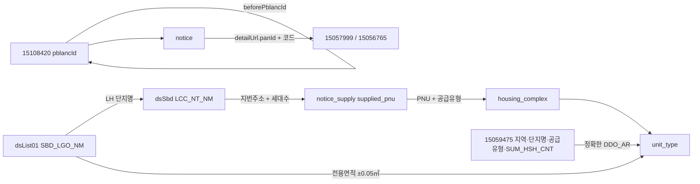

# 원천 API 명세

이 문서는 이 프로젝트가 실제 적재에 쓰는 외부 API 다섯 개를 설명한다.
처음 보는 개발자가 요청을 재현하고, 응답 필드가 어느 테이블로 가며,
서로 다른 원천이 어떤 키로 이어지는지 파악하는 데 필요한 범위만 담았다.

테이블의 컬럼·제약·생명주기는 [테이블 설계 사전](테이블-설계-사전.md)을 함께 본다.

## 1. 한눈에 보기

적재 서비스가 고정 호출하는 외부 경로는 아래 다섯 개다.
호출은 스케줄러가 아니라 `/admin/ingest/*` 관리 엔드포인트로 명시적으로 시작한다.
따라서 이 목록은 자동 실행 주기나 운영 스케줄을 뜻하지 않는다.

| API ID | 이름 | 고정 경로 | 응답 행의 알갱이 | 주로 받는 정보 | 주요 저장 테이블 |
| --- | --- | --- | --- | --- | --- |
| 15110581 | 마이홈 공공임대주택 단지정보 | `HWSPR04/rentalHouseGwList` | 단지 × 공급유형 × 주택형 | 단지, 주소, PNU, 주택형, 기준 임대조건 | `housing_complex`, `unit_type` |
| 15108420 | 마이홈 공공주택 모집공고 | `HWSPR02/rsdtRcritNtcList` | 공고 × 공급행 | 공고 이력, 정정 체인, 공급 대상, 공고 임대조건 | `notice`, `notice_supply` |
| 15057999 | LH 분양임대공고별 상세정보 | `lhLeaseNoticeDtlInfo1/getLeaseNoticeDtlInfo1` | 공고 한 건 아래 여러 데이터셋 | 정정사유, 일정, 접수처, 단지 상세, 첨부 | `notice`, `notice_schedule`, `reception_place`, `notice_attachment`, `notice_supply` |
| 15056765 | LH 분양임대공고별 공급정보 | `lhLeaseNoticeSplInfo1/getLeaseNoticeSplInfo1` | 공고 × 단지 × 주택형 | 주택형별 전체·금회 공급 세대수 | `notice_supply` |
| 15059475 | LH 임대주택 단지별 면적·세대수 카탈로그 | `lhLeaseInfo1/lhLeaseInfo1` | 지역 × 공급유형 × 단지 × 전용면적 | 단지·주택형별 전체 세대수·임대조건 | `unit_type` (원천행은 저장하지 않는다) |

API가 다섯 개인데 정보 종류가 더 많아 보이는 이유는 15057999 때문이다.
이 API 한 번의 응답에 일정, 접수처, 단지 상세, 공고 첨부, 단지 이미지가
각각 별도 데이터셋으로 함께 들어온다.

## 2. 공통 호출 규칙

### 2.1 HTTP와 base URL

모든 원천은 `GET`이고 같은 공공데이터포털 `serviceKey`를 쓴다.

| 구분 | base URL | 사용하는 API |
| --- | --- | --- |
| 마이홈 단지 | `https://apis.data.go.kr/1613000/HWSPR04` | 15110581 |
| 마이홈 공고 | `https://apis.data.go.kr/1613000/HWSPR02` | 15108420 |
| LH | `https://apis.data.go.kr/B552555` | 15057999, 15056765 |

`serviceKey`는 URL 쿼리의 첫 파라미터로 붙는다.
포털의 Encoding 키처럼 이미 `%`가 들어 있는 값은 그대로 쓰고,
Decoding 키는 한 번만 URL 인코딩한다. 나머지 파라미터는 URI 빌더가 인코딩한다.
이 규칙은 `%2B` 같은 문자열을 다시 `%252B`로 바꾸는 이중 인코딩을 막는다.

### 2.2 두 응답 봉투

마이홈 계열은 객체 안의 `response.header/body`를 쓴다.

```json
{
  "response": {
    "header": {"resultCode": "00", "resultMsg": "NORMAL SERVICE"},
    "body": {"totalCount": 1, "item": [{"...": "..."}]}
  }
}
```

LH 계열은 최상위 배열 안에 `resHeader`와 여러 데이터셋을 나눠 담는다.

```json
[
  {"resHeader": [{"SS_CODE": "Y", "RS_MSG": "정상", "RS_DTTM": "20260813120000"}]},
  {"dsList01": [{"...": "..."}]}
]
```

마이홈은 `resultCode=00`을 성공, `03`을 자료 없음으로 받아들인다.
LH는 `resHeader[0].SS_CODE=Y`만 성공이다.
자료 없음은 빈 행 목록으로 처리하고, 그 밖의 원천 오류나 빈 응답은 실패로 기록한다.

## 3. 15110581 — 마이홈 단지 카탈로그

### 3.1 목적과 요청

이 원천은 현재 알려진 공공임대 단지 카탈로그를 만든다.
한 `item`은 **단지 × 공급유형 × 주택형** 한 줄이다.
같은 `hsmpSn`이 여러 번 나오는 것이 정상이다.

```http
GET https://apis.data.go.kr/1613000/HWSPR04/rentalHouseGwList
```

| 파라미터 | 필수 | 값/출처 | 설명 |
| --- | --- | --- | --- |
| `serviceKey` | O | 환경변수 `DATA_GO_KR_SERVICE_KEY` | 공공데이터포털 인증키 |
| `brtcCode` | O | 지역 카탈로그 | 광역시도 코드 2자리 |
| `signguCode` | O | 지역 카탈로그 | 시군구 코드 3자리 |
| `numOfRows` | O | 관리 요청의 `pageSize` | 페이지 크기 |
| `pageNo` | O | 1부터 증가 | 페이지 번호 |

서비스는 `myhome-region-codes.csv`의 시군구 조합 256개를 모두 순회한다.
이 API에는 공급유형 필터가 없으므로 `suplyTy` 같은 조건을 보내지 않는다.

```text
GET /1613000/HWSPR04/rentalHouseGwList
  ?serviceKey=<REDACTED>&brtcCode=43&signguCode=750&numOfRows=200&pageNo=1
```

### 3.2 응답 모양

```json
{
  "response": {
    "header": {"resultCode": "00", "resultMsg": "NORMAL SERVICE"},
    "body": {
      "totalCount": 1,
      "item": [{
        "hsmpSn": 12345,
        "hsmpNm": "예시단지",
        "suplyTyNm": "국민임대",
        "styleNm": "46",
        "suplyPrvuseAr": 46.90
      }]
    }
  }
}
```

### 3.3 `MyHomeComplexItem` 필드

| 필드 | 의미 | 저장 위치/처리 |
| --- | --- | --- |
| `hsmpSn` | 마이홈 단지 식별자 | `housing_complex.source_complex_id` |
| `insttNm` | 공급기관명 | `housing_complex.supply_institution_name` |
| `brtcCode` / `brtcNm` | 광역시도 코드/명 | `housing_complex.province_code/province_name` |
| `signguCode` / `signguNm` | 시군구 코드/명 | `housing_complex.district_code/district_name` |
| `hsmpNm` | 단지명 | `housing_complex.name` |
| `rnAdres` | 도로명주소 | `housing_complex.road_address` |
| `pnu` | 19자리 필지고유번호 | `housing_complex.pnu`; 앞 10자리는 법정동코드로도 저장 |
| `competDe` | 준공일 | 날짜로 변환해 `housing_complex.completion_date` |
| `hshldCo` | 해당 단지·공급유형 전체 세대수 | `housing_complex.unit_count` |
| `suplyTyNm` | 공급유형명 | `housing_complex.supply_type_name/supply_type` |
| `styleNm` | 주택형명 | `unit_type.type_name` |
| `suplyPrvuseAr` / `suplyCmnuseAr` | 전용면적/주거공용면적 | `unit_type.exclusive_area/residential_common_area` |
| `houseTyNm` | 주택유형명 | `housing_complex.house_type_name/house_type` |
| `heatMthdDetailNm` | 난방방식 상세 | `housing_complex.heating_type_name/heating_type` |
| `buldStleNm` | 복도식 등 건물 형태 | `housing_complex.corridor_type` |
| `elvtrInstlAtNm` | 승강기 설치 여부 | `housing_complex.elevator_installation` |
| `parkngCo` | 주차 가능 대수 | `housing_complex.parking_spaces` |
| `bassRentGtn` / `bassMtRntchrg` | 기준 임대보증금/월임대료 | `unit_type.base_deposit/base_monthly_rent` |
| `bassCnvrsGtnLmt` | 기준 전환보증금 한도 | `unit_type.base_convertible_deposit_limit` |

응답 자체는 공급유형으로 거르지 않는다.
받은 뒤 `SupplyType`으로 해석해 건설형 공공임대 8종만 남기며,
매입임대·전세임대와 알 수 없는 유형은 저장 경계에서 제외한다.
주택유형이 아파트이거나 유효한 준공일이 있어야 건설형 근거가 있는 것으로 본다.

## 4. 15108420 — 마이홈 임대 모집공고

### 4.1 목적과 요청

이 원천은 모집공고의 버전 이력과 공고가 대상으로 삼은 주택 행을 준다.
한 `item`의 알갱이는 **공고버전(`pblancId`) × 공급행(`houseSn`)**이다.

```http
GET https://apis.data.go.kr/1613000/HWSPR02/rsdtRcritNtcList
```

| 파라미터 | 필수 | 값/출처 | 설명 |
| --- | --- | --- | --- |
| `serviceKey` | O | 환경변수 | 공공데이터포털 인증키 |
| `suplyTy` | O | 아래 8개 코드를 순회 | 공급유형 필터 |
| `numOfRows` | O | 관리 요청의 `pageSize` | 페이지 크기 |
| `pageNo` | O | 1부터 증가 | 페이지 번호 |

| `suplyTy` | 이름 |
| --- | --- |
| `01` | 영구임대 |
| `02` | 국민임대 |
| `03` | 50년임대 |
| `05` | 10년임대 |
| `06` | 5년임대 |
| `10` | 행복주택 |
| `12` | 통합공공임대 |

```text
GET /1613000/HWSPR02/rsdtRcritNtcList
  ?serviceKey=<REDACTED>&suplyTy=02&numOfRows=100&pageNo=1
```

### 4.2 응답 모양

```json
{
  "response": {
    "header": {"resultCode": "00", "resultMsg": "NORMAL SERVICE"},
    "body": {
      "item": [{
        "pblancId": "20260001",
        "houseSn": 1,
        "pblancNm": "국민임대 예비입주자 모집",
        "hsmpNm": "예시단지",
        "sumSuplyCo": 20
      }]
    }
  }
}
```

### 4.3 공고 공통 필드

같은 `pblancId`에서 반복되며 값이 갈리지 않는 필드다.

| 필드 | 의미 | 저장 위치/처리 |
| --- | --- | --- |
| `pblancId` | 공고 ID | `notice.source_notice_id`; 첫 버전이면 자기 자신이 체인 뿌리 |
| `sttusNm` | 일반/정정/취소 상태명 | `notice.notice_change_status_name` 원문 |
| `pblancNm` | 공고명 | `notice.title` |
| `suplyInsttNm` | 공급기관명 | `notice.supply_institution_name` |
| `houseTyNm` | 주택유형명 | `notice.house_type_name` 원문 |
| `suplyTyNm` | 공급유형명 | `notice.supply_type_name` 원문; LH 호출 코드도 여기서 정한다 |
| `beforePblancId` | 바로 이전 공고 ID | `notice.before_source_notice_id` 원문 + `supersedes_notice_id`·`root_source_notice_id` |
| `rcritPblancDe` | 모집공고일 | `notice.published_at` |
| `przwnerPresnatnDe` | 당첨자 발표일 | `notice.winner_announced_on` |
| `beginDe` / `endDe` | 신청 시작일/종료일 | `notice.application_begin_on/application_end_on` |
| `refrnc` | 문의처 | `notice.contact` |
| `url` | 공고 원문 상세 URL | `notice.detail_url`; LH 요청 파라미터의 출발점 |

### 4.4 공급행 필드

| 필드 | 의미 | 저장 위치/처리 |
| --- | --- | --- |
| `houseSn` | 공고 안 공급행 일련번호 | `notice_supply.house_sn`; 같은 단지 행을 묶는 키 |
| `pcUrl` / `mobileUrl` | PC/모바일 행별 상세 URL | `notice_supply.detail_url/mobile_detail_url` |
| `hsmpNm` | 공고가 적은 단지명 | `notice_supply.complex_name` |
| `brtcNm` / `signguNm` | 광역시도/시군구명 | 저장하지 않는다. `fullAdres`에 이미 들어 있다 |
| `fullAdres` | 공고가 적은 전체 주소 | `notice_supply.supplied_address`; LH `dsSbd` 지번주소와 대조하는 키 |
| `rnCodeNm` | 도로명 | 저장하지 않는다 |
| `refrnLegaldongNm` | 참고 법정동명 | 저장하지 않는다 |
| `pnu` | 필지고유번호 | `notice_supply.supplied_pnu`; 19자리 숫자만 저장하는 카탈로그 연결 키 |
| `heatMthdNm` | 난방방식 원문 | 저장하지 않는다. 카탈로그 `housing_complex.heating_type_name`을 쓴다 |
| `totHshldCo` | 대상 주택 전체 세대수 | 숫자로 변환해 `notice_supply.complex_total_unit_count` |
| `sumSuplyCo` | 이번 공고 이 단지 공급 수 | `notice_supply.complex_supply_count` |
| `rentGtn` | 임대보증금 | `notice_supply.deposit` (단지 단위 값이라 주택형 행마다 반복) |
| `enty` / `surlus` | 계약금/잔금 | `notice_supply.down_payment/balance` |
| `mtRntchrg` | 월임대료 | `notice_supply.monthly_rent` |

원천에는 `suplyHoCo`와 `prtpay`도 보이지만 현재 수신 레코드에는 넣지 않는다.
건설임대 실측에서 `suplyHoCo`는 0 또는 의미 없는 상수였고 `prtpay`는 항상 0이었다.

같은 서비스의 분양 목록 `ltRsdtRcritNtcList`는 사용하지 않는다.
현재 모델은 건설형 임대의 보증금·월임대료와 임대 단지 카탈로그를 경계로 삼으며,
분양대금 필드는 같은 의미로 저장할 수 없기 때문이다.

## 5. LH 공통 요청 파생 규칙

LH 두 API는 먼저 저장된 `notice.detail_url`에서 요청 값을 얻는다. 두 호출은 파라미터가 같아서
`LhNoticeIngestService`가 한 번에 이어서 부른다.

```text
...selectWrtancInfo.do
  ?panId=2015122300020476
  &ccrCnntSysDsCd=03
  &uppAisTpCd=06
  &aisTpCd=10
```

| `detailUrl` 쿼리 | LH 요청 파라미터 | 필수 | 처리 |
| --- | --- | --- | --- |
| `panId` | `PAN_ID` | O | LH 공고와 호출 대상을 식별 |
| `ccrCnntSysDsCd` | `CCR_CNNT_SYS_DS_CD` | O | 연결 시스템 구분 |
| `uppAisTpCd` | `UPP_AIS_TP_CD` | O | 상위 공고유형 |
| `aisTpCd` | `AIS_TP_CD` | X | 링크에 없으면 요청에서도 생략 |
| `notice.supply_type_name` | `SPL_INF_TP_CD` | O | 아래 resolver 표로 계산 |
| 고정값 | `PG_SZ` / `PAGE` | O | `100` / `1` |

| 마이홈 `suplyTyNm` | `SPL_INF_TP_CD` |
| --- | --- |
| 5년임대, 10년임대 | `060` |
| 50년임대 | `061` |
| 국민임대, 영구임대 | `062` |
| 행복주택 | `063` |
| 통합공공임대 | 미확인이라 LH 호출 생략 |

`PAN_ID`, `CCR_CNNT_SYS_DS_CD`, `UPP_AIS_TP_CD` 중 하나라도 없으면 호출하지 않는다.

## 6. 15057999 — LH 공고 상세

### 6.1 요청

```http
GET https://apis.data.go.kr/B552555/lhLeaseNoticeDtlInfo1/getLeaseNoticeDtlInfo1
```

| 파라미터 | 필수 | 값/출처 |
| --- | --- | --- |
| `serviceKey` | O | 공공데이터포털 인증키 |
| `PAN_ID` | O | `detailUrl.panId` |
| `CCR_CNNT_SYS_DS_CD` | O | `detailUrl.ccrCnntSysDsCd` |
| `UPP_AIS_TP_CD` | O | `detailUrl.uppAisTpCd` |
| `AIS_TP_CD` | X | `detailUrl.aisTpCd` |
| `SPL_INF_TP_CD` | O | 공급유형 resolver 결과 |
| `PG_SZ` / `PAGE` | O | `100` / `1` |

```text
GET /B552555/lhLeaseNoticeDtlInfo1/getLeaseNoticeDtlInfo1
  ?serviceKey=<REDACTED>&PAN_ID=2015122300020476&CCR_CNNT_SYS_DS_CD=03
  &UPP_AIS_TP_CD=06&AIS_TP_CD=10&SPL_INF_TP_CD=062&PG_SZ=100&PAGE=1
```

### 6.2 응답 데이터셋

```json
[
  {"dsEtcInfo": [{"CRC_RSN": "정정 사유", "ETC_CTS": "기타사항"}]},
  {"dsSplScdl": [{"SBD_LGO_NM": "예시단지", "CTRT_ST_DT": "2026.09.01"}]},
  {"dsCtrtPlc": [{"CTRT_PLC_ADR": "서울특별시 ..."}]},
  {"dsSbd": [{"LCC_NT_NM": "예시단지", "HSH_CNT": "500"}]},
  {"dsAhflInfo": [{"CMN_AHFL_NM": "공고문.pdf", "AHFL_URL": "https://..."}]},
  {"dsSbdAhfl": [{"LCC_NT_NM": "예시단지", "AHFL_URL": "https://..."}]},
  {"resHeader": [{"SS_CODE": "Y", "RS_MSG": "정상", "RS_DTTM": "20260813120000"}]}
]
```

| 데이터셋 | 제공 정보 | 저장 위치 |
| --- | --- | --- |
| `resHeader` | 성공 여부와 원천 응답시각 | 성공 검사에만 쓰고 저장하지 않는다 |
| `dsEtcInfo` | 기타사항, 정정·취소 사유 | `notice.correction_reason` |
| `dsSplScdl` | 신청·서류·계약 일정 | `notice_schedule` |
| `dsCtrtPlc` | 방문 접수처와 운영 안내 | `reception_place` |
| `dsSbd` | 공고 시점의 단지 상세 | 저장하지 않는다. 공급행을 잇는 지번주소 키로 쓰고 입주예정월만 `notice_supply.move_in_year_month`로 옮긴다 |
| `dsAhflInfo` | 공고문·카탈로그 파일 | `notice_attachment` |
| `dsSbdAhfl` | 조감도·배치도·위치도 | `notice_attachment` |

호출 메타데이터인 `PAN_ID`와 네 코드, 데이터셋 존재 여부, 수집시각은
요청에 쓴 `panId`와 공급정보구분코드는 `notice.source_pan_id`·`lh_supply_info_type_code`에 남긴다.

### 6.3 `resHeader`와 `dsEtcInfo`

| 필드 | 의미 | 저장 위치/처리 |
| --- | --- | --- |
| `SS_CODE` | 처리 성공 코드 | `Y`인지 검사 |
| `RS_MSG` | 처리 메시지 | 오류 메시지에 사용, 별도 저장 안 함 |
| `RS_DTTM` | 원천 응답시각 | 저장하지 않는다. 수집 시각은 `notice.lh_fetched_at` |
| `CRC_RSN` | 정정·취소 사유 | 첫 유효값을 `notice.correction_reason`에 저장 |
| `ETC_CTS` | 기타사항 | 수신하지만 현재 저장하지 않음 |

### 6.4 `dsSplScdl`

| 필드 | 의미 | 저장 위치 |
| --- | --- | --- |
| `SBD_LGO_NM` | 일정 대상 단지명 | `notice_schedule.complex_name` |
| `ACP_DTTM` | 신청 기간 원문 | `notice_schedule.application_period` |
| `PPR_SBM_OPE_ANC_DT` | 서류제출 대상자 발표일 | `notice_schedule.document_target_announcement_date` |
| `PPR_ACP_ST_DT` / `PPR_ACP_CLSG_DT` | 서류접수 시작일/종료일 | `notice_schedule.document_submission_begin_date/end_date` |
| `CTRT_ST_DT` / `CTRT_ED_DT` | 계약 시작일/종료일 | `notice_schedule.contract_begin_date/end_date` |

### 6.5 `dsCtrtPlc`

| 필드 | 의미 | 저장 위치 |
| --- | --- | --- |
| `CTRT_PLC_ADR` / `CTRT_PLC_DTL_ADR` | 접수처 주소/상세주소 | `reception_place.address/detail_address` |
| `TSK_ST_DTTM` / `TSK_ED_DTTM` | 운영 시작/종료 일시 원문 | `reception_place.operation_begin/operation_end` |
| `SIL_OFC_TLNO` | 현장 사무실 전화번호 | `reception_place.phone` |
| `SIL_OFC_GUD_FCTS` | 현장 안내 | `reception_place.guidance` |

### 6.6 `dsSbd`

| 필드 | 의미 | 저장 위치 |
| --- | --- | --- |
| `LCC_NT_NM` | LH 단지명 | `dsList01`의 `SBD_LGO_NM`과 잇는 키; 확정 시 `notice_supply.lh_complex_label` |
| `LGDN_ADR` / `LGDN_DTL_ADR` | 지번 주소/상세주소 | 이어 붙여 `notice_supply.supplied_address`와 대조. 저장하지 않는다 |
| `HSH_CNT` | 전체 세대수 | 주소가 유일해도 `notice_supply.complex_total_unit_count`와 다르면 확정하지 않는다 |
| `HTN_FMLA_DESC` | 난방방식 설명 | 저장하지 않는다 |
| `DDO_AR` | 전용면적 범위 원문 | 저장하지 않는다. 주택형별 면적은 15056765가 준다 |
| `MVIN_XPC_YM` | 입주예정 연월 | `notice_supply.move_in_year_month` |
| `SPL_INF_GUD_FCTS` | 공급 안내 | 저장하지 않는다 |

### 6.7 `dsAhflInfo`와 `dsSbdAhfl`

| 데이터셋 | 필드 | 의미 | 저장 위치 |
| --- | --- | --- | --- |
| `dsAhflInfo` | `SL_PAN_AHFL_DS_CD_NM` | 공고 파일 구분 | `notice_attachment.kind` |
| `dsAhflInfo` | `CMN_AHFL_NM` | 첨부파일명 | `notice_attachment.name` |
| `dsAhflInfo` | `AHFL_URL` | 다운로드 URL | `notice_attachment.url` |
| `dsSbdAhfl` | `LS_SPL_INF_UPL_FL_DS_CD_NM` | 단지 이미지 구분 | `notice_attachment.kind` |
| `dsSbdAhfl` | `CMN_AHFL_NM` / `AHFL_URL` | 파일명/URL | `notice_attachment.name/url` |
| `dsSbdAhfl` | `LCC_NT_NM` | 첨부 대상 LH 단지명 | `notice_attachment.complex_label` |

LH는 실제 데이터와 함께 컬럼 제목만 든 `...Nm` 행도 보낸다.
첨부는 `http` 또는 `https`이고 호스트가 있는 URL이며 구분명·파일명이 있을 때만 저장하므로,
URL 자리에 `다운로드`가 든 헤더/라벨 행은 제외된다.

## 7. 15056765 — LH 주택형별 공급정보

이 원천은 한 공고에서 **어느 단지의 어느 주택형을 몇 호 공급하는지** 알려 준다.

```http
GET https://apis.data.go.kr/B552555/lhLeaseNoticeSplInfo1/getLeaseNoticeSplInfo1
```

요청 파라미터와 파생 규칙은 15057999와 완전히 같다.
즉 `serviceKey`, `PAN_ID`, `CCR_CNNT_SYS_DS_CD`, `UPP_AIS_TP_CD`, 선택적 `AIS_TP_CD`,
`SPL_INF_TP_CD`, `PG_SZ=100`, `PAGE=1`을 사용한다.

```text
GET /B552555/lhLeaseNoticeSplInfo1/getLeaseNoticeSplInfo1
  ?serviceKey=<REDACTED>&PAN_ID=2015122300020476&CCR_CNNT_SYS_DS_CD=03
  &UPP_AIS_TP_CD=06&AIS_TP_CD=10&SPL_INF_TP_CD=062&PG_SZ=100&PAGE=1
```

### 7.1 응답

```json
[
  {"dsList01": [{
    "SBD_LGO_NM": "울산구영1BL 국민임대",
    "HTY_NNA": "59㎡",
    "DDO_AR": "59.94",
    "SPL_AR": "82.1224",
    "HSH_CNT": "235",
    "NOW_HSH_CNT": "20",
    "RFE": "공고문 참조",
    "LS_GMY": "공고문 참조"
  }]},
  {"resHeader": [{"SS_CODE": "Y", "RS_DTTM": "20260813120000"}]}
]
```

| 필드 | 의미 | 저장 위치/처리 |
| --- | --- | --- |
| `SBD_LGO_NM` | LH 단지명 | `notice_supply.lh_complex_label`; `dsSbd.LCC_NT_NM`과 잇는 키 |
| `HTY_NNA` | LH 주택형명 | `notice_supply.type_name` |
| `DDO_AR` | 전용면적 | `notice_supply.exclusive_area`; 카탈로그 주택형과 ±0.05㎡ 비교 |
| `SPL_AR` | 공급면적 | `notice_supply.supply_area` |
| `HSH_CNT` | 단지·주택형 전체 세대수 | `notice_supply.unit_total_count` |
| `NOW_HSH_CNT` | 이번 공고 공급 세대수 | `notice_supply.unit_supply_count` — **금회 공급호수** |
| `RFE` | 월임대료 | `notice_supply.lh_monthly_rent_text`에 **문자열 그대로**. 아래 설명 참고 |
| `LS_GMY` | 임대보증금 | `notice_supply.lh_deposit_text`에 **문자열 그대로**. 아래 설명 참고 |

`LS_GMY`·`RFE`를 숫자로 파싱하지 않는 이유는, API가 `dsList01Nm`에 "임대보증금(원)"·"월임대료(원)"
이라고 써 주는데도 실제로는 `"공고문 참조"` 문자열이 오기 때문이다. 파싱해 버리면 어느 쪽이 왔는지
셀 수가 없다. **2026-08-14 전국 적재에서 주택형 공급행 256행 전부가 `"공고문 참조"`였다 — 숫자 0건.**
알갱이로만 보면 주택형별 임대료를 줄 수 있는 유일한 원천이었지만(마이홈은 단지 단위로만 준다) 값을
안 준다. 문자열 칸은 LH가 나중에 숫자를 주기 시작하면 드러나게 하려고 남긴다.

각 `dsList01` 행은 `dsSbd`를 거쳐 마이홈 공급행에 닿으면 그 행의 임대조건·PNU를 복사한 주택형 행이 되고,
못 닿으면 마이홈 값 없이 `notice_supply` 행으로 남는다. 호출 메타데이터는 `notice.source_pan_id`·
`lh_supply_info_type_code`·`lh_fetched_at` 세 칸으로 줄었다.

## 8. 15059475 — LH 임대단지 주택형 카탈로그

이 원천은 공고가 아니라 LH 임대단지 카탈로그다. 한 `dsList` 행은
**지역 × 공급유형 × 단지명 × 전용면적** 조합이며, `HSH_CNT`가 그 전용면적
주택형의 전체 세대수다. `SUM_HSH_CNT`는 같은 단지·공급유형의 전체 세대수다.

```http
GET https://apis.data.go.kr/B552555/lhLeaseInfo1/lhLeaseInfo1
```

### 요청

전국을 받을 때는 지역·공급유형 필터를 생략하고 페이지를 반복한다.
현재 응답 규모에서는 `PG_SZ=9999`, `PAGE=1` 한 번으로 6,710행을 받았다.

| 파라미터 | 필수 | 값/출처 | 설명 |
| --- | --- | --- | --- |
| `serviceKey` | O | 환경변수 `DATA_GO_KR_SERVICE_KEY` | 공공데이터포털 인증키 |
| `CNP_CD` | X | 지역 코드 | 특정 지역만 조회할 때 사용 |
| `SPL_TP_CD` | X | 공급유형 코드 | 특정 공급유형만 조회할 때 사용 |
| `PG_SZ` | O | 기본 `9999` | 페이지당 행 수 |
| `PAGE` | O | 1부터 증가 | 페이지 번호 |

```text
GET /B552555/lhLeaseInfo1/lhLeaseInfo1
  ?serviceKey=<REDACTED>&PG_SZ=9999&PAGE=1
```

### 응답

```json
[
  {"dsSch":[{"PG_SZ":"9999","PAGE":"1"}]},
  {"dsList":[{
    "ARA_NM":"강원특별자치도 강릉시",
    "AIS_TP_CD_NM":"행복주택",
    "SBD_LGO_NM":"강릉교동 행복주택",
    "SUM_HSH_CNT":"180",
    "DDO_AR":"36.97",
    "HSH_CNT":"72",
    "LS_GMY":"19546000",
    "RFE":"195460"
  }],"resHeader":[{"SS_CODE":"Y","RS_DTTM":"20260813042736"}]}
]
```

| 필드 | 의미 | 저장 위치/처리 |
| --- | --- | --- |
| `ARA_NM` | 지역명 | 카탈로그 지역명과 비교. 저장하지 않는다 |
| `AIS_TP_CD_NM` | 공급유형명 | `housing_complex.supply_type_name`과 비교. 저장하지 않는다 |
| `SBD_LGO_NM` | LH 단지명 | `housing_complex.name`과 비교. 저장하지 않는다 |
| `SUM_HSH_CNT` | 단지·공급유형 전체 세대수 | `housing_complex.unit_count` 검증. 다르면 반영하지 않는다 |
| `DDO_AR` | 전용면적(㎡) | `unit_type.exclusive_area`와 정확 비교(근사 없음) |
| `HSH_CNT` | 해당 전용면적 주택형 전체 세대수 | 확정된 `unit_type.total_unit_count` |
| `LS_GMY` | 현재 카탈로그 주택형 임대보증금 | 확정된 `unit_type.base_deposit` (실측 6,710/6,710 전부 숫자) |
| `RFE` | 현재 카탈로그 주택형 월임대료 | 확정된 `unit_type.base_monthly_rent` |
| `resHeader.RS_DTTM` | 원천 응답 시각 | 성공 검사에만 쓰고 저장하지 않는다 |

이 API에는 단지 ID·PNU·상세주소가 없다. 따라서 `ARA_NM`·`SBD_LGO_NM`·공급유형·
`SUM_HSH_CNT`가 하나의 카탈로그 단지·공급유형으로 좁혀지고, `DDO_AR`가
`BigDecimal` 기준으로 정확히 하나의 `UnitType`과 일치할 때만 `HSH_CNT`를 반영한다.
±0.05㎡ 근사 매칭은 사용하지 않는다. 같은 UnitType을 가리키는 원천행이 여러 개면
마지막 행이 앞 행을 덮어쓰지 못하도록 아무것도 반영하지 않는다.

`dsList`가 누락되거나 모든 페이지가 비어 있으면 아무것도 바꾸지 않는다. 유효한 전국 응답을 받으면
반영 전에 모든 `unit_type.total_unit_count`를 비워, 이번 응답이 말하지 않는 값이 남지 않게 한다.
**원천행은 저장하지 않는다** — 공고와 무관한 전국 카탈로그고 한 번 호출이면 전부 받으므로
재적재 비용이 원천행을 남길 값보다 작다.

## 9. 원천 연결 키 지도



| 연결 | 양쪽 값 | 역할 |
| --- | --- | --- |
| 공고 정정 체인 | `pblancId` ← `beforePblancId` | 이전 공고버전과 다음 정정·취소 버전을 연결 |
| 마이홈 공고 → LH 호출 | `notice.detail_url`의 `panId`와 코드 | 같은 공고의 LH 상세·공급정보 요청을 구성 |
| 공고 공급행 → 카탈로그 단지 | `notice_supply.supplied_pnu` = `housing_complex.pnu` (+ 같은 공급유형명) | 마이홈 두 원천의 안전한 단지 연결 |
| LH 공급행 → LH 단지 상세 | `SBD_LGO_NM` = `LCC_NT_NM` | 같은 LH 명명 체계 안에서 단지 연결 |
| LH 단지 상세 → 공고 공급행 | `notice_supply.supplied_address`, 필요 시 세대수 | PNU가 없는 LH 상세를 마이홈 공고행에 연결 |
| LH 공급행 → 카탈로그 주택형 | 단지 경로 + `DDO_AR`와 `exclusive_area` 차이 ≤ 0.05㎡ | 주택형명 표기 차이를 피하고 면적으로 연결 |
| LH 단지 카탈로그 → 카탈로그 주택형 | `ARA_NM`·`SBD_LGO_NM`·공급유형·`SUM_HSH_CNT` + `DDO_AR` 정확 일치 | `HSH_CNT`를 `UnitType.totalUnitCount`에 반영 |

`SBD_LGO_NM`을 바로 마이홈 카탈로그 단지명과 비교하지 않는다.
먼저 같은 LH 계열의 `LCC_NT_NM`에 연결한 뒤 주소와 PNU 경로를 따라간다.

## 10. 적재와 매칭 순서

관리 엔드포인트는 아래 순서로 호출한다.

1. `POST /admin/ingest/complexes` — 15110581 카탈로그 적재
2. `POST /admin/ingest/lease-infos` — 15059475로 주택형 총세대수·기준 임대조건 보강
3. `POST /admin/ingest/notices` — 15108420 공고와 단지 단위 공급행 적재
4. `POST /admin/ingest/lh-notices` — 15057999 + 15056765를 한 번에 받아 공급행을 주택형 단위로 재구성
5. `POST /admin/ingest/links` — 공급행에 카탈로그 단지·주택형 FK 채우기

2번은 1번이 만든 단지·주택형이 있어야 붙일 곳이 있다. 4번은 3번이 만든 공급행을 다시 쓰므로 순서가 있다.
5번은 공고와 카탈로그가 서로 다른 시점에 들어오기 때문에 마지막에 따로 돈다 — 규칙을 고쳤거나
카탈로그를 다시 받았을 때 **원천 재호출 없이** 다시 돌려도 된다.

## 11. 검토했지만 쓰지 않는 원천

| 원천 | 제외 이유 |
| --- | --- |
| 15058476 공공임대주택 단지 기본정보 | 15110581로 대체된 구버전 |
| 15058530 LH 분양임대공고문 | 현재 마이홈 공고보다 정정 체인, PNU, 임대조건 정보가 부족함 |
| 15108420 `ltRsdtRcritNtcList` | 분양 모집공고라 건설형 임대 모델의 경계 밖 |
| 15088707 마이홈포털 임대주택 입주자모집공고(파일데이터) | data.go.kr 등록 확장자가 PDF. 공고문 첨부 링크 모음일 뿐 구조화된 표가 아님 |
| 마이홈 상세 페이지(myhome.go.kr) HTML | LH·SH·GH 전 기관에서 주택형별 데이터가 실측으로 확인되지만 문서화된 API 계약이 아니라 채택하지 않음. 상세는 [원천-정리.md §6](원천-정리.md) |

`GET /admin/ingest/probe`는 지정한 경로의 원천 응답을 수동 확인하는 개발 도구다.
고정 적재 서비스가 아니므로 다섯 번째 원천으로 세지 않는다.

## 12. 현재 범위와 한계

아래 수치는 2026-08-13 적재 스냅샷이다.

아래 수치는 2026-08-14에 이 스키마로 실제 전국 적재를 돌린 결과다. 원천이 살아 있어 공고 수는
날마다 달라진다.

| 항목 | 수치 |
| --- | ---: |
| `housing_complex` (물리 단지 2,837 × 공급유형) | 3,038 |
| `unit_type` | 10,024 |
| `notice` | 52 |
| LH 응답을 받은 공고 | 49 |
| `notice_supply` — 주택형 단위 | 256 |
| `notice_supply` — 단지 단위 잔여 | 15 |
| 카탈로그 `UnitType` 확정 연결 | 198 |
| 같은 면적 후보가 여러 개라 미확정 | 28 |
| 주소가 안 맞아 마이홈 행에 못 붙음 | 24 |
| PNU로 단지를 못 찾아 미확정 | 9 |
| 15059475 원천행 → 카탈로그 반영 | 6,710 → 1,487 |

면적 후보가 여러 개인 건 같은 전용면적에 공급대상만 다른 주택형이 여럿인 경우가 주원인이다.
경로가 끊긴 건 주소 또는 PNU 연결이 안 된 경우이며 LH 공급행 자체가 잘못됐다는 뜻은 아니다.

**카탈로그 연결이 없어도 `notice_supply`의 LH 단지명, 주택형명, 면적, 전체 세대수,
금회 공급호수는 원천 사실로 남는다.** 조회는 `notice_supply`에서 출발하고 `unit_type`은
left join 보강값으로 다룬다. 왜 안 붙었는지는 `unmatched_reason` 한 칸에 남는다.
