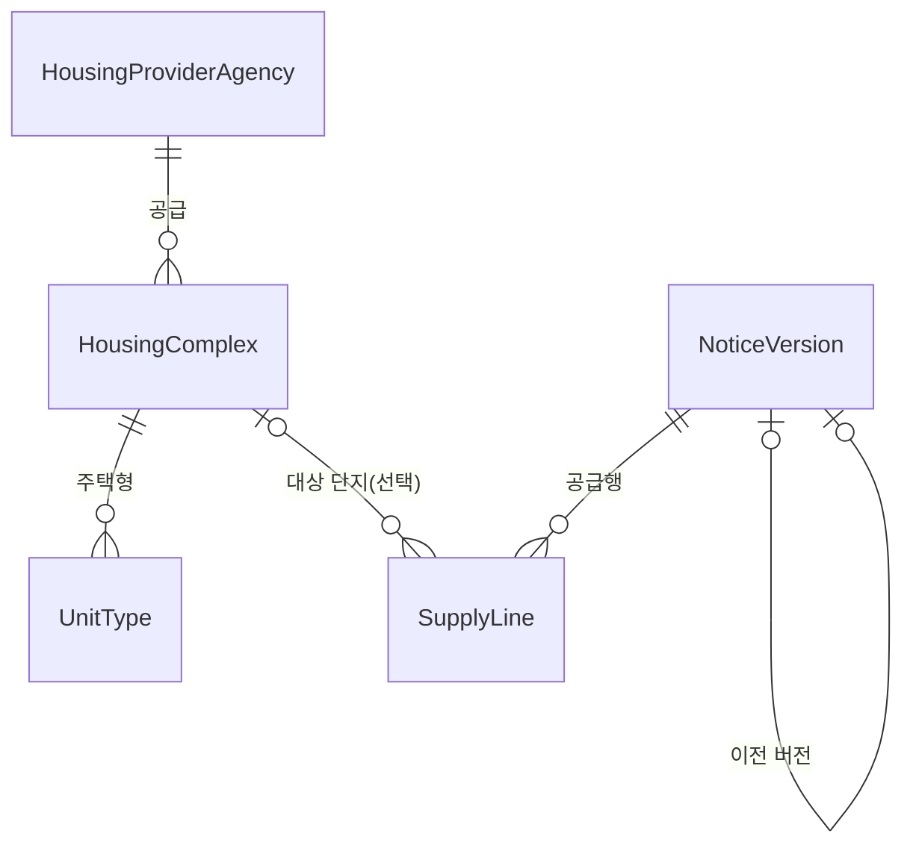

# 원천 API ↔ 도메인 매핑

공공데이터 두 개를 받아서 우리 테이블 네 개에 담는다. 그 사이에서 원천이 우리 기대와 어긋나는 지점들이 있고, 이 문서는 그걸 설명한다.

**모든 수치는 2026-08-12 적재 결과를 직접 센 것이다.**

```
단지 1,025 · 주택형 3,748 · 공고버전 68 · 공급행 137
```

---

## 1. 무엇을 담는가

**공공이 지어서 임대하는 단지**와, **거기 들어갈 사람을 뽑는 모집공고**다.



테이블이 넷인데 **성격이 둘로 갈린다.** 이게 설계 전체를 지배한다.

| | 단지 · 주택형 | 공고 · 공급행 |
| --- | --- | --- |
| 무엇인가 | **카탈로그** — 지금 세상에 뭐가 있는가 | **시점 기록** — 그때 뭐라고 공고했는가 |
| 언제 바뀌나 | 원천이 갱신되면 계속 | **안 바뀐다.** 바뀌면 새 버전이 생긴다 |
| 원천 | HWSPR04 단지정보 | HWSPR02 모집공고 |
| 없으면 | 지도에 찍을 게 없다 | 신청할 게 없다 |

"강남 중계센트럴파크는 지금 어떤 단지인가"와 "2026년 8월 공고가 그 단지를 뭐라고 불렀는가"는 **다른 질문이고, 답도 따로 보관해야 한다.** 단지명이 바뀌어도 그때 나간 공고는 그때 이름 그대로 남아야 하기 때문이다.

두 갈래를 이어 주는 건 **PNU(필지고유번호) 하나뿐**이다. 왜 그것뿐이고 왜 그게 어려운지는 3.3에 있다.

---

## 2. 원천 두 개

| 약칭 | 데이터 | 엔드포인트 · 오퍼레이션 | 채우는 테이블 |
| --- | --- | --- | --- |
| **HWSPR04** | 15110581 마이홈 공공임대주택 단지정보 | `apis.data.go.kr/1613000/HWSPR04` `/rentalHouseGwList` | `housing_complex`, `unit_type` |
| **HWSPR02** | 15108420 마이홈 공공주택 모집공고 | `apis.data.go.kr/1613000/HWSPR02` `/rsdtRcritNtcList`(임대) | `notice_version`, `supply_line` |

**분양공고는 받지 않는다.** 같은 API 에 `/ltRsdtRcritNtcList`(분양) 오퍼레이션이 있고 스키마도 같지만, 우리 카탈로그는 임대주택이다. 담아 보면 이렇게 어긋난다.

| | 임대공고 | 분양공고 |
| --- | ---: | ---: |
| 공급행 | 137 | 63 |
| 단지가 붙은 행 | **117 (85%)** | **11 (17%)** |
| `suplyTyNm` | 100% | **빈값** |

단지가 안 붙는 이유가 구조적이다 — **HWSPR04 는 공공임대주택만 담아서 분양 단지가 아예 없다.** 게다가 분양은 보증금·계약금·잔금이 <b>분양대금 분할</b>이라 같은 칸에 넣으면 뜻이 달라진다(5.3).

### 응답 구조

```
{"response":{"header":{"resultCode":"00"},"body":{"item":[ ... ]}}}
```

- 자료가 없으면 `resultCode: "03"`(NODATA_ERROR)이 오고 **`body` 키 자체가 없다.** 오류가 아니라 빈 페이지라 예외로 올리지 않는다.
- 인증키는 포털이 이미 URL 인코딩해서 준다(`%2B`, `%2F`, `%3D`). 재인코딩하면 `%252B`가 되어 실패한다. `OpenApiClient.buildUri()`가 인증키만 문자열로 이어 붙이고 나머지만 인코딩한다.

### 요청 파라미터 — 지역 코드가 전부다

| API | 받는 파라미터 |
| --- | --- |
| HWSPR04 (단지) | `brtcCode`(광역시도) · `signguCode`(시군구) · `numOfRows` · `pageNo` |
| HWSPR02 (공고) | 위 + `suplyTy` · `lfstsTyAt` · `bassMtRntchrgSe`. 지역을 안 주면 전국이 온다 |

**단지 API에 공급유형 필터는 없다.** 포털이 주는 참고문서 `붙임1. 요청 파라미터 코드(공공임대주택 단지정보)`를 열어 보면 시트가 하나뿐이고 내용이 전국 시군구 코드표(256개)다. 실제로 다른 값을 붙여도 결과가 안 변한다.

```
파라미터 없음        totalCount=217
suplyTy=매입임대     totalCount=217
houseTy=아파트       totalCount=217
zzzz=1(없는 이름)    totalCount=217
```

**그래서 "건설임대만 주세요"를 서버에 부탁할 수 없다.** 전부 받아서 우리가 거른다(3.1). 오퍼레이션도 `rentalHouseGwList` 하나뿐이고, 다른 이름은 전부 `NO_OPENAPI_SERVICE_ERROR`가 온다.

---

## 3. 원천을 읽기 전에 알아야 할 네 가지

여기를 안 읽고 4장 테이블만 보면 반드시 오해한다.

### 3.1 건설임대만 담는다

공공임대주택은 **어떻게 확보했느냐**로 세 갈래다.

| | 뜻 | 단지라는 게 있나 |
| --- | --- | --- |
| **건설임대** | 공공이 **직접 지었다** — 국민임대·영구임대·행복주택·통합공공임대·장기전세·5·10·50년임대 | 있다 |
| **매입임대** | 이미 지어진 민간주택을 **사들였다** | 없다. 여기저기 흩어진 개별 주택이다 |
| **전세임대** | 세입자가 **직접 구해온** 집의 전세금을 지원한다 | 대상 주택 자체가 없다 |

**우리 카탈로그의 전제는 "이름 있는 단지가 있고 그 안에 주택형이 있다"인데, 매입임대·전세임대에서는 그게 성립하지 않는다.** 그래서 안 담는다.

원천 데이터가 그 차이를 그대로 보여 준다. 32,699행 중 매입임대가 28,773행(87%)인데, 건물 제원이 통째로 비어 있다.

| | 준공일 | 난방 | 주차 | 아파트 비율 |
| --- | ---: | ---: | ---: | ---: |
| 매입임대 | **0%** | **0%** | **0%** | 13% |
| 건설임대 | 94% | 62% | 54% | 95% |

매입임대는 다가구주택 15,091행 · 다세대주택 5,424행처럼 **한 채씩 사들인 집**이라 "이 단지의 준공일·주차대수" 같은 게 원천에 아예 없다.

#### 라벨만 믿으면 안 된다

거르는 첫 조건은 공급유형 이름(`suplyTyNm`)이다. 화이트리스트가 아니라 **매입임대·전세임대만 제외**한다 — 원천에 새 건설임대 제도가 생겼을 때 모르는 값이라는 이유로 버리지 않기 위해서다.

그런데 이 라벨만으로는 **64단지가 새어 들어온다.**

| 기관 | 단지 | 라벨 | 실제로 무엇인가 |
| --- | ---: | --- | --- |
| 성남시 | 40 | `10년임대` | 단지명이 **"매입임대주택"**, 주택형 자리에도 **"매입임대"** |
| 대구도시개발공사 | 24 | `장기전세` `50년임대` | 다가구 한 채씩. 주택형 자리는 **방 수**(1·2·3) |

**`suplyTyNm` 한 칸에 성격이 다른 두 가지가 들어오기 때문이다.**

```
'매입임대'                  → 어떻게 확보했나 (취득 방식)
'10년임대' '장기전세' '행복주택' → 어떤 조건으로 빌려주나 (임대 유형)
```

사들인 집을 10년임대 조건으로 공급하면 **둘 다 참**이다. 칸은 하나뿐이니 기관이 둘 중 하나를 고른다. 대구 노블힐즈4(`hsmpSn` 1058)는 그 갈림이 같은 응답 안에 보인다.

```
장기전세  styleNm=1  전용 19.52  세대 8
장기전세  styleNm=2  전용 61.85  세대 8
장기전세  styleNm=3  전용 89.85  세대 8
매입임대  styleNm=    전용 40.00  세대 1   ← 이 행만 라벨로 걸러진다
```

단지 단위로 봐도 안 걸린다. **64단지 중 63단지는 원천에 '매입임대'라는 글자가 아예 없다** — 섞여 오는 건 노블힐즈4 하나뿐이다.

#### 두 번째 조건 — 지어진 흔적

그래서 라벨 대신 **지어진 흔적**으로 한 번 더 거른다.

```java
아파트가 아니면서 준공일도 없으면 담지 않는다
```

이 조건이 진짜 단지를 버리지 않는다는 근거는 **반대 방향이 비어 있다는 것**이다. 매입임대 라벨 28,773행 중 준공일이 있는 건 **2행(0.007%)** 뿐이다. 준공일이 있는 비아파트 건설임대 8단지(만부마을 행복주택, 평택이충 통합공공임대주택, 구산연립주택 …)는 그대로 남는다.

| 조건 | 단지 |
| --- | ---: |
| 원천 전체 | 11,169 |
| `suplyTyNm` 만 | 1,089 |
| **+ 아파트거나 준공일 있음** | **1,025** |

두 조건 모두 `MyHomeComplexIngestService.applyOne()` 한 자리에 있다.

거르고 나면 주택형 자리도 깨끗해진다. 3,748건 중 3자리 숫자는 **1건**뿐이고("상계장암지구3단지 114형", 전용 114.69㎡) 그마저 호실이 아니라 진짜 주택형이다. 매입임대에서는 주택형 칸에 `201`, `302` 같은 **호실 번호**가 오는데, 건설임대에는 **0건**이다.

```
46(366) 36(364) 59(294) 26(278) 51(266) 39(183) 84(118) …
59A(21) 59B(15) 26A(12) 44A(7) 26B(7) 51A(7) 36A(7) 49A(6) …
```

다만 33건은 `15평`·`21㎡`·`39.016`처럼 단위가 붙거나 면적 원값이 그대로 온다. 오래된 영구임대 단지에서 주로 나온다.

### 3.2 공급유형은 단지가 아니라 주택형에 붙는다

처음 보면 이상하다. "이 단지는 국민임대"라고 단지에 적으면 될 것 같은데, `unit_type.supply_type_name`에 있다. 원천 구조 때문이다.

#### 원천 한 행은 단지가 아니다

```
원천 한 행 = 단지 × 공급유형 × 주택형
```

중계센트럴파크(`hsmpSn` 30965288)를 조회하면 단지 하나가 아니라 이런 행들이 온다.

| `hsmpSn` | `suplyTyNm` | `styleNm` | 전용 | `hshldCo` | 기본 보증금 |
| --- | --- | --- | ---: | ---: | ---: |
| 30965288 | 국민임대 | 49A | 49.90 | 115 | 63,850,000 |
| 30965288 | **장기전세** | **49A** | **49.90** | 114 | **311,220,000** |
| 30965288 | 장기전세 | 49A-2 | 49.73 | 114 | 311,220,000 |
| 30965288 | 국민임대 | 49B | 49.49 | 115 | 63,850,000 |

**같은 `49A`가 국민임대와 장기전세로 두 번 온다.** 주택형 이름도 면적도 같은데 임대조건이 다르다 — 같은 평면의 집이라도 어떤 제도로 공급되느냐에 따라 보증금이 6,385만 원과 3억 1,122만 원으로 갈린다.

#### 단지 식별자 안에서 갈리는 필드는 딱 둘이다

`hsmpSn`(주택단지 일련번호)이 단지 식별자로 쓸 만한지 확인했다. 행이 2개 이상인 6,045단지에서, **하나의 `hsmpSn` 안에 값이 두 가지 이상 나오는 단지 수**다.

| 필드 | 갈림 | | 필드 | 갈림 |
| --- | ---: | --- | --- | ---: |
| `hsmpNm` 단지명 | 0 | | `heatMthdDetailNm` 난방 | 0 |
| `rnAdres` 도로명주소 | 0 | | `buldStleNm` 건물형태 | 0 |
| `pnu` 필지고유번호 | 0 | | `elvtrInstlAtNm` 승강기 | 0 |
| `insttNm` 기관 | 0 | | `houseTyNm` 주택유형 | 0 |
| `competDe` 준공일 | 0 | | `brtcCode`/`signguCode` | 0 |
| `parkngCo` 주차수 | 0 | | **`suplyTyNm` 공급유형** | **80** |
| | | | **`hshldCo` 세대수** | **80** |

**단지의 성질은 전부 안 갈린다. 갈리는 건 공급유형과 세대수 둘뿐인데, 이 둘이 정확히 같이 갈린다.**

같이 갈리는 이유가 답이다. `hshldCo`는 단지 전체 세대수가 아니라 **(단지, 공급유형)별 세대수**다. 한 단지에 행복주택 20세대 + 5년임대 2세대가 있으면 20과 2가 따로 온다. 그래서 공급유형을 단지에 두면 값이 하나로 안 정해진다 — **주택형으로 내려간 게 아니라, 원래부터 단지의 성질이 아니었다.**

#### 자연키에 공급유형과 면적이 들어간 이유

주택형을 무엇으로 유일하게 지목할지도 여기서 결정된다.

| 자연키 후보 | 고유 | 충돌 |
| --- | ---: | ---: |
| (단지, 주택형명) | 2,758 | **990** |
| (단지, 공급유형, 주택형명, 전용) | 3,662 | 86 |
| **(단지, 공급유형, 주택형명, 전용, 공용)** | **3,748** | **0** |

- **공급유형이 필요한 이유** — 위의 `49A` 두 줄. 같은 평면인데 제도가 달라 임대조건이 다르다.
- **면적이 필요한 이유** — 같은 "59형"에 전용 59.93㎡와 59.95㎡가 따로 온다. 주택형 이름은 반올림한 값이라 그 차이를 못 담는다.

`unit_type.supply_type_name`이 **enum이 아니라 원문 문자열**인 것도 이 때문이다. enum으로 바꾸면 모르는 값이 null이 되어 유니크 제약이 무너진다. 여기만 원문이 주인이고 enum(`supply_type`)이 파생이다.

#### 치르는 대가 — 세대수가 주택형마다 중복 저장된다

원천 구조를 그대로 따르면 `단지 ─< 공급유형(세대수) ─< 주택형` 3단계인데, 우리는 2단계로 눌렀다. 그래서 세대수가 주택형 행마다 반복된다.

| 한 단지의 공급유형 수 | 단지 |
| ---: | ---: |
| 1개 | **944 (92%)** |
| 2개 | 72 |
| 3개 | 7 |

**92%는 단지 하나에 공급유형도 하나다.** 그런데도 그 값이 주택형 3,748행에 흩어져 저장된다. 값이 어긋나지는 않는다(재적재가 전부 `unchanged`인 게 증거). 중간 테이블은 공급유형별 화면이 필요해질 때 넣는다.

같은 이유로 `housing_complex.max_supply_type_unit_count`는 **단지 총 세대수가 아니다.** 공급유형별 값 중 큰 쪽이다. 이름이 그 사실을 드러내라고 `total_unit_count`에서 바꿨다. 정확한 합계는 지금도 뽑을 수 있다.

```sql
select sum(cnt) from (
  select distinct supply_type_name, supply_type_unit_count cnt
  from unit_type where complex_id = ?
)
```

### 3.3 공고와 단지는 PNU 하나로만 이어진다

공고 API는 "이 공고로 어느 주택 몇 호를 모집한다"까지 말해 준다. 그런데 그 주택이 우리 `housing_complex`의 어느 행인지는 안 알려 준다. **두 API의 ID 체계가 다르기 때문이다.**

```
단지 API   hsmpSn 30965288     (주택단지 일련번호)
공고 API   pblancId 20989      (공고 ID) + houseSn 1 (공고 안의 주택 순번)
```

공고의 `houseSn`은 "이 공고 안에서 몇 번째 주택인가"일 뿐, 단지 식별자가 아니다. 둘 다 갖고 있는 값은 **주소를 코드로 만든 PNU** 하나다.

#### PNU가 뭔가

**필지고유번호(Parcel Number). 땅 한 필지에 붙는 19자리 코드**다.

```
4113110200133130000
└─────┬────┘└┬┘└──┬──┘└┬┘
법정동코드 10  대장  본번  부번
```

앞 10자리가 법정동코드라 `housing_complex.legal_dong_code`로 잘라 두었다. 나중에 좌표를 붙일 때 행안부 좌표검색API의 `admCd`로 그대로 들어간다(5.2).

#### PNU는 단지를 유일하게 지목하지 않는다

이게 매칭이 어려운 이유다.

```
단지 11,169개  →  고유 PNU 6,787개
단독 PNU 5,969 / 중복 PNU 818 / 한 PNU 최대 단지 수 113
```

**한 필지에 단지가 113개까지 달린다.** 매입임대가 같은 건물에서 호를 따로 사들이면 각각 다른 `hsmpSn`으로 등록되기 때문이다. 중복 PNU 818개 중 **703개는 이름과 주소까지 완전히 같다.**

```
PNU 4311410100103720006  →  hsmpSn 31393177 / 31393160 / 31393159 …  전부 같은 주소
```

그래서 **후보가 정확히 하나일 때만 붙인다.** 둘 이상이면 어느 쪽인지 알 방법이 없고, 잘못 붙은 단지를 화면에 보여 주는 것보다 안 붙은 채로 두는 편이 낫다. `SupplyLine.complexId`가 선택인 이유다.

#### 붙어도 공고가 말한 값을 지우지 않는다

`supply_line`에는 `supplied_complex_name`, `supplied_full_address`, `supplied_pnu` 같은 `supplied_*` 칸이 있다. 단지가 붙어도 이 값들을 지우지 않는다.

**공고버전은 불변인데 단지 카탈로그는 계속 갱신되기 때문이다.** 단지명이 나중에 바뀌어도 "2026년 8월 공고는 이 주택을 뭐라고 불렀는가"는 남아야 한다.

#### 닭과 달걀 — 그래서 재매칭이 필요하다

- 단지 API는 **시군구 단위로만** 열려 있어서 어느 지역을 받을지 정해야 한다
- 그 지역 목록은 **공고의 PNU 앞 5자리**에서 나온다 (`brtcCode` 2 + `signguCode` 3)

즉 공고가 먼저 들어오고 단지가 나중에 들어온다. 그런데 매칭은 공고 적재 시점에 일어나므로 **이미 저장된 공급행은 매칭 기회를 놓친다.** 그래서 마지막에 한 번 더 돌린다.

```
공고 적재 → 지역 도출 → 단지 적재 → 재매칭
```

실제로 이 순서로 돌린 결과다.

| 공급행 137건 | 건수 |
| --- | ---: |
| **매칭 성공** | **117 (85%)** |
| 안 붙음 | 20 |

안 붙는 20건은 **단지가 원천에 없거나 PNU가 모호한 경우**다. 우리가 더 할 수 있는 게 없는 쪽이다.

같은 API 의 분양공고를 담던 때는 이 비율이 62%까지 떨어졌다. 분양 공급행 63건 중 11건만 붙었기 때문인데, HWSPR04 가 공공**임대**주택만 담아서 분양 단지가 아예 없다. 그래서 분양공고를 안 받는다(2장).

#### `houseSn = 0` — 대상 주택이 없는 공고

공고의 공급행은 "대상 주택이 정해진 것"과 "안 정해진 것"으로 딱 둘로 나뉘고, **`houseSn`이 그 플래그다.**

| | 행수 | `pnu` | `hsmpNm` | `fullAdres` | `rentGtn` | `sumSuplyCo` |
| --- | ---: | ---: | ---: | ---: | ---: | ---: |
| `houseSn = 0` | 150 | **0** | **0** | **0** | **0** | 73 |
| `houseSn ≥ 1` | 145 | **145** | **145** | **145** | 145 | 136 |

랜덤하게 반쯤 비는 게 아니라 **통째로 비거나 통째로 찬다.** `houseSn = 0`인 행의 공급유형을 보면 이유가 분명하다.

```
매입임대 85행 · 전세임대 65행   (그 외 0)
```

매입임대는 공고 시점에 "이 지역에서 몇 호 모집"만 있고 실제 주택은 나중에 배정된다. 전세임대는 세입자가 직접 집을 구해오므로 애초에 대상 주택이 없다. **건설임대만 담는 지금은 `houseSn = 0`인 행이 없고, 공급행 137건이 전부 PNU를 갖는다.**

### 3.4 공고는 버전으로 쌓인다

모집공고는 나간 뒤에도 정정된다. 마감일이 바뀌거나 세대수가 바뀐다. 그때 원천이 하는 일이 우리 테이블 모양을 결정한다.

**마이홈은 정정공고를 낼 때 원래 공고를 고치지 않는다. 새 `pblancId`를 발급하고 `beforePblancId`로 이전 것을 가리킨다.**

```
21001(정정) ── beforePblancId ──▶ 20942(정정) ──▶ 20893(정정) ──▶ 20680(일반)
```

즉 **`pblancId`는 "공고"가 아니라 "공고의 한 버전"이다.** 이걸 그대로 한 행에 담으면 같은 모집이 네 줄로 흩어지고, "이 모집의 최신 내용"을 물을 수가 없다.

그래서 두 칸을 파생시킨다.

| 칸 | 무엇인가 | 어떻게 정하나 |
| --- | --- | --- |
| `notice_id` | 모집 하나의 식별자. 모든 버전이 공유한다 | **체인 맨 앞** `pblancId` |
| `version_number` | 그 안에서 몇 번째 버전인가 | 체인 깊이 (1, 2, 3 …) |

실제로 담긴 모습이다.

```
notice_id  version  source_notice_id  status      공고명
1120       1        1120              ORIGINAL    전북권 임대주택 분양전환 후 잔여세대 일반매각
1120       2        1341              CORRECTION  [정정공고]전북권 임대주택 분양전환 후 잔여세대
```

`source_notice_id`(그 버전 자신의 원천 ID)를 남겨 두는 이유는, **다음 정정공고가 여기를 가리키기 때문**이다. 이게 없으면 체인을 이을 수 없다.

적재 순서 문제도 원천이 풀어 준다. **`beforePblancId`는 항상 자기 `pblancId`보다 작다**(295행에서 예외 0건). 숫자 오름차순으로 처리하면 이전 버전이 항상 먼저 저장되므로, 없는 이전 버전을 가리키는 일이 안 생긴다.

현재 공고버전 68개 중 정정공고가 11개다.

#### 공고 단위 값과 행 단위 값

한 공고가 여러 주택을 모집하면 행이 여러 개 온다. 그 행들 사이에서 **뭐가 같고 뭐가 다른지**가 `notice_version`과 `supply_line`의 경계다. 행이 2개 이상인 공고 49건으로 확인했다.

| | 필드 |
| --- | --- |
| **공고 단위** (한 공고 안에서 값이 하나) | `sttusNm` 상태 · `pblancNm` 공고명 · `suplyInsttNm` 기관 · `houseTyNm` · `suplyTyNm` · `beforePblancId` · `rcritPblancDe` 공고일 · `przwnerPresnatnDe` 발표일 · `refrnc` 문의처 · `url` · `beginDe`/`endDe` 접수기간 |
| **행 단위** (행마다 다름) | `houseSn` · `hsmpNm` 단지명 · `fullAdres` 주소 · `pnu` · `rnCodeNm` 도로명 · `signguNm` · `heatMthdNm` 난방 · `totHshldCo` 총세대수 · `sumSuplyCo` 공급수 · `rentGtn` 보증금 · `enty` 계약금 · `surlus` 잔금 · `mtRntchrg` 월세 · **`pcUrl`/`mobileUrl`** |

**`pcUrl`이 행 단위인 게 함정이다.** URL이니 공고 대표 링크처럼 보이는데 `houseSn`이 붙어 있어 행마다 다르다(49건 중 28건). 공고의 대표 URL은 `url`이다.

---

## 4. 테이블 넷

### `housing_complex` — 단지

공고와 상관없이 유지되는 카탈로그의 기준점. 유니크: `source_complex_id`

| 컬럼 | 무엇인가 | 원천 필드 | 채워짐 |
| --- | --- | --- | ---: |
| `name` | 단지명 | `hsmpNm` (주택단지명) | 100% |
| `road_address` | 도로명주소 | `rnAdres` | 100% |
| `pnu` | 필지고유번호 19자리. 공고와 잇는 유일한 키(3.3) | `pnu` | 100% |
| `legal_dong_code` | 법정동코드 10자리. `pnu` 앞 10자리 | (파생) | 100% |
| `province_code` / `province_name` | 광역시도 (11 서울) | `brtcCode` / `brtcNm` | 100% |
| `district_code` / `district_name` | 시군구 (350 노원구) | `signguCode` / `signguNm` | 100% |
| `housing_provider_agency_id` | 공급기관 (LH서울, SH공사 …) | `insttNm` | 100% |
| `source_complex_id` | 원천 단지 식별자. 재적재 기준점 | `hsmpSn` | 100% |
| `max_supply_type_unit_count` | **단지 총 세대수가 아니다.** 가장 큰 공급유형의 세대수(3.2) | `hshldCo` | 100% |
| `completion_date` / `completion_year` | 준공(사용승인) 일자와 연도 | `competDe` | 97% |
| `heating_type` / `heating_type_name` | 난방 enum과 원문. enum이 버리는 열원(가스·폐열)이 원문에 남는다 | `heatMthdDetailNm` | 62% |
| `parking_spaces` | 주차 대수 | `parkngCo` | 54% |
| `corridor_type` | 복도 형태 — 계단식/복도식/혼합식 | `buldStleNm` | 63% |
| `elevator_installation` | 승강기 — 미설치/전체동 설치 | `elvtrInstlAtNm` | 57% |
| `house_type` / `house_type_name` | 주택유형 enum과 원문. 99%가 아파트 | `houseTyNm` | 99.9% |

**`name`을 매칭에 쓰면 안 된다.** 1,025개 중 194개가 이름이 겹친다 — "별하람마을3단지"만 29개다. 단지 식별은 `source_complex_id`로 한다.

### `unit_type` — 주택형

한 단지 안에서 면적·구조·공급조건을 공유하는 카탈로그 항목. 단지와 **같은 행**에서 나온다(3.2).

유니크: `(complex_id, supply_type_name, type_name, exclusive_area, residential_common_area)`

| 컬럼 | 무엇인가 | 원천 필드 | 채워짐 |
| --- | --- | --- | ---: |
| `complex_id` | 소속 단지 | `hsmpSn` | 100% |
| `type_name` | 주택형 이름 — `49A`, `59B`, `84` | `styleNm` | 100% |
| `supply_type_name` | 공급유형 원문. **자연키의 일부라 enum이 아니라 원문이 주인이다**(3.2) | `suplyTyNm` | 100% |
| `supply_type` | 공급유형 enum (파생) | `suplyTyNm` | 100% |
| `exclusive_area` | 주거전용면적(㎡) — 집 안 면적 | `suplyPrvuseAr` | 100% |
| `residential_common_area` | 주거공용면적(㎡) — 계단·복도 | `suplyCmnuseAr` | 99.9% |
| `supply_type_unit_count` | **이 공급유형의 세대수.** 주택형별이 아니라 같은 값이 반복된다 | `hshldCo` | 100% |
| `base_deposit` | 기본 임대보증금(원). 공고와 무관한 카탈로그 기준값 | `bassRentGtn` | 99% |
| `base_monthly_rent` | 기본 월임대료(원). 장기전세는 0 | `bassMtRntchrg` | 98% |
| `base_convertible_deposit_limit` | 기본 전환보증금 한도 — 월세를 보증금으로 바꿀 수 있는 최대치 | `bassCnvrsGtnLmt` | 91% |

담긴 공급유형 분포다.

| 공급유형 | 단지 | 주택형 | | 공급유형 | 단지 | 주택형 |
| --- | ---: | ---: | --- | --- | ---: | ---: |
| 국민임대 | 482 | 1,763 | | 50년임대 | 30 | 82 |
| 행복주택 | 232 | 1,010 | | 장기전세 | 8 | 22 |
| 10년임대 | 205 | 553 | | 통합공공임대 | 4 | 21 |
| 영구임대 | 141 | 278 | | 5년임대 | 7 | 19 |

### `notice_version` — 공고 버전

최초·정정·취소 시점의 내용을 보존하는 **불변 스냅샷**. 공고 단위 값만 담는다(3.4).

유니크: `(notice_id, version_number)`, `source_notice_id`

| 컬럼 | 무엇인가 | 원천 필드 | 채워짐 |
| --- | --- | --- | ---: |
| `notice_id` | 모집 하나의 식별자. 모든 버전이 공유 | (파생) 체인 맨 앞 `pblancId` | 100% |
| `source_notice_id` | 이 버전 자신의 원천 ID. 다음 정정공고가 여기를 가리킨다 | `pblancId` | 100% |
| `version_number` | 공고 안의 버전 순서 | (파생) 체인 깊이 | 100% |
| `notice_change_status` | 원본/정정/취소 | `sttusNm` | 100% |
| `supersedes_version_id` | 바로 이전 버전 | `beforePblancId` | 정정공고만 |
| `published_at` | 모집공고일 | `rcritPblancDe` | 100% |
| `title` | 공고명. 정정공고에서 바뀌므로 버전 소유가 맞다 | `pblancNm` | 100% |
| `detail_url` | 청약 사이트 원문 링크. LH건은 `panId`가 박혀 있다 | `url` | 100% |
| `application_begin_on` / `application_end_on` | 접수 시작·마감일 | `beginDe` / `endDe` | 100% |
| `winner_announced_on` | 당첨자 발표일 | `przwnerPresnatnDe` | 100% |
| `supply_institution_name` | 공급기관. 단지 쪽과 달리 지역본부 구분 없이 "LH" | `suplyInsttNm` | 100% |
| `house_type` (+원문) | 주택유형 | `houseTyNm` | 100% |
| `supply_type` (+원문) | 공급유형 | `suplyTyNm` | 100% |
| `contact` | 문의처 | `refrnc` | 95% |
| `source_system` | 어느 원천에서 왔는지 (고정 `MYHOME_PORTAL`) | — | 100% |

### `supply_line` — 공급행

이번 공고버전에서 **어느 주택에 몇 호를 배정했는가.** 공고와 같은 행에서 나온다.

유니크: `(notice_version_id, display_order)`

| 컬럼 | 무엇인가 | 원천 필드 | 채워짐 |
| --- | --- | --- | ---: |
| `notice_version_id` | 소유 공고버전 | `pblancId` | 100% |
| `complex_id` | 대상 단지. PNU 후보가 정확히 하나일 때만 붙인다(3.3) | 매칭 결과 | 85% |
| `display_order` | 표시 순서. **`houseSn`은 중복될 수 있어**(21건) 응답 순서를 쓴다 | (파생) | 100% |
| `house_sn` | 공고 안의 주택 일련번호 | `houseSn` | 100% |
| `supply_count` | 공급 수(선발 수) | `sumSuplyCo` | 100% |
| `supplied_complex_name` | **공고가 말한** 단지명. 단지가 안 붙어도 화면에 쓸 수 있다 | `hsmpNm` | 100% |
| `supplied_full_address` / `supplied_pnu` / `supplied_road_name` | 공고가 말한 주소·PNU·도로명 | `fullAdres` / `pnu` / `rnCodeNm` | 100% / 100% / 95% |
| `supplied_province_name` / `supplied_district_name` | 광역시도·시군구 | `brtcNm` / `signguNm` | 100% |
| `supplied_heating_type_name` | 난방 | `heatMthdNm` | 90% |
| `supplied_total_unit_count` | 총 세대수 | `totHshldCo` | 42% |
| `deposit` / `down_payment` / `balance` / `monthly_rent` | 보증금 · 계약금 · 잔금 · 월임대료 | `rentGtn` / `enty` / `surlus` / `mtRntchrg` | 100% |
| `detail_url` / `mobile_detail_url` | 마이홈 상세. **행마다 다르다**(3.4) | `pcUrl` / `mobileUrl` | 100% |

`supplied_*`가 왜 남는지는 3.3에 있다.

---

## 5. 지금 알고 있는 한계

### 5.1 단지 범위가 공고에 묶여 있다 — 전국의 5분의 1

**전국 256개 시군구 중 53개.** 단지 API가 시군구 단위로만 열려 있고(2장), 어느 시군구를 받을지를 "공고가 가리키는 지역"에서 뽑기 때문이다(3.3). **모집공고가 없는 지역의 단지는 아예 안 들어온다.**

이 결합이 실제로 물린 적이 있다. 분양공고를 담던 때는 지역이 64개였는데, 분양을 빼자 **11개 시군구가 통째로 빠졌다.** 그 지역에 있던 **단지 158개**는 멀쩡한 건설임대인데 "그 지역을 가리키는 임대공고가 없다"는 이유만으로 대상에서 빠지는 것이다.

> 지금 DB의 단지 1,025개는 분양공고가 가리키던 지역까지 포함해 받은 결과다. **지금 절차대로 처음부터 다시 돌리면 867개가 된다.** 이미 받은 158개를 지울 이유는 없어서 그대로 뒀다.

**카탈로그를 공고에 종속시키지 않는 게 맞다.** 시군구 코드표는 포털이 파일로 주므로(2장) 256개를 그대로 돌리면 된다. 53개에 2분 45초 걸렸으니 10분쯤이다.

```bash
curl -X POST "localhost:8080/admin/ingest/complexes/regions?codes=11110,11140,..."
```

### 5.2 좌표 칸이 없다 — 지도에 핀을 못 찍는다

두 원천 어디에도 위경도가 없다. 가진 건 도로명주소 문자열과 PNU뿐이다.

**기술 문제가 아니라 약관 문제다.** 우리는 좌표를 DB에 눌러 담으려는 것인데, 상용 지도 API 대부분이 그걸 막는다.

| 원천 | 저장 가능? | 근거 |
| --- | --- | --- |
| 카카오 로컬 API | **불가** | "Local API 호출 결과의 모든 데이터 저장 및 활용은 허용되지 않습니다" |
| 국토부 지오코더(VWorld) | **불가** | "별도의 저장장치나 데이터베이스에 저장할 수 없습니다" |
| 행안부 좌표검색API | **확인 중** | 활용가이드에는 저장 금지 문구가 없다. 사이트 공통 약관 제12조가 걸리는데 세 조항 모두 "**사전 승낙 없이**"라는 단서가 붙어 있다 |

행안부 API로 가더라도 입력값이 모자란다. 주소 문자열을 안 받고 분해된 코드를 요구하는데, `admCd`(행정구역코드 10)는 `legal_dong_code`가 그대로 들어가지만 `rnMgtSn`(도로명코드 12)은 **파싱으로 못 얻는다.** 도로명주소 검색API를 한 번 더 부르거나 주소DB 파일을 받아야 한다.

출력도 위경도가 아니다. `entX: 945959.03` 같은 **EPSG:5179(UTM-K) 평면직각좌표**라 카카오·네이버 지도에 찍으려면 WGS84로 변환해야 한다.

**그래서 컬럼을 아직 안 만들었다.** 저장 가능 여부와 좌표계(5179만? 위경도만? 둘 다?)가 정해져야 칸 모양이 나온다. 도움센터(1588-0061)에 물어볼 것은 "신청서의 영리 용도 승인이 제12조①의 사전 승낙에 해당하는가" 하나로 좁혀진다.

### 5.3 금액이 안 맞는 공급행이 5건 있다

**`계약금 + 잔금 = 임대보증금`이 137건 중 132건에서 성립한다.** 어긋나는 5건은 원천 값 자체가 안 맞는다.

```
구리 행복주택   보증금 22,896,000 vs 계약금 1,115,000 + 잔금 21,751,000 = 22,866,000  (3만 원 차이)
고창율계 영구임대  보증금  2,530,000 vs 계약금   253,000 + 잔금    227,700          (잔금 자릿수로 보인다)
```

우리가 고칠 수 있는 게 아니라 **그대로 담고 알고만 있는다.** 금액을 화면에 보여 줄 때 셋을 함께 쓰면 안 맞는 게 드러나므로, 보증금 하나만 쓰거나 검증을 붙여야 한다.

중도금(`prtpay`)은 임대공고 295행 전체에서 0이라 담지 않는다. **분양공고에서는 0이 아닌데**(최대 1억 5,327만) 분양을 안 받으므로 해당 없다.

### 5.4 두 원천의 기관 표기가 안 맞는다

```
단지쪽 insttNm      : LH서울, LH경기북부, SH공사, 경기주택도시공사, 대구도시개발공사
공고쪽 suplyInsttNm : LH, 강원개발공사, 경남개발공사, 충남개발공사
```

**단지는 지역본부 단위, 공고는 본사 단위다.** `LH서울`과 `LH`를 이어 줄 게 없어서 "LH가 공급하는 공고만 보기" 같은 필터를 지금은 못 만든다.

게다가 비대칭이다 — 단지는 `HousingProviderAgency` 엔티티인데 공고는 `supply_institution_name` 문자열이다. 원천이 기관 코드를 안 줘서 `code`에 기관명을 그대로 넣고 있어, 지금 이 엔티티는 문자열 한 칸과 다를 게 없고 조인만 하나 더 는다. 값을 하려면 `LH ─┬─ LH서울 └─ LH경기북부` 같은 계층이 필요하다.

### 5.5 인덱스가 PK·FK·유니크뿐이다

직접 만든 인덱스가 하나도 없다. 지금 실제로 아픈 건 하나다 — **`housing_complex.pnu`에 인덱스가 없는데** 공고를 적재할 때 공급행마다 `findByAddressPnu`를 부른다. 단지 1,000개인 지금은 티가 안 나지만 전국을 받으면(5.1) 눈에 띈다.

나머지(`legal_dong_code`, `application_end_on`)는 **조회 API가 없어서 아직 정할 수 없다.**

### 5.6 작지만 기억해 둘 것

- **최신 버전 조회가 매번 서브쿼리다.** 공고 101건인 지금은 문제없다. 목록 API가 느려지면 `is_latest` 플래그를 고민하면 된다.
- **`created_at`/`updated_at`이 없다.** 언제 적재된 데이터인지 몰라서 원천이 조용히 바뀌었을 때 추적이 안 된다.
- **단지명이 공백인 단지가 원천에 있다.** 이름은 필수라 `광역시도명 + 시군구명`으로 대체하고 경고를 남긴다.

---

## 6. 돌리는 법

인증키는 포털의 **Encoding** 값을 그대로 넣는다(코드가 재인코딩하지 않는다).

```bash
DATA_GO_KR_SERVICE_KEY='포털의_Encoding_키' ./gradlew bootRun
```

**순서가 중요하다.** 단지를 어느 시군구까지 받을지는 공고에서 나오고(3.3), 매칭은 마지막에 한 번 더 돌려야 한다.

① 공고를 먼저 받는다. 지역 파라미터가 없어 한 번에 전국이 온다. **임대공고만 받는다**(2장).

```bash
curl -X POST "localhost:8080/admin/ingest/notices"
```

② 공고가 가리키는 시군구의 단지를 받는다. `codes`를 안 주면 공고에서 알아서 뽑는다(53개 시군구, 약 3분). 전국을 받으려면 여기에 256개를 직접 넘긴다(5.1).

```bash
curl -X POST "localhost:8080/admin/ingest/complexes/regions"
```

③ 단지가 늦게 들어왔으니 공급행을 다시 붙인다.

```bash
curl -X POST "localhost:8080/admin/ingest/rematch"
```

실제 결과다. `skipped`가 걸러낸 매입임대·전세임대다.

```
① 공고  {"created":60,"versioned":8,"unchanged":0,"skipped":38}
② 단지  {"created":1025,"versioned":2725,"unchanged":1,"skipped":28948}
③ 재매칭 117
```

`versioned` 8이 정정공고다. **③의 값은 순서에 달렸다** — 빈 DB에서 이 순서로 돌리면 공고가 먼저라 117건이 여기서 붙지만, 단지가 이미 있는 상태로 공고만 다시 받으면 매칭이 ① 안에서 끝나 ③은 0이 된다.

단지 보고서의 숫자가 단지 기준이라 **같은 단지의 두 번째 주택형부터는 `versioned`로 잡힌다.** 두 번째 실행부터는 전부 `unchanged`로 나오고 DB에 쓰지 않는다.

특정 지역만 받을 때와 원천 응답을 그대로 볼 때:

```bash
curl -X POST "localhost:8080/admin/ingest/complexes?brtcCode=11&signguCode=680"
```

```bash
curl "localhost:8080/admin/ingest/probe?source=myhome-complex&path=rentalHouseGwList&brtcCode=11&signguCode=110&numOfRows=1&pageNo=1"
```

### DB 들여다보기

적재한 데이터는 `data/domain.mv.db`(H2 파일 모드)에 남는다. 앱을 내려도 유지되고, 스키마는 `ddl-auto=update`라 엔티티에 칸을 더하면 따라 붙는다. 다만 **컬럼 삭제나 타입 변경은 반영되지 않으니** 그럴 땐 `data/`를 지우고 다시 받아야 한다.

**`localhost:8080/h2-console`은 안 뜬다(404).** Spring Boot 4가 H2 콘솔 자동설정을 빼서(`spring-boot-autoconfigure-4.1.0` 안에 H2Console 클래스가 0개다) `spring.h2.console.enabled=true`가 아무 일도 하지 않는다. 콘솔을 따로 띄운다.

```bash
java -cp ~/.gradle/caches/modules-2/files-2.1/com.h2database/h2/2.4.240/686180ad33981ad943fdc0ab381e619b2c2fdfe5/h2-2.4.240.jar org.h2.tools.Console
```

`localhost:8082`가 열리면 JDBC URL을 **`AUTO_SERVER=TRUE`까지 그대로** 넣는다. 빼면 파일 락에 막혀 `Database may be already in use`가 난다. 사용자 `sa`, 비밀번호 없음.

```
jdbc:h2:file:/Users/pjh/source/domain/data/domain;MODE=MySQL;AUTO_SERVER=TRUE
```

외부 도구로 붙을 때는 **절대경로**를 써야 한다. `./data/domain`은 그 도구를 띄운 디렉터리 기준으로 풀린다.

테스트는 이 파일을 건드리지 않는다. `@DataJpaTest`는 알아서 인메모리로 갈아끼우고, 실제 설정을 그대로 읽는 `@SpringBootTest`에는 `@AutoConfigureTestDatabase`를 붙여 뒀다.

---

## 부록 A. 안 쓰기로 한 원천

| 데이터 | 왜 안 쓰나 |
| --- | --- |
| 15058530 LH 분양임대공고문 | 정정/취소 구분, 이전 버전 연결, 주소·PNU, 임대조건이 전부 없다. 마이홈 `url`에 LH `panId`가 박혀 있으므로 나중에 이어야 할 때 그걸 쓴다 |
| 15059475 LH 임대주택단지 | 지역명·단지명·세대수·면적뿐. **단지 ID도 주소도 PNU도 없어서** 기존 단지에 붙일 방법이 없다 |
| 15056765 LH 공고별 공급정보 | **분양용지** 정보라 주택형·공급수·순위가 없다 |
| 15058476 LH 공공임대주택 단지정보 | 포털 안내가 "마이홈 단지정보로 제공 중"이라고 가리킨다. 같은 데이터의 구버전 |
| 15108378 마이홈 예비입주자 대기현황 | 대기 순번 데이터. 카탈로그와 성격이 다르다 |

**기준 공고 원천을 15058530(LH)에서 15108420(마이홈)으로 바꾼 이유**는 정정/취소 구분(`sttusNm`), 이전 버전 연결(`beforePblancId`), 주소·PNU, 임대조건, 접수 기간이 마이홈에만 있어서다. 포함 기관도 LH만이 아니라 SH공사·대전도시공사·경남개발공사까지 넓다. 둘을 같은 테이블에 넣으면 ID 체계(`PAN_ID` vs `pblancId`)가 달라 같은 공고가 두 줄로 들어간다.

### 아직 안 쓰지만 붙일 만한 것 — LH 분양임대공고별 상세정보

`apis.data.go.kr/B552555/lhLeaseNoticeDtlInfo1/getLeaseNoticeDtlInfo1` 가 마이홈에 없는 걸 준다.

| 데이터셋 | 내용 | 지금 우리 상태 |
| --- | --- | --- |
| `dsSbdAhfl` | **조감도·평면도·토지이용계획도 이미지 URL** | 부록 B "원천에 없다" |
| `dsEtcInfo.CRC_RSN` | **정정/취소 사유** | 부록 B "주는 원천이 없다" |
| `dsAhflInfo` | 공고문 원문 첨부(HWP/PDF) | 없음 |
| `dsSbd.MVIN_XPC_YM` · `dsCtrtPlc` | 입주예정월 · 접수처 | 없음 |

**호출 키를 이미 갖고 있다.** `notice_version.detail_url` 이 LH 링크라 그 안에 `panId`·`ccrCnntSysDsCd`·`uppAisTpCd`·`aisTpCd` 가 다 박혀 있고(공고버전 68건 중 65건), 여기에 `SPL_INF_TP_CD=062` 만 더하면 된다.

**다만 주택형별 공급 세대수는 여기에도 없다.** 단지 전용면적이 `36.67~51.93` 같은 범위값으로만 온다. 그 배분은 공고문 첨부파일 안에 있다.

## 부록 B. 원천에 있는데 안 담는 칸

| 뺀 것 | 왜 | 언제 되살리나 |
| --- | --- | --- |
| `application_option` 테이블 | 순위·공급대상이 어느 API에도 없다 | 공고문 PDF 파싱 경로가 생기면 |
| `supply_line.unit_type_id` | 공고가 "이 단지에 몇 호"까지만 말하고 주택형별 배분을 안 준다 | 원천이 주택형별 배정을 주면 |
| `supply_line.interim_payment` | 임대공고 295행 전체에서 0이다(5.3) | 0이 아닌 값이 나오면 |
| `notice_version.supply_unit_count_text` | `suplyHoCo`는 매입임대 공고에만 있던 값 | 매입임대를 다시 담으면 |
| `notice_version.correction_reason` | 정정 사유 원문을 주는 원천이 없다 | 공고문 본문 수집 경로가 생기면 |
| `unit_type.other_common_area` / `contract_area` | 기타공용면적이 없어 계약면적도 계산이 안 된다 | 원천이 면적 내역을 주면 |
| `unit_type.floor_plan_url` · `housing_complex.complex_image_url` | 평면도·조감도가 원천에 없다 | 별도 수집 경로가 생기면 |

평면도·조감도는 사용자에게 중요한 정보라 **칸을 지운 게 아니라 미룬 것**이다.

## 부록 C. 원천 필드명 읽는 법

공공데이터 필드명은 행정표준용어를 약어로 줄인 것이다. 규칙을 알면 처음 보는 필드도 읽힌다.

| 약어 | 뜻 | 약어 | 뜻 | 약어 | 뜻 |
| --- | --- | --- | --- | --- | --- |
| `Nm` | 명(이름) | `Cd` | 코드 | `Sn` | 일련번호 |
| `De` | 일자 | `Co` | 수(개수) | `Ar` | 면적 |
| `Ty`, `Tp` | 유형 | `At` | 여부 | `Se` | 구분 |
| `hsmp` | 주택단지 | `pblanc` | 공고 | `rcrit` | 모집 |
| `suply`, `spl` | 공급 | `instt` | 기관 | `brtc` | 광역시도 |
| `signgu` | 시군구 | `adres` | 주소 | `rn` | 도로명 |
| `hshld` | 세대 | `bass` | 기본 | `gtn` | 보증금 |
| `rnt`, `rent` | 임대 | `mt` | 월 | `chrg` | 료(요금) |
| `przwner` | 당첨자 | `presnatn` | 발표 | `refrn` | 참조 |
| `cnvrs` | 전환 | `lmt` | 한도 | `buld` | 건물 |
| `elvtr` | 승강기 | `instl` | 설치 | `prvuse` | 전용 |
| `cmnuse` | 공용 | `lfsts` | 전세 | `tot`, `sum` | 총 |

포털이 **요청 파라미터**는 한글 설명을 주지만 **응답 필드 사전은 공개하지 않는다.** 위 뜻은 실제 값과 이 약어 규칙에서 읽어낸 것이다.
