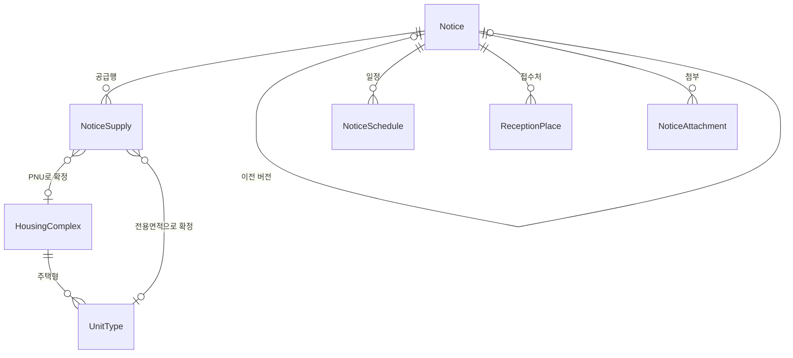

# 원천 API ↔ 도메인 매핑

공공데이터 다섯 개를 받아서 카탈로그와 공고에 담는다. 그 사이에서 원천이 우리 기대와 어긋나는 지점들이
있고, 이 문서는 그걸 설명한다.

컬럼 단위 사전은 [테이블-설계-사전.md](테이블-설계-사전.md), 모델이 왜 그 모양인지는
[도메인-설계.md](도메인-설계.md), 무엇이 이어지고 무엇이 끊기는지는 [원천-정리.md](원천-정리.md)에 있다.
여기는 **원천을 다룰 때 걸리는 함정과 돌리는 법**이다.

**수치는 2026-08-14 전국 적재 결과를 직접 센 것이다.**

```
단지 3,286(물리 2,969 × 공급유형) · 주택형 11,170 · 공고 52 · 공급행 271(주택형 256 + 단지 15)
15059475 원천행 6,710 → 카탈로그 반영 1,487
```

---

## 1. 무엇을 담는가

**공공이 지어서 임대하는 단지**와, **거기 들어갈 사람을 뽑는 모집공고**다.



테이블은 일곱이지만 **성격이 둘로 갈린다.** 이게 설계 전체를 지배한다.

| | 단지 · 주택형 | 공고 · 공급행 |
| --- | --- | --- |
| 무엇인가 | **카탈로그** — 지금 세상에 뭐가 있는가 | **시점 기록** — 그때 뭐라고 공고했는가 |
| 언제 바뀌나 | 원천이 갱신되면 계속 | **안 바뀐다.** 바뀌면 새 버전이 생긴다 |
| 원천 | HWSPR04 단지정보 (+ 15059475 보강) | HWSPR02 모집공고 (+ LH 두 원천) |
| 없으면 | 지도에 찍을 게 없다 | 신청할 게 없다 |

"중계센트럴파크는 지금 어떤 단지인가"와 "2026년 8월 공고가 그 단지를 뭐라고 불렀는가"는 **다른 질문이고,
답도 따로 보관해야 한다.** 단지명이 바뀌어도 그때 나간 공고는 그때 이름 그대로 남아야 하기 때문이다.

두 갈래를 이어 주는 건 **PNU(필지고유번호) 하나뿐**이다. 왜 그것뿐이고 왜 그게 어려운지는 3.3에 있다.

---

## 2. 원천 다섯 개

| 약칭 | 데이터 | 엔드포인트 · 오퍼레이션 | 채우는 테이블 |
| --- | --- | --- | --- |
| **HWSPR04** | 15110581 마이홈 공공임대주택 단지정보 | `apis.data.go.kr/1613000/HWSPR04` `/rentalHouseGwList` | `housing_complex`, `unit_type` |
| **HWSPR02** | 15108420 마이홈 공공주택 모집공고 | `apis.data.go.kr/1613000/HWSPR02` `/rsdtRcritNtcList`(임대) | `notice`, `notice_supply` |
| **LH상세** | 15057999 LH 분양임대공고별 상세정보 | `apis.data.go.kr/B552555` `/lhLeaseNoticeDtlInfo1/getLeaseNoticeDtlInfo1` | `notice`와 자식 셋, `notice_supply` |
| **LH공급** | 15056765 LH 분양임대공고별 공급정보 | `apis.data.go.kr/B552555` `/lhLeaseNoticeSplInfo1/getLeaseNoticeSplInfo1` | `notice_supply` |
| **LH카탈로그** | 15059475 LH 임대주택 단지별 면적·세대수 | `apis.data.go.kr/B552555` `/lhLeaseInfo1/lhLeaseInfo1` | `unit_type` (원천행은 저장 안 함) |

앞의 둘이 뼈대고 **LH상세·LH공급은 마이홈 공고를 완성하는 원천**이다. 둘은 요청 파라미터가 같아서
`LhNoticeIngestService` 하나가 이어서 부른다. LH카탈로그는 공고와 무관하게 전국 임대단지의 주택형별
전체 세대수와 기준 임대조건을 보강한다. LH는 성공을 `SS_CODE: "Y"`로 준다 — 국토부의
`resultCode: "00"`과 다르다.

**분양공고는 받지 않는다.** 같은 API에 `/ltRsdtRcritNtcList`(분양) 오퍼레이션이 있고 스키마도 같지만,
우리 카탈로그는 임대주택이다. 담아 보면 이렇게 어긋난다.

| | 임대공고 | 분양공고 |
| --- | ---: | ---: |
| 공급행 | 137 | 63 |
| 단지가 붙은 행 | **117 (85%)** | **11 (17%)** |
| `suplyTyNm` | 100% | **빈값** |

단지가 안 붙는 이유가 구조적이다 — **HWSPR04는 공공임대주택만 담아서 분양 단지가 아예 없다.** 게다가
분양은 보증금·계약금·잔금이 <b>분양대금 분할</b>이라 같은 칸에 넣으면 뜻이 달라진다(5.2).

### 응답 구조

```
{"response":{"header":{"resultCode":"00"},"body":{"item":[ ... ]}}}
```

- 자료가 없으면 `resultCode: "03"`(NODATA_ERROR)이 오고 **`body` 키 자체가 없다.** 오류가 아니라 빈 페이지라 예외로 올리지 않는다.
- 인증키는 포털의 Encoding 값이면 그대로 쓰고, 원문 Decoding 값이면 `OpenApiClient`가 한 번 인코딩한다. 이미 인코딩된 `%2B`, `%2F`, `%3D`를 다시 `%252B`로 만들지 않는다.

### 요청 파라미터 — 지역 코드가 전부다

| API | 받는 파라미터 |
| --- | --- |
| HWSPR04 (단지) | `brtcCode`(광역시도) · `signguCode`(시군구) · `numOfRows` · `pageNo` |
| HWSPR02 (공고) | 위 + `suplyTy` · `lfstsTyAt` · `bassMtRntchrgSe`. 지역을 안 주면 전국이 온다 |

**단지 API에 공급유형 필터는 없다.** 포털이 주는 참고문서 `붙임1. 요청 파라미터 코드(공공임대주택
단지정보)`를 열어 보면 시트가 하나뿐이고 내용이 전국 시군구 코드표(256개)다. 실제로 다른 값을 붙여도
결과가 안 변한다.

```
파라미터 없음        totalCount=217
suplyTy=매입임대     totalCount=217
houseTy=아파트       totalCount=217
zzzz=1(없는 이름)    totalCount=217
```

**그래서 "건설임대만 주세요"를 서버에 부탁할 수 없다.** 전부 받아서 우리가 거른다(3.1). 오퍼레이션도
`rentalHouseGwList` 하나뿐이고, 다른 이름은 전부 `NO_OPENAPI_SERVICE_ERROR`가 온다.

반대로 **공고 API는 공급유형 필터만 열려 있다.** 그래서 적재는 허용된 8개 코드를 모두 순회한다
(`MyHomeRentalType`). 한 공급유형의 페이지를 전부 모은 뒤에만 그 결과를 저장하므로, 한 유형이
`maxPages` 안에 안 끝나도 다른 유형은 그대로 진행되고 그 유형만 실패 1건으로 남는다.

---

## 3. 원천을 읽기 전에 알아야 할 다섯 가지

### 3.1 건설임대만 담는다

공공임대주택은 **어떻게 확보했느냐**로 세 갈래다.

| | 뜻 | 단지라는 게 있나 |
| --- | --- | --- |
| **건설임대** | 공공이 **직접 지었다** — 국민임대·영구임대·행복주택·통합공공임대·장기전세·5·10·50년임대 | 있다 |
| 매입임대 | 민간주택을 한 채씩 사들였다 | 없다. 단지명 칸에 "경기도 수원시" 같은 지역명이 온다 |
| 전세임대 | 세입자가 직접 집을 구해온다 | 없다. 대상 주택 자체가 우리 쪽에 없다 |

**라벨만 믿지 않는다.** `ConstructionRentalPolicy`가 두 단계로 거른다 — 허용 이름 8개가 아니면
제외하고, 그걸 통과해도 준공일이 파싱되지 않고 주택유형도 아파트가 아니면
`NOT_CONSTRUCTION_HOUSING`으로 한 번 더 거른다. "행복주택"이라는 라벨을 달고 있어도 실체가
매입주택인 행이 있기 때문이다(성남시 `매입임대주택`이 `suplyTyNm=10년임대`로 온 사례).

전국 적재 결과 단지 3,286행(물리 단지 2,969개)이 남고, 121,780건이 공급유형으로, 248건이 건설 증거 없음으로 걸러졌다.

### 3.2 공급유형별 단지를 별도 행으로 저장한다

같은 `hsmpSn`에서 공급유형이 다르면 별도 `housing_complex` 행을 만든다. 이름·주소·PNU·준공·기관을
두 행에 그대로 중복 저장하고, 각 행에 `supply_type_name`과 `unit_count`를 붙인다. 공급유형별로
임대조건과 총세대수가 다르기 때문이다 — 같은 단지·같은 51A형·같은 전용면적인데 국민임대는 보증금
1.25억, 행복주택은 1.97억으로 갈린 사례가 있다.

**자연키가 한글 문자열이다.** 공급유형 enum을 없애서 `(source_complex_id, supply_type_name)`이
유니크가 됐다. 적재가 앞뒤 공백을 지우는 게 필수 조건이 됐다.

### 3.3 공고와 단지는 PNU 하나로만 이어진다

**PNU는 마이홈 계열에만 있다.** 카탈로그(15110581)와 공고(15108420) 양쪽에 있고, LH 계열
(15057999·15056765·15059475)에는 PNU도 `hsmpSn`도 없다.

단지명은 못 쓴다. 매입임대는 단지명 칸에 지역명이 오고, 마이홈과 LH는 명명 체계 자체가 다르다 —
주소·세대수로 같은 단지임이 확인된 85쌍 중 이름이 맞은 건 16쌍(19%)뿐이다.

| 카탈로그(마이홈) | LH |
| --- | --- |
| `하나로아파트` | `군산조촌부향` |
| `4단지` | `화성동탄2 A24블록 영구임대` |
| `평화주공4단지` | `전주평화4 영구임대주택` |

마이홈은 **동네에서 부르는 이름**, LH는 **사업지구명 + 블록 + 공급유형**이다. 공백을 지우고 괄호를
떼도 `하나로아파트`가 `군산조촌부향`이 되지 않는다.

그래서 공급행에 남는 주소 계열 컬럼은 **`supplied_pnu`와 `supplied_address` 둘뿐**이고, 둘 다 매칭
키다. PNU는 카탈로그 단지를, 주소는 LH 단지 상세를 잇는다. 나머지 주소 조각(시군구명·도로명·
광역시도명·참고 법정동명)은 `supplied_address`에 이미 들어 있어 저장하지 않는다.

### 3.4 공고는 버전으로 쌓인다

모집공고는 나간 뒤에도 정정된다. 그때 원천이 하는 일이 우리 테이블 모양을 결정한다.

**마이홈은 정정공고를 낼 때 원래 공고를 고치지 않는다. 새 `pblancId`를 발급하고 `beforePblancId`로
이전 것을 가리킨다.**

```
21001(정정) ── beforePblancId ──▶ 20942(정정) ──▶ 20893(정정) ──▶ 20680(일반)
```

즉 **`pblancId`는 "공고"가 아니라 "공고의 한 버전"이다.** 그래서 두 칸을 파생시킨다.

| 칸 | 무엇인가 | 어떻게 정하나 |
| --- | --- | --- |
| `supersedes_notice_id` | 직전 버전 self FK | `beforePblancId`로 찾은 행 |
| `root_source_notice_id` | 체인 뿌리의 `pblancId`. 모든 버전이 공유한다 | 직전 버전의 값, 없으면 자기 자신 |

예전에는 이 역할을 `recruitment_notice` 루트 테이블이 했다. 실측 49개 공고 중 40개가 버전 1개·9개가
2개라 테이블 하나를 유지할 깊이가 아니어서 컬럼으로 대체했다.

**저장 순서를 숫자 정렬에 기대면 안 된다.** `beforePblancId`가 자기 `pblancId`보다 항상 작다는 보장이
없어서, batch 안의 의존관계를 그래프로 만들어 위상 정렬한다. batch를 넘어 원공고가 늦게 오는 경우까지
남아서, 저장 뒤에 이미 저장된 정정공고들의 뿌리를 옮기는 단계(`rebaseOnto`)를 따로 뒀다.

#### 공고 단위 값과 행 단위 값

한 공고가 여러 주택을 모집하면 행이 여러 개 온다. 그 행들 사이에서 **뭐가 같고 뭐가 다른지**가
`notice`와 `notice_supply`의 경계다. 행이 2개 이상인 공고 49건으로 확인했다.

| | 필드 |
| --- | --- |
| **공고 단위** (한 공고 안에서 값이 하나) | `sttusNm` 상태 · `pblancNm` 공고명 · `suplyInsttNm` 기관 · `houseTyNm` · `suplyTyNm` · `beforePblancId` · `rcritPblancDe` 공고일 · `przwnerPresnatnDe` 발표일 · `refrnc` 문의처 · `url` · `beginDe`/`endDe` 접수기간 |
| **행 단위** (행마다 다름) | `houseSn` · `hsmpNm` 단지명 · `fullAdres` 주소 · `pnu` · `totHshldCo` 총세대수 · `sumSuplyCo` 공급수 · `rentGtn` 보증금 · `enty` 계약금 · `surlus` 잔금 · `mtRntchrg` 월세 · **`pcUrl`/`mobileUrl`** |

**`pcUrl`이 행 단위인 게 함정이다.** URL이니 공고 대표 링크처럼 보이는데 `houseSn`이 붙어 있어 행마다
다르다(49건 중 28건). 공고의 대표 URL은 `url`이고, 그 안에 LH 호출 키가 박혀 있다.

### 3.5 공급행은 두 번에 걸쳐 만들어진다

마이홈은 "이 단지에 몇 호"까지만 말하고 **어느 주택형에 몇 호**인지는 안 준다. 그래서 공급행은 두 패스로 완성된다.

```
① 마이홈 15108420  →  단지 단위 공급행 (임대조건 · PNU · 주소)
② LH 15057999+15056765 → 주택형 단위로 다시 씀 (주택형 · 전용면적 · 금회 공급호수)
```

②가 ①이 만든 행을 지우고 다시 쓴다. 행마다 자연키가 달라(LH 행은 단지명+주택형, 마이홈 행은
`houseSn`) 부분 갱신이 성립하지 않아서 **공고 단위 통째 교체**다.

**두 패스라서 주소를 DB에 남겨야 한다.** ②가 마이홈 행과 LH `dsSbd`를 지번주소로 대조하는데, ①이
주소를 안 남기면 ②가 짝을 찾을 방법이 없다. 그래서 `supplied_address`가 지워지지 않고 남았다.

**결과는 알갱이가 섞인 테이블이다.** 주택형 행 256개 중 24개가 마이홈 공급행을 못 만났고, 마이홈
공급행 중 15개가 주택형 행으로 안 쪼개졌다. 합계를 낼 때는 반드시 한쪽 기준으로만 낸다 — LH 기준
11,513호, 마이홈 기준 11,266호다(자세한 건 [테이블-설계-사전.md §4.2](테이블-설계-사전.md)).

### 3.6 15059475는 주택형별 전체 세대수를 보강한다

15059475의 `HSH_CNT`는 공고의 이번 공급 수가 아니다. `DDO_AR`로 식별되는 전용면적 주택형이 단지
전체에서 몇 세대인지 나타내는 **카탈로그 값**이다. 따라서 공고 공급 수(`NOW_HSH_CNT`)와 같은 컬럼에
넣지 않고 `UnitType.totalUnitCount`에 둔다.

원천 응답에는 단지 ID·PNU·상세주소가 없으므로 단지명 하나만으로 기존 카탈로그에 붙이지 않는다.
다음 조건을 순서대로 모두 통과한 행만 `UnitType`에 반영한다.

1. `ARA_NM`이 카탈로그 단지 주소의 시도·시군구와 같다.
2. `SBD_LGO_NM`과 단지명이 같고 공급유형도 같다.
3. `SUM_HSH_CNT`가 카탈로그 `HousingComplex.unitCount`와 같다.
4. `DDO_AR`와 `UnitType.exclusiveArea`가 `BigDecimal` 기준으로 정확히 하나 일치한다.

전용면적은 36.97과 36.9700처럼 소수 자릿수만 다른 값은 같은 값으로 보지만, 36.92와 36.97처럼 수치가
다른 값에는 ±0.05㎡ 허용오차를 적용하지 않는다. 한 주택형을 여러 15059475 행이 가리키면 어느
`HSH_CNT`가 맞는지 결정하지 않고 아무것도 반영하지 않는다.

**원천행은 저장하지 않는다.** 공고와 무관한 전국 카탈로그고 `PG_SZ=9999` 한 번이면 6,710행을 다 받아서,
재적재 비용이 원천행을 남길 값보다 작다. 유효한 전국 응답을 받으면 반영 전에 모든 `totalUnitCount`를
비워 이번 응답이 말하지 않는 값이 남지 않게 하고, `dsList`가 없거나 전부 비면 아무것도 바꾸지 않는다.

---

## 4. 테이블

컬럼별 사전은 [테이블-설계-사전.md](테이블-설계-사전.md)에 있다. 여기는 채워짐 비율만 남긴다 —
어느 칸을 화면에서 믿을 수 있는지 판단하는 데 쓴다.

### `housing_complex` — 단지

| 컬럼 | 원천 필드 | 채워짐 |
| --- | --- | ---: |
| `name` · `road_address` · `pnu` · `province_*` · `district_*` | `hsmpNm` · `rnAdres` · `pnu` · `brtc*` · `signgu*` | 100% |
| `source_complex_id` · `supply_type_name` · `unit_count` · `supply_institution_name` | `hsmpSn` · `suplyTyNm` · `hshldCo` · `insttNm` | 100% |
| `legal_dong_code` | (파생) `pnu` 앞 10자리 | 100% |
| `house_type_name` | `houseTyNm` | 99.9% |
| `completion_date` / `completion_year` | `competDe` | 97% |
| `corridor_type` | `buldStleNm` | 63% |
| `heating_type_name` | `heatMthdDetailNm` | 62% |
| `elevator_installation` | `elvtrInstlAtNm` | 57% |
| `parking_spaces` | `parkngCo` | 54% |

**`name`을 매칭에 쓰면 안 된다.** 이름이 겹치는 단지가 많다 — "별하람마을3단지"만 29개다. 단지 식별은
`(source_complex_id, supply_type_name)`으로 한다.

### `unit_type` — 주택형

| 컬럼 | 원천 필드 | 채워짐 |
| --- | --- | ---: |
| `type_name` · `exclusive_area` | `styleNm` · `suplyPrvuseAr` | 100% |
| `residential_common_area` | `suplyCmnuseAr` | 99.9% |
| `base_deposit` | `bassRentGtn`, 이후 15059475 `LS_GMY` | 99% |
| `base_monthly_rent` | `bassMtRntchrg`, 이후 15059475 `RFE`. 장기전세는 0 | 98% |
| `base_convertible_deposit_limit` | `bassCnvrsGtnLmt`. 15059475는 주지 않아 유지된다 | 91% |
| `total_unit_count` | 15059475 `HSH_CNT`; 유일 매칭 때만 | 1,487 / 11,170 |

### `notice` — 공고

| 컬럼 | 원천 필드 | 채워짐 |
| --- | --- | ---: |
| `source_notice_id` · `root_source_notice_id` · `version_number` | `pblancId` (+파생) | 100% |
| `notice_change_status_name` · `title` · `published_at` · `detail_url` | `sttusNm` · `pblancNm` · `rcritPblancDe` · `url` | 100% |
| `application_begin_on` / `application_end_on` · `winner_announced_on` | `beginDe`/`endDe` · `przwnerPresnatnDe` | 100% |
| `supply_institution_name` · `house_type_name` · `supply_type_name` | `suplyInsttNm` · `houseTyNm` · `suplyTyNm` | 100% |
| `before_source_notice_id` · `supersedes_notice_id` | `beforePblancId` | 정정공고만 |
| `contact` | `refrnc` | 95% |
| `source_pan_id` · `lh_supply_info_type_code` · `lh_fetched_at` | LH 호출 흔적 | LH 공고만(56/58) |
| `correction_reason` | 15057999 `dsEtcInfo.CRC_RSN` | 정정공고만 |

### `notice_supply` — 공급행

행 하나가 `공고 × 단지 × 주택형`, 또는 주택형을 못 받았으면 `공고 × 단지`다.

| 컬럼 | 원천 필드 | 어느 행에 있나 |
| --- | --- | --- |
| `house_sn` · `complex_name` · `supplied_pnu` · `supplied_address` | `houseSn` · `hsmpNm` · `pnu` · `fullAdres` | 마이홈 짝을 찾은 행 |
| `complex_supply_count` · `complex_total_unit_count` | `sumSuplyCo` · `totHshldCo` | 〃 |
| `deposit` / `down_payment` / `balance` / `monthly_rent` | `rentGtn` / `enty` / `surlus` / `mtRntchrg` | 〃 (주택형 행마다 반복) |
| `detail_url` / `mobile_detail_url` | `pcUrl` / `mobileUrl` | 〃 |
| `type_name` · `exclusive_area` · `supply_area` | `HTY_NNA` · `DDO_AR` · `SPL_AR` | 15056765를 받은 행 |
| `unit_supply_count` · `unit_total_count` | `NOW_HSH_CNT` · `HSH_CNT` | 〃 |
| `lh_deposit_text` · `lh_monthly_rent_text` | `LS_GMY` · `RFE` (문자열 원문) | 〃 |
| `lh_complex_label` · `move_in_year_month` | `SBD_LGO_NM` · `dsSbd.MVIN_XPC_YM` | 〃 |
| `housing_complex_id` · `unit_type_id` · `unmatched_reason` | (판정 결과) | 연결 단계가 채운다 |

---

## 5. 지금 알고 있는 한계

### 5.1 SH·GH는 주택형별 배분이 없다

15056765는 LH 전용이다. 2026-08-14 적재에서 공고 52건 중 49건이 LH 응답을 받아 주택형까지
쪼개졌고, 나머지는 단지 단위 행으로 남는다(통합공공임대 1건은 `SPL_INF_TP_CD`를 몰라 호출 자체를
건너뛴다). data.go.kr에 SH·GH 이름으로 찾아도 공고 단위
실시간 API가 없고, 두 기관의 공고·단지 자체는 15108420·15110581로 이미 들어온다 — 빠진 건
"이 공고가 어느 주택형을 몇 호 공급하는지"뿐이다. 합법 경로가 없는 이상 이 칸은 비워 둔다.

### 5.2 금액이 안 맞는 공급행이 있다

**`계약금 + 잔금 = 임대보증금`이 137건 중 132건에서 성립한다.** 어긋나는 5건은 원천 값 자체가 안 맞는다.

```
구리 행복주택      보증금 22,896,000 vs 계약금 1,115,000 + 잔금 21,751,000 = 22,866,000  (3만 원 차이)
고창율계 영구임대   보증금  2,530,000 vs 계약금   253,000 + 잔금    227,700           (잔금 자릿수로 보인다)
```

우리가 고칠 수 있는 게 아니라 **그대로 담고 알고만 있는다.** 금액을 화면에 보여 줄 때 셋을 함께 쓰면
안 맞는 게 드러나므로, 보증금 하나만 쓰거나 검증을 붙여야 한다.

중도금(`prtpay`)은 임대공고 295행 전체에서 0이라 담지 않는다.

### 5.3 주택형별 임대료를 주는 원천이 없다 — 확정

마이홈은 임대조건을 **단지 단위**로만 주고, 15059475는 공고가 아니라 **현재 카탈로그 기준값**이다.
알갱이가 맞는 건 15056765의 `LS_GMY`·`RFE`뿐이었는데, 2026-08-14 전국 적재에서 **주택형 공급행
256행 전부가 `"공고문 참조"` 문자열이었다. 숫자는 0건이다.**

```sql
SELECT lh_deposit_text, COUNT(*) FROM notice_supply GROUP BY 1;
-- 공고문 참조 | 256
-- (null)    |  15   ← 15056765를 못 받은 단지 단위 행
```

그래서 문자열 칸(`lh_deposit_text`, `lh_monthly_rent_text`)은 남기되 숫자 컬럼으로 승격하지 않는다.
LH가 나중에 숫자를 주기 시작하면 이 칸에서 드러난다. 지금 `notice_supply.deposit`은 단지 단위 값이
주택형 행마다 복사된 것이라 **주택형별로 구분되지 않는다** — 화면에서 주택형별 임대료로 쓰면 안 된다.

### 5.4 좌표 칸이 없다 — 지도에 핀을 못 찍는다

두 원천 어디에도 위경도가 없다. 가진 건 도로명주소 문자열과 PNU뿐이다.

**기술 문제가 아니라 약관 문제다.** 우리는 좌표를 DB에 눌러 담으려는 것인데, 상용 지도 API 대부분이
그걸 막는다.

| 원천 | 저장 가능? | 근거 |
| --- | --- | --- |
| 카카오 로컬 API | **불가** | "Local API 호출 결과의 모든 데이터 저장 및 활용은 허용되지 않습니다" |
| 국토부 지오코더(VWorld) | **불가** | "별도의 저장장치나 데이터베이스에 저장할 수 없습니다" |
| 행안부 좌표검색API | **확인 중** | 활용가이드에는 저장 금지 문구가 없다. 사이트 공통 약관 제12조가 걸리는데 세 조항 모두 "**사전 승낙 없이**"라는 단서가 붙어 있다 |

행안부 API로 가더라도 입력값이 모자란다. 주소 문자열을 안 받고 분해된 코드를 요구하는데,
`admCd`(행정구역코드 10)는 `legal_dong_code`가 그대로 들어가지만 `rnMgtSn`(도로명코드 12)은
**파싱으로 못 얻는다.** 출력도 위경도가 아니라 `entX: 945959.03` 같은 **EPSG:5179(UTM-K)
평면직각좌표**라 지도에 찍으려면 WGS84로 변환해야 한다.

**그래서 컬럼을 아직 안 만들었다.** 저장 가능 여부와 좌표계가 정해져야 칸 모양이 나온다.

### 5.5 두 원천의 기관 표기가 안 맞는다

```
단지쪽 insttNm      : LH서울, LH경기북부, SH공사, 경기주택도시공사, 대구도시개발공사
공고쪽 suplyInsttNm : LH, 강원개발공사, 경남개발공사, 충남개발공사
```

**단지는 지역본부 단위, 공고는 본사 단위다.** `LH서울`과 `LH`를 이어 줄 게 없어서 "LH가 공급하는 공고만
보기" 같은 필터를 지금은 못 만든다. 기관은 조인 키로 쓰지 않고 양쪽에 원문 문자열로만 저장한다.
기관 코드·기관 마스터·기관 FK는 두지 않는다.

### 5.6 인덱스가 PK·FK·유니크뿐이다

직접 만든 인덱스가 하나도 없다. 지금 실제로 아픈 건 하나다 — **`housing_complex.pnu`에 인덱스가 없는데**
공급행을 연결할 때 행마다 `findAllByAddressPnuAndSupplyTypeName`을 부른다. 전국 단지 2,969개면 아직
티가 안 나지만 조회 API가 붙으면 눈에 띈다.

### 5.7 작지만 기억해 둘 것

- **최신 버전 조회 정책이 없다.** `Notice`에 current 플래그가 없어서 `version_number`·게시일·취소 포함 여부를 조회 쪽이 정해야 한다.
- **`created_at`/`updated_at`이 없다.** 언제 적재된 데이터인지 몰라서 원천이 조용히 바뀌었을 때 추적이 안 된다. LH 쪽은 `notice.lh_fetched_at`이 그 역할을 일부 한다.
- **단지명이 공백인 단지가 원천에 있다.** 이름은 필수라 `광역시도명 + 시군구명`으로 대체하고 경고를 남긴다.
- **못 붙은 이유는 한 칸뿐이다.** `unmatched_reason`이 문자열이라 집계는 되지만 안정적인 코드가 아니다. 규칙을 고친 뒤 비교하려면 이 값을 파싱하지 말고 다시 돌려서 세는 게 맞다.

---

## 6. 돌리는 법

인증키는 포털의 **Encoding 또는 Decoding** 값을 넣는다. 원문 키만 클라이언트가 한 번 인코딩한다.

```bash
DATA_GO_KR_SERVICE_KEY='포털에서_받은_키' ./gradlew bootRun
```

**순서가 있다.** 공급행이 카탈로그를 가리키려면 단지가 먼저 있어야 하고, 주택형까지 쪼개려면 LH 원천이
먼저 와야 한다.

① 전국 256개 시군구의 단지·주택형을 받는다(약 10분).

```bash
curl -X POST "localhost:8080/admin/ingest/complexes"
```

② 15059475로 주택형의 전체 세대수·기준 임대조건을 보강한다. 한 번 호출로 6,710행이 온다.

```bash
curl -X POST "localhost:8080/admin/ingest/lease-infos"
```

③ 공고를 받는다. 지역 파라미터가 없어 공급유형 8개를 돌면 전국이 온다. **임대공고만 받는다**(2장).
이 단계에서 공급행은 아직 단지 단위다.

```bash
curl -X POST "localhost:8080/admin/ingest/notices"
```

④ LH 공고에 일정·접수처·첨부·정정사유를 붙이고, 공급행을 주택형 단위로 다시 쓴다. 15057999와
15056765를 한 번에 부른다. 공고당 한 번만 호출한다(`lh_fetched_at`이 차면 건너뛴다).

```bash
curl -X POST "localhost:8080/admin/ingest/lh-notices"
```

⑤ 공급행에 카탈로그 단지·주택형 FK를 채운다. **규칙을 고쳤거나 카탈로그를 다시 받았으면 이것만 다시
돌리면 된다** — 원천을 재호출하지 않는다.

```bash
curl -X POST "localhost:8080/admin/ingest/links"
```

`rejectedByReason`은 의도적으로 거른 원천 데이터이고, `failed`는 재시도가 필요한 통신·응답 오류다.

원천 응답을 그대로 보고 싶을 때:

```bash
curl "localhost:8080/admin/ingest/probe?source=myhome-complex&path=rentalHouseGwList&brtcCode=11&signguCode=110&numOfRows=1&pageNo=1"
```

### DB 들여다보기

적재한 데이터는 `data/domain-construction-rental-v4.mv.db`(H2 파일 모드)에 남는다. 앱을 내려도
유지되고, 스키마는 `ddl-auto=update`라 엔티티에 칸을 더하면 따라 붙는다. 다만 **컬럼 삭제나 타입
변경은 반영되지 않으니** 그럴 땐 새 파일로 옮겨야 한다 — 테이블 18개를 7개로 합치면서 v3에서 v4로
옮긴 게 그 경우다. 이전 파일들은 보존본이라 읽지도 지우지도 않는다.

**`localhost:8080/h2-console`은 안 뜬다(404).** Spring Boot 4가 H2 콘솔 자동설정을 빼서
(`spring-boot-autoconfigure-4.1.0` 안에 H2Console 클래스가 0개다) `spring.h2.console.enabled=true`가
아무 일도 하지 않는다. 콘솔을 따로 띄운다.

```bash
java -cp ~/.gradle/caches/modules-2/files-2.1/com.h2database/h2/2.4.240/686180ad33981ad943fdc0ab381e619b2c2fdfe5/h2-2.4.240.jar org.h2.tools.Console
```

`localhost:8082`가 열리면 JDBC URL을 **`AUTO_SERVER=TRUE`까지 그대로** 넣는다. 빼면 파일 락에 막혀
`Database may be already in use`가 난다. 사용자 `sa`, 비밀번호 없음.

```
jdbc:h2:file:/Users/pjh/source/domain/data/domain-construction-rental-v4;MODE=MySQL;AUTO_SERVER=TRUE
```

외부 도구로 붙을 때는 **절대경로**를 써야 한다. `./data/domain`은 그 도구를 띄운 디렉터리 기준으로 풀린다.

테스트는 이 파일을 건드리지 않는다. `@DataJpaTest`는 알아서 인메모리로 갈아끼운다.

---

## 부록 A. 안 쓰기로 한 원천

| 데이터 | 왜 안 쓰나 |
| --- | --- |
| 15058530 LH 분양임대공고문 | 정정/취소 구분, 이전 버전 연결, 주소·PNU, 임대조건이 전부 없다. 마이홈 `url`에 LH `panId`가 박혀 있으므로 필요하면 그걸로 잇는다 |
| 15058476 LH 공공임대주택 단지정보 | 포털 안내가 "마이홈 단지정보로 제공 중"이라고 가리킨다. 같은 데이터의 구버전 |
| 15108378 마이홈 예비입주자 대기현황 | 대기 순번 데이터. 카탈로그와 성격이 다르다 |
| 15088707 마이홈 입주자모집공고(파일데이터) | data.go.kr 등록 확장자가 PDF. 공고문 첨부 링크 모음일 뿐 구조화된 표가 아니다 |
| 공고문 PDF/HWP 첨부 | 주택형별 배정이 여기에도 있지만 HWP는 비공개 바이너리고 표 구조가 기관·연도마다 다르다. 15056765가 같은 값을 구조화해서 주므로 필요가 없어졌다 |
| 마이홈 상세 페이지 HTML | 인증 없는 공개 페이지에서 주택형별 값이 다 나오는 걸 실측으로 확인했지만, 문서화된 API 계약이 아니라 채택하지 않는다 |

**기준 공고 원천을 15058530(LH)에서 15108420(마이홈)으로 바꾼 이유**는 정정/취소 구분(`sttusNm`),
이전 버전 연결(`beforePblancId`), 주소·PNU, 임대조건, 접수 기간이 마이홈에만 있어서다. 포함 기관도
LH만이 아니라 SH공사·지방개발공사까지 넓다. 둘을 같은 테이블에 넣으면 ID 체계(`PAN_ID` vs
`pblancId`)가 달라 같은 공고가 두 줄로 들어간다.

### LH 15057999가 채우는 것

공고 58건 중 56건이 LH 건이다.

| 데이터셋 | 무엇 | 어디로 |
| --- | --- | --- |
| `dsAhflInfo` | 공고문 원문(hwp·PDF)·카탈로그 | `notice_attachment` |
| `dsSbdAhfl` | 단지 이미지 — 배치도·조감도·위치도 | `notice_attachment` |
| `dsEtcInfo.CRC_RSN` | **정정/취소 사유** | `notice.correction_reason` |
| `dsSplScdl` | 서류 제출 대상 발표·제출·계약 일정 | `notice_schedule` |
| `dsCtrtPlc` | 현장 접수처·운영시간·연락처 | `reception_place` |
| `dsSbd` | 지번주소·세대수·난방·면적 범위·입주예정월 | **저장 안 함.** 공급행을 잇는 키로 쓰고 입주예정월만 `notice_supply`로 |

**호출 키를 따로 구할 필요가 없었다.** `notice.detail_url`이 LH 청약 사이트 주소라 그 안에
`panId`·`ccrCnntSysDsCd`·`uppAisTpCd`·`aisTpCd`가 박혀 있다. 여기에 공급유형명에서 정한
`SPL_INF_TP_CD`만 더하면 된다. 통합공공임대는 어느 코드로 응답하는지 아직 실측하지 못해 호출을 건너뛴다.

주의할 점이 하나 있다 — 원천이 **값 대신 컬럼 이름을 담은 행**을 같은 응답에 같이 준다. `dsAhflInfo`
옆에 `dsAhflInfoNm`이 있고 거기엔 URL 자리에 `"다운로드"`가 들어 있다. URL이 `http`로 시작하는지로
걸러낸다.

## 부록 B. 원천에 있는데 안 담는 칸

| 뺀 것 | 왜 | 언제 되살리나 |
| --- | --- | --- |
| 순위·공급대상(`application_option`) | 어느 API에도 없다 | 공고문 PDF 파싱 경로가 생기면 |
| `notice_supply.interim_payment` | 임대공고 295행 전체에서 0이다(5.2) | 0이 아닌 값이 나오면 |
| `suplyHoCo` 공급호수 원문 | 매입임대 공고에만 있던 값 | 매입임대를 다시 담으면 |
| `unit_type.other_common_area` / `contract_area` | 기타공용면적이 없어 계약면적도 계산이 안 된다 | 원천이 면적 내역을 주면 |
| 15056765 `LS_GMY`·`RFE`의 **숫자** 컬럼 | 실측에서 `"공고문 참조"`라 숫자가 온다는 확인이 아직 없다(5.3) | 숫자가 오는 공고를 세어 본 뒤 |
| 공고 공급행의 시군구명·도로명·법정동명·난방 원문 | `supplied_address`에 이미 들어 있거나 카탈로그에 있다 | — |
| `unit_type.floor_plan_url` · `housing_complex.complex_image_url` | 이미지를 단지가 아니라 **공고**에 달았다(`notice_attachment`). LH가 공고 단위로 주고, 단지에 붙이려면 PNU 없이 이름으로 매칭해야 한다 | 이름 매칭을 신뢰할 수 있게 되면 |

평면도·조감도는 **이제 있다** — 다만 공고에 달려 있어서 "공고가 없는 단지"에는 그림이 없다.

## 부록 C. 원천 필드명 읽는 법

공공데이터 필드명은 행정표준용어를 약어로 줄인 것이다. 규칙을 알면 처음 보는 필드도 읽힌다.

| 약어 | 뜻 | 약어 | 뜻 | 약어 | 뜻 |
| --- | --- | --- | --- | --- | --- |
| `Nm` | 명(이름) | `Cd` | 코드 | `Sn` | 일련번호 |
| `De` | 일자 | `Co` | 수(개수) | `Ar` | 면적 |
| `Ty`, `Tp` | 유형 | `At` | 여부 | `Se` | 구분 |
| `hsmp` | 주택단지 | `pblanc` | 공고 | `rcrit` | 모집 |
| `suply`, `spl` | 공급 | `instt` | 기관 | `brtc` | 광역시도 |
| `signgu` | 시군구 | `adres` | 주소 | `rn` | 도로명 |
| `hshld` | 세대 | `bass` | 기본 | `gtn` | 보증금 |
| `rnt`, `rent` | 임대 | `mt` | 월 | `chrg` | 료(요금) |
| `przwner` | 당첨자 | `presnatn` | 발표 | `refrn` | 참조 |
| `cnvrs` | 전환 | `lmt` | 한도 | `buld` | 건물 |
| `elvtr` | 승강기 | `instl` | 설치 | `prvuse` | 전용 |
| `cmnuse` | 공용 | `lfsts` | 전세 | `tot`, `sum` | 총 |

LH 계열은 약어 체계가 다르다.

| 약어 | 뜻 | 약어 | 뜻 |
| --- | --- | --- | --- |
| `PAN` | 공고 | `AIS_TP` | 공고유형 |
| `SBD_LGO_NM` | 단지명 | `LCC_NT_NM` | 단지명(상세 데이터셋) |
| `HTY_NNA` | 주택형명 | `DDO_AR` | 전용면적 |
| `SPL_AR` | 공급면적 | `HSH_CNT` | 세대수 |
| `NOW_HSH_CNT` | 금회 공급 세대수 | `SUM_HSH_CNT` | 단지 총세대수 |
| `LS_GMY` | 임대보증금 | `RFE` | 월임대료 |
| `LGDN_ADR` | 지번주소 | `MVIN_XPC_YM` | 입주예정 연월 |
| `CRC_RSN` | 정정사유 | `AHFL` | 첨부파일 |

포털이 **요청 파라미터**는 한글 설명을 주지만 **응답 필드 사전은 공개하지 않는다.** 위 뜻은 실제 값과
이 약어 규칙에서 읽어낸 것이다.
