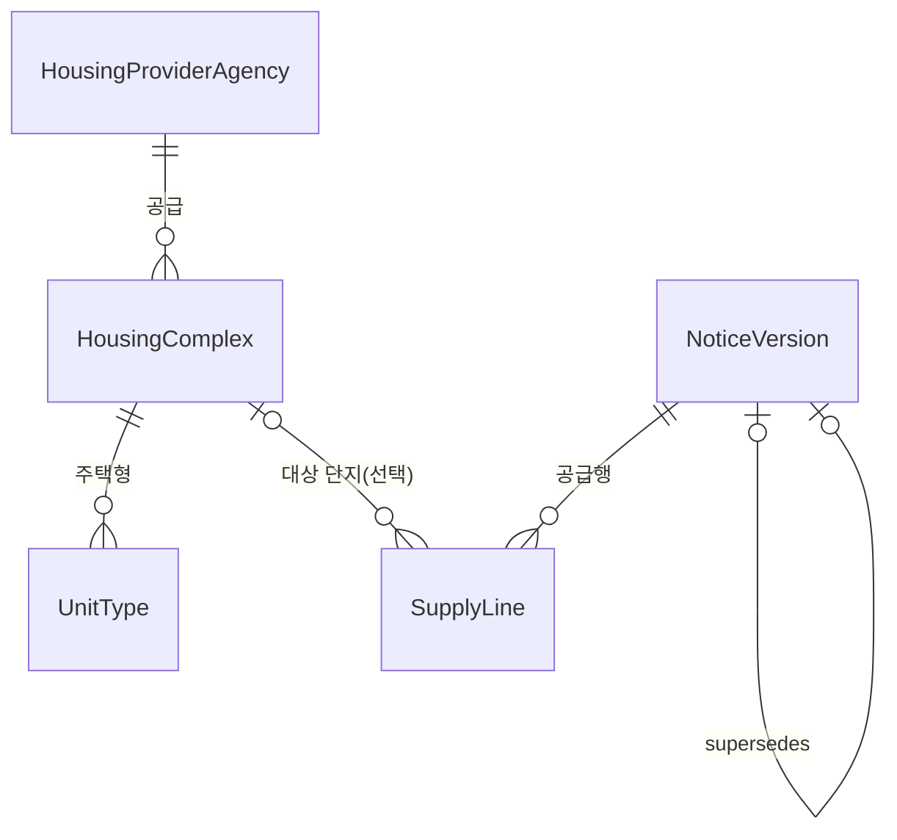

# 원천 API ↔ 도메인 매핑

이 문서의 모든 수치는 실제 호출 결과를 센 것이다.

- **단지 표본** — 28개 시군구 조회, 중복 제거 후 **7,821행 / 2,602단지** (15110581 HWSPR04)
- **공고 표본** — 전국 임대 305행 · 분양 63행 (15108420 HWSPR02)

> **적재 범위 — 건설임대만 담는다.** 매입임대·전세임대는 지어진 단지가 아니라서 이 카탈로그의 전제와
> 맞지 않아 적재 단계에서 걸러낸다(3.1). 아래 분석은 걸러내기 <b>전</b> 원천 전체를 대상으로 한 것이고,
> 걸러낸 뒤 실제로 무엇이 남는지는 3.7 에 있다.

## 0. 원천 필드명 읽는 법

공공데이터 필드명은 행정표준용어를 약어로 줄인 것이다. 규칙을 알면 처음 보는 필드도 읽힌다.

| 약어 | 뜻 | 약어 | 뜻 | 약어 | 뜻 |
| --- | --- | --- | --- | --- | --- |
| `Nm` | 명(이름) | `Cd` | 코드 | `Sn` | 일련번호 |
| `De` | 일자 | `Co` | 수(개수) | `Ar` | 면적 |
| `Ty`, `Tp` | 유형 | `At` | 여부 | `Se` | 구분 |
| `hsmp` | 주택단지 | `pblanc` | 공고 | `rcrit` | 모집 |
| `suply`, `spl` | 공급 | `instt` | 기관 | `brtc` | 광역시도 |
| `signgu` | 시군구 | `adres` | 주소 | `rn` | 도로명 |
| `hshld` | 세대 | `bass` | 기본 | `gtn` | 보증금 |
| `rnt`, `rent` | 임대 | `mt` | 월 | `chrg` | 료(요금) |
| `przwner` | 당첨자 | `presnatn` | 발표 | `refrn` | 참조 |
| `cnvrs` | 전환 | `lmt` | 한도 | `buld` | 건물 |
| `elvtr` | 승강기 | `instl` | 설치 | `prvuse` | 전용 |
| `cmnuse` | 공용 | `lfsts` | 전세 | `tot`, `sum` | 총 |

> 포털이 **요청 파라미터**는 한글 설명을 주지만 **응답 필드 사전은 공개하지 않는다.** 아래 원천 필드 뜻은 실제 값과 위 약어 규칙에서 읽어낸 것이다. 값으로 확인되지 않은 것은 (추정)으로 표시했다.

## 1. 원천 현황

| 데이터 | 엔드포인트 | 오퍼레이션 | 정책 |
| --- | --- | --- | --- |
| 15110581 마이홈 공공임대주택 단지정보 | `apis.data.go.kr/1613000/HWSPR04` | `/rentalHouseGwList` | **기준 단지 원천** |
| 15108420 마이홈 공공주택 모집공고 | `apis.data.go.kr/1613000/HWSPR02` | `/rsdtRcritNtcList`(임대)<br>`/ltRsdtRcritNtcList`(분양) | **기준 공고 원천** |
| 15058530 LH 분양임대공고문 | `apis.data.go.kr/B552555` | `/lhLeaseNoticeInfo1/lhLeaseNoticeInfo1` | probe 전용 |
| 15059475 LH 임대주택단지 | `apis.data.go.kr/B552555` | `/lhLeaseInfo1/lhLeaseInfo1` | 사용 안 함 |
| 15056765 LH 공고별 공급정보 | `apis.data.go.kr/B552555` | `/lhLeaseNoticeSplInfo1/getLeaseNoticeSplInfo1` | 사용 안 함 |

### 기준 공고 원천을 15058530 → 15108420 으로 바꾼 이유

| 필요한 것 | 15058530 (LH) | 15108420 (마이홈) |
| --- | --- | --- |
| 정정/취소 구분 | 없음 (공고명 말머리로 추측) | `sttusNm` (상태명) |
| 이전 버전 연결 | 없음 | `beforePblancId` (이전공고ID) |
| 공급 수 | 없음 | `sumSuplyCo` (총공급수) |
| 단지 주소·PNU | 없음 | `fullAdres`(전체주소), `pnu`(필지고유번호) |
| 접수 기간 | 마감일만 | `beginDe` ~ `endDe` |
| 임대조건 | 없음 | `rentGtn`(임대보증금), `mtRntchrg`(월임대료) 등 |
| 포함 기관 | LH만 | LH, SH공사, 대전도시공사, 경남개발공사 … |

둘을 같은 테이블에 넣으면 ID 체계(`PAN_ID` vs `pblancId`)가 달라 같은 공고가 두 줄로 들어간다. 마이홈 `url`에 LH `panId`가 박혀 있으므로 나중에 이어야 할 때 그걸 쓴다.

## 2. 응답 구조

```
국토부(1613000)   {"response":{"header":{"resultCode":"00"},"body":{"item":[ ... ]}}}
LH(B552555)       [{"resHeader":[ ... ]},{"dsList":[ ... ]}]
```

- 국토부는 자료가 없으면 `resultCode: "03"`(NODATA_ERROR)을 주고 **`body` 키 자체가 없다.** 오류가 아니라 빈 페이지라 예외로 올리지 않는다.
- 인증키는 포털이 이미 URL 인코딩해서 준다(`%2B`, `%2F`, `%3D`). 재인코딩하면 `%252B`가 되어 실패한다. `OpenApiClient.buildUri()`가 인증키만 문자열로 이어 붙이고 나머지만 인코딩한다.

## 3. 데이터의 결 — 같은 API인데 행마다 다른 게 온다

**이 장을 안 읽고 테이블만 보면 반드시 오해한다.** 같은 응답 안에서도 공급유형과 주택유형에 따라 채워지는 필드가 완전히 달라지고, 심지어 같은 필드에 다른 종류의 값이 들어온다.

### 3.1 가장 큰 축 — 매입임대 vs 건설임대

| 구분 | 뜻 | 표본 비중 |
| --- | --- | --- |
| **매입임대** | 이미 지어진 민간주택을 LH·SH가 **사들여서** 임대 | 6,909행 (88%) |
| **건설임대** | 공공이 **직접 지은** 단지 (국민임대·영구임대·행복주택·통합공공임대·장기전세·5·10·50년임대) | 912행 (12%) |
| **전세임대** | 세입자가 집을 **직접 구해오면** 공공이 전세금을 지원 | 단지 API에는 없음 |

이 구분이 데이터의 거의 모든 차이를 설명한다.

- 매입임대는 **여기저기 흩어진 개별 주택**이다. 그래서 "단지"라는 개념이 약하고, 준공일·난방·주차 같은 **건물 제원이 원천에 아예 없다.**
- 건설임대는 진짜 단지라서 건물 제원이 온다.
- 전세임대는 대상 주택 자체가 없어서 **단지 API에 나오지 않고**, 공고 API에만 나온다.

**그래서 매입임대·전세임대는 적재하지 않는다.** 단지·주택형 카탈로그의 전제("이름 있는 단지가 있고 그 안에 주택형이 있다")가 이 둘에서는 성립하지 않는다.

화이트리스트가 아니라 **이 둘만 제외**한다. 모르는 값이나 공급유형이 없는 분양공고를 실수로 버리지 않기 위해서다. 원천에 새 건설임대 제도가 생겨도 그대로 들어온다.

다만 **`suplyTyNm` 라벨만으로는 다 걸러지지 않는다.** 라벨이 건설임대인 매입임대가 64단지 통과한다(3.7).

### 3.2 주택유형(`houseTyNm`)별로 뭐가 오는가

| 주택유형 | 행 | 단지 | 준공일<br>`competDe` | 난방<br>`heatMthdDetailNm` | 주차<br>`parkngCo` | 복도<br>`buldStleNm` | 승강기<br>`elvtrInstlAtNm` |
| --- | ---: | ---: | ---: | ---: | ---: | ---: | ---: |
| 다가구주택 | 2,569 | 547 | 0% | 0% | 0% | 0% | 0% |
| **아파트** | 1,914 | 1,143 | **41%** | **29%** | **25%** | **29%** | **27%** |
| 다세대주택 | 1,632 | 351 | 1% | 1% | 1% | 1% | 1% |
| 오피스텔 | 805 | 274 | 0% | 0% | 0% | 0% | 0% |
| (빈값) | 557 | 222 | 0% | 0% | 0% | 0% | 0% |
| 연립주택 | 302 | 52 | 20% | 20% | 20% | 20% | 20% |
| 단독주택 | 42 | 13 | 0% | 0% | 0% | 0% | 0% |

**건물 제원 다섯 칸은 사실상 아파트 전용이다.** 다가구·다세대·오피스텔·단독은 0~1%다. 전체 평균으로 보면 준공일 10.9%지만 아파트만 보면 40.6%다. 평균값은 이 사실을 감춘다.

주택유형과 공급유형의 관계도 뚜렷하다.

| 공급유형 | 주요 주택유형 | 행 |
| --- | --- | ---: |
| 매입임대 | 다가구주택 | 2,542 |
| 매입임대 | 다세대주택 | 1,615 |
| 매입임대 | 아파트 | 1,106 |
| 매입임대 | 오피스텔 | 805 |
| 매입임대 | (빈값) | 557 |
| 행복주택 | 아파트 | 274 |
| 매입임대 | 연립주택 | 242 |
| 국민임대 | 아파트 | 209 |
| 영구임대 | 아파트 | 94 |
| 장기전세 | 아파트 | 93 |

**매입임대는 모든 주택유형에 걸쳐 있고, 건설임대는 거의 전부 아파트다.** 그래서 "아파트인가"와 "건설임대인가"는 거의 같은 질문이다.

주택유형 자체가 비는 행도 557개(7%) 있다. 전부 매입임대다.

### 3.3 `styleNm` — 주택형일 때도 있고 호수일 때도 있다

**같은 필드에 성격이 다른 두 가지가 온다.** 이게 이 원천에서 제일 헷갈리는 지점이다.

| 주택유형 | 호수형<br>(`201`, `302`) | 면적형<br>(`36`, `59`) | 문자형<br>(`51A`, `84B`) |
| --- | ---: | ---: | ---: |
| 다세대주택 | **678 (42%)** | 875 | 79 |
| 다가구주택 | 193 (8%) | 2,157 | 219 |
| 오피스텔 | 156 (19%) | 614 | 35 |
| **아파트** | **0** | 1,589 | 325 |
| 연립주택 | 0 | 187 | 115 |
| 단독주택 | 0 | 16 | 26 |

- **면적형** — 전용면적을 반올림한 숫자. `36`이면 전용 36㎡ 안팎이다.
- **문자형** — 아파트의 진짜 주택형 이름. `51A`, `84B`.
- **호수형** — **주택형이 아니라 호실 번호다.** 앞자리가 층이다.

실제 예시(서울 강남구 봉은사로13길 26, 다세대주택 "백년빌"):

| `styleNm` | `suplyPrvuseAr` | `suplyCmnuseAr` | `bassRentGtn` | `bassMtRntchrg` |
| --- | ---: | ---: | ---: | ---: |
| 201 | 29.34 | 8.35 | 38,880,000 | 400,500 |
| 202 | 29.16 | 8.30 | 36,750,000 | 378,700 |
| … | | | | |
| 502 | 37.85 | 10.76 | 52,130,000 | 537,300 |

**세대수 15 = 행 15개**이고 면적이 호마다 전부 다르다. 같은 평면을 공유하는 카탈로그 항목이 아니라 **호실 목록**이다. 실제로 `unit_type` 행 수와 단지 세대수가 일치하는 단지가 604개 중 292개(48%)다.

**아파트는 호수형이 0건**이라, 아파트만 보면 `styleNm`은 항상 주택형이다.

이 사실이 화면에 그대로 드러난다. "이 단지의 주택형"을 나열하면 아파트는 `51A, 59B`가 나오고 다세대는 `201, 202, 203…`이 나온다. 집계도 기준이 어긋난다 — 아파트는 주택형 단위로, 다세대는 호실 단위로 세게 된다.

지금은 **테이블을 나누지 않고 그대로 담아 뒀다.** 원천이 한 필드에 섞어 보내는 이상 판별 규칙은 어차피 우리가 만들어야 하고, 화면 요구사항이 없는 상태에서 나누면 추측이 되기 때문이다. 판별이 필요하면 이 규칙을 쓰면 된다.

```
houseTyNm 이 아파트·연립·단독  → styleNm 은 항상 주택형
그 외에서 styleNm 이 3자리 이상 숫자 → 호수
```

### 3.4 공급행 — `houseSn` 하나가 전부를 가른다

공고 API의 공급행은 "대상 주택이 정해진 것"과 "안 정해진 것"으로 딱 둘로 나뉘고, **`houseSn`(주택일련번호)이 그 플래그다.**

| | 행수 | `pnu` | `hsmpNm`<br>단지명 | `fullAdres`<br>주소 | `heatMthdNm`<br>난방 | `totHshldCo`<br>총세대수 | `rentGtn`<br>보증금 | `mtRntchrg`<br>월세 | `sumSuplyCo`<br>공급수 | `signguNm`<br>시군구 |
| --- | ---: | ---: | ---: | ---: | ---: | ---: | ---: | ---: | ---: | ---: |
| `houseSn = 0` | 156 | **0** | **0** | **0** | **0** | **0** | **0** | **0** | 79 | 81 |
| `houseSn ≥ 1` | 145 | **145** | **145** | **145** | 124 | 65 | **145** | **145** | 136 | 145 |

**`houseSn = 0`이면 주택 관련 필드가 전부 비고, 1 이상이면 주소·PNU·임대조건이 100% 찬다.** 랜덤하게 반쯤 비는 게 아니다.

`houseSn = 0`인 공고가 무엇인지 보면 이유가 분명하다.

| 공급유형 | 행 | 공고 수 |
| --- | ---: | ---: |
| 매입임대 | 91 | 35 |
| 전세임대 | 65 | 5 |

- **매입임대**는 공고 시점에 "이 지역에서 몇 호 모집"만 있고 실제 주택은 나중에 배정된다.
- **전세임대**는 세입자가 직접 집을 구해오므로 애초에 대상 주택이 없다.

건설임대(행복주택·국민임대·영구임대·10·50년임대)는 지어진 단지가 특정돼 있어 전부 `houseSn ≥ 1`이다.

**그래서 `SupplyLine.complexId`가 선택이어야 한다.** 필수로 두면 매입임대·전세임대 공고 156행이 통째로 저장 불가가 된다. 그 행들도 `sumSuplyCo`(79행)와 `signguNm`(81행)은 있으므로 "어느 지역에 몇 호"는 남길 수 있다.

### 3.5 PNU 는 단지를 유일하게 지목하지 않는다

두 API 를 잇는 키는 PNU 뿐인데, **PNU 하나에 단지가 여러 개 달린다.**

```
단지 11,236개  →  고유 PNU 6,851개
단독 PNU 6,030 / 중복 PNU 821 / 한 PNU 최대 단지 수 113
```

매입임대가 같은 건물(필지)에서 호를 따로 사들이면 각각 다른 `hsmpSn` 으로 등록되기 때문이다. 중복 PNU 821개 중 704개는 **이름과 주소까지 완전히 같다.**

```
PNU 4311410100103720006  →  hsmpSn 31393177 / 31393160 / 31393159 …  전부 "충청북도 청주시", 같은 주소
```

그래서 매칭은 **후보가 정확히 하나일 때만 붙인다.** 둘 이상이면 어느 쪽인지 알 방법이 없고, 잘못 붙은 단지를 화면에 보여 주는 것보다 안 붙은 채로 두는 편이 낫다.

### 3.6 적재 순서와 재매칭

닭과 달걀이 있다.

- 단지 API 는 **시군구 단위로만** 열려 있어서 어느 지역을 받을지 정해야 한다
- 그 지역 목록은 **공고의 PNU 앞 5자리**에서 나온다 (`brtcCode` 2 + `signguCode` 3)

즉 공고가 먼저 들어오고 단지가 나중에 들어온다. 그런데 매칭은 공고 적재 시점에 일어나므로, **이미 저장된 공급행은 매칭 기회를 놓친다.** 그래서 마지막에 재매칭이 필요하다.

```
공고 적재 → 지역 도출 → 단지 적재 → 재매칭
```

실제로 이 순서로 돌린 결과다(공고가 가리키는 66개 시군구, 단지 11,236개).

| 공급행 366건 | 건수 | 비고 |
| --- | ---: | --- |
| PNU 없음 — 단지 미특정 | 156 | 매입임대·전세임대. 3.4 참고 |
| **매칭 성공** | **127** | 재매칭 전에는 4건뿐이었다 |
| 단지가 원천에 없음 | 70 | 그중 48건이 **분양공고**. HWSPR04 는 공공<b>임대</b>주택만 담는다 |
| PNU 모호 (후보 2~6개) | 13 | 3.5 |

PNU 가 있는 210건 중 **127건(60%)** 이 붙는다. 나머지는 우리 문제가 아니라 원천의 한계다.

### 3.7 건설임대만 걸러낸 결과

앞의 분석은 원천 전체를 본 것이다. 건설임대만 남기고 실제로 적재하면 이렇게 된다.

| | 전체 적재 시 | **건설임대만** |
| --- | ---: | ---: |
| 단지 | 11,169 | **1,025** |
| 주택형 | 31,326 | **3,748** |
| 공고버전 | 141 | **101** |
| 공급행 | 366 | **197** |

**3.3 에서 문제였던 호수형이 사라진다.** 주택형 3,748건 중 3자리 숫자는 1건뿐이고, 그마저도 "상계장암지구3단지 장기전세 **114형**"(전용 114.69㎡)이라 호실이 아니라 진짜 주택형이다. 즉 **건설임대에 호실 번호는 0건이다.**

**대신 라벨을 갈아입은 매입임대가 있었다.** 공급유형이 건설임대인데 실제로는 매입임대인 단지가 64개 통과한다.

| 기관 | 단지 | `suplyTyNm` | 실제로 무엇인가 |
| --- | ---: | --- | --- |
| 성남시 | 40 | `10년임대` | `hsmpNm` 이 **"매입임대주택"**, `styleNm` 이 **"매입임대"** |
| 대구도시개발공사 | 24 | `장기전세` `50년임대` | 다가구 한 채씩. `styleNm` 은 주택형이 아니라 **방 수**(1·2·3) |

`suplyTyNm` 한 칸에 성격이 다른 두 가지가 들어오기 때문이다 — **'매입임대'는 어떻게 확보했나이고, '10년임대'·'장기전세'는 어떤 조건으로 빌려주나다.** 사들인 집을 10년임대로 공급하면 둘 다 참이라 어느 쪽을 적을지가 기관마다 갈린다. 대구 노블힐즈4(`hsmpSn` 1058)는 그 갈림이 같은 응답 안에 보인다.

```
장기전세  styleNm=1  전용 19.52  세대 8
장기전세  styleNm=2  전용 61.85  세대 8
장기전세  styleNm=3  전용 89.85  세대 8
매입임대  styleNm=    전용 40.00  세대 1   ← 이 행만 라벨로 걸러졌다
```

**단지 단위로 봐도 안 걸린다.** 64단지 중 63단지는 원천에 '매입임대' 라벨 행이 아예 없다 — 섞여 오는 건 노블힐즈4 하나뿐이다. 요청 파라미터로 거르는 길도 없다. 단지 API는 지역 코드와 페이지 말고는 아무것도 받지 않고(무슨 값을 더 붙여도 `totalCount` 가 그대로다), 포털이 주는 "요청 파라미터 코드" 파일도 시군구 코드표가 전부다.

그래서 **라벨 대신 지어진 흔적으로 한 번 더 거른다.**

```
아파트가 아니면서 준공일도 없으면 담지 않는다
```

반대 방향이 거의 비어 있어서 이 조건이 진짜 단지를 버리지 않는다 — **매입임대 라벨 28,773행 중 준공일이 있는 건 2행(0.007%)뿐이다.** 준공일이 있는 비아파트 건설임대 8단지(만부마을 행복주택, 평택이충 통합공공임대주택, 구산연립주택 …)는 그대로 남는다.

| 조건 | 단지 |
| --- | ---: |
| `suplyTyNm` 만 | 1,089 |
| **+ 아파트거나 준공일 있음** | **1,025** |

남는 주택형 이름은 이런 모양이다.

```
46(366) 36(364) 59(294) 26(278) 51(266) 39(183) 84(118) …
59A(21) 59B(15) 26A(12) 44A(7) 26B(7) 51A(7) 36A(7) 49A(6) …
```

**3.4 의 `houseSn = 0` 문제도 사라진다.** 공급행 139건이 **전부 PNU를 갖는다.** `houseSn = 0` 은 매입임대·전세임대에서만 나왔기 때문이다. 그 결과 단지 매칭률이 크게 오른다.

| | 전체 적재 시 | 건설임대만 |
| --- | ---: | ---: |
| 공급행 | 366 | 197 |
| PNU 있음 | 210 (57%) | **197 (100%)** |
| 단지 매칭 | 127 (35%) | **124 (63%)** |

건물 제원도 같이 올라간다.

| | 원천 전체 | 건설임대만 |
| --- | ---: | ---: |
| 준공일 | 11% | **97%** (994/1,025) |
| 난방 | 8% | **62%** (638/1,025) |
| 주차 | 7% | **54%** (557/1,025) |
| 아파트 비율 | 23% | **99%** (1,017/1,025) |

**그래도 구조는 그대로 둔다.** 자연키에서 면적을 뺄 수 있을까 재봤지만 안 된다.

| 자연키 후보 (건설임대만) | 고유 | 충돌 |
| --- | ---: | ---: |
| (단지, 주택형명) | 2,758 | **990** |
| (단지, 공급유형, 주택형명, 전용) | 3,662 | 86 |
| (단지, 공급유형, 주택형명, 전용, 공용) | 3,748 | **0** |

아파트에서도 같은 "59형"에 전용 59.93㎡와 59.95㎡가 따로 온다. 그리고 공급유형도 여전히 필요하다 — 서울 노원 중계센트럴파크는 `49A` 가 **국민임대와 장기전세로 두 번** 오는데 주택형명도 면적도 같고 임대조건만 다르다(보증금 6,385만 vs 3억 1,122만).

`SupplyLine.complexId` 도 선택으로 남긴다. `houseSn = 0` 은 사라졌지만 73건은 여전히 안 붙는다. **그중 52건이 분양공고다** — HWSPR04 는 임대만 담아서 분양 단지가 아예 없다. 임대공고만 보면 134건 중 113건(84%)이 붙는다. 나머지는 단지가 원천에 없거나 PNU 가 모호한 경우다(3.5).

## 4. 전체 테이블 설계

건설임대만 담는다. 채워짐은 실제 적재 결과다(단지 1,025 · 주택형 3,748 · 공고버전 101 · 공급행 197).



원천이 나뉘는 지점이 곧 테이블이 나뉘는 지점이다. **단지·주택형은 HWSPR04**가, **공고·공급행은 HWSPR02**가 채운다. 둘을 잇는 유일한 키는 PNU다.

아래 표의 **원천 API** 열은 이 약칭을 쓴다.

| 약칭 | 데이터 | 엔드포인트 · 오퍼레이션 |
| --- | --- | --- |
| **HWSPR04** | 15110581 마이홈 공공임대주택 단지정보 | `apis.data.go.kr/1613000/HWSPR04` `/rentalHouseGwList` |
| **HWSPR02** | 15108420 마이홈 공공주택 모집공고 | `apis.data.go.kr/1613000/HWSPR02` `/rsdtRcritNtcList`(임대)<br>`/ltRsdtRcritNtcList`(분양) |
| **(파생)** | 원천 값에서 우리가 계산한 것 | — |
| **(고정)** | 원천과 무관한 우리 쪽 상수 | — |

### `housing_complex` — 단지

공고와 상관없이 유지되는 주택 카탈로그의 기준점.

> 지도 탐색이 목표지만 **아직 좌표 칸이 없다.** 원천이 좌표를 안 주기 때문이고, 어떻게 채울지는 6장에 정리했다.

| 컬럼 | 무엇인가 | 원천 API | 원천 필드 (뜻) | 채워짐 |
| --- | --- | --- | --- | ---: |
| `id` | 서비스 내부 식별자 | (고정) | — | |
| `name` | 단지명 | HWSPR04 | `hsmpNm` (주택단지명) | 100% |
| `road_address` | 도로명주소 | HWSPR04 | `rnAdres` (도로명주소) | 100% |
| `legal_dong_code` | 법정동코드 10자리. 좌표검색API의 `admCd` 로 그대로 들어간다(6장) | HWSPR04 (파생) | `pnu` 앞 10자리 | 100% |
| `pnu` | 필지고유번호 19자리. 공고와 단지를 잇는 유일한 키 | HWSPR04 | `pnu` (필지고유번호) | 100% |
| `province_code` / `province_name` | 광역시도 코드·명 (11 서울) | HWSPR04 | `brtcCode` / `brtcNm` | 100% |
| `district_code` / `district_name` | 시군구 코드·명 (350 노원구) | HWSPR04 | `signguCode` / `signguNm` | 100% |
| `housing_provider_agency_id` | 주택 공급기관 (LH서울, SH공사 …) | HWSPR04 | `insttNm` (기관명) | 100% |
| `max_supply_type_unit_count` | **단지 총 세대수가 아니다.** 가장 큰 공급유형의 세대수 (5.5) | HWSPR04 | `hshldCo` (세대수) | 100% |
| `completion_date` | 준공(사용승인) 일자 (추정) | HWSPR04 | `competDe` (준공일자, 추정) | 97% |
| `completion_year` | 준공연도. 위에서 연도만 뽑은 값 | HWSPR04 (파생) | `competDe` 앞 4자리 | 97% |
| `source_complex_id` | 원천의 단지 식별자. 재적재 기준점 | HWSPR04 | `hsmpSn` (주택단지 일련번호) | 100% |
| `heating_type` | 난방유형 enum — `INDIVIDUAL`/`CENTRAL`/`DISTRICT` | HWSPR04 (파생) | `heatMthdDetailNm` 앞 2자 | 62% |
| `heating_type_name` | 난방유형 원문. enum 이 버리는 열원(가스·전기·폐열)이 여기 남는다 | HWSPR04 | `heatMthdDetailNm` (난방방식상세명) | 62% |
| `parking_spaces` | 주차 대수 | HWSPR04 | `parkngCo` (주차수) | 54% |
| `corridor_type` | 복도 형태 — 계단식/복도식/혼합식 | HWSPR04 | `buldStleNm` (건물형태명) | 63% |
| `elevator_installation` | 승강기 — 미설치/전체동 설치 | HWSPR04 | `elvtrInstlAtNm` (승강기설치여부명) | 57% |
| `house_type` | 주택유형 enum — `APARTMENT` 등 6개. 건설임대는 99%가 아파트 | HWSPR04 (파생) | `houseTyNm` 매핑 | 99.9% |
| `house_type_name` | 주택유형 원문 | HWSPR04 | `houseTyNm` (주택유형명) | 99.9% |

유니크: `source_complex_id`

**`name` 을 매칭에 쓰면 안 된다.** 매입임대를 빼고 나면 지역명을 단지명으로 쓰는 행은 0건이지만, 이번엔 **같은 이름이 여러 `hsmpSn` 으로 온다** — 1,025개 중 194개가 이름이 겹친다("별하람마을3단지" 29개, "김포한강데세리브(공임리츠Ac-01a)" 10개).

### `unit_type` — 주택형

한 단지 안에서 면적·구조를 공유하는 카탈로그 항목. 단지와 **같은 행**에서 나온다.

건설임대만 담으므로 `type_name` 은 대개 `49A`, `59B`, `84` 같은 주택형이고 **호실 번호는 0건이다**(3.7). 다만 3,748건 중 33건은 `15평`·`21㎡`·`39.016` 처럼 단위가 붙거나 면적 원값이 그대로 온다.

| 컬럼 | 무엇인가 | 원천 API | 원천 필드 (뜻) | 채워짐 |
| --- | --- | --- | --- | ---: |
| `id` | 내부 식별자 | (고정) | — | |
| `complex_id` | 소속 단지 | HWSPR04 | `hsmpSn` | 100% |
| `type_name` | 주택형 이름 — `49A`, `59B`, `84` | HWSPR04 | `styleNm` (주택형명) | 100% |
| `supply_type_name` | 공급유형 원문. **자연키의 일부라 enum 이 아니라 원문을 쓴다**(5.6) | HWSPR04 | `suplyTyNm` (공급유형명) | 100% |
| `supply_type` | 공급유형 enum — `NATIONAL_RENTAL` 등 | HWSPR04 (파생) | `suplyTyNm` 매핑 | 100% |
| `exclusive_area` | 주거전용면적(㎡) — 집 안 면적 | HWSPR04 | `suplyPrvuseAr` (공급전용면적) | 100% |
| `residential_common_area` | 주거공용면적(㎡) — 계단·복도 등 | HWSPR04 | `suplyCmnuseAr` (공급공용면적) | 99.9% |
| `supply_type_unit_count` | **이 공급유형의 세대수.** 주택형별이 아니라서 같은 공급유형끼리 값이 반복된다 | HWSPR04 | `hshldCo` (세대수) | 100% |
| `base_deposit` | 기본 임대보증금(원). 공고와 무관한 카탈로그 기준값 | HWSPR04 | `bassRentGtn` (기본임대보증금) | 99% |
| `base_monthly_rent` | 기본 월임대료(원). 장기전세는 0 | HWSPR04 | `bassMtRntchrg` (기본월임대료) | 98% |
| `base_convertible_deposit_limit` | 기본 전환보증금 한도(원) — 월세를 보증금으로 바꿀 수 있는 최대치 | HWSPR04 | `bassCnvrsGtnLmt` (기본전환보증금한도) | 91% |

유니크: `(complex_id, supply_type_name, type_name, exclusive_area, residential_common_area)`

### `notice_version` — 공고

최초·정정·취소 시점의 내용을 보존하는 불변 스냅샷. **공고 단위 값만** 담는다(5.3).

| 컬럼 | 무엇인가 | 원천 API | 원천 필드 (뜻) | 채워짐 |
| --- | --- | --- | --- | ---: |
| `id` | 이 버전의 PK | (고정) | — | |
| `notice_id` | 공고 식별자. 같은 공고의 모든 버전이 공유한다 | HWSPR02 (파생) | 체인 맨 앞 `pblancId` | 100% |
| `source_notice_id` | 이 버전 자신의 원천 ID. 다음 정정공고가 여기를 가리킨다 | HWSPR02 | `pblancId` (공고ID) | 100% |
| `version_number` | 공고 안의 버전 순서 (1, 2, 3 …) | HWSPR02 (파생) | 체인 깊이 | 100% |
| `notice_change_status` | 원본/정정/취소 구분 | HWSPR02 | `sttusNm` (상태명) | 100% |
| `supersedes_version_id` | 바로 이전 버전 | HWSPR02 | `beforePblancId` (이전공고ID) | 정정공고만 |
| `source_system` | 어느 원천에서 왔는지 | (고정) | `MYHOME_PORTAL` | 100% |
| `published_at` | 공고 게시일 | HWSPR02 | `rcritPblancDe` (모집공고일자) | 100% |
| `title` | 공고명. 정정공고에서 바뀌므로 버전 소유가 맞다 | HWSPR02 | `pblancNm` (공고명) | 100% |
| `detail_url` | 청약 사이트 원문 링크. LH건은 `panId` 가 박혀 있어 LH 원천과 잇는 열쇠 | HWSPR02 | `url` | 100% |
| `application_begin_on` / `application_end_on` | 접수 시작·마감일 | HWSPR02 | `beginDe` / `endDe` | 100% |
| `winner_announced_on` | 당첨자 발표일 | HWSPR02 | `przwnerPresnatnDe` | 100% |
| `supply_institution_name` | 공급기관. 단지 쪽과 달리 지역본부 구분 없이 "LH" | HWSPR02 | `suplyInsttNm` (공급기관명) | 100% |
| `house_type` / `house_type_name` | 주택유형 enum·원문 | HWSPR02 | `houseTyNm` (주택유형명) | 100% |
| `supply_type` / `supply_type_name` | 공급유형 enum·원문. 단지 쪽과 같은 enum 이라 바로 비교된다 | HWSPR02 | `suplyTyNm` (공급유형명) | 100% |
| `contact` | 문의처 — 콜센터 번호 등 | HWSPR02 | `refrnc` (참조사항) | 96% |

유니크: `(notice_id, version_number)`, `source_notice_id`

### `supply_line` — 공급행

이번 공고버전에서 어느 주택에 수량이 배정됐는가. 공고와 **같은 행**에서 나온다.

건설임대만 담으므로 `houseSn = 0` 인 행이 없고, **197건 전부 PNU를 갖는다**(3.7).

| 컬럼 | 무엇인가 | 원천 API | 원천 필드 (뜻) | 채워짐 |
| --- | --- | --- | --- | ---: |
| `id` | 공급행 식별자 | (고정) | — | |
| `notice_version_id` | 소유 공고버전 | HWSPR02 | `pblancId` (공고ID) | 100% |
| `complex_id` | 대상 단지. PNU 로 후보가 정확히 하나일 때만 붙인다(3.5) | HWSPR02 → HWSPR04 매칭 | `pnu` | 63% |
| `display_order` | 표시 순서. `houseSn` 은 중복될 수 있어 응답 순서를 쓴다 | HWSPR02 (파생) | 응답 순서 | 100% |
| `house_sn` | 공고 안의 주택 일련번호 | HWSPR02 | `houseSn` (주택일련번호) | 100% |
| `supply_count` | 공급 수(선발 수) | HWSPR02 | `sumSuplyCo` (총공급수) | 98% |
| `supplied_complex_name` | **공고가 말한** 단지명. 단지가 안 붙어도 화면에 쓸 수 있다 | HWSPR02 | `hsmpNm` (주택단지명) | 100% |
| `supplied_full_address` | 공고가 말한 주소. 지번이 섞여 온다 | HWSPR02 | `fullAdres` (전체주소) | 100% |
| `supplied_pnu` | 공고가 말한 필지고유번호. 매칭에 쓴 키를 그대로 남긴다 | HWSPR02 | `pnu` (필지고유번호) | 100% |
| `supplied_road_name` | 도로명 | HWSPR02 | `rnCodeNm` (도로명) | 95% |
| `supplied_reference_legal_dong_name` | 참조 법정동명 | HWSPR02 | `refrnLegaldongNm` | 5% |
| `supplied_province_name` / `supplied_district_name` | 광역시도명·시군구명 | HWSPR02 | `brtcNm` / `signguNm` | 100% |
| `supplied_heating_type_name` | 난방유형 | HWSPR02 | `heatMthdNm` (난방방식명) | 91% |
| `supplied_total_unit_count` | 총 세대수 | HWSPR02 | `totHshldCo` (총세대수) | 43% |
| `deposit` | 임대보증금(원) | HWSPR02 | `rentGtn` (임대보증금) | 100% |
| `down_payment` | 계약금(원) | HWSPR02 | `enty` (계약금) | 100% |
| `balance` | 잔금(원) | HWSPR02 | `surlus` (잔금) | 100% |
| `monthly_rent` | 월임대료(원) | HWSPR02 | `mtRntchrg` (월임대료) | 100% |
| `detail_url` / `mobile_detail_url` | 마이홈 상세(PC·모바일). **행마다 다르다**(`houseSn` 이 붙는다) | HWSPR02 | `pcUrl` / `mobileUrl` | 100% |

유니크: `(notice_version_id, display_order)`

`supplied_*` 는 단지가 붙어도 지우지 않는다. **공고버전은 불변인데 단지 카탈로그는 계속 갱신되므로**, 공고가 그때 뭐라고 했는지가 남아야 한다.

**금액 관계는 값으로 확인했다.** `계약금 + 잔금 = 임대보증금`. 원천의 중도금(`prtpay`)은 표본 전체에서 0이라 담지 않는다.

### 뺀 것과 그 이유

건설임대 전용으로 좁히면서 **영원히 비는 칸**을 걷어냈다. 되살릴 조건도 같이 적어 둔다.

| 뺀 것 | 왜 | 언제 되살리나 |
| --- | --- | --- |
| `application_option` 테이블 | 순위·공급대상이 어느 API 에도 없다. 0행 | 공고문 PDF 파싱 경로가 생기면 |
| `supply_line.unit_type_id` | 공고가 "이 단지에 몇 호"까지만 말하고 주택형별 배분을 안 준다 | 원천이 주택형별 배정을 주면 |
| `supply_line.reserve_number` | 예비 번호가 원천에 없다 | 상동 |
| `supply_line.interim_payment` | 중도금이 표본 전체에서 0 | 0이 아닌 값이 나오면 |
| `notice_version.supply_unit_count_text` | `suplyHoCo` 는 **매입임대 공고에만** 있던 값. 건설임대 0/70 | 매입임대를 다시 담으면 |
| `notice_version.correction_reason` | 정정 사유 원문을 주는 원천이 없다. 0/70 | 공고문 본문 수집 경로가 생기면 |
| `unit_type.other_common_area` / `contract_area` | 기타공용면적이 없어 계약면적도 계산이 안 된다. 0/3,340 | 원천이 면적 내역을 주면 |
| `unit_type.floor_plan_url` | 평면도가 원천에 없다 | 별도 수집 경로가 생기면 |
| `housing_complex.complex_image_url` | 조감도가 원천에 없다 | 상동 |

평면도·조감도는 사용자에게 중요한 정보라 **칸을 지운 게 아니라 미룬 것**이다. 지금은 채울 방법이 없어서 빈 칸으로 두는 대신 이 표에 남겨 뒀다.

## 5. 설계를 바꾼 것과 근거

### 5.1 주택형 자연키에 공급유형과 면적이 들어간다

```
(단지, 주택형명)                       고유 6,063 / 충돌 768
(단지, 주택형명, 전용, 공용)            고유 7,308 / 충돌   9
(단지, 공급유형, 주택형명, 전용, 공용)   고유 7,317 / 충돌   0
```

- **면적이 필요한 이유** — 매입임대는 호마다 따로 사들인 집이라 같은 "39형"에 전용 39.27㎡와 39.57㎡가 같이 온다. 3.3의 호수형은 애초에 값이 호마다 달라 충돌하지 않는다.
- **공급유형이 필요한 이유** — 같은 평면이라도 공급유형별로 임대조건이 다른 행이 따로 온다.

| 단지 | 주택형 | 전용면적 | 공급유형 | 기본 임대보증금 | 기본 월임대료 |
| --- | --- | --- | --- | --- | --- |
| 대치푸르지오써밋 | 51A | 51.7377 | 국민임대 | 125,070,000 | 211,600 |
| 대치푸르지오써밋 | 51A | 51.7377 | 행복주택 | 196,800,000 | 771,000 |

### 5.2 `hsmpSn`(주택단지 일련번호)은 단지 식별자로 성립한다

2,524단지에서 하나의 `hsmpSn` 안에 값이 두 가지 이상 나오는 단지 수:

| 원천 필드 (뜻) | 갈림 | | 원천 필드 (뜻) | 갈림 |
| --- | --- | --- | --- | --- |
| `hsmpNm` (주택단지명) | 0 | | `heatMthdDetailNm` (난방방식상세명) | 0 |
| `rnAdres` (도로명주소) | 0 | | `buldStleNm` (건물형태명) | 0 |
| `pnu` (필지고유번호) | 0 | | `elvtrInstlAtNm` (승강기설치여부명) | 0 |
| `insttNm` (기관명) | 0 | | `houseTyNm` (주택유형명) | 0 |
| `competDe` (준공일자) | 0 | | `brtcCode`/`signguCode` (지역코드) | 0 |
| `parkngCo` (주차수) | 0 | | **`suplyTyNm` (공급유형명)** | **23** |
| | | | **`hshldCo` (세대수)** | **23** |

갈리는 둘은 같이 갈린다. `hshldCo`가 단지 전체가 아니라 **공급유형별 세대수**이기 때문이다(한 단지에 5년임대 2세대 / 행복주택 20세대). 그래서 `suplyTyNm`은 주택형으로 내렸고, `hshldCo`는 주택형에 그대로 남기면서 단지 쪽에는 **큰 값을 남긴다**(5.6). 안 그러면 행 순서대로 값이 뒤집혀 다시 적재할 때마다 바뀐 것처럼 보인다.

### 5.3 `pcUrl`은 공고 단위가 아니다

행이 2개 이상인 공고 52건으로 확인한 필드 레벨:

**공고 단위** (한 공고 안에서 값이 하나)

| 필드 | 뜻 | 필드 | 뜻 |
| --- | --- | --- | --- |
| `sttusNm` | 상태명(일반/정정공고) | `refrnc` | 참조사항(문의처) |
| `pblancNm` | 공고명 | `url` | 청약 사이트 원문 링크 |
| `suplyInsttNm` | 공급기관명 | `beginDe` | 접수 시작일자 |
| `houseTyNm` | 주택유형명 | `endDe` | 접수 종료일자 |
| `suplyTyNm` | 공급유형명 | `rcritPblancDe` | 모집공고일자 |
| `beforePblancId` | 이전공고ID | `przwnerPresnatnDe` | 당첨자발표일자 |
| `suplyHoCo` | 공급호수 | | |

**행 단위** (같은 공고 안에서도 행마다 다름)

| 필드 | 뜻 | 필드 | 뜻 |
| --- | --- | --- | --- |
| `houseSn` | 주택일련번호 | `pnu` | 필지고유번호 |
| `pcUrl` | 마이홈 상세(PC) | `heatMthdNm` | 난방방식명 |
| `mobileUrl` | 마이홈 상세(모바일) | `totHshldCo` | 총세대수 |
| `hsmpNm` | 주택단지명 | `sumSuplyCo` | 총공급수 |
| `brtcNm` | 광역시도명 | `rentGtn` | 임대보증금 |
| `signguNm` | 시군구명 | `enty` | 계약금 |
| `fullAdres` | 전체주소 | `surlus` | 잔금 |
| `rnCodeNm` | 도로명 | `mtRntchrg` | 월임대료 |

`pcUrl`/`mobileUrl`에는 `houseSn`이 붙어 52건 중 29건에서 행마다 다르다. 공고의 대표 URL은 `url`이다.

### 5.4 공고 버전 체인

마이홈은 정정공고를 낼 때 **새 `pblancId`(공고ID)를 발급**하고 `beforePblancId`(이전공고ID)로 이전 공고를 가리킨다. `pblancId`는 "공고"가 아니라 "공고의 한 버전"이다.

```
21001(정정) ← 20942(정정) ← 20893(정정) ← 20680(일반)
```

`beforePblancId`는 항상 자기 `pblancId`보다 작아서 **숫자 오름차순으로 처리하면 이전 버전이 항상 먼저 저장된다.** 표본 19건 모두 같은 응답 안에서 체인이 해결됐다.

### 5.5 이름이 값을 속이던 칸을 고쳤다 — `total_unit_count` → `max_supply_type_unit_count`

원천 `hshldCo`는 (단지, 공급유형) 단위 값이다. 한 단지에 행복주택 20세대 + 5년임대 2세대가 있으면 20과 2가 따로 온다. 우리는 값이 뒤집히지 않게 **큰 쪽만 남기는데**, 칸 이름이 `total_unit_count`(단지 총 세대수)였다.

604단지 중 18개(3%)에서 이 이름은 거짓이다. 실제로는 22인데 20이 들어 있다. 이름이 그 사실을 감춘다.

**값을 바꾸지 않고 이름만 바꿨다.** 정확한 합계는 지금도 뽑을 수 있어서 정보 손실이 없기 때문이다.

```sql
select sum(cnt) from (
  select distinct supply_type_name, supply_type_unit_count cnt
  from unit_type where complex_id = ?
)
```

원천 구조를 그대로 따르려면 `housing_complex ──< complex_supply_type(공급유형, 세대수) ──< unit_type` 3단계가 맞다. 그렇게 하면 세대수 중복 저장(주택형 2,005행에 실제 값은 624개)도 없어진다. 다만 해당 단지가 3%뿐이고 모든 주택형 조회에 조인이 하나 더 붙어서, 공급유형별 화면이 필요해질 때 판단하기로 했다.

### 5.6 공급유형·주택유형을 enum 으로 세웠다

`suplyTyNm`(10개)과 `houseTyNm`(6개)은 값이 유한한데 문자열로만 들고 있었다. 난방은 `HeatingType` enum 인데 이 둘은 아니어서 일관성도 없었다.

**enum 과 원문을 함께 둔다.** 난방에서 쓰던 방식 그대로다.

| 테이블 | enum 칸 | 원문 칸 |
| --- | --- | --- |
| `housing_complex` | `house_type` | `house_type_name` |
| `unit_type` | `supply_type` | `supply_type_name` |
| `notice_version` | `house_type`, `supply_type` | `house_type_name`, `supply_type_name` |

원문을 남기는 이유는 **모르는 값이 왔을 때 적재가 죽지 않게** 하기 위해서다. `from()`은 매칭이 안 되면 null 을 돌려주고 원문은 그대로 남는다. 원천이 새 주택 제도를 추가해도 그 행이 버려지지 않는다.

**`unit_type.supply_type_name`은 원문 문자열이 자연키의 일부다.** enum 으로 바꾸면 모르는 값이 null 이 되어 유니크 제약이 무너지기 때문에, 여기만 원문이 주인이고 enum 이 파생이다.

실제 적재로 확인한 결과 **enum 매핑 실패 0건**이었다. `house_type`이 null 인 6개 단지는 원천 `houseTyNm` 자체가 빈 값인 경우다.

```
PURCHASED_RENTAL | 매입임대  | 759행      MULTI_FAMILY_HOUSE | 다가구주택 | 59단지
LONG_TERM_JEONSE | 장기전세  |  93행      APARTMENT          | 아파트   | 47단지
HAPPY_HOUSE      | 행복주택  |  60행      MULTIPLEX_HOUSE    | 다세대주택 | 31단지
```

두 원천이 같은 enum 을 쓰므로 `unit_type.supply_type`과 `notice_version.supply_type`을 바로 비교할 수 있다. 문자열일 때는 표기가 어긋나면 조용히 안 맞았다.

### 5.7 실제 데이터에서만 나온 두 케이스

- **단지명이 공백**인 단지가 있다(강남구 `hsmpSn=30582441`, 6행). 이름은 필수라 `광역시도명 + 시군구명`으로 대체하고 경고를 남긴다. 매입임대는 원래 원천이 지역명을 단지명으로 쓰므로 같은 관례다.
- **URL이 278자**인 공고가 있다(경북개발공사 게시판 링크). URL 칸은 500자로 잡았다.

## 6. 좌표 — 아직 못 채운 칸

`housing_complex`를 "지도 탐색"에 쓴다고 해 놓고 **두 원천 어디에도 위경도가 없다.** 가진 건 도로명주소 문자열과 PNU뿐이라 지금 상태로는 지도에 핀을 못 찍는다.

### 6.1 확보 경로마다 "저장해도 되는가"가 다르다

지오코딩은 기술 문제가 아니라 **약관 문제**다. 우리는 좌표를 DB에 눌러 담으려는 것이고, 상용 지도 API 대부분이 그걸 막는다.

| 원천 | 저장 가능? | 근거 |
| --- | --- | --- |
| 카카오 로컬 API | **불가** | "Local API 호출 결과의 모든 데이터 저장 및 활용은 허용되지 않습니다" — 카카오 공식 답변. 저장을 여는 유료·제휴 옵션도 없다 |
| 국토부 지오코더(VWorld) | **불가** | "API 요청은 실시간으로 사용하셔야 하며 별도의 저장장치나 데이터베이스에 저장할 수 없습니다" — 포털에 명시. 일 40,000건 |
| 행안부 좌표검색API | **확인 중** | 활용가이드에는 저장 금지 문구가 없다. 사이트 약관 제12조가 걸리는데 6.4 참고 |
| 네이버 클라우드 Maps | 미확인 | 콘솔에서 Application 등록 시 뜨는 약관에만 있다 |

"이용허락범위 제한 없음"(결과 데이터의 라이선스)과 "실시간 호출만 가능"(호출 방식 제약)은 **별개**다. 국토부 지오코더가 둘 다 해당하는 사례다.

### 6.2 행안부 좌표검색API — 입력값이 모자란다

`https://business.juso.go.kr/addrlink/addrCoordApi.do`

이 API는 **주소 문자열을 받지 않는다.** 주소를 분해한 코드값을 요구한다.

| 요청변수 | 뜻 | 우리가 갖고 있나 |
| --- | --- | --- |
| `admCd` | 행정구역코드 10 | ✅ `legal_dong_code` 그대로 |
| `rnMgtSn` | 도로명코드 12 | ❌ 없음 |
| `buldMnnm` | 건물본번 | ❌ 없음 (주소 문자열 안에만) |
| `buldSlno` | 건물부번 | ❌ 없음 |
| `udrtYn` | 지하여부 | 0으로 가정 가능 |
| `confmKey` | 승인키 | 신청 완료 |

**`admCd`가 맞아떨어지는 건 우연이 아니다.** 활용가이드 각주가 "행정구역코드(10)는 … 주소DB의 법정동코드(10)를 이용할 수 있습니다"라고 명시한다. PNU 앞 10자리를 잘라 둔 결정이 여기서 그대로 값을 한다.

건물본번·부번은 주소 문자열에서 파싱할 여지가 있지만(`평창문화로 67` → 67·0, `순화궁로 458-58` → 458·58), **도로명코드 12자리는 파싱으로 못 얻는다.** 그래서 경로가 둘이다.

- **(A) API 2단계** — 도로명주소 검색API로 `rnMgtSn`·`buldMnnm`·`buldSlno` 확보 → 좌표검색API 호출. 단지당 2회. 에러코드 `E0007`("짧은 시간동안 다량의 주소검색 요청이 있습니다")가 있어 스로틀이 필요하다.
- **(B) 주소DB 다운로드** — 도로명코드·법정동코드 파일을 받아 로컬에서 매핑. 파일 배포본이라 저장 문제가 아예 안 생긴다. 대신 신청·심사가 있다.

단지가 수백 건인 지금은 (A)로 충분하고, 전국 수만 건이면 (B)가 맞다.

### 6.3 출력 좌표가 위경도가 아니다

```
entX: 945959.0381341814
entY: 1953851.7348996028
```

위경도라면 `127.x`, `37.x`가 나와야 한다. 이건 **EPSG:5179 (UTM-K)** 평면직각좌표다(예제 값은 서울 마포구 상암동). 카카오·네이버 지도에 찍으려면 WGS84로 변환해야 하고, 활용가이드는 이걸 언급하지 않는다.

**저장 시 원본(5179)과 변환값(WGS84)을 둘 다 남기는 쪽을 권한다.** 변환은 손실이 있고, 원본이 있으면 나중에 변환 로직을 고쳐도 다시 계산할 수 있다.

### 6.4 약관 — 신청은 했고 확인은 남았다

주소정보 누리집 이용약관(2021-09-02 시행) 제12조가 문언상 걸린다.

> ① 이용자는 당 사이트의 **사전 승낙 없이** 서비스를 이용하여 어떠한 영리행위도 할 수 없습니다.
> ② 이용자는 … 얻은 정보를 **사전승낙 없이** 복사, 복제, 변경, 번역 … 사용하거나 이를 타인에게 제공할 수 없습니다.

문언 그대로면 좌표 저장은 "복제", 좌표계 변환은 "변경"에 해당할 수 있다. 다만 **세 조항 전부 "사전 승낙 없이"라는 단서가 붙어 있다.** 금지가 아니라 승낙 절차가 있다는 뜻이고, API 신청서의 **"서비스 용도: 영리/비영리"** 선택과 활용목적 기재가 그 절차로 보인다.

또 이 약관은 API 전용이 아니라 **사이트 공통 약관**이다. 제3조가 스스로 "이용규정 및 별도 약관과 함께 적용", "주소정보 제공에 관한 규정 … 에 따른다"고 가리킨다. 공공데이터포털의 "이용허락범위 제한 없음" 표기와 어느 쪽이 우선인지도 이 문서만으로는 판단되지 않는다.

**도움센터(1588-0061)에 확인할 것:**

1. 좌표를 자체 DB에 영구 저장하고 재호출 없이 사용해도 되는지
2. EPSG:5179 → WGS84 변환이 제12조②의 "변경"에 해당하는지
3. 신청서의 "서비스 용도: 영리" 승인이 제12조①의 "사전 승낙"에 해당하는지
4. 위 사항과 포털의 "이용허락범위 제한 없음" 표기의 관계

3번 답이 핵심이다.

### 6.5 그래서 좌표 컬럼을 아직 안 넣었다

저장 가능 여부와 좌표계(5179만? 위경도만? 둘 다?)가 정해져야 컬럼 모양이 나온다.

정해질 때 같이 결정할 것이 하나 더 있다. 약관 제15·16조가 무료 서비스라 **좌표 정확도를 보증하지 않는다.** 매입임대는 다세대·다가구가 많아 주소 매칭이 빗나갈 수 있으므로, 좌표를 `Address`에 단순히 붙일지 아니면 **지오코딩 이력 테이블**(원천·정확도 등급·시도 시각·실패 사유)을 따로 둘지가 갈린다.

## 7. 원천에 있는데 아직 안 쓰는 것

전부 적재는 하고 있다. 판단만 남았다.

- **임대조건이 두 벌이다.** `unit_type`의 `base_*`(공고와 무관한 카탈로그 기준 임대료)와 `supply_line`의 `deposit`/`monthly_rent`(이번 공고의 실제 조건)는 다른 값이다.
- `supply_line`의 `supplied_*`(공고 시점 주택 스냅샷)는 단지에 붙든 안 붙든 남긴다. 단지 카탈로그는 계속 갱신되지만 공고버전은 불변이라 그때 뭐라고 했는지가 남아야 한다.
- `notice_version.detail_url` 안의 LH `panId`(공고 식별자)는 15058530과 잇는 열쇠다.
- 원천이 주는데 안 담는 값은 4장 "뺀 것과 그 이유"에 정리했다.

## 8. 안 쓰는 원천

- **15059475 LH 임대주택단지** — `ARA_NM`(지역명), `SBD_LGO_NM`(단지명), `SUM_HSH_CNT`(총세대수), `DDO_AR`(전용면적), `HSH_CNT`(세대수), `LS_GMY`(임대보증금), `RFE`(월임대료), `MVIN_XPC_YM`(최초입주년월) 뿐. **단지 ID도 주소도 PNU도 없어서** 기존 단지에 붙일 방법이 없다. 이름 매칭은 매입임대 단지명이 지역명이라 더 위험하다.
- **15056765 LH 공고별 공급정보** — `LND_US_DS_CD_NM`(공급용도), `LGDN_DTL_ADR`(소재지), `LNO`(지번), `AR`(면적), `SPL_XPC_AMT`(예정가격). **분양용지** 정보라 주택형·공급수·순위가 없다.

## 9. 지금 알고 있는 한계

구조가 틀린 건 아니지만 알고는 있어야 하는 것들. 전부 실제 DB에서 센 값이다.

### 9.1 세대수가 주택형 행마다 중복 저장된다

원천의 `단지 → 공급유형(세대수) → 주택형` 3단계를 2단계로 눌러서, 주택형 2,005행에 실제 세대수 값은 624개다. **1,381행이 중복**이다. 값이 어긋나지는 않는다(재적재가 전부 `unchanged`인 게 증거). 5.5에 적은 대로 중간 테이블은 필요해질 때 넣는다.

### 9.2 `HousingProviderAgency`는 지금 값을 못 하고 있다

```
CODE         | NAME
SH공사        | SH공사
LH서울        | LH서울
경기주택도시공사  | 경기주택도시공사
```

**`code`와 `name`이 전부 같다.** 원천이 기관 코드를 안 줘서 이름을 코드 자리에 넣었는데, 그러면 문자열 한 칸과 다를 게 없고 조인만 하나 더 는다. 게다가 단지는 엔티티인데 공고는 `supply_institution_name` 문자열이라 비대칭이다.

이 엔티티가 값을 하려면 계층이 필요하다 — 공고는 `LH`, 단지는 `LH서울`로 오므로 `LH ─┬─ LH서울 └─ LH경기북부` 구조가 있어야 두 원천이 이어진다(9.3).

### 9.3 두 원천의 기관 표기가 달라서 조인이 안 된다

```
단지쪽 insttNm      : LH서울, LH경기북부, SH공사, 경기주택도시공사, 한국자산관리공사
공고쪽 suplyInsttNm : LH, 강원개발공사, 경남개발공사, 경상북도개발공사, 충남개발공사
```

단지는 **지역본부 단위**, 공고는 **본사 단위**다. `LH서울`과 `LH`를 이어 줄 게 없어서 "LH가 공급하는 공고만 보기" 같은 필터를 지금은 만들 수 없다.

게다가 비대칭이다. 단지는 `HousingProviderAgency` 엔티티로 만드는데 공고는 `supply_institution_name` 문자열로만 갖는다. 원천이 기관 코드를 안 줘서 `HousingProviderAgency.code`에 기관명을 그대로 넣고 있는 것도 여기서 값을 치른다.

### 9.4 인덱스가 PK·FK·유니크뿐이다

직접 만든 인덱스가 하나도 없다. 지금 실제로 아픈 건 하나다.

**`housing_complex.pnu`에 인덱스가 없다.** 공고를 적재할 때 공급행마다 `findByAddressPnu`를 부르는데 매번 전체 스캔이다. 단지 수백 개인 지금은 티가 안 나지만 전국 수만 건이면 눈에 띈다.

나머지(`legal_dong_code`, `application_end_on` 등)는 **조회 API가 없어서 아직 정할 수 없다.** 6장이 정해진 뒤에 같이 잡는 게 맞다.

### 9.5 `display_order` 는 원문 순서가 아니다

`houseSn` 이 한 공고 안에서 중복될 수 있어 순서로 쓸 수 없었다. 응답 순서를 쓴다. 공고버전이 불변이라 실질 문제는 없다.

### 9.6 아직은 괜찮지만 기억해 둘 것

- **최신 버전 조회가 매번 서브쿼리다.** 공고 108건인 지금은 문제없다. 목록 API가 느려지면 그때 `Notice` 루트 테이블이나 `is_latest` 플래그를 고민하면 된다.
- **`created_at`/`updated_at`이 없다.** 언제 적재된 데이터인지 몰라서 원천이 조용히 바뀌었을 때 추적이 안 된다.
- **`display_order`는 원문 순서가 아니라 응답 순서다.** `houseSn`이 미특정 행에서 전부 0이고 한 공고 안에서 중복돼(같은 pblancId + houseSn=0 조합 23건) 순서로 쓸 수 없었다.

## 10. 조회 파라미터

포털이 한글 설명을 주는 부분이다.

### `HWSPR04/rentalHouseGwList` (단지)

| 파라미터 | 뜻 | 필수 |
| --- | --- | --- |
| `brtcCode` | 광역시도 코드 | 사실상 필수 |
| `signguCode` | 시군구 코드 | 사실상 필수 |
| `numOfRows` | 페이지당 데이터 개수 (기본 10) | |
| `pageNo` | 페이지 번호 (기본 1) | |

**시군구 단위로만** 열려 있어 전국을 받으려면 시군구를 돌아야 한다.

### `HWSPR02/rsdtRcritNtcList` (임대 공고)

| 파라미터 | 뜻 |
| --- | --- |
| `brtcCode` | 광역시도 코드 |
| `signguCode` | 시군구 코드 |
| `numOfRows` / `pageNo` | 페이지당 개수 / 페이지 번호 |
| `suplyTy` | 공급유형 |
| `lfstsTyAt` | 전세형 모집 여부 |
| `bassMtRntchrgSe` | 월임대료 구분 |

지역 파라미터 없이 부르면 전국이 온다. 적재는 필터 없이 전량을 받는다.

## 11. 실행

적재한 데이터는 `data/domain.mv.db`(H2 파일 모드)에 남는다. 앱을 내려도 유지되고, 스키마는 `ddl-auto=update`라 엔티티에 칸을 더하면 따라 붙는다. 다만 **컬럼 삭제나 타입 변경은 반영되지 않으니** 그럴 땐 `data/`를 지우고 다시 받아야 한다.

```bash
DATA_GO_KR_SERVICE_KEY='포털의_Encoding_키' ./gradlew bootRun
```

**순서가 중요하다.** 단지를 어느 시군구까지 받을지는 공고에서 나오고(3.6), 매칭은 마지막에 한 번 더 돌려야 한다.

① 공고를 먼저 받는다. 지역 파라미터가 없어 한 번에 전국이 온다.

```bash
curl -X POST "localhost:8080/admin/ingest/notices?type=rental"
```

```bash
curl -X POST "localhost:8080/admin/ingest/notices?type=sale"
```

② 공고가 가리키는 시군구의 단지를 받는다. `codes` 를 안 주면 공고에서 알아서 뽑는다(64개 시군구, 약 3분).

```bash
curl -X POST "localhost:8080/admin/ingest/complexes/regions"
```

③ 단지가 늦게 들어왔으니 공급행을 다시 붙인다.

```bash
curl -X POST "localhost:8080/admin/ingest/rematch"
```

보고서의 `skipped` 가 걸러낸 매입임대·전세임대다. 실제로 이렇게 나온다.

```
① 공고  {"created":64,"versioned":6,"unchanged":3,"skipped":40}   (임대)
         {"created":25,"versioned":6,"unchanged":0,"skipped":0}    (분양)
② 단지  {"created":1025,"versioned":2725,"unchanged":1,"skipped":28948}
③ 재매칭 124
```

특정 지역만 받고 싶으면 이렇게 한다.

```bash
curl -X POST "localhost:8080/admin/ingest/complexes?brtcCode=11&signguCode=680"
```

원천 응답을 그대로 볼 때:

```bash
curl "localhost:8080/admin/ingest/probe?source=myhome-complex&path=rentalHouseGwList&brtcCode=11&signguCode=110&numOfRows=1&pageNo=1"
```

두 번째 실행부터는 전부 `unchanged`로 나오고 DB에 쓰지 않는다.

### DB 들여다보기

**`localhost:8080/h2-console` 은 이제 안 뜬다(404).** Spring Boot 4 는 H2 콘솔 자동설정을 빼서(`spring-boot-autoconfigure-4.1.0` 안에 H2Console 클래스가 0개다) `spring.h2.console.enabled=true` 가 아무 일도 하지 않는다. 대신 H2 콘솔을 따로 띄운다.

```bash
java -cp ~/.gradle/caches/modules-2/files-2.1/com.h2database/h2/2.4.240/686180ad33981ad943fdc0ab381e619b2c2fdfe5/h2-2.4.240.jar org.h2.tools.Console
```

브라우저가 `localhost:8082` 로 열린다. JDBC URL은 **`AUTO_SERVER=TRUE`까지 그대로** 넣어야 한다. 빼면 파일 락에 막혀 `Database may be already in use`가 난다.

```
jdbc:h2:file:/Users/pjh/source/domain/data/domain;MODE=MySQL;AUTO_SERVER=TRUE
```

사용자 `sa`, 비밀번호 없음. 별도 H2 콘솔이나 IntelliJ DB 툴로 붙을 때는 **절대경로**를 써야 한다. `./data/domain`은 그 도구를 띄운 디렉터리 기준으로 풀린다.

테스트는 이 파일을 건드리지 않는다. `@DataJpaTest`는 알아서 인메모리로 갈아끼우고, 실제 설정을 그대로 읽는 `@SpringBootTest`에는 `@AutoConfigureTestDatabase`를 붙여 뒀다.
