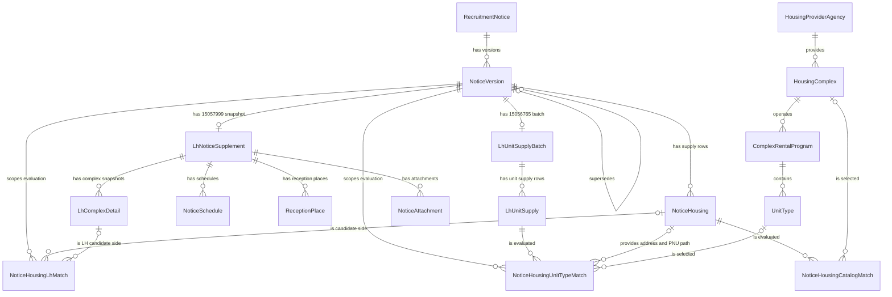

# 테이블 설계 사전

## 1. 문서 목적과 읽는 순서

이 문서는 프로젝트를 처음 보는 개발자가 코드를 먼저 전부 읽지 않아도 다음 질문에 답할 수 있도록 만든 온보딩 문서이자 상세 레퍼런스다.

- 데이터가 왜 17개 테이블로 나뉘는가
- 각 테이블에서 행 하나와 각 컬럼은 무엇을 뜻하는가
- 원천이 준 사실과 matcher가 계산한 판단은 어디에서 갈리는가
- 부모·자식, 식별자, 유니크 제약과 생명주기는 어떻게 이어지는가

**기준 시점은 2026-08-13**이다. Java 엔티티·값 객체, 적재 코드, 현재 H2 `INFORMATION_SCHEMA`를 교차 확인했다. 실제 H2 타입과 제약을 우선하며, JPA 애너테이션에 적힌 길이만 보고 DB 타입을 추측하지 않는다.

권장 읽기 순서는 다음과 같다.

1. 이 문서의 [데이터 네 층](#2-데이터의-네-층)에서 원천 사실과 파생 판단의 경계를 잡는다.
2. [전체 ER 구조](#3-전체-er-구조)와 [17개 테이블 관계 요약](#4-17개-테이블-관계-요약)에서 큰 흐름을 본다.
3. 필요한 테이블의 상세 절에서 행의 알갱이, 제약, 전체 컬럼을 확인한다.
4. HTTP 요청·응답과 원천 필드 계약은 [원천 API 명세](원천-API-명세.md)에서 이어서 본다.
5. 모델이 이 형태가 된 조사 과정과 실측 근거는 [도메인 설계](도메인-설계.md), 문서 전체의 승인 범위는 [테이블 설계 사전·원천 API 명세 문서 설계](superpowers/specs/2026-08-13-table-and-source-api-reference-design.md)에서 확인한다.

## 2. 데이터의 네 층

### 2.1 최신 주택 카탈로그

`HousingProviderAgency → HousingComplex → ComplexRentalProgram → UnitType`은 마이홈 15110581이 현재 알려 주는 단지·공급유형·주택형을 보관한다. 같은 원천 식별자를 다시 수집하면 새 이력 행을 쌓는 대신 변경 가능한 상세값을 갱신한다. 따라서 이 층은 공고 당시의 상태를 복원하는 이력 모델이 아니라 **최신 상태 카탈로그**다.

### 2.2 불변 공고·버전 이력

`RecruitmentNotice`는 원공고와 정정·취소 버전의 체인을 묶고, `NoticeVersion`과 `NoticeHousing`은 마이홈 15108420이 그 버전에서 말한 내용을 보존한다. 내용이 바뀌면 기존 버전을 수정하지 않고 다음 `NoticeVersion`을 추가한다.

### 2.3 LH 보충 원천 스냅샷

`LhNoticeSupplement`와 네 자식은 LH 15057999 응답을, `LhUnitSupplyBatch`와 `LhUnitSupply`는 LH 15056765 응답을 공고버전에 붙여 보존한다. 두 API는 요청 키가 같더라도 별도 호출이며 실패·재시도 생명주기도 다르므로 별도 aggregate다. 이 층의 단지 상세와 공급 수는 현재 카탈로그가 아니라 **그 공고버전에 대해 LH가 응답한 원천 스냅샷**이다.

### 2.4 재계산 가능한 파생 매칭

`NoticeHousingCatalogMatch`, `NoticeHousingLhMatch`, `NoticeHousingUnitTypeMatch`는 서로 다른 원천의 행을 연결하기 위해 matcher가 계산한 결과다. 후보 수, 상태, 근거, 판정 시각, `matcherVersion`을 남기며 규칙이 바뀌면 원천 행을 수정하지 않고 다시 계산할 수 있다.

카탈로그·공고·LH 보충 테이블은 원천에서 받은 값과 그 값을 보존하기 위한 직접 변환을 담는다. 예를 들어 `pnu` 앞 10자리로 `legal_dong_code`를 만들거나 난방 원문을 `HeatingType`으로 정규화하는 일은 원천 사실에서 결정적으로 파생되는 변환이다. 반면 주소·PNU·면적 후보 중 어느 행을 연결할지 선택하는 일은 matcher의 판단이다. **원천 aggregate의 nullable FK를 나중에 채워 매칭을 사실처럼 만들지 않고, 세 파생 테이블에 판단을 격리한다.**

## 3. 전체 ER 구조

다이어그램은 Java 엔티티 이름을 사용한다. 선은 현재 H2에 존재하는 FK를 모두 반영한다. `o|`로 표시된 연결 대상은 해당 FK가 `NULL`일 수 있다는 뜻이다.

`NoticeVersion.supersedesVersion`은 이전 버전을 가리키는 nullable self FK다. DB 유니크 제약은 없으므로 스키마만 보면 한 이전 버전을 여러 다음 버전이 가리킬 수 있다. 나머지 관계도 JPA 객체 그래프의 cascade 설정이 아니라 실제 DB FK를 기준으로 읽어야 한다. 현재 22개 FK는 모두 `ON UPDATE NO ACTION`, `ON DELETE NO ACTION`이다. JPA `CascadeType.ALL`이나 `orphanRemoval`은 영속성 컨텍스트가 수행하는 동작이지 DB의 `ON DELETE CASCADE`가 아니다.

## 4. 17개 테이블 관계 요약

| DB table name | Java entity | layer | row grain | parent (FK target) |
| --- | --- | --- | --- | --- |
| `housing_provider_agency` | `HousingProviderAgency` | 최신 주택 카탈로그 | 마이홈 공급기관명으로 식별한 공급기관 하나 | 없음 |
| `housing_complex` | `HousingComplex` | 최신 주택 카탈로그 | 원천 시스템 × 원천 단지 ID(`hsmpSn`) 하나 | `housing_provider_agency` |
| `complex_rental_program` | `ComplexRentalProgram` | 최신 주택 카탈로그 | 단지 × 원천 공급유형명 하나 | `housing_complex` |
| `unit_type` | `UnitType` | 최신 주택 카탈로그 | 프로그램 × 주택형명 × 전용면적 × 주거공용면적 하나 | `complex_rental_program` |
| `recruitment_notice` | `RecruitmentNotice` | 불변 공고·버전 이력 | 원공고와 모든 정정·취소 버전을 묶는 체인 하나 | 없음 |
| `notice_version` | `NoticeVersion` | 불변 공고·버전 이력 | 마이홈 `pblancId` 하나의 공고 스냅샷 | `recruitment_notice`, 이전 `notice_version`(선택) |
| `notice_housing` | `NoticeHousing` | 불변 공고·버전 이력 | 공고버전 × `houseSn`, 즉 15108420 공급행 하나 | `notice_version` |
| `lh_notice_supplement` | `LhNoticeSupplement` | LH 보충 원천 스냅샷 | 공고버전에 대한 15057999 응답 묶음 하나 | `notice_version` |
| `notice_schedule` | `NoticeSchedule` | LH 보충 원천 스냅샷 | 15057999 `dsSplScdl` 일정 행 하나 | `lh_notice_supplement` |
| `reception_place` | `ReceptionPlace` | LH 보충 원천 스냅샷 | 15057999 `dsCtrtPlc` 접수처 행 하나 | `lh_notice_supplement` |
| `lh_complex_detail` | `LhComplexDetail` | LH 보충 원천 스냅샷 | 15057999 `dsSbd`의 공고 시점 단지 상세 행 하나 | `lh_notice_supplement` |
| `notice_attachment` | `NoticeAttachment` | LH 보충 원천 스냅샷 | 15057999 공고문·단지 첨부파일 행 하나 | `lh_notice_supplement` |
| `lh_unit_supply_batch` | `LhUnitSupplyBatch` | LH 보충 원천 스냅샷 | 공고버전에 대한 15056765 응답 묶음 하나 | `notice_version` |
| `lh_unit_supply` | `LhUnitSupply` | LH 보충 원천 스냅샷 | 15056765 단지 × 주택형 공급행 하나 | `lh_unit_supply_batch` |
| `notice_housing_catalog_match` | `NoticeHousingCatalogMatch` | 재계산 가능한 파생 매칭 | 공고 공급행 × matcher 버전의 카탈로그 단지 판정 하나 | `notice_housing`, `housing_complex`(선택) |
| `notice_housing_lh_match` | `NoticeHousingLhMatch` | 재계산 가능한 파생 매칭 | 공고버전 × matcher 버전 × 판정 순번의 주소·세대수 판정 하나 | `notice_version`, `notice_housing`(선택), `lh_complex_detail`(선택) |
| `notice_housing_unit_type_match` | `NoticeHousingUnitTypeMatch` | 재계산 가능한 파생 매칭 | LH 공급행 × matcher 버전의 카탈로그 주택형 판정 하나 | `notice_version`, `lh_unit_supply`, `notice_housing`(선택), `unit_type`(선택) |

## 5. 최신 주택 카탈로그 테이블

카탈로그 네 테이블은 마이홈 15110581 `rentalHouseGwList`를 적재한다. 원천 한 행의 알갱이는 **단지 × 공급유형 × 주택형**이다. 반복되는 공급기관, 단지 속성, 공급유형별 세대수, 주택형별 면적·기본 임대조건을 각자의 실제 알갱이에 한 번씩만 두기 위해 네 단계로 나눈다.

### 5.1 `housing_provider_agency`

#### 행 하나의 의미

마이홈 `insttNm`으로 식별한 공급기관 하나다. 현재 원천은 안정적인 기관 코드를 주지 않으므로 정규화한 기관명을 `code`와 `name`에 같은 값으로 저장한다.

#### 왜 이 테이블이 존재하는가

LH·SH와 지역 공사 이름이 여러 단지 행에서 반복된다. 공급기관을 단지 문자열 컬럼으로 복제하지 않고 참조 엔티티로 분리하면 반복을 제거하고, 나중에 공식 코드 체계가 확인됐을 때 공급기관 식별 방식만 교체할 수 있다. 실데이터의 LH도 `LH서울`, `LH경기남부`, `LH경기북부`처럼 지역본부 단위 이름으로 들어오므로 지금의 `code`를 공식 기관 코드로 해석하면 안 된다.

#### 부모·자식

- 부모: 없음
- 자식: `housing_complex` 0개 이상

#### 생성·갱신 생명주기

단지 적재 중 `insttNm`을 trim한 값으로 `code`를 조회한다. 없으면 `code=name=insttNm`으로 한 번 생성한다. 현재 코드에는 기존 기관의 `code`나 `name`을 갱신하는 경로가 없다.

#### 키와 제약

| kind | columns | why |
| --- | --- | --- |
| PK | `id` | 원천이 기관 ID를 주지 않으므로 내부 surrogate key를 사용한다. |
| UNIQUE | `code` | 같은 원천 기관명이 중복 기관 행을 만들지 않게 한다. 현재는 이름 기반 임시 식별자다. |
| FK | 없음 | 최상위 참조 엔티티다. |

#### 전체 컬럼

| DB column | Java property | actual H2 type | NULL | meaning | source |
| --- | --- | --- | --- | --- | --- |
| `id` | `HousingProviderAgency.id` | `bigint` | 불가 | 내부 기관 PK | DB `IDENTITY` 생성 |
| `code` | `HousingProviderAgency.code` | `varchar(20)` | 불가 | 기관 조회용 식별값; 현재는 기관명과 동일 | 15110581 `insttNm` trim 값 |
| `name` | `HousingProviderAgency.name` | `varchar(255)` | 불가 | 화면과 도메인에서 사용하는 공급기관명 | 15110581 `insttNm` trim 값 |

#### 설계상 주의점

- `code`라는 이름만 보고 공공기관의 공식 코드를 기대하면 안 된다. 원천이 안정적인 코드를 제공하지 않아 현재는 이름을 재사용한다.
- 기관명이 바뀌거나 표기가 갈리면 별도 기관으로 생성된다. 현재 모델은 기관명 정규화·병합 판단을 하지 않는다.
- `housing_complex` FK의 DB 삭제 동작은 `NO ACTION`이다. 기관을 지우면 자식 단지가 DB에서 자동 삭제되지 않는다.

### 5.2 `housing_complex`

#### 행 하나의 의미

마이홈 원천 시스템과 `hsmpSn` 조합으로 식별되는 현재 단지 하나다. 이름이 아니라 `source_system + source_complex_id`가 원천 정체성이다.

#### 왜 이 테이블이 존재하는가

같은 `hsmpSn`이 공급유형과 주택형만 달리해 여러 원천 행에 반복된다. 단지명·주소·공급기관·준공·난방 같은 단지 속성을 한 행에 모은다. `hsmpNm`은 건설임대에서는 단지명이지만 매입임대에서는 지역명일 수 있어 식별자로 안전하지 않다. 주소도 단지 없이 독립적인 생명주기가 없으므로 `Address` 값 객체로 묶어 이 테이블에 펼친다.

#### 부모·자식

- 부모: `housing_provider_agency` 정확히 1개
- 자식: `complex_rental_program` 0개 이상, 파생 `notice_housing_catalog_match` 0개 이상

#### 생성·갱신 생명주기

`source_system=MYHOME_PORTAL`, `source_complex_id=hsmpSn`으로 기존 행을 찾는다. 처음 만들 때 이름·`Address`·공급기관을 정하고, 재조회에서는 이 정체성 필드를 바꾸지 않는다. 재조회 시 `CatalogDetails`의 준공·난방·주차·복도·승강기·주택유형만 통째로 비교해 값이 달라졌을 때 갱신한다. `CatalogDetails`는 JPA 내장 객체가 아니라 갱신 경계를 표현하는 plain record다.

#### 키와 제약

| kind | columns | why |
| --- | --- | --- |
| PK | `id` | 관계에서 사용할 내부 단지 PK다. |
| FK | `housing_provider_agency_id → housing_provider_agency.id` | 반복되는 공급기관을 참조한다. DB 동작은 `ON UPDATE NO ACTION`, `ON DELETE NO ACTION`이다. |
| UNIQUE | `source_system, source_complex_id` | 서로 다른 원천 ID 공간을 구분하면서 동일 원천의 같은 `hsmpSn`이 중복 단지가 되지 않게 한다. |

#### 전체 컬럼

| DB column | Java property | actual H2 type | NULL | meaning | source |
| --- | --- | --- | --- | --- | --- |
| `id` | `HousingComplex.id` | `bigint` | 불가 | 내부 단지 PK | DB `IDENTITY` 생성 |
| `district_code` | `HousingComplex.address.districtCode` | `varchar(10)` | 허용 | 시군구 코드 | 15110581 `signguCode` trim 값 |
| `district_name` | `HousingComplex.address.districtName` | `varchar(30)` | 허용 | 시군구명 | 15110581 `signguNm` trim 값 |
| `legal_dong_code` | `HousingComplex.address.legalDongCode` | `varchar(10)` | 허용 | 법정동코드 10자리 | 유효한 19자리 `pnu`의 앞 10자리에서 파생 |
| `pnu` | `HousingComplex.address.pnu` | `varchar(19)` | 허용 | 필지고유번호; 공고 원천과 카탈로그를 잇는 안전한 키 | 15110581 `pnu`; 19자리 숫자가 아니면 `NULL` |
| `province_code` | `HousingComplex.address.provinceCode` | `varchar(10)` | 허용 | 광역시도 코드 | 15110581 `brtcCode` trim 값 |
| `province_name` | `HousingComplex.address.provinceName` | `varchar(30)` | 허용 | 광역시도명 | 15110581 `brtcNm` trim 값 |
| `road_address` | `HousingComplex.address.roadAddress` | `varchar(255)` | 불가 | 단지 도로명주소 | 15110581 `rnAdres` trim 값 |
| `completion_date` | `HousingComplex.completionDate` | `date` | 허용 | 준공일 | 15110581 `competDe`(`yyyyMMdd`) 파싱 값 |
| `completion_year` | `HousingComplex.completionYear` | `integer` | 허용 | 준공연도 | `completion_date`의 연도에서 파생 |
| `corridor_type` | `HousingComplex.corridorType` | `varchar(20)` | 허용 | 계단식·복도식·혼합식 등 건물 형태 원문 | 15110581 `buldStleNm` trim 값 |
| `elevator_installation` | `HousingComplex.elevatorInstallation` | `varchar(20)` | 허용 | 승강기 설치 여부 원문 | 15110581 `elvtrInstlAtNm` trim 값 |
| `heating_type` | `HousingComplex.heatingType` | `H2 ENUM` | 허용 | 난방 분류 `INDIVIDUAL`, `CENTRAL`, `DISTRICT` | 15110581 `heatMthdDetailNm`을 `HeatingType.from`으로 분류 |
| `heating_type_name` | `HousingComplex.heatingTypeName` | `varchar(30)` | 허용 | 열원 정보까지 보존한 난방 원문 | 15110581 `heatMthdDetailNm` trim 값 |
| `house_type` | `HousingComplex.houseType` | `H2 ENUM` | 허용 | 아파트·연립·다세대 등 표준 주택유형 | 15110581 `houseTyNm`을 `HouseType.from`으로 분류 |
| `house_type_name` | `HousingComplex.houseTypeName` | `varchar(30)` | 허용 | 매핑되지 않은 값도 남기는 주택유형 원문 | 15110581 `houseTyNm` trim 값 |
| `name` | `HousingComplex.name` | `varchar(255)` | 불가 | 단지 표시명 | 15110581 `hsmpNm`; 비면 지역명(`brtcNm + signguNm`), 그것도 없으면 `rnAdres` |
| `parking_spaces` | `HousingComplex.parkingSpaces` | `integer` | 허용 | 주차 가능 대수 | 15110581 `parkngCo` |
| `source_complex_id` | `HousingComplex.sourceComplexId` | `varchar(255)` | 불가 | 원천 단지 식별자 | 15110581 `hsmpSn`의 문자열 표현 |
| `source_system` | `HousingComplex.sourceSystem` | `H2 ENUM` | 불가 | 단지 식별자 네임스페이스; 현재 `MYHOME_PORTAL` | 적재 서비스가 지정 |
| `housing_provider_agency_id` | `HousingComplex.housingProviderAgency.id` | `bigint` | 불가 | 공급기관 FK | 15110581 `insttNm`으로 기관을 조회하거나 생성한 결과 |

#### 설계상 주의점

- H2의 `heating_type`, `house_type`, `source_system`은 실제로 native `ENUM`이다. `@Column(length=...)`을 근거로 `varchar(20)`이나 `varchar(30)`이라고 문서화하면 실제 스키마와 달라진다.
- 단지명은 표시값이지 식별자가 아니다. 원천 정체성은 `hsmpSn`이고 DB 유니크 키는 원천 시스템까지 포함한다.
- `Address`는 별도 테이블이 아니라 실제 `@Embeddable`이며 일곱 컬럼이 `housing_complex`에 평탄화된다.
- 이 테이블은 최신값만 유지한다. 공고 시점 단지 상태는 `lh_complex_detail` 등 공고·LH 스냅샷에서 찾아야 한다.
- 재수집 때 이름·주소·공급기관은 갱신하지 않는다. 원천의 정체성 필드가 바뀐 상황을 이 갱신 경로가 자동 반영한다고 가정하면 안 된다.

### 5.3 `complex_rental_program`

#### 행 하나의 의미

한 단지가 한 원천 공급유형명으로 운영하는 임대 프로그램 하나다. 원천의 `hshldCo`는 단지 전체가 아니라 **단지 × 공급유형**의 세대수다.

#### 왜 이 테이블이 존재하는가

같은 단지에 국민임대와 행복주택 같은 여러 공급유형이 함께 있을 수 있고, 세대수와 기본 임대조건도 공급유형에 따라 갈린다. 세대수를 단지에 두면 서로 다른 공급유형 값이 충돌하고, 모든 주택형에 반복하면 같은 값을 복제하게 된다. 그래서 단지와 주택형 사이에 프로그램 계층을 둔다.

#### 부모·자식

- 부모: `housing_complex` 정확히 1개
- 자식: `unit_type` 0개 이상

#### 생성·갱신 생명주기

수집한 단지 행들을 trim한 `suplyTyNm`으로 묶고 `housing_complex + supply_type_name`으로 upsert한다. 새 프로그램은 원문 공급유형명, `SupplyType` 분류, `hshldCo`를 함께 저장한다. 기존 프로그램은 `unit_count`가 달라질 때만 갱신한다. 같은 프로그램 안의 비어 있지 않은 `hshldCo`가 둘 이상이면 그 프로그램 묶음을 모순된 원천으로 보고 적재에서 제외한다.

#### 키와 제약

| kind | columns | why |
| --- | --- | --- |
| PK | `id` | 주택형이 참조할 내부 프로그램 PK다. |
| FK | `housing_complex_id → housing_complex.id` | 프로그램이 어느 단지에 속하는지 고정한다. DB 동작은 `ON UPDATE NO ACTION`, `ON DELETE NO ACTION`이다. |
| UNIQUE | `housing_complex_id, supply_type_name` | 같은 단지에서 같은 원천 공급유형 프로그램이 중복 생성되지 않게 한다. enum이 아니라 원문 이름을 보존한 키다. |

#### 전체 컬럼

| DB column | Java property | actual H2 type | NULL | meaning | source |
| --- | --- | --- | --- | --- | --- |
| `id` | `ComplexRentalProgram.id` | `bigint` | 불가 | 내부 프로그램 PK | DB `IDENTITY` 생성 |
| `supply_type` | `ComplexRentalProgram.supplyType` | `H2 ENUM` | 불가 | 표준 공급유형 분류 | 15110581 `suplyTyNm`을 `SupplyType.from`으로 변환 |
| `supply_type_name` | `ComplexRentalProgram.supplyTypeName` | `varchar(30)` | 불가 | 원천 공급유형명 | 15110581 `suplyTyNm` trim 값 |
| `unit_count` | `ComplexRentalProgram.unitCount` | `integer` | 허용 | 이 단지·공급유형의 전체 세대수 | 15110581 `hshldCo` |
| `housing_complex_id` | `ComplexRentalProgram.housingComplex.id` | `bigint` | 불가 | 소속 단지 FK | 같은 `hsmpSn`으로 upsert한 `housing_complex.id` |

#### 설계상 주의점

- H2의 `supply_type`은 native `ENUM`이다. JPA의 `@Enumerated(EnumType.STRING)`과 `length=30`만 보고 `varchar(30)`으로 읽으면 안 된다.
- 유니크 키는 표준 enum이 아니라 원천 `supply_type_name`을 쓴다. enum과 원문을 함께 보관하므로 원천 표현과 도메인 분류를 모두 추적할 수 있다.
- JPA에서 부모가 자식을 저장하는 방식과 무관하게 DB FK의 삭제 동작은 `NO ACTION`이다. 단지를 삭제한다고 프로그램이 DB cascade로 지워지지 않는다.

### 5.4 `unit_type`

#### 행 하나의 의미

한 임대 프로그램 안에서 주택형명·전용면적·주거공용면적이 같은 카탈로그 주택형 하나다. 15110581의 유효한 원천 행 하나가 이 알갱이에 대응한다.

#### 왜 이 테이블이 존재하는가

주택형명만으로는 같은 이름 아래 다른 면적을 구분할 수 없고, 같은 평면도 공급유형에 따라 기본 임대조건이 달라진다. 실측에서 `(단지, 공급유형, 주택형명, 전용면적, 공용면적)`을 모두 사용했을 때만 조사한 7,317개 원천 행이 충돌 없이 식별됐다. 공급유형은 부모 `ComplexRentalProgram`이 표현하므로 이 테이블의 자연키는 **프로그램 × 주택형명 × 전용면적 × 주거공용면적**이다.

#### 부모·자식

- 부모: `complex_rental_program` 정확히 1개
- 자식: 파생 `notice_housing_unit_type_match` 0개 이상

#### 생성·갱신 생명주기

프로그램 안에서 `type_name + exclusive_area + residential_common_area`로 기존 행을 조회해 upsert한다. 새 행은 이름과 면적을 고정하고, 재수집에서는 `BaseRentTerms`의 보증금·월임대료·전환보증금 한도만 통째로 비교해 달라졌을 때 갱신한다. 빈 `styleNm` 행은 저장하지 않는다.

#### 키와 제약

| kind | columns | why |
| --- | --- | --- |
| PK | `id` | 매칭 결과가 참조할 내부 주택형 PK다. |
| FK | `complex_rental_program_id → complex_rental_program.id` | 단지와 공급유형 문맥을 부모 프로그램으로 고정한다. DB 동작은 `ON UPDATE NO ACTION`, `ON DELETE NO ACTION`이다. |
| UNIQUE | `complex_rental_program_id, type_name, exclusive_area, residential_common_area` | 이름만 같은 다른 면적과 같은 단지의 다른 공급유형을 구분한다. |

#### 전체 컬럼

| DB column | Java property | actual H2 type | NULL | meaning | source |
| --- | --- | --- | --- | --- | --- |
| `id` | `UnitType.id` | `bigint` | 불가 | 내부 주택형 PK | DB `IDENTITY` 생성 |
| `base_convertible_deposit_limit` | `UnitType.baseRentTerms.convertibleDepositLimit` | `bigint` | 허용 | 월세를 보증금으로 전환할 수 있는 기본 한도(원) | 15110581 `bassCnvrsGtnLmt` |
| `base_deposit` | `UnitType.baseRentTerms.deposit` | `bigint` | 허용 | 카탈로그 기본 임대보증금(원) | 15110581 `bassRentGtn` |
| `base_monthly_rent` | `UnitType.baseRentTerms.monthlyRent` | `bigint` | 허용 | 카탈로그 기본 월임대료(원) | 15110581 `bassMtRntchrg` |
| `exclusive_area` | `UnitType.exclusiveArea` | `numeric(10,4)` | 허용 | 전용면적(㎡) | 15110581 `suplyPrvuseAr` |
| `residential_common_area` | `UnitType.residentialCommonArea` | `numeric(10,4)` | 허용 | 주거공용면적(㎡) | 15110581 `suplyCmnuseAr` |
| `type_name` | `UnitType.typeName` | `varchar(50)` | 불가 | 주택형명; 예: `36`, `51A` | 15110581 `styleNm` trim 값 |
| `complex_rental_program_id` | `UnitType.complexRentalProgram.id` | `bigint` | 불가 | 소속 단지·공급유형 프로그램 FK | `hsmpSn + suplyTyNm`으로 upsert한 프로그램 |

#### 설계상 주의점

- `exclusive_area`와 `residential_common_area`는 nullable이다. SQL UNIQUE에서는 `NULL`끼리 같은 값으로 취급되지 않으므로 DB 유니크 제약만으로 nullable 자연키 중복을 모두 막을 수 없다. 적재 서비스가 저장 전에 같은 자연키를 한 번 더 중복 제거한다.
- 면적은 합산·비교 오차를 피하려고 `double`이 아니라 `numeric(10,4)`/`BigDecimal`을 쓴다.
- `BaseRentTerms`는 카탈로그 기준값이다. 특정 모집공고에서 제시한 실제 임대조건인 `NoticeHousing.rentTerms`와 섞으면 안 된다.
- 이름·면적은 기존 행 갱신 대상이 아니다. 이 조합이 달라지면 다른 자연키의 주택형으로 취급한다.

## 6. 카탈로그 값 객체와 컬럼 평탄화

값을 Java에서 한 덩어리로 다룬다고 해서 모두 JPA `@Embeddable`인 것은 아니다. `Address`와 `BaseRentTerms`는 실제 내장 값 타입이고, `CatalogDetails`는 갱신 비교를 위한 plain Java record다.

### 6.1 `Address` — 실제 JPA `@Embeddable`

`HousingComplex.address`의 `@Embedded` 값이다. 별도 PK나 테이블 없이 다음 컬럼으로 `housing_complex`에 펼쳐진다.

| logical property | owner column | actual H2 type | source / derivation |
| --- | --- | --- | --- |
| `Address.roadAddress` | `housing_complex.road_address` | `varchar(255)` | 15110581 `rnAdres` |
| `Address.legalDongCode` | `housing_complex.legal_dong_code` | `varchar(10)` | 유효한 `pnu` 앞 10자리 |
| `Address.pnu` | `housing_complex.pnu` | `varchar(19)` | 15110581 `pnu` |
| `Address.provinceCode` | `housing_complex.province_code` | `varchar(10)` | 15110581 `brtcCode` |
| `Address.provinceName` | `housing_complex.province_name` | `varchar(30)` | 15110581 `brtcNm` |
| `Address.districtCode` | `housing_complex.district_code` | `varchar(10)` | 15110581 `signguCode` |
| `Address.districtName` | `housing_complex.district_name` | `varchar(30)` | 15110581 `signguNm` |

생성자는 도로명주소를 필수로 검증하고, PNU가 정확한 19자리 숫자일 때만 보존한다. 주소는 단지의 일부이므로 독립 생명주기나 독립 식별자가 없다.

### 6.2 `BaseRentTerms` — 실제 JPA `@Embeddable`

`UnitType.baseRentTerms`의 `@Embedded` 값이다. 다음 세 컬럼으로 `unit_type`에 펼쳐진다.

| logical property | owner column | actual H2 type | source |
| --- | --- | --- | --- |
| `BaseRentTerms.deposit` | `unit_type.base_deposit` | `bigint` | 15110581 `bassRentGtn` |
| `BaseRentTerms.monthlyRent` | `unit_type.base_monthly_rent` | `bigint` | 15110581 `bassMtRntchrg` |
| `BaseRentTerms.convertibleDepositLimit` | `unit_type.base_convertible_deposit_limit` | `bigint` | 15110581 `bassCnvrsGtnLmt` |

세 값은 함께 비교해 변경이 있을 때만 갱신한다. 세 컬럼이 모두 nullable이므로 값 객체 자체가 없거나 원천의 일부 금액이 비어 있는 상태를 표현할 수 있다.

### 6.3 `CatalogDetails` — JPA 내장 타입이 아닌 논리 record

`CatalogDetails`에는 `@Embeddable`이 없다. `HousingComplex`가 현재 변경 가능한 카탈로그 상세를 record로 조립해 비교하고, `updateCatalogDetails`가 각 엔티티 필드에 값을 복사한다. 따라서 DB에는 `catalog_details` 테이블이나 내장 객체 경계가 존재하지 않는다.

| record component | copied owner column | actual H2 type | source / derivation |
| --- | --- | --- | --- |
| `completionDate` | `housing_complex.completion_date` | `date` | 15110581 `competDe` 파싱 값 |
| `completionDate` | `housing_complex.completion_year` | `integer` | 복사 시 `completionDate.getYear()`로 추가 파생 |
| `heatingType` | `housing_complex.heating_type` | `H2 ENUM` | `heatMthdDetailNm` 표준 분류 |
| `heatingTypeName` | `housing_complex.heating_type_name` | `varchar(30)` | 15110581 `heatMthdDetailNm` 원문 |
| `parkingSpaces` | `housing_complex.parking_spaces` | `integer` | 15110581 `parkngCo` |
| `corridorType` | `housing_complex.corridor_type` | `varchar(20)` | 15110581 `buldStleNm` |
| `elevatorInstallation` | `housing_complex.elevator_installation` | `varchar(20)` | 15110581 `elvtrInstlAtNm` |
| `houseType` | `housing_complex.house_type` | `H2 ENUM` | `houseTyNm` 표준 분류 |
| `houseTypeName` | `housing_complex.house_type_name` | `varchar(30)` | 15110581 `houseTyNm` 원문 |

`name`, `address`, `housingProviderAgency`, `sourceSystem`, `sourceComplexId`가 이 record에 없는 것은 의도적이다. 이 값들은 최초 생성 때 단지 정체성을 정하고, 현재 재수집 갱신 경로가 덮어쓰지 않는다.
