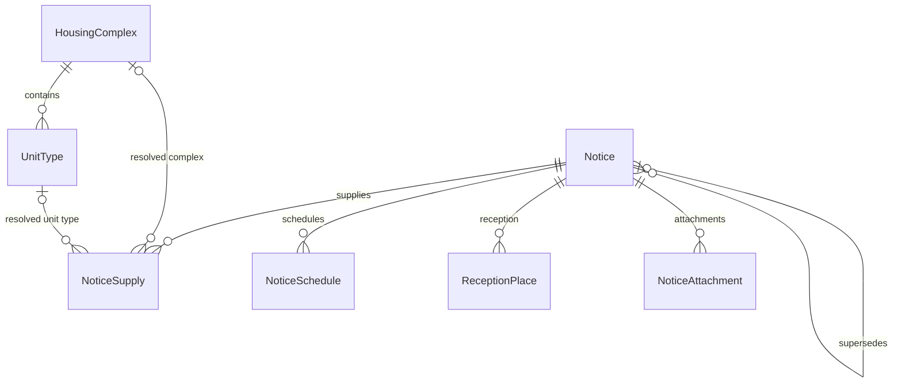

# 테이블 설계 사전 — 7개 테이블

프로젝트를 처음 보는 개발자가 테이블 7개의 역할과 연결 방식을 빠르게 찾기 위한 사전이다.
이전 18개 테이블 설계를 대체하며, 바뀐 이유는 넷이다.

1. `recruitment_notice`(공고 루트)를 없앤다
2. LH 전용 스냅샷 테이블을 없애고 **공급행 하나에 다 넣는다**
3. 원문 → 표준값 **enum 변환 컬럼을 전부 없앤다**
4. 15059475(LH 임대단지 카탈로그)를 별도 테이블에 두지 않고 **카탈로그 본체에 바로 반영한다**

수치는 전부 `data/domain-construction-rental-v4`(2026-08-16 21:52 KST 전체 재적재)를 직접 센 것이다.
모든 FK의 DB 갱신·삭제 규칙은 `NO ACTION`이며, JPA cascade는 이와 별개다.

---

## 0. 먼저: 15056765에서 돈이 나오나

**금회공급호수는 확실히 나온다.** `NOW_HSH_CNT`가 그것이고, 적재된 252행 전부에 값이 있다(합계 11,348호).
매칭 없이 원천이 그대로 준다.

**돈은 안 나온다 — 2026-08-16 전체 재적재로 확인했다.** 응답에 `LS_GMY`(임대보증금)·`RFE`(월임대료)가
있고 API 스스로 같은 응답의 `dsList01Nm`에 "임대보증금(원)", "월임대료(원)"이라고 쓴다. 그런데
**주택형 공급행 252행 전부가 문자열 `"공고문 참조"`였다. 숫자는 0건이다.**

```json
{"HTY_NNA":"59㎡","DDO_AR":"59.94","HSH_CNT":"235","NOW_HSH_CNT":"20",
 "RFE":"공고문 참조","LS_GMY":"공고문 참조"}
```

그래서 이 두 값을 **문자열 그대로** 받는다(`notice_supply.lh_deposit_text`, `lh_monthly_rent_text`).
숫자 컬럼으로 승격하지 않는다 — 승격할 값이 없다는 게 실측 결과다. 문자열 칸을 남겨 두는 건 LH가
나중에 숫자를 주기 시작하면 그때 드러나게 하려는 것이다.

돈이 확실히 나오는 곳은 따로다.

| 원천 | 돈 | 채워진 비율 | 알갱이 |
| --- | --- | --- | --- |
| 마이홈 15108420 | 보증금·계약금·잔금·월임대료 | **107 / 107** | 공고 × **단지** (주택형별 아님) |
| LH 15059475 | `LS_GMY`·`RFE` | **6,710 / 6,710** 전부 숫자 | 현재 카탈로그 (**공고 시점 아님**) |
| LH 15056765 | `LS_GMY`·`RFE` | **0 / 252** (전부 `"공고문 참조"`) | 공고 × 단지 × **주택형** ← 알갱이는 여기만 맞음 |

즉 **"이번 공고의, 주택형별, 실제 임대료"를 주는 원천은 없다.** 알갱이가 맞는 유일한 원천이 값을
안 준다. `notice_supply.deposit`은 단지 단위 값을 주택형 행마다 복사한 것이라 주택형별로 구분되지 않는다.

---

## 1. 전체 구조



| DB 테이블 | Java 엔티티 | 행 하나 | 부모 |
| --- | --- | --- | --- |
| `housing_complex` | `HousingComplex` | 원천 단지 ID × 공급유형 | 없음 |
| `unit_type` | `UnitType` | 단지 × 주택형명 × 두 면적 | `housing_complex` |
| `notice` | `Notice` | 마이홈 `pblancId` 스냅샷 | 이전 버전(self, 선택) |
| `notice_supply` | `NoticeSupply` | 공고 × 단지 × 주택형, 또는 공고 × 단지 | `notice` |
| `notice_schedule` | `NoticeSchedule` | `dsSplScdl` 일정 행 | `notice` |
| `reception_place` | `ReceptionPlace` | `dsCtrtPlc` 접수처 행 | `notice` |
| `notice_attachment` | `NoticeAttachment` | 공고문·단지 파일 행 | `notice` |

**18개에서 7개로 줄어 순감소한 테이블은 11개다.** 이전 구조의 `recruitment_notice`,
`notice_version`(→`notice`), `notice_housing`,
`lh_notice_supplement`, `lh_complex_detail`, `lh_unit_supply_batch`, `lh_unit_supply`,
`lh_lease_info_batch`, `lh_lease_info`, 그리고 match 테이블 4개.

**match 테이블이 없어진다는 건 "매칭을 안 한다"가 아니라 "매칭 결과를 FK 두 칸에만 남긴다"는 뜻이다.**
주소·PNU·면적 대조는 그대로 적재 시점에 돌고, 확정된 것만
`notice_supply.housing_complex_id` / `unit_type_id`에 쓰인다. 후보 수·matcher 버전·판정 시각은
저장하지 않고, 왜 못 붙었는지만 `unmatched_reason` 한 칸에 남는다.

---

## 2. 적재 순서

공급행이 카탈로그를 가리키려면 단지가 먼저 있어야 하고, 주택형까지 쪼개려면 LH 원천이 먼저 와야 한다.

```
1. POST /admin/ingest/complexes    15110581 → housing_complex + unit_type
2. POST /admin/ingest/lease-infos  15059475 → unit_type 총세대수·기준 임대조건 보강
3. POST /admin/ingest/notices      15108420 → notice + 단지 단위 notice_supply
4. POST /admin/ingest/lh-notices   15057999 + 15056765 → 일정·접수처·첨부 + 공급행을 주택형 단위로 재구성
5. POST /admin/ingest/links                 → notice_supply 에 카탈로그 FK 채우기
```

5번이 따로 있는 이유는 공고와 카탈로그가 서로 다른 시점에 들어오기 때문이다. 공고를 먼저 받으면 붙일
단지가 아직 없고, 카탈로그를 다시 받으면 이미 붙인 결과가 낡는다. **원천 재호출 없이 다시 돌려도 된다** —
그러려고 공급행에 `supplied_pnu`를 남겨 뒀다.

---

## 3. `notice` — 공고

**행 하나**는 마이홈 `pblancId` 하나가 표현한 불변 공고 스냅샷이다. 정정·취소는 새 행이 된다.

**루트 테이블 없이 체인을 잇는다.** 마이홈은 정정공고에 <em>새 pblancId</em>를 발급하고
`beforePblancId`로 이전 공고를 가리킨다. 즉 pblancId는 "공고"가 아니라 "공고의 한 버전"이다.
예전에는 체인을 묶으려고 `recruitment_notice` 루트 행을 뒀는데, 실측 49개 공고 중 40개가 버전 1개·
9개가 2개라 테이블 하나를 유지할 깊이가 아니었다. 컬럼 둘이 그 자리를 대신한다.

- `supersedes_notice_id` — 직전 버전 self FK. 한 칸 위로 올라간다.
- `root_source_notice_id` — 체인 뿌리의 pblancId. 원공고는 자기 자신이다. "이 공고의 모든 버전"이 인덱스 한 방이다.

정정공고가 원공고보다 먼저 들어오면 스스로를 뿌리로 두고 시작하고, 나중에 원공고가 들어오면
`Notice.rebaseOnto`가 뿌리·순번·FK를 옮긴다(뒷 버전까지 따라 내려간다). 루트 테이블을 뒀어도 두 루트를
병합해야 했을 문제라 없앤다고 새로 생긴 비용이 아니다.

**키:** PK `id` · UNIQUE `source_notice_id` · self FK `supersedes_notice_id`(선택)

| 컬럼 | 의미 | 출처 |
| --- | --- | --- |
| `id` | PK | DB |
| `source_notice_id` | 이 버전의 원천 ID | 15108420 `pblancId` |
| `before_source_notice_id` | 직전 공고 ID **원문** | `beforePblancId` |
| `supersedes_notice_id` | 직전 버전 self FK | `beforePblancId`로 찾은 행 |
| `root_source_notice_id` | 체인 뿌리 `pblancId` | 직전 버전의 값, 없으면 자기 자신 |
| `version_number` | 체인 안 순번 | 직전 버전 + 1 |
| `notice_change_status_name` | 원공고·정정·취소 **원문** | `sttusNm` — **enum 제거** |
| `title` | 공고명 | `pblancNm` |
| `published_at` | 게시 시각 | `rcritPblancDe` 자정 |
| `application_begin_on` / `application_end_on` | 접수 시작·종료일 | `beginDe` / `endDe` |
| `winner_announced_on` | 당첨자 발표일 | `przwnerPresnatnDe` |
| `contact` | 문의처 | `refrnc` |
| `detail_url` | 공고 원문 URL | `url` (LH건은 `panId` 포함) |
| `house_type_name` | 주택유형 **원문** | `houseTyNm` — **enum 제거** |
| `supply_type_name` | 공급유형 **원문** | `suplyTyNm` — **enum 제거** |
| `supply_institution_name` | 공급기관명 | `suplyInsttNm` |
| `source_pan_id` | LH 공고 ID | `detail_url`의 `panId` |
| `lh_supply_info_type_code` | LH 호출에 쓴 `SPL_INF_TP_CD` | `supply_type_name`에서 변환 |
| `lh_fetched_at` | LH 두 원천 수집 시각 | 차 있으면 재호출하지 않는다 |
| `correction_reason` | 정정·취소 사유 | 15057999 `dsEtcInfo.CRC_RSN` |

`lh_notice_supplement`·`lh_unit_supply_batch`가 갖고 있던 나머지 요청 코드
(`CCR_CNNT_SYS_DS_CD`, `UPP_AIS_TP_CD`, `AIS_TP_CD`)와 `*_dataset_present` 플래그는 버렸다.
앞 셋은 `detail_url`에 그대로 들어 있고, 플래그는 "빈 배열"과 "데이터셋 누락"을 구분하려던
디버깅용인데 합친 뒤에는 둘 다 그냥 자식 0행이 된다.

`source_system` 컬럼도 없앴다. 공고도 단지도 원천이 마이홈 하나뿐이라 상수 컬럼이었다.

---

## 4. `notice_supply` — 공급행 (설계의 중심)

**행 하나 = 이 공고가 공급하는 한 덩어리.** LH가 주택형을 쪼개 주면 `공고 × 단지 × 주택형`이고,
안 주면(SH·GH 공고, 또는 주소가 안 맞아 못 붙인 단지) `공고 × 단지` 한 줄이다.
`type_name`이 있는지로 구분한다.

**키:** PK `id` · FK `notice_id` · UNIQUE `(notice_id, display_order)`
· nullable FK `housing_complex_id`, `unit_type_id`

| 컬럼 | 의미 | 출처 |
| --- | --- | --- |
| **식별** | | |
| `id` | PK | DB |
| `notice_id` | 소속 공고 FK | |
| `display_order` | 공고 안 순서 | 0부터 |
| `house_sn` | 마이홈 공급행 일련번호. **같은 단지 행을 묶는 키** | 15108420 `houseSn`; LH 쪽만 있는 행은 `NULL` |
| **카탈로그 연결** | | |
| `housing_complex_id` | 카탈로그 단지 FK | PNU·공급유형으로 확정된 것만 |
| `unit_type_id` | 카탈로그 주택형 FK | 전용면적 ±0.05㎡ → 완전일치 → 공급면적 순으로 유일한 후보만 |
| `unmatched_reason` | `unit_type_id`가 빈 이유 | 확정된 행은 `NULL` |
| **주택형 (LH 15056765)** | | |
| `type_name` | LH 주택형명 **원문** | `HTY_NNA` — "26A(청년)"처럼 공급대상까지 붙기도 |
| `exclusive_area` | 전용면적(㎡) | `DDO_AR` |
| `supply_area` | 공급면적(㎡) | `SPL_AR` |
| `unit_supply_count` | **금회 공급호수** | `NOW_HSH_CNT` |
| `unit_total_count` | 이 주택형의 단지 전체 세대수 | `HSH_CNT` |
| `lh_deposit_text` | LH 임대보증금 **원문** | `LS_GMY` — 숫자로 파싱하지 않는다 |
| `lh_monthly_rent_text` | LH 월임대료 **원문** | `RFE` — 숫자로 파싱하지 않는다 |
| **단지·돈 (마이홈 15108420 + LH 15057999)** | | |
| `complex_name` | 마이홈 단지명 | `hsmpNm` |
| `lh_complex_label` | LH 단지명 | `SBD_LGO_NM` / `LCC_NT_NM` |
| `supplied_pnu` | 필지고유번호 | `pnu`; 19자리 숫자만 저장 |
| `supplied_address` | 전체 주소 | `fullAdres`; LH `dsSbd` 단지 상세 주소와 대조하는 키 |
| `complex_supply_count` | 이 단지의 공고 공급 수 | `sumSuplyCo` (같은 `house_sn`끼리 반복) |
| `complex_total_unit_count` | 이 단지 전체 세대수 | `totHshldCo` (반복) |
| `move_in_year_month` | 입주 예정 연월 | 15057999 `dsSbd.MVIN_XPC_YM` (반복) |
| `deposit` | 임대보증금 | `rentGtn` (단지 단위, 반복) |
| `down_payment` | 계약금 | `enty` (반복) |
| `balance` | 잔금 | `surlus` (반복) |
| `monthly_rent` | 월임대료 | `mtRntchrg` (반복) |
| `detail_url` / `mobile_detail_url` | 상세 URL | `pcUrl` / `mobileUrl` |

재적재는 **공고 단위 통째 교체**다. 행의 자연키가 원천마다 다르고(LH 행은 단지명+주택형, 마이홈 행은
`house_sn`) 둘이 섞이므로 행 단위 upsert가 성립하지 않는다.

### 4.1 주소 컬럼을 다 지우지 못한 이유

`supplied_district_name`, `supplied_road_name`, `supplied_province_name`,
`supplied_reference_legal_dong_name`, `supplied_heating_type_name`은 지웠다.
남긴 건 **`supplied_pnu`와 `supplied_address` 둘**뿐이고, 둘 다 매칭 키다.

- **PNU → 카탈로그 단지.** 사후 재계산이 된다. 행은 그대로 두고 FK만 다시 채우면 되니, 입력값 한 칸을
  남기면 원천 재호출 없이 규칙을 고칠 수 있다.
- **주소 → LH 단지 상세.** 마이홈 공고 적재와 LH 적재는 **서로 다른 패스**다. 두 번째 패스가 짝을 찾으려면
  첫 패스가 남긴 주소가 DB에 있어야 한다. 이 매칭은 "어느 LH 주택형 행과 어느 마이홈 공급행이 한 줄이
  되는가"를 정하므로 규칙이 바뀌면 행 구성 자체가 달라지고, 그때는 재적재가 필요하다.

### 4.2 이 합침이 치르는 대가

**(1) 같은 단지가 두 줄로 남을 수 있다.** 2026-08-16 전체 재적재에서

- LH 주택형 행 252개 중 **24개**가 주소 매칭이 끊겨 마이홈 공급행을 못 만났다 → `house_sn`·돈이 `NULL`
- 마이홈 공급행 107개 중 **21개**가 LH 주택형 행을 못 만났다 → `type_name`·`unit_supply_count`가 `NULL`

합치면 `notice_supply`는 **273행**이 되는데, 이 24와 21 중 일부는 주소가 안 맞아 서로를 못 찾은
**같은 단지**다. 예전에는 match 행이 `UNMATCHED`로 그 사실을 말해 줬는데, 한 테이블에 섞이면 두 줄로 보인다.

그래서 **합계는 반드시 한쪽 기준으로만 낸다.**

```sql
-- LH 기준 (주택형까지 쪼개진 것만)
SELECT SUM(unit_supply_count) FROM notice_supply WHERE type_name IS NOT NULL;      -- 11,348

-- 마이홈 기준 (단지 단위, house_sn 중복 제거)
SELECT SUM(complex_supply_count) FROM (SELECT DISTINCT notice_id, house_sn, complex_supply_count
                                       FROM notice_supply WHERE house_sn IS NOT NULL);  -- 13,251
```

두 수가 애초에 다르다. 원천 둘이 "이번에 몇 호 공급"을 다르게 말한다는 뜻이라 섞어서 더하면 안 된다.

**(2) 돈이 주택형 행마다 반복된다.** 한 단지에 주택형이 5개면 `deposit`이 5번 같은 값으로 들어간다.
같은 `house_sn` 행끼리는 항상 같은 값이라는 규칙을 코드가 지킨다(`NoticeSupply.splitInto`).

**(3) 상태값이 사라지고 이유만 남는다.** 예전 `AMBIGUOUS`(면적이 같은 주택형이 둘)와
`NO_CATALOG_PATH`(주소·PNU 구간에서 끊김)가 둘 다 `unit_type_id IS NULL`이 된다. 이번 재적재는
`MATCHED` 224 / `NO_CATALOG_PATH` 49 / `AMBIGUOUS` 0이다. 공급면적 동률 해소까지 적용되어 면적 모호는
없지만, 규칙이나 원천이 바뀔 때 다시 생길 수 있으므로 `unmatched_reason` 한 칸을 남긴다.
후보 수·matcher 버전·판정 시각은 안 남긴다 — 그건 match 테이블을 되살리는 것이다.

---

## 5. `notice_schedule` · `reception_place` · `notice_attachment`

내용은 그대로고 **부모만 `lh_notice_supplement` → `notice`로 바뀌었다.** 세 테이블 다 한 공고에
여러 행이고 공급행과 알갱이가 달라서 공급행에 넣을 수 없다.

| 테이블 | 키 | 원천 |
| --- | --- | --- |
| `notice_schedule` | UNIQUE `(notice_id, display_order)` | 15057999 `dsSplScdl` |
| `reception_place` | UNIQUE `(notice_id, display_order)` | 15057999 `dsCtrtPlc` |
| `notice_attachment` | UNIQUE `(notice_id, display_order)` | 15057999 `dsAhflInfo` + `dsSbdAhfl` |

`notice_attachment`는 공고문 파일과 단지 이미지를 한 테이블에 담는다. 원천에서 서로 다른 데이터셋으로
오지만 (구분, 파일명, URL)로 모양이 같고, 둘 다 "이 공고에 딸린 파일"이다. 원천이 값 대신 컬럼 이름을
담은 행("첨부파일명", "다운로드")을 섞어 줘서, URL이 http(s)인지로 걸러낸다.

---

## 6. `housing_complex` / `unit_type`

### 6.1 `housing_complex (단지)`

**행 하나**는 `source_complex_id + supply_type_name`으로 식별되는 현재 단지·공급유형 조합이다.
같은 `hsmpSn`에 공급유형이 여러 개면 이름·주소·PNU·준공·기관을 각 행에 그대로 중복 저장한다.

**키:** PK `id` · UNIQUE `(source_complex_id, supply_type_name)` · 자식 `unit_type`

| 컬럼 | 의미 | 출처 |
| --- | --- | --- |
| `id` | PK | DB |
| `name` | 단지 표시명 | `hsmpNm`; 없으면 지역명 또는 주소 |
| `source_complex_id` | 원천 단지 ID | `hsmpSn` |
| `supply_type_name` | 공급유형 **원문** | `suplyTyNm` — **enum 제거**, 자연키의 일부 |
| `road_address` · `pnu` · `legal_dong_code` · `province_code` · `province_name` · `district_code` · `district_name` | 주소(`Address` 값 객체) | `rnAdres`, `pnu`(19자리만), `brtcCode`… |
| `unit_count` | 이 단지·공급유형의 전체 세대수 | `hshldCo` |
| `supply_institution_name` | 공급기관명 | `insttNm` |
| `completion_date` / `completion_year` | 준공일 / 준공연도 | `competDe` 파싱 |
| `heating_type_name` | 난방 **원문** | `heatMthdDetailNm` — **enum 제거** |
| `house_type_name` | 주택유형 **원문** | `houseTyNm` — **enum 제거** |
| `corridor_type` | 계단식·복도식 등 | `buldStleNm` |
| `elevator_installation` | 승강기 설치 여부 | `elvtrInstlAtNm` |
| `parking_spaces` | 주차 가능 대수 | `parkngCo` |

### 6.2 `unit_type (주택형)`

**행 하나**는 한 단지·공급유형 안에서 주택형명·전용면적·주거공용면적이 같은 카탈로그 주택형 하나다.
주택형명만으로는 다른 면적을 구분할 수 없어 면적을 자연키에 포함한다.

**키:** PK `id` · FK `housing_complex_id` ·
UNIQUE `(housing_complex_id, type_name, exclusive_area, residential_common_area)`

| 컬럼 | 의미 | 출처 |
| --- | --- | --- |
| `id` | PK | DB |
| `housing_complex_id` | 소속 단지·공급유형 FK | |
| `type_name` | 주택형명 | 15110581 `styleNm` |
| `exclusive_area` | 전용면적(㎡) | `suplyPrvuseAr`; 소수 4자리 |
| `residential_common_area` | 주거공용면적(㎡) | `suplyCmnuseAr`; 소수 4자리 |
| `total_unit_count` | 이 전용면적 주택형의 단지 전체 세대수 | 15059475 `HSH_CNT`; 유일 매칭 때만 |
| `base_deposit` | 기본 임대보증금(원) | 최초 `bassRentGtn`; 15059475 유일 매칭 후 `LS_GMY`로 갱신 |
| `base_monthly_rent` | 기본 월임대료(원) | 최초 `bassMtRntchrg`; 15059475 유일 매칭 후 `RFE`로 갱신 |
| `base_convertible_deposit_limit` | 기본 전환보증금 한도(원) | `bassCnvrsGtnLmt`; 15059475는 주지 않아 유지된다 |

### 6.3 15059475는 카탈로그 본체로 직행

`lh_lease_info_batch`(4컬럼) · `lh_lease_info`(6,710행) · `lh_lease_info_unit_type_match`를
전부 없앴다. 대신 적재할 때 유일 매칭이 성립한 행만 `unit_type`에 바로 쓴다.

매칭 규칙은 그대로다. `ARA_NM`·`SBD_LGO_NM`·공급유형이 `housing_complex` 하나로 좁혀지고,
`SUM_HSH_CNT`가 그 단지 세대수와 같고, `DDO_AR`가 `unit_type.exclusive_area`와 **정확히** 하나
일치할 때만 반영한다. 36.97과 36.9700처럼 소수 자릿수만 다른 값은 같게 보지만 ±0.05㎡ 근사는 쓰지
않는다. 같은 주택형을 여러 원천행이 가리키면 마지막 값이 앞 값을 덮어쓰지 못하게 아무것도 반영하지 않는다.
새 전국 응답을 받으면 반영 전에 모든 `total_unit_count`를 비워, 이번 응답이 말하지 않는 값이 남지 않게 한다.

**이 삭제는 안전한 편이다.** 15059475는 공고와 무관한 전국 카탈로그고 `PG_SZ=9999` 한 번이면
6,710행을 다 받는다. 원천행을 안 남겨도 재적재 비용이 거의 없다.

### 6.4 enum을 지우고 대신 한 일

| 테이블 | 지운 컬럼 | 남은 것 |
| --- | --- | --- |
| `housing_complex` | `supply_type`, `house_type`, `heating_type`, `source_system` | `*_name` 원문 |
| `notice` | `supply_type`, `house_type`, `notice_change_status`, `source_system` | `*_name` 원문 |

enum에 기대던 세 군데는 이렇게 바뀌었다.

1. **`housing_complex` 자연키.** UNIQUE가 `(source_complex_id, supply_type_name)`이 되어 한글
   문자열이 키다. 그래서 이 값은 반드시 앞뒤 공백을 지운 상태로만 저장한다(`HousingComplex.requireText`).
2. **건설임대 필터.** `SupplyType.isConstructionRental()`이 하던 일은 enum 없이도 된다. 저장이 아니라
   적재 시점 필터라서, 허용 이름 7개 집합으로 거르면 그만이다(`ConstructionRentalPolicy`).
3. **LH 호출 코드 변환.** `LhSupplyInfoTypeResolver`가 `Map<String, String>` 상수가 됐다.

조회 쪽에서는 "취소 공고 제외" 같은 조건이 `notice_change_status_name <> '취소공고'` 같은 문자열
비교가 된다. 원천 표기가 바뀌면 조용히 빗나가는데, 그게 enum을 지우고 받는 값이다.

---

## 7. 주요 조회 경로

**공고 → 주택형별 공급 사실** (예전: 공고→버전→배치→공급행, 4홉)

```sql
SELECT type_name, exclusive_area, unit_supply_count, deposit, monthly_rent
FROM notice_supply WHERE notice_id = ? ORDER BY display_order;
```

**주택형까지 확정된 것만 카탈로그 붙이기** (예전: match 테이블 left join + 상태 필터)

```sql
SELECT s.type_name, s.unit_supply_count, u.type_name, u.base_deposit, u.base_monthly_rent
FROM notice_supply s LEFT JOIN unit_type u ON u.id = s.unit_type_id
WHERE s.notice_id = ?;
```

**공고의 모든 버전**

```sql
SELECT * FROM notice WHERE root_source_notice_id = ? ORDER BY version_number;
```

`Notice`에 current 플래그는 없다. 최신 버전 선택은 `version_number`, 게시일, 취소 포함 여부를 정한
조회 정책의 몫이다.

---

## 8. 2026-08-16 21:52 KST 전체 재적재 관측값

이 스키마로 실제 전국 적재를 돌린 결과다. 원천이 살아 있어 공고 수는 날마다 달라진다.

| 항목 | 값 |
| --- | --- |
| `housing_complex` | **3,038** (물리 단지 2,837 × 공급유형) |
| `unit_type` | 10,024 |
| `notice` | 52 (원공고 43 + 정정 9) |
| `notice_supply` | **273** — 주택형 단위 252 + 단지 단위 21 |
| 주택형 확정(`unit_type_id`) | 224 / 273 |
| 미확정 — 주소가 안 맞아 마이홈 행에 못 붙음 | 24 |
| 미확정 — 면적 후보 다수 | 0 |
| 미확정 — PNU·공급유형으로 단지를 유일하게 못 찾음 | 9 |
| 미확정 — LH가 이 단지의 주택형 행을 안 줌 | 12 |
| 미확정 — LH 주택형별 정보를 아직 받지 않은 공고 | 4 |
| 15059475 원천행 | 6,710 (그중 카탈로그 반영 1,481) |
| `notice_schedule` / `reception_place` / `notice_attachment` | 99 / 47 / 425 |

`housing_complex`가 2,837이 아니라 3,038인 이유는 자연키가 `(hsmpSn, 공급유형명)`이기 때문이다.
한 `hsmpSn`이 공급유형 2개로 갈린 단지가 151개, 3개 이상으로 갈린 단지가 25개다. 예전 문서의 2,837은
공급유형을 자연키에 넣기 전에 적재된 DB를 센 값이라 물리 단지 수였다.

공급 호수 합계는 기준에 따라 다르다 — **LH 기준 11,348호, 마이홈 기준 13,251호**(§4.2 참고).
