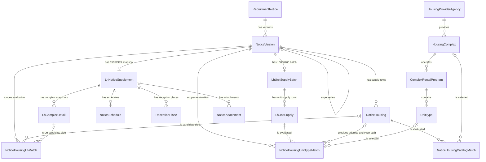

# 테이블 설계 사전

## 1. 문서 목적과 읽는 순서

이 문서는 프로젝트를 처음 보는 개발자가 코드를 먼저 전부 읽지 않아도 다음 질문에 답할 수 있도록 만든 온보딩 문서이자 상세 레퍼런스다.

- 데이터가 왜 17개 테이블로 나뉘는가
- 각 테이블에서 행 하나와 각 컬럼은 무엇을 뜻하는가
- 원천이 준 사실과 matcher가 계산한 판단은 어디에서 갈리는가
- 부모·자식, 식별자, 유니크 제약과 생명주기는 어떻게 이어지는가

**기준 시점은 2026-08-13**이다. Java 엔티티·값 객체, 적재 코드, 현재 H2 `INFORMATION_SCHEMA`를 교차 확인했다. 실제 H2 타입과 제약을 우선하며, JPA 애너테이션에 적힌 길이만 보고 DB 타입을 추측하지 않는다.

권장 읽기 순서는 다음과 같다.

1. 이 문서의 [데이터 네 층](#2-데이터의-네-층)에서 원천 사실과 파생 판단의 경계를 잡는다.
2. [전체 ER 구조](#3-전체-er-구조)와 [17개 테이블 관계 요약](#4-17개-테이블-관계-요약)에서 큰 흐름을 본다.
3. 필요한 테이블의 상세 절에서 행의 알갱이, 제약, 전체 컬럼을 확인한다.
4. HTTP 요청·응답과 원천 필드 계약은 [원천 API 명세](원천-API-명세.md)에서 이어서 본다.
5. 모델이 이 형태가 된 조사 과정과 실측 근거는 [도메인 설계](도메인-설계.md), 문서 전체의 승인 범위는 [테이블 설계 사전·원천 API 명세 문서 설계](superpowers/specs/2026-08-13-table-and-source-api-reference-design.md)에서 확인한다.

## 2. 데이터의 네 층

### 2.1 최신 주택 카탈로그

`HousingProviderAgency → HousingComplex → ComplexRentalProgram → UnitType`은 마이홈 15110581이 현재 알려 주는 단지·공급유형·주택형을 보관한다. 같은 원천 식별자를 다시 수집하면 새 이력 행을 쌓는 대신 변경 가능한 상세값을 갱신한다. 따라서 이 층은 공고 당시의 상태를 복원하는 이력 모델이 아니라 **최신 상태 카탈로그**다.

### 2.2 불변 공고·버전 이력

`RecruitmentNotice`는 원공고와 정정·취소 버전의 체인을 묶고, `NoticeVersion`과 `NoticeHousing`은 마이홈 15108420이 그 버전에서 말한 내용을 보존한다. 내용이 바뀌면 기존 버전을 수정하지 않고 다음 `NoticeVersion`을 추가한다.

### 2.3 LH 보충 원천 스냅샷

`LhNoticeSupplement`와 네 자식은 LH 15057999 응답을, `LhUnitSupplyBatch`와 `LhUnitSupply`는 LH 15056765 응답을 공고버전에 붙여 보존한다. 두 API는 요청 키가 같더라도 별도 호출이며 실패·재시도 생명주기도 다르므로 별도 aggregate다. 이 층의 단지 상세와 공급 수는 현재 카탈로그가 아니라 **그 공고버전에 대해 LH가 응답한 원천 스냅샷**이다.

### 2.4 재계산 가능한 파생 매칭

`NoticeHousingCatalogMatch`, `NoticeHousingLhMatch`, `NoticeHousingUnitTypeMatch`는 서로 다른 원천의 행을 연결하기 위해 matcher가 계산한 결과다. 후보 수, 상태, 근거, 판정 시각, `matcherVersion`을 남기며 규칙이 바뀌면 원천 행을 수정하지 않고 다시 계산할 수 있다.

카탈로그·공고·LH 보충 테이블은 원천에서 받은 값과 그 값을 보존하기 위한 직접 변환을 담는다. 예를 들어 `pnu` 앞 10자리로 `legal_dong_code`를 만들거나 난방 원문을 `HeatingType`으로 정규화하는 일은 원천 사실에서 결정적으로 파생되는 변환이다. 반면 주소·PNU·면적 후보 중 어느 행을 연결할지 선택하는 일은 matcher의 판단이다. **원천 aggregate의 nullable FK를 나중에 채워 매칭을 사실처럼 만들지 않고, 세 파생 테이블에 판단을 격리한다.**

## 3. 전체 ER 구조

다이어그램은 Java 엔티티 이름을 사용한다. 선은 현재 H2에 존재하는 FK를 모두 반영한다. `o|`로 표시된 연결 대상은 해당 FK가 `NULL`일 수 있다는 뜻이다.

`NoticeVersion.supersedesVersion`은 이전 버전을 가리키는 nullable self FK다. DB 유니크 제약은 없으므로 스키마만 보면 한 이전 버전을 여러 다음 버전이 가리킬 수 있다. 나머지 관계도 JPA 객체 그래프의 cascade 설정이 아니라 실제 DB FK를 기준으로 읽어야 한다. 현재 H2 `INFORMATION_SCHEMA.REFERENTIAL_CONSTRAINTS`가 22개 FK에 기록한 정확한 메타데이터 용어는 모두 `ON UPDATE NO ACTION`, `ON DELETE NO ACTION`이다. 즉 DB cascade는 없으며, JPA `CascadeType.ALL`이나 `orphanRemoval`은 영속성 컨텍스트가 수행하는 별도 동작이다.

## 4. 17개 테이블 관계 요약

| DB table name | Java entity | layer | row grain | parent (FK target) |
| --- | --- | --- | --- | --- |
| `housing_provider_agency` | `HousingProviderAgency` | 최신 주택 카탈로그 | 마이홈 공급기관명으로 식별한 공급기관 하나 | 없음 |
| `housing_complex` | `HousingComplex` | 최신 주택 카탈로그 | 원천 시스템 × 원천 단지 ID(`hsmpSn`) 하나 | `housing_provider_agency` |
| `complex_rental_program` | `ComplexRentalProgram` | 최신 주택 카탈로그 | 단지 × 원천 공급유형명 하나 | `housing_complex` |
| `unit_type` | `UnitType` | 최신 주택 카탈로그 | 프로그램 × 주택형명 × 전용면적 × 주거공용면적 하나 | `complex_rental_program` |
| `recruitment_notice` | `RecruitmentNotice` | 불변 공고·버전 이력 | 원공고와 모든 정정·취소 버전을 묶는 체인 하나 | 없음 |
| `notice_version` | `NoticeVersion` | 불변 공고·버전 이력 | 마이홈 `pblancId` 하나의 공고 스냅샷 | `recruitment_notice`, 이전 `notice_version`(선택) |
| `notice_housing` | `NoticeHousing` | 불변 공고·버전 이력 | 공고버전 × `houseSn`, 즉 15108420 공급행 하나 | `notice_version` |
| `lh_notice_supplement` | `LhNoticeSupplement` | LH 보충 원천 스냅샷 | 공고버전에 대한 15057999 응답 묶음 하나 | `notice_version` |
| `notice_schedule` | `NoticeSchedule` | LH 보충 원천 스냅샷 | 15057999 `dsSplScdl` 일정 행 하나 | `lh_notice_supplement` |
| `reception_place` | `ReceptionPlace` | LH 보충 원천 스냅샷 | 15057999 `dsCtrtPlc` 접수처 행 하나 | `lh_notice_supplement` |
| `lh_complex_detail` | `LhComplexDetail` | LH 보충 원천 스냅샷 | 15057999 `dsSbd`의 공고 시점 단지 상세 행 하나 | `lh_notice_supplement` |
| `notice_attachment` | `NoticeAttachment` | LH 보충 원천 스냅샷 | 15057999 공고문·단지 첨부파일 행 하나 | `lh_notice_supplement` |
| `lh_unit_supply_batch` | `LhUnitSupplyBatch` | LH 보충 원천 스냅샷 | 공고버전에 대한 15056765 응답 묶음 하나 | `notice_version` |
| `lh_unit_supply` | `LhUnitSupply` | LH 보충 원천 스냅샷 | 15056765 단지 × 주택형 공급행 하나 | `lh_unit_supply_batch` |
| `notice_housing_catalog_match` | `NoticeHousingCatalogMatch` | 재계산 가능한 파생 매칭 | 공고 공급행 × matcher 버전의 카탈로그 단지 판정 하나 | `notice_housing`, `housing_complex`(선택) |
| `notice_housing_lh_match` | `NoticeHousingLhMatch` | 재계산 가능한 파생 매칭 | 공고버전 × matcher 버전 × 판정 순번의 주소·세대수 판정 하나 | `notice_version`, `notice_housing`(선택), `lh_complex_detail`(선택) |
| `notice_housing_unit_type_match` | `NoticeHousingUnitTypeMatch` | 재계산 가능한 파생 매칭 | LH 공급행 × matcher 버전의 카탈로그 주택형 판정 하나 | `notice_version`, `lh_unit_supply`, `notice_housing`(선택), `unit_type`(선택) |

## 5. 최신 주택 카탈로그 테이블

카탈로그 네 테이블은 마이홈 15110581 `rentalHouseGwList`를 적재한다. 원천 한 행의 알갱이는 **단지 × 공급유형 × 주택형**이다. 반복되는 공급기관, 단지 속성, 공급유형별 세대수, 주택형별 면적·기본 임대조건을 각자의 실제 알갱이에 한 번씩만 두기 위해 네 단계로 나눈다.

15110581 응답이 모두 카탈로그가 되는 것은 아니다. `ConstructionRentalPolicy`는 `SupplyType.from`으로 알 수 없는 공급유형을 `UNKNOWN_SUPPLY_TYPE`, `PURCHASED_RENTAL`·`JEONSE_RENTAL`을 `UNSUPPORTED_SUPPLY_TYPE`으로 제외한다. 유효한 공급유형이어도 같은 `hsmpSn` 묶음에 파싱 가능한 `competDe` 또는 `HouseType.APARTMENT` 증거가 한 행도 없으면 `NOT_CONSTRUCTION_HOUSING`으로 제외한다. 따라서 아래 카탈로그는 이 건설형 공공임대 경계를 통과한 원천만 담는다.

### 5.1 `housing_provider_agency`

#### 행 하나의 의미

마이홈 `insttNm`으로 식별한 공급기관 하나다. 현재 원천은 안정적인 기관 코드를 주지 않으므로 정규화한 기관명을 `code`와 `name`에 같은 값으로 저장한다.

#### 왜 이 테이블이 존재하는가

LH·SH와 지역 공사 이름이 여러 단지 행에서 반복된다. 공급기관을 단지 문자열 컬럼으로 복제하지 않고 참조 엔티티로 분리하면 반복을 제거하고, 나중에 공식 코드 체계가 확인됐을 때 공급기관 식별 방식만 교체할 수 있다. 실데이터의 LH도 `LH서울`, `LH경기남부`, `LH경기북부`처럼 지역본부 단위 이름으로 들어오므로 지금의 `code`를 공식 기관 코드로 해석하면 안 된다.

#### 부모·자식

- 부모: 없음
- 자식: `housing_complex` 0개 이상

#### 생성·갱신 생명주기

단지 적재 중 `insttNm`을 trim한 값으로 `code`를 조회한다. 없으면 `code=name=insttNm`으로 한 번 생성한다. 현재 코드에는 기존 기관의 `code`나 `name`을 갱신하는 경로가 없다.

#### 키와 제약

| kind | columns | why |
| --- | --- | --- |
| PK | `id` | 원천이 기관 ID를 주지 않으므로 내부 surrogate key를 사용한다. |
| UNIQUE | `code` | 같은 원천 기관명이 중복 기관 행을 만들지 않게 한다. 현재는 이름 기반 임시 식별자다. |
| FK | 없음 | 최상위 참조 엔티티다. |

#### 전체 컬럼

| DB column | Java property | actual H2 type | NULL | meaning | source |
| --- | --- | --- | --- | --- | --- |
| `id` | `HousingProviderAgency.id` | `bigint` | 불가 | 내부 기관 PK | DB `IDENTITY` 생성 |
| `code` | `HousingProviderAgency.code` | `varchar(20)` | 불가 | 기관 조회용 식별값; 현재는 기관명과 동일 | 15110581 `insttNm` trim 값 |
| `name` | `HousingProviderAgency.name` | `varchar(255)` | 불가 | 화면과 도메인에서 사용하는 공급기관명 | 15110581 `insttNm` trim 값 |

#### 설계상 주의점

- `code`라는 이름만 보고 공공기관의 공식 코드를 기대하면 안 된다. 원천이 안정적인 코드를 제공하지 않아 현재는 이름을 재사용한다.
- 기관명이 바뀌거나 표기가 갈리면 별도 기관으로 생성된다. 현재 모델은 기관명 정규화·병합 판단을 하지 않는다.
- `housing_complex` FK의 DB 삭제 동작은 `NO ACTION`이다. 기관을 지우면 자식 단지가 DB에서 자동 삭제되지 않는다.

### 5.2 `housing_complex`

#### 행 하나의 의미

마이홈 원천 시스템과 `hsmpSn` 조합으로 식별되는 현재 단지 하나다. 이름이 아니라 `source_system + source_complex_id`가 원천 정체성이다.

#### 왜 이 테이블이 존재하는가

같은 `hsmpSn`이 공급유형과 주택형만 달리해 여러 원천 행에 반복된다. 단지명·주소·공급기관·준공·난방 같은 단지 속성을 한 행에 모은다. `hsmpNm`은 건설임대에서는 단지명이지만 매입임대에서는 지역명일 수 있어 식별자로 안전하지 않다. 주소도 단지 없이 독립적인 생명주기가 없으므로 `Address` 값 객체로 묶어 이 테이블에 펼친다.

#### 부모·자식

- 부모: `housing_provider_agency` 정확히 1개
- 자식: `complex_rental_program` 0개 이상, 파생 `notice_housing_catalog_match` 0개 이상

#### 생성·갱신 생명주기

`source_system=MYHOME_PORTAL`, `source_complex_id=hsmpSn`으로 기존 행을 찾는다. 처음 만들 때 이름·`Address`·공급기관을 정하고, 재조회에서는 이 정체성 필드를 바꾸지 않는다. 재조회 시 `CatalogDetails`의 준공·난방·주차·복도·승강기·주택유형만 통째로 비교해 값이 달라졌을 때 갱신한다. `CatalogDetails`는 JPA 내장 객체가 아니라 갱신 경계를 표현하는 plain record다.

#### 키와 제약

| kind | columns | why |
| --- | --- | --- |
| PK | `id` | 관계에서 사용할 내부 단지 PK다. |
| FK | `housing_provider_agency_id → housing_provider_agency.id` | 반복되는 공급기관을 참조한다. DB 동작은 `ON UPDATE NO ACTION`, `ON DELETE NO ACTION`이다. |
| UNIQUE | `source_system, source_complex_id` | 서로 다른 원천 ID 공간을 구분하면서 동일 원천의 같은 `hsmpSn`이 중복 단지가 되지 않게 한다. |

#### 전체 컬럼

| DB column | Java property | actual H2 type | NULL | meaning | source |
| --- | --- | --- | --- | --- | --- |
| `id` | `HousingComplex.id` | `bigint` | 불가 | 내부 단지 PK | DB `IDENTITY` 생성 |
| `district_code` | `HousingComplex.address.districtCode` | `varchar(10)` | 허용 | 시군구 코드 | 15110581 `signguCode` trim 값 |
| `district_name` | `HousingComplex.address.districtName` | `varchar(30)` | 허용 | 시군구명 | 15110581 `signguNm` trim 값 |
| `legal_dong_code` | `HousingComplex.address.legalDongCode` | `varchar(10)` | 허용 | 법정동코드 10자리 | 유효한 19자리 `pnu`의 앞 10자리에서 파생 |
| `pnu` | `HousingComplex.address.pnu` | `varchar(19)` | 허용 | 필지고유번호; 공고 원천과 카탈로그를 잇는 안전한 키 | 15110581 `pnu`; 19자리 숫자가 아니면 `NULL` |
| `province_code` | `HousingComplex.address.provinceCode` | `varchar(10)` | 허용 | 광역시도 코드 | 15110581 `brtcCode` trim 값 |
| `province_name` | `HousingComplex.address.provinceName` | `varchar(30)` | 허용 | 광역시도명 | 15110581 `brtcNm` trim 값 |
| `road_address` | `HousingComplex.address.roadAddress` | `varchar(255)` | 불가 | 단지 도로명주소 | 15110581 `rnAdres` trim 값 |
| `completion_date` | `HousingComplex.completionDate` | `date` | 허용 | 준공일 | 15110581 `competDe`(`yyyyMMdd`) 파싱 값 |
| `completion_year` | `HousingComplex.completionYear` | `integer` | 허용 | 준공연도 | `completion_date`의 연도에서 파생 |
| `corridor_type` | `HousingComplex.corridorType` | `varchar(20)` | 허용 | 계단식·복도식·혼합식 등 건물 형태 원문 | 15110581 `buldStleNm` trim 값 |
| `elevator_installation` | `HousingComplex.elevatorInstallation` | `varchar(20)` | 허용 | 승강기 설치 여부 원문 | 15110581 `elvtrInstlAtNm` trim 값 |
| `heating_type` | `HousingComplex.heatingType` | `H2 ENUM` | 허용 | 난방 분류 `INDIVIDUAL`, `CENTRAL`, `DISTRICT` | 15110581 `heatMthdDetailNm`을 `HeatingType.from`으로 분류 |
| `heating_type_name` | `HousingComplex.heatingTypeName` | `varchar(30)` | 허용 | 열원 정보까지 보존한 난방 원문 | 15110581 `heatMthdDetailNm` trim 값 |
| `house_type` | `HousingComplex.houseType` | `H2 ENUM` | 허용 | 아파트·연립·다세대 등 표준 주택유형 | 15110581 `houseTyNm`을 `HouseType.from`으로 분류 |
| `house_type_name` | `HousingComplex.houseTypeName` | `varchar(30)` | 허용 | 매핑되지 않은 값도 남기는 주택유형 원문 | 15110581 `houseTyNm` trim 값 |
| `name` | `HousingComplex.name` | `varchar(255)` | 불가 | 단지 표시명 | 15110581 `hsmpNm`; 비면 지역명(`brtcNm + signguNm`), 그것도 없으면 `rnAdres` |
| `parking_spaces` | `HousingComplex.parkingSpaces` | `integer` | 허용 | 주차 가능 대수 | 15110581 `parkngCo` |
| `source_complex_id` | `HousingComplex.sourceComplexId` | `varchar(255)` | 불가 | 원천 단지 식별자 | 15110581 `hsmpSn`의 문자열 표현 |
| `source_system` | `HousingComplex.sourceSystem` | `H2 ENUM` | 불가 | 단지 식별자 네임스페이스; 현재 `MYHOME_PORTAL` | 적재 서비스가 지정 |
| `housing_provider_agency_id` | `HousingComplex.housingProviderAgency.id` | `bigint` | 불가 | 공급기관 FK | 15110581 `insttNm`으로 기관을 조회하거나 생성한 결과 |

#### 설계상 주의점

- H2의 `heating_type`, `house_type`, `source_system`은 실제로 native `ENUM`이다. `@Column(length=...)`을 근거로 `varchar(20)`이나 `varchar(30)`이라고 문서화하면 실제 스키마와 달라진다.
- 단지명은 표시값이지 식별자가 아니다. 원천 정체성은 `hsmpSn`이고 DB 유니크 키는 원천 시스템까지 포함한다.
- `Address`는 별도 테이블이 아니라 실제 `@Embeddable`이며 일곱 컬럼이 `housing_complex`에 평탄화된다.
- 이 테이블은 최신값만 유지한다. 공고 시점 단지 상태는 `lh_complex_detail` 등 공고·LH 스냅샷에서 찾아야 한다.
- 재수집 때 이름·주소·공급기관은 갱신하지 않는다. 원천의 정체성 필드가 바뀐 상황을 이 갱신 경로가 자동 반영한다고 가정하면 안 된다.

### 5.3 `complex_rental_program`

#### 행 하나의 의미

한 단지가 한 원천 공급유형명으로 운영하는 임대 프로그램 하나다. 원천의 `hshldCo`는 단지 전체가 아니라 **단지 × 공급유형**의 세대수다.

#### 왜 이 테이블이 존재하는가

같은 단지에 국민임대와 행복주택 같은 여러 공급유형이 함께 있을 수 있고, 세대수와 기본 임대조건도 공급유형에 따라 갈린다. 세대수를 단지에 두면 서로 다른 공급유형 값이 충돌하고, 모든 주택형에 반복하면 같은 값을 복제하게 된다. 그래서 단지와 주택형 사이에 프로그램 계층을 둔다.

#### 부모·자식

- 부모: `housing_complex` 정확히 1개
- 자식: `unit_type` 0개 이상

#### 생성·갱신 생명주기

수집한 단지 행들을 trim한 `suplyTyNm`으로 묶고 `housing_complex + supply_type_name`으로 upsert한다. 새 프로그램은 원문 공급유형명, `SupplyType` 분류, `hshldCo`를 함께 저장한다. 기존 프로그램은 `unit_count`가 달라질 때만 갱신한다. 같은 프로그램 안의 비어 있지 않은 `hshldCo`가 둘 이상이면 그 프로그램 묶음을 모순된 원천으로 보고 적재에서 제외한다.

#### 키와 제약

| kind | columns | why |
| --- | --- | --- |
| PK | `id` | 주택형이 참조할 내부 프로그램 PK다. |
| FK | `housing_complex_id → housing_complex.id` | 프로그램이 어느 단지에 속하는지 고정한다. DB 동작은 `ON UPDATE NO ACTION`, `ON DELETE NO ACTION`이다. |
| UNIQUE | `housing_complex_id, supply_type_name` | 같은 단지에서 같은 원천 공급유형 프로그램이 중복 생성되지 않게 한다. enum이 아니라 원문 이름을 보존한 키다. |

#### 전체 컬럼

| DB column | Java property | actual H2 type | NULL | meaning | source |
| --- | --- | --- | --- | --- | --- |
| `id` | `ComplexRentalProgram.id` | `bigint` | 불가 | 내부 프로그램 PK | DB `IDENTITY` 생성 |
| `supply_type` | `ComplexRentalProgram.supplyType` | `H2 ENUM` | 불가 | 표준 공급유형 분류 | 15110581 `suplyTyNm`을 `SupplyType.from`으로 변환 |
| `supply_type_name` | `ComplexRentalProgram.supplyTypeName` | `varchar(30)` | 불가 | 원천 공급유형명 | 15110581 `suplyTyNm` trim 값 |
| `unit_count` | `ComplexRentalProgram.unitCount` | `integer` | 허용 | 이 단지·공급유형의 전체 세대수 | 15110581 `hshldCo` |
| `housing_complex_id` | `ComplexRentalProgram.housingComplex.id` | `bigint` | 불가 | 소속 단지 FK | 같은 `hsmpSn`으로 upsert한 `housing_complex.id` |

#### 설계상 주의점

- H2의 `supply_type`은 native `ENUM`이다. JPA의 `@Enumerated(EnumType.STRING)`과 `length=30`만 보고 `varchar(30)`으로 읽으면 안 된다.
- 유니크 키는 표준 enum이 아니라 원천 `supply_type_name`을 쓴다. enum과 원문을 함께 보관하므로 원천 표현과 도메인 분류를 모두 추적할 수 있다.
- JPA에서 부모가 자식을 저장하는 방식과 무관하게 DB FK의 삭제 동작은 `NO ACTION`이다. 단지를 삭제한다고 프로그램이 DB cascade로 지워지지 않는다.

### 5.4 `unit_type`

#### 행 하나의 의미

한 임대 프로그램 안에서 주택형명·전용면적·주거공용면적이 같은 카탈로그 주택형 하나다. 15110581의 유효한 원천 행 하나가 이 알갱이에 대응한다.

#### 왜 이 테이블이 존재하는가

주택형명만으로는 같은 이름 아래 다른 면적을 구분할 수 없고, 같은 평면도 공급유형에 따라 기본 임대조건이 달라진다. 자연키 설계 당시 23개 시군구에서 조사한 제한 표본 7,317개 원천 행은 `(단지, 공급유형, 주택형명, 전용면적, 공용면적)`을 모두 사용했을 때만 충돌 없이 식별됐다. 이는 현재 저장된 `unit_type` 11,170건이 아니라 설계 당시 표본 수다. 공급유형은 부모 `ComplexRentalProgram`이 표현하므로 이 테이블의 자연키는 **프로그램 × 주택형명 × 전용면적 × 주거공용면적**이다.

#### 부모·자식

- 부모: `complex_rental_program` 정확히 1개
- 자식: 파생 `notice_housing_unit_type_match` 0개 이상

#### 생성·갱신 생명주기

프로그램 안에서 `type_name + exclusive_area + residential_common_area`로 기존 행을 조회해 upsert한다. 새 행은 이름과 면적을 고정하고, 재수집에서는 `BaseRentTerms`의 보증금·월임대료·전환보증금 한도만 통째로 비교해 달라졌을 때 갱신한다. 빈 `styleNm` 행은 저장하지 않는다.

#### 키와 제약

| kind | columns | why |
| --- | --- | --- |
| PK | `id` | 매칭 결과가 참조할 내부 주택형 PK다. |
| FK | `complex_rental_program_id → complex_rental_program.id` | 단지와 공급유형 문맥을 부모 프로그램으로 고정한다. DB 동작은 `ON UPDATE NO ACTION`, `ON DELETE NO ACTION`이다. |
| UNIQUE | `complex_rental_program_id, type_name, exclusive_area, residential_common_area` | 이름만 같은 다른 면적과 같은 단지의 다른 공급유형을 구분한다. |

#### 전체 컬럼

| DB column | Java property | actual H2 type | NULL | meaning | source |
| --- | --- | --- | --- | --- | --- |
| `id` | `UnitType.id` | `bigint` | 불가 | 내부 주택형 PK | DB `IDENTITY` 생성 |
| `base_convertible_deposit_limit` | `UnitType.baseRentTerms.convertibleDepositLimit` | `bigint` | 허용 | 월세를 보증금으로 전환할 수 있는 기본 한도(원) | 15110581 `bassCnvrsGtnLmt` |
| `base_deposit` | `UnitType.baseRentTerms.deposit` | `bigint` | 허용 | 카탈로그 기본 임대보증금(원) | 15110581 `bassRentGtn` |
| `base_monthly_rent` | `UnitType.baseRentTerms.monthlyRent` | `bigint` | 허용 | 카탈로그 기본 월임대료(원) | 15110581 `bassMtRntchrg` |
| `exclusive_area` | `UnitType.exclusiveArea` | `numeric(10,4)` | 허용 | 전용면적(㎡) | 15110581 `suplyPrvuseAr` |
| `residential_common_area` | `UnitType.residentialCommonArea` | `numeric(10,4)` | 허용 | 주거공용면적(㎡) | 15110581 `suplyCmnuseAr` |
| `type_name` | `UnitType.typeName` | `varchar(50)` | 불가 | 주택형명; 예: `36`, `51A` | 15110581 `styleNm` trim 값 |
| `complex_rental_program_id` | `UnitType.complexRentalProgram.id` | `bigint` | 불가 | 소속 단지·공급유형 프로그램 FK | `hsmpSn + suplyTyNm`으로 upsert한 프로그램 |

#### 설계상 주의점

- `exclusive_area`와 `residential_common_area`는 nullable이다. SQL UNIQUE에서는 `NULL`끼리 같은 값으로 취급되지 않으므로 DB 유니크 제약만으로 nullable 자연키 중복을 모두 막을 수 없다. 적재 서비스가 저장 전에 같은 자연키를 한 번 더 중복 제거한다.
- 면적은 합산·비교 오차를 피하려고 `double`이 아니라 `numeric(10,4)`/`BigDecimal`을 쓴다.
- `BaseRentTerms`는 카탈로그 기준값이다. 특정 모집공고에서 제시한 실제 임대조건인 `NoticeHousing.rentTerms`와 섞으면 안 된다.
- 이름·면적은 기존 행 갱신 대상이 아니다. 이 조합이 달라지면 다른 자연키의 주택형으로 취급한다.

## 6. 값 객체와 컬럼 평탄화

값을 Java에서 한 덩어리로 다룬다고 해서 모두 JPA `@Embeddable`인 것은 아니다. `Address`, `BaseRentTerms`, `SuppliedHousing`, `RentTerms`는 실제 내장 값 타입이고, `CatalogDetails`와 `NoticeSnapshot`은 비교·복사를 위한 plain Java record다.

### 6.1 `Address` — 실제 JPA `@Embeddable`

`HousingComplex.address`의 `@Embedded` 값이다. 별도 PK나 테이블 없이 다음 컬럼으로 `housing_complex`에 펼쳐진다.

| logical property | owner column | actual H2 type | source / derivation |
| --- | --- | --- | --- |
| `Address.roadAddress` | `housing_complex.road_address` | `varchar(255)` | 15110581 `rnAdres` |
| `Address.legalDongCode` | `housing_complex.legal_dong_code` | `varchar(10)` | 유효한 `pnu` 앞 10자리 |
| `Address.pnu` | `housing_complex.pnu` | `varchar(19)` | 15110581 `pnu` |
| `Address.provinceCode` | `housing_complex.province_code` | `varchar(10)` | 15110581 `brtcCode` |
| `Address.provinceName` | `housing_complex.province_name` | `varchar(30)` | 15110581 `brtcNm` |
| `Address.districtCode` | `housing_complex.district_code` | `varchar(10)` | 15110581 `signguCode` |
| `Address.districtName` | `housing_complex.district_name` | `varchar(30)` | 15110581 `signguNm` |

생성자는 도로명주소를 필수로 검증하고, PNU가 정확한 19자리 숫자일 때만 보존한다. 주소는 단지의 일부이므로 독립 생명주기나 독립 식별자가 없다.

### 6.2 `BaseRentTerms` — 실제 JPA `@Embeddable`

`UnitType.baseRentTerms`의 `@Embedded` 값이다. 다음 세 컬럼으로 `unit_type`에 펼쳐진다.

| logical property | owner column | actual H2 type | source |
| --- | --- | --- | --- |
| `BaseRentTerms.deposit` | `unit_type.base_deposit` | `bigint` | 15110581 `bassRentGtn` |
| `BaseRentTerms.monthlyRent` | `unit_type.base_monthly_rent` | `bigint` | 15110581 `bassMtRntchrg` |
| `BaseRentTerms.convertibleDepositLimit` | `unit_type.base_convertible_deposit_limit` | `bigint` | 15110581 `bassCnvrsGtnLmt` |

세 값은 함께 비교해 변경이 있을 때만 갱신한다. 세 컬럼이 모두 nullable이므로 값 객체 자체가 없거나 원천의 일부 금액이 비어 있는 상태를 표현할 수 있다.

### 6.3 `CatalogDetails` — JPA 내장 타입이 아닌 논리 record

`CatalogDetails`에는 `@Embeddable`이 없다. `HousingComplex`가 현재 변경 가능한 카탈로그 상세를 record로 조립해 비교하고, `updateCatalogDetails`가 각 엔티티 필드에 값을 복사한다. 따라서 DB에는 `catalog_details` 테이블이나 내장 객체 경계가 존재하지 않는다.

| record component | copied owner column | actual H2 type | source / derivation |
| --- | --- | --- | --- |
| `completionDate` | `housing_complex.completion_date` | `date` | 15110581 `competDe` 파싱 값 |
| `completionDate` | `housing_complex.completion_year` | `integer` | 복사 시 `completionDate.getYear()`로 추가 파생 |
| `heatingType` | `housing_complex.heating_type` | `H2 ENUM` | `heatMthdDetailNm` 표준 분류 |
| `heatingTypeName` | `housing_complex.heating_type_name` | `varchar(30)` | 15110581 `heatMthdDetailNm` 원문 |
| `parkingSpaces` | `housing_complex.parking_spaces` | `integer` | 15110581 `parkngCo` |
| `corridorType` | `housing_complex.corridor_type` | `varchar(20)` | 15110581 `buldStleNm` |
| `elevatorInstallation` | `housing_complex.elevator_installation` | `varchar(20)` | 15110581 `elvtrInstlAtNm` |
| `houseType` | `housing_complex.house_type` | `H2 ENUM` | `houseTyNm` 표준 분류 |
| `houseTypeName` | `housing_complex.house_type_name` | `varchar(30)` | 15110581 `houseTyNm` 원문 |

`name`, `address`, `housingProviderAgency`, `sourceSystem`, `sourceComplexId`가 이 record에 없는 것은 의도적이다. 이 값들은 최초 생성 때 단지 정체성을 정하고, 현재 재수집 갱신 경로가 덮어쓰지 않는다.

### 6.4 `NoticeSnapshot` — JPA 내장 타입이 아닌 논리 record

`NoticeSnapshot`에는 `@Embeddable`이 없다. 같은 마이홈 `pblancId`를 다시 읽었을 때 공고 단위 내용이 바뀌었는지 통째로 비교하고, 새 `NoticeVersion`을 만들 때 엔티티 필드로 복사하기 위한 plain Java record다. DB에는 `notice_snapshot` 테이블이나 내장 객체 경계가 없다.

| record component | copied owner column | actual H2 type | source / derivation |
| --- | --- | --- | --- |
| `changeStatus` | `notice_version.notice_change_status` | `H2 ENUM` | 15108420 `sttusNm`을 `NoticeChangeStatus.fromStatusName`으로 분류 |
| `publishedAt` | `notice_version.published_at` | `timestamp` | 15108420 `rcritPblancDe`를 날짜로 파싱한 뒤 자정 시각으로 변환 |
| `title` | `notice_version.title` | `varchar(255)` | 15108420 `pblancNm` trim 값 |
| `detailUrl` | `notice_version.detail_url` | `varchar(500)` | 15108420 `url` trim 값 |
| `applicationBeginOn` | `notice_version.application_begin_on` | `date` | 15108420 `beginDe` 파싱 값 |
| `applicationEndOn` | `notice_version.application_end_on` | `date` | 15108420 `endDe` 파싱 값 |
| `winnerAnnouncedOn` | `notice_version.winner_announced_on` | `date` | 15108420 `przwnerPresnatnDe` 파싱 값 |
| `supplyInstitutionName` | `notice_version.supply_institution_name` | `varchar(50)` | 15108420 `suplyInsttNm` trim 값 |
| `houseTypeName` | `notice_version.house_type_name` | `varchar(30)` | 15108420 `houseTyNm` trim 값 |
| `supplyTypeName` | `notice_version.supply_type_name` | `varchar(30)` | 15108420 `suplyTyNm` trim 값 |
| `contact` | `notice_version.contact` | `varchar(200)` | 15108420 `refrnc` trim 값 |

`id`, `versionNumber`, `recruitmentNotice`, `supersedesVersion`은 버전 정체성과 연결 정보이므로 이 비교 record에 들어가지 않는다. `houseType`과 `supplyType` enum은 각각 record의 원문 이름을 엔티티 생성자가 분류해 별도 컬럼에 복사한다.

### 6.5 `SuppliedHousing` — 실제 JPA `@Embeddable`

`NoticeHousing.suppliedHousing`의 `@Embedded` 값이다. 공고가 가리킨 주택을 그 공고 시점의 원천 문자열로 보존하며, 독립 PK나 테이블 없이 다음 아홉 컬럼으로 `notice_housing`에 펼쳐진다.

| logical property | owner column | actual H2 type | source |
| --- | --- | --- | --- |
| `SuppliedHousing.complexName` | `notice_housing.supplied_complex_name` | `varchar(255)` | 15108420 `hsmpNm` |
| `SuppliedHousing.fullAddress` | `notice_housing.supplied_full_address` | `varchar(255)` | 15108420 `fullAdres` |
| `SuppliedHousing.pnu` | `notice_housing.supplied_pnu` | `varchar(19)` | 15108420 `pnu` |
| `SuppliedHousing.roadName` | `notice_housing.supplied_road_name` | `varchar(100)` | 15108420 `rnCodeNm` |
| `SuppliedHousing.referenceLegalDongName` | `notice_housing.supplied_reference_legal_dong_name` | `varchar(50)` | 15108420 `refrnLegaldongNm` |
| `SuppliedHousing.provinceName` | `notice_housing.supplied_province_name` | `varchar(30)` | 15108420 `brtcNm` |
| `SuppliedHousing.districtName` | `notice_housing.supplied_district_name` | `varchar(30)` | 15108420 `signguNm` |
| `SuppliedHousing.heatingTypeName` | `notice_housing.supplied_heating_type_name` | `varchar(30)` | 15108420 `heatMthdNm` |
| `SuppliedHousing.totalUnitCount` | `notice_housing.supplied_total_unit_count` | `integer` | 15108420 `totHshldCo` 숫자 변환 값 |

카탈로그 단지와 연결되더라도 이 값은 지우거나 덮어쓰지 않는다. 최신 카탈로그와 공고 당시 원천 사실의 생명주기가 다르고, 매칭은 별도 파생 테이블이 담당하기 때문이다.

### 6.6 `RentTerms` — 실제 JPA `@Embeddable`

`NoticeHousing.rentTerms`의 `@Embedded` 값이다. 이번 공고의 공급행에 적용된 실제 임대조건이며, 카탈로그 기준값인 `BaseRentTerms`와 다른 시간·의미의 값이다.

| logical property | owner column | actual H2 type | source |
| --- | --- | --- | --- |
| `RentTerms.deposit` | `notice_housing.deposit` | `bigint` | 15108420 `rentGtn` |
| `RentTerms.downPayment` | `notice_housing.down_payment` | `bigint` | 15108420 `enty` |
| `RentTerms.balance` | `notice_housing.balance` | `bigint` | 15108420 `surlus` |
| `RentTerms.monthlyRent` | `notice_housing.monthly_rent` | `bigint` | 15108420 `mtRntchrg` |

네 컬럼은 모두 nullable이다. 원천 `prtpay`는 조사 표본에서 항상 0이어서 중도금 컬럼을 만들지 않았고, 보증금·계약금·잔금·월임대료만 원천 그대로 비교하고 보존한다.

### 6.7 `NoticeHousingLhMatchEvidence` — 실제 JPA `@Embeddable`

`NoticeHousingLhMatch.evidence`에 내장되는 실제 `@Embeddable`이다. 주소 matcher가 어떤 원문을 어떻게 정규화했고, 어떤 세대수와 후보를 보고 상태를 정했는지 한 묶음으로 보존한다. 별도 테이블은 없으며 다음 여덟 컬럼으로 `notice_housing_lh_match`에 평탄화된다.

| value property | flattened DB column | meaning |
| --- | --- | --- |
| `noticeAddressRaw` | `notice_address_raw` | `NoticeHousing.suppliedHousing.fullAddress`로 조립한 공고 주소 원문 |
| `noticeAddressNormalized` | `notice_address_normalized` | 공고 주소를 trim하고 공백만 제거한 비교값 |
| `lhAddressRaw` | `lh_address_raw` | `LhComplexDetail.fullLotAddress()`로 조립한 LH 주소 원문 |
| `lhAddressNormalized` | `lh_address_normalized` | LH 주소를 trim하고 공백만 제거한 비교값 |
| `noticeUnitCount` | `notice_unit_count` | 공고 공급행의 전체 세대수 |
| `lhUnitCount` | `lh_unit_count` | LH 단지 상세의 전체 세대수 |
| `candidateLhComplexDetailIds` | `candidate_lh_complex_detail_ids` | 후보 `LhComplexDetail.id`를 정렬해 쉼표로 이은 조사 문자열 |
| `reason` | `reason` | 해당 상태가 된 사람이 읽을 수 있는 판정 이유 |

원문과 정규화값을 함께 두는 이유는 matcher를 재검토할 때 공백 제거가 무엇을 바꿨는지 추적하기 위해서다. `Address`, `BaseRentTerms`, `SuppliedHousing`, `RentTerms`처럼 이 타입도 실제 JPA 내장 값 객체다. 반면 `CatalogDetails`, `NoticeSnapshot`은 엔티티 컬럼을 비교·전달하기 위한 plain record일 뿐 `@Embedded`로 저장되지 않는다는 구분은 그대로다.

## 7. 불변 공고·버전 이력 테이블

세 테이블은 마이홈 15108420 `rsdtRcritNtcList`를 적재한다. 원천 한 행은 공고 전체가 아니라 공고의 한 공급행이므로, `pblancId`별 공고 내용과 공급행을 나눠 저장한다. 정정·취소가 새 `pblancId`로 발급되면 이전 행을 수정하지 않고 같은 `RecruitmentNotice` 아래 다음 버전을 추가한다.

### 7.1 `recruitment_notice`

#### 행 하나의 의미

원공고 하나와 그 뒤에 이어지는 모든 정정·취소 공고를 묶는 버전 체인 루트 하나다. `source_root_notice_id`는 체인 맨 앞에서 루트를 만든 원천 `pblancId`다.

#### 왜 이 테이블이 존재하는가

마이홈은 정정공고마다 새 `pblancId`를 발급하고 `beforePblancId`로 이전 버전을 가리킨다. 따라서 `pblancId` 하나를 공고의 영구 ID로 쓰면 원공고와 정정공고가 서로 다른 공고처럼 갈라진다. 변하지 않는 루트를 별도 행으로 두면 여러 `NoticeVersion`이 같은 공고의 시간 순서라는 사실을 표현할 수 있다.

#### 부모·자식

- 부모: 없음
- 자식: `notice_version` 1개 이상

#### 생성·갱신 생명주기

이전 `pblancId`가 없는 최초 버전이 들어오면 `source_system=MYHOME_PORTAL`, 현재 `pblancId`를 루트 ID로 새 행을 만든다. `beforePblancId`로 저장된 이전 버전을 찾으면 그 버전의 기존 루트를 재사용한다. 이전 버전을 찾지 못해 체인이 끊긴 경우에는 현재 `pblancId`로 새 루트를 시작한다. 생성 뒤 루트 값을 갱신하는 경로는 없다.

#### 키와 제약

| kind | columns | why |
| --- | --- | --- |
| PK | `id` | 버전들이 참조할 내부 공고 루트 PK다. |
| UNIQUE | `source_system, source_root_notice_id` | 원천 ID 네임스페이스를 구분하면서 같은 체인 루트가 중복 생성되지 않게 한다. |
| FK | 없음 | 공고 이력의 최상위 aggregate root다. |

#### 전체 컬럼

| DB column | Java property | actual H2 type | NULL | meaning | source |
| --- | --- | --- | --- | --- | --- |
| `id` | `RecruitmentNotice.id` | `bigint` | 불가 | 내부 공고 체인 PK | DB `IDENTITY` 생성 |
| `source_root_notice_id` | `RecruitmentNotice.sourceRootNoticeId` | `varchar(50)` | 불가 | 원공고·정정·취소 체인을 시작한 원천 공고 ID | 15108420 체인의 최초 도달 `pblancId`; 끊긴 체인은 현재 `pblancId` |
| `source_system` | `RecruitmentNotice.sourceSystem` | `H2 ENUM` | 불가 | 루트 ID의 원천 네임스페이스; 현재 `MYHOME_PORTAL` | 적재 서비스가 지정 |

#### 설계상 주의점

- `source_root_notice_id`는 모든 버전의 `pblancId`를 복사한 값이 아니라 체인에 한 번만 존재하는 루트 식별자다.
- 끊긴 체인은 현재 버전으로 새 루트를 시작하므로, 나중에 누락된 이전 공고를 받아도 기존 루트를 자동 병합하지 않는다.
- 자식 `notice_version` FK의 DB 삭제 동작은 `NO ACTION`이다. 루트를 삭제해도 버전이 DB cascade로 지워지지 않는다.

### 7.2 `notice_version`

#### 행 하나의 의미

원천 `pblancId` 하나가 나타내는 공고 내용의 불변 버전 스냅샷 하나다. 같은 `RecruitmentNotice` 아래 `version_number`가 1부터 증가한다.

#### 왜 이 테이블이 존재하는가

정정·취소 때마다 제목·접수기간·공급유형 같은 공고 내용이 달라질 수 있고 원천은 새 `pblancId`를 발급한다. 최신 한 행을 덮어쓰면 과거 공고 내용과 당시 공급행을 복원할 수 없다. 버전별 행을 추가하고 `supersedes_version_id`로 직전 버전을, `before_source_notice_id`로 원천 `beforePblancId`를 함께 남기면 DB 연결과 원천 증거를 모두 보존할 수 있다.

#### 부모·자식

- 부모: `recruitment_notice` 정확히 1개, 직전 `notice_version` 0개 또는 1개
- 자식: 다음 `notice_version` 0개 이상, `notice_housing` 1개 이상, `lh_notice_supplement` 0개 또는 1개, `lh_unit_supply_batch` 0개 또는 1개
- 파생 매칭 테이블도 이 버전 범위를 참조하지만, 매칭 결과의 상세는 별도 절에서 다룬다.

#### 생성·갱신 생명주기

15108420 행들을 `pblancId`로 묶어 공고 단위 필드로 `NoticeSnapshot`을 만든다. 원공고나 끊긴 체인은 `firstVersion`으로 1번 버전을, 기존 이전 버전을 찾은 정정·취소는 `nextVersion`으로 다음 번호와 self FK를 가진 새 행을 만든다. 같은 `pblancId`를 다시 받으면 스냅샷과 공급행 전체가 같은 경우에만 unchanged로 처리하고, 내용이 달라졌다면 기존 aggregate를 수정하지 않고 해당 요청을 거부한다.

#### 키와 제약

| kind | columns | why |
| --- | --- | --- |
| PK | `id` | 각 불변 버전 자체의 내부 PK다. |
| FK | `recruitment_notice_id → recruitment_notice.id` | 여러 버전을 같은 공고 체인에 묶는다. DB 동작은 `ON UPDATE NO ACTION`, `ON DELETE NO ACTION`이다. |
| FK | `supersedes_version_id → notice_version.id` | 원천 체인에서 직전 버전을 선택적으로 가리킨다. DB 동작은 `ON UPDATE NO ACTION`, `ON DELETE NO ACTION`이다. |
| UNIQUE | `recruitment_notice_id, version_number` | 한 공고 체인에서 같은 버전 번호가 두 번 생기지 않게 한다. |
| UNIQUE | `source_system, source_notice_id` | 같은 원천 `pblancId`가 중복 버전으로 저장되지 않게 한다. |

#### 전체 컬럼

| DB column | Java property | actual H2 type | NULL | meaning | source |
| --- | --- | --- | --- | --- | --- |
| `id` | `NoticeVersion.id` | `bigint` | 불가 | 내부 공고버전 PK | DB `IDENTITY` 생성 |
| `application_begin_on` | `NoticeVersion.applicationBeginOn` | `date` | 허용 | 청약 접수 시작일 | 15108420 `beginDe` 파싱 값 |
| `application_end_on` | `NoticeVersion.applicationEndOn` | `date` | 허용 | 청약 접수 종료일 | 15108420 `endDe` 파싱 값 |
| `before_source_notice_id` | `NoticeVersion.beforeSourceNoticeId` | `varchar(50)` | 허용 | 원천이 준 직전 공고 ID 원문 | 15108420 `beforePblancId` trim 값 |
| `contact` | `NoticeVersion.contact` | `varchar(200)` | 허용 | 문의처·콜센터 안내 | 15108420 `refrnc` trim 값 |
| `detail_url` | `NoticeVersion.detailUrl` | `varchar(500)` | 허용 | 청약 사이트의 공고 원문 URL; LH 호출 파라미터도 포함할 수 있음 | 15108420 `url` trim 값 |
| `house_type` | `NoticeVersion.houseType` | `H2 ENUM` | 허용 | 표준 주택유형 분류 | 15108420 `houseTyNm`을 `HouseType.from`으로 분류 |
| `house_type_name` | `NoticeVersion.houseTypeName` | `varchar(30)` | 허용 | 주택유형 원문 | 15108420 `houseTyNm` trim 값 |
| `notice_change_status` | `NoticeVersion.noticeChangeStatus` | `H2 ENUM` | 불가 | `ORIGINAL`, `CORRECTION`, `CANCELLATION` 중 버전 상태 | 15108420 `sttusNm`을 `NoticeChangeStatus.fromStatusName`으로 분류 |
| `published_at` | `NoticeVersion.publishedAt` | `timestamp` | 허용 | 공고 게시 시각; 원천은 날짜까지만 제공 | 15108420 `rcritPblancDe` 파싱 날짜의 자정 |
| `source_notice_id` | `NoticeVersion.sourceNoticeId` | `varchar(50)` | 불가 | 이 버전 자신의 원천 ID | 15108420 `pblancId` trim 값 |
| `source_system` | `NoticeVersion.sourceSystem` | `H2 ENUM` | 불가 | 버전 ID의 원천 네임스페이스; 현재 `MYHOME_PORTAL` | 소속 `RecruitmentNotice.sourceSystem` 복사 |
| `supply_institution_name` | `NoticeVersion.supplyInstitutionName` | `varchar(50)` | 허용 | 이 공고의 공급기관명 | 15108420 `suplyInsttNm` trim 값 |
| `supply_type` | `NoticeVersion.supplyType` | `H2 ENUM` | 허용 | 표준 공급유형 분류 | 15108420 `suplyTyNm`을 `SupplyType.from`으로 분류 |
| `supply_type_name` | `NoticeVersion.supplyTypeName` | `varchar(30)` | 허용 | 공급유형 원문 | 15108420 `suplyTyNm` trim 값 |
| `title` | `NoticeVersion.title` | `varchar(255)` | 불가 | 이 버전의 공고명 | 15108420 `pblancNm` trim 값 |
| `version_number` | `NoticeVersion.versionNumber` | `integer` | 불가 | 루트 안의 1부터 시작하는 버전 순번 | 최초면 1, 정정·취소면 직전 `version_number + 1` |
| `winner_announced_on` | `NoticeVersion.winnerAnnouncedOn` | `date` | 허용 | 당첨자 발표일 | 15108420 `przwnerPresnatnDe` 파싱 값 |
| `recruitment_notice_id` | `NoticeVersion.recruitmentNotice.id` | `bigint` | 불가 | 소속 공고 체인 루트 FK | 최초 생성하거나 직전 버전에서 재사용한 `recruitment_notice.id` |
| `supersedes_version_id` | `NoticeVersion.supersedesVersion.id` | `bigint` | 허용 | 이 버전이 대체한 직전 버전 self FK | `beforePblancId`로 찾은 기존 `notice_version.id`; 찾지 못하면 `NULL` |

#### 설계상 주의점

- `NoticeSnapshot`은 `@Embeddable`이 아닌 plain record다. `notice_version` 컬럼에 값을 복사할 뿐 별도 테이블이나 JPA 내장 경계를 만들지 않는다.
- `before_source_notice_id`는 원천 원문이고 `supersedes_version_id`는 실제로 찾은 DB 연결이다. 체인이 끊기면 앞 값만 있고 self FK는 `NULL`일 수 있다.
- self FK에는 유니크 제약이 없다. 스키마만 보면 여러 다음 버전이 같은 이전 버전을 가리킬 수 있어, 적재 서비스가 batch의 분기·순환을 검사한다.
- 내용 변경은 `UPDATE`가 아니라 다음 버전 생성으로 표현한다. 같은 `pblancId`의 제자리 변경도 기존 행에 반영하지 않는다.
- `notice_change_status`, `house_type`, `supply_type`, `source_system`은 실제 H2 native `ENUM`이다.

### 7.3 `notice_housing`

#### 행 하나의 의미

한 `NoticeVersion`에서 마이홈 15108420이 준 공급행 하나다. 원천 `houseSn`이 버전 안의 행 정체성이고, `display_order`가 응답 표시 순서를 보존한다.

#### 왜 이 테이블이 존재하는가

같은 `pblancId`가 지역·단지별 여러 행으로 오며 `sumSuplyCo`, 주소, PNU, 임대조건이 행마다 달라진다. 이를 `notice_version`에 두면 공고 단위 값과 공급행 단위 값이 충돌한다. 반대로 카탈로그 단지나 주택형 FK를 직접 두면 불완전한 원천을 추정 연결한 결과가 사실처럼 섞이므로, 공급행 원문만 보존하고 연결 판단은 파생 매칭 테이블로 분리한다.

#### 부모·자식

- 부모: `notice_version` 정확히 1개
- 직접 카탈로그·주택형 부모: 없음. `housing_complex`, `unit_type`과의 연결은 파생 매칭 테이블이 표현한다.
- 자식: 파생 매칭 판정 0개 이상

#### 생성·갱신 생명주기

공고버전을 처음 저장할 때 유효한 `houseSn` 공급행을 원천 순서대로 만들고, 빈 문자열은 `NULL`, 숫자 문자열은 해당 숫자 타입으로 변환한다. 같은 `(pblancId, houseSn)`이 완전히 같은 내용으로 반복되면 한 행만 사용하고, 내용이 충돌하면 공고 전체를 제외한다. 공고버전이 불변이므로 공급행도 갱신하지 않으며 정정공고는 새 버전 아래 새 행들을 만든다.

#### 키와 제약

| kind | columns | why |
| --- | --- | --- |
| PK | `id` | 공급행을 참조할 내부 PK다. |
| FK | `notice_version_id → notice_version.id` | 공급행이 어느 불변 공고버전에 속하는지 고정한다. DB 동작은 `ON UPDATE NO ACTION`, `ON DELETE NO ACTION`이다. |
| UNIQUE | `notice_version_id, house_sn` | 원천 `houseSn`은 한 공고버전 안에서 유일하므로 중복 공급행을 막는다. |

#### 전체 컬럼

| DB column | Java property | actual H2 type | NULL | meaning | source |
| --- | --- | --- | --- | --- | --- |
| `id` | `NoticeHousing.id` | `bigint` | 불가 | 내부 공고 공급행 PK | DB `IDENTITY` 생성 |
| `detail_url` | `NoticeHousing.detailUrl` | `varchar(500)` | 허용 | 이 공급행의 PC 상세 URL | 15108420 `pcUrl` trim 값 |
| `display_order` | `NoticeHousing.displayOrder` | `integer` | 불가 | 공고 안의 0부터 시작하는 표시 순서 | 유효 공급행의 원천 응답 순서 |
| `house_sn` | `NoticeHousing.houseSn` | `integer` | 불가 | 공고 안의 원천 주택 일련번호 | 15108420 `houseSn` |
| `mobile_detail_url` | `NoticeHousing.mobileDetailUrl` | `varchar(500)` | 허용 | 이 공급행의 모바일 상세 URL | 15108420 `mobileUrl` trim 값 |
| `balance` | `NoticeHousing.rentTerms.balance` | `bigint` | 허용 | 이번 공고 임대보증금의 잔금(원) | 15108420 `surlus` |
| `deposit` | `NoticeHousing.rentTerms.deposit` | `bigint` | 허용 | 이번 공고의 임대보증금(원) | 15108420 `rentGtn` |
| `down_payment` | `NoticeHousing.rentTerms.downPayment` | `bigint` | 허용 | 이번 공고 임대보증금의 계약금(원) | 15108420 `enty` |
| `monthly_rent` | `NoticeHousing.rentTerms.monthlyRent` | `bigint` | 허용 | 이번 공고의 월임대료(원) | 15108420 `mtRntchrg` |
| `supplied_complex_name` | `NoticeHousing.suppliedHousing.complexName` | `varchar(255)` | 허용 | 공고가 말한 대상 단지명 | 15108420 `hsmpNm` trim 값 |
| `supplied_district_name` | `NoticeHousing.suppliedHousing.districtName` | `varchar(30)` | 허용 | 공고가 말한 시군구명 | 15108420 `signguNm` trim 값 |
| `supplied_full_address` | `NoticeHousing.suppliedHousing.fullAddress` | `varchar(255)` | 허용 | 공고가 말한 전체 주소; 지번과 도로명이 섞일 수 있음 | 15108420 `fullAdres` trim 값 |
| `supplied_heating_type_name` | `NoticeHousing.suppliedHousing.heatingTypeName` | `varchar(30)` | 허용 | 공고가 말한 난방방식 원문 | 15108420 `heatMthdNm` trim 값 |
| `supplied_pnu` | `NoticeHousing.suppliedHousing.pnu` | `varchar(19)` | 허용 | 공고가 준 필지고유번호 | 15108420 `pnu` trim 값 |
| `supplied_province_name` | `NoticeHousing.suppliedHousing.provinceName` | `varchar(30)` | 허용 | 공고가 말한 광역시도명 | 15108420 `brtcNm` trim 값 |
| `supplied_reference_legal_dong_name` | `NoticeHousing.suppliedHousing.referenceLegalDongName` | `varchar(50)` | 허용 | 원천의 참고 법정동명 | 15108420 `refrnLegaldongNm` trim 값 |
| `supplied_road_name` | `NoticeHousing.suppliedHousing.roadName` | `varchar(100)` | 허용 | 원천의 도로명 | 15108420 `rnCodeNm` trim 값 |
| `supplied_total_unit_count` | `NoticeHousing.suppliedHousing.totalUnitCount` | `integer` | 허용 | 공고가 말한 대상 주택의 전체 세대수 | 15108420 `totHshldCo` 숫자 변환 값 |
| `supply_count` | `NoticeHousing.supplyCount` | `integer` | 허용 | 이 공급행에서 선발하는 공급 수 | 15108420 `sumSuplyCo` |
| `notice_version_id` | `NoticeHousing.noticeVersion.id` | `bigint` | 불가 | 소속 불변 공고버전 FK | `pblancId`로 생성하거나 찾은 `notice_version.id` |

#### 설계상 주의점

- `SuppliedHousing`과 `RentTerms`는 실제 `@Embeddable`이며 각각 아홉 컬럼과 네 컬럼으로 이 테이블에 평탄화된다.
- `supplied_total_unit_count`는 대상 주택 전체 규모이고 `supply_count`는 이번 공고 선발 수다. 이름이 비슷해도 서로 대체할 수 없다.
- 카탈로그 단지·프로그램·주택형 FK가 없는 것은 누락이 아니라 원천 사실과 매칭 판단을 분리한 설계다.
- 주택형별 배분은 이 API가 주지 않는다. 중도금은 조사 표본에서 늘 0이어서 저장하지 않는다.
- 부모 FK의 DB 삭제 동작은 `NO ACTION`이다. 공고버전을 삭제해도 공급행이 DB cascade로 지워지지 않는다.

## 8. LH 15057999 보충 원천 테이블

LH 15057999 `lhLeaseNoticeDtlInfo1/getLeaseNoticeDtlInfo1`은 한 응답 안에 일정, 접수처, 단지 상세, 공고문·이미지처럼 모양과 행 수가 다른 데이터셋을 함께 준다. 응답 전체의 요청·수집 메타데이터는 `lh_notice_supplement`에 한 번 두고, 반복되는 네 종류의 행은 각 자식 테이블에 원천 순서대로 보존한다.

### 8.1 `lh_notice_supplement`

#### 행 하나의 의미

한 `NoticeVersion`에 대해 LH 15057999를 한 번 호출해 받은 응답 묶음 하나다. 요청에 사용한 `PAN_ID`와 코드, 원천 응답 시각, 수집 시각, 정정 사유, `dsSbd` 데이터셋 존재 여부를 보존하는 보충 aggregate root다.

#### 왜 이 테이블이 존재하는가

마이홈 공고에는 정정 사유·공고문 파일·단지 이미지·LH 상세 일정이 없지만 LH 상세 API는 이를 제공한다. 이 값들은 한 공고버전에 종속되면서 네 자식 데이터셋이 공통으로 사용하는 호출 메타데이터다. 15056765 공급정보와 요청 키가 같더라도 별도 HTTP 호출이고 실패·재시도 시점이 다르므로 `LhUnitSupplyBatch`와 합치지 않는다.

#### 부모·자식

- 부모: `notice_version` 정확히 1개
- 자식: `notice_schedule`, `reception_place`, `lh_complex_detail`, `notice_attachment` 각각 0개 이상

#### 생성·갱신 생명주기

LH 링크를 가진 공고버전마다 먼저 보충 루트 존재 여부를 확인하고, 이미 있으면 HTTP 호출 없이 unchanged로 끝낸다. 루트가 없으면 `detail_url`과 공급유형에서 요청 파라미터를 결정한 뒤 트랜잭션 밖에서 15057999를 호출한다. 응답을 받은 저장 경계에서 루트 존재 여부를 다시 확인하고, 여전히 없을 때만 공고 하나의 `REQUIRES_NEW` 트랜잭션 안에서 aggregate를 생성해 루트와 네 자식 목록을 함께 저장한다. 이 두 번째 확인은 최초 확인과 HTTP 응답 사이에 다른 실행이 같은 루트를 저장했을 가능성을 다시 거른다.

#### 키와 제약

| kind | columns | why |
| --- | --- | --- |
| PK | `id` | 네 종류 자식이 참조할 내부 보충 스냅샷 PK다. |
| FK | `notice_version_id → notice_version.id` | 보충 응답이 어느 공고버전에 대한 것인지 고정한다. DB 동작은 `ON UPDATE NO ACTION`, `ON DELETE NO ACTION`이다. |
| UNIQUE | `notice_version_id` | 한 공고버전에 15057999 응답 묶음이 하나만 존재하게 한다. |

#### 전체 컬럼

| DB column | Java property | actual H2 type | NULL | meaning | source |
| --- | --- | --- | --- | --- | --- |
| `id` | `LhNoticeSupplement.id` | `bigint` | 불가 | 내부 LH 보충 스냅샷 PK | DB `IDENTITY` 생성 |
| `complex_detail_dataset_present` | `LhNoticeSupplement.complexDetailDatasetPresent` | `boolean` | 불가 | 응답에 `dsSbd` 키 자체가 존재했는지 | 15057999 응답 배열의 `dsSbd` key presence 검사 |
| `correction_reason` | `LhNoticeSupplement.correctionReason` | `varchar(2000)` | 허용 | LH가 안내한 정정·취소 사유 | 15057999 `dsEtcInfo.CRC_RSN` 중 첫 nonblank 값 |
| `fetched_at` | `LhNoticeSupplement.fetchedAt` | `timestamp` | 허용 | 애플리케이션이 응답을 받아 저장한 시각 | 적재 시 `Clock`의 현재 시각 |
| `requested_announcement_type_code` | `LhNoticeSupplement.requestedAnnouncementTypeCode` | `varchar(10)` | 허용 | 요청에 보낸 공고유형코드 | 마이홈 `detail_url`의 `aisTpCd`를 `AIS_TP_CD`로 전송; 링크에 없으면 `NULL` |
| `requested_connection_system_division_code` | `LhNoticeSupplement.requestedConnectionSystemDivisionCode` | `varchar(10)` | 허용 | 요청에 보낸 접속시스템구분코드 | 마이홈 `detail_url`의 `ccrCnntSysDsCd`를 `CCR_CNNT_SYS_DS_CD`로 전송 |
| `requested_supply_info_type_code` | `LhNoticeSupplement.requestedSupplyInfoTypeCode` | `varchar(10)` | 허용 | 요청에 보낸 공급정보구분코드 | `NoticeVersion.supplyType`을 resolver로 변환해 `SPL_INF_TP_CD`로 전송 |
| `requested_upper_announcement_type_code` | `LhNoticeSupplement.requestedUpperAnnouncementTypeCode` | `varchar(10)` | 허용 | 요청에 보낸 상위공고유형코드 | 마이홈 `detail_url`의 `uppAisTpCd`를 `UPP_AIS_TP_CD`로 전송 |
| `source_pan_id` | `LhNoticeSupplement.sourcePanId` | `varchar(50)` | 허용 | LH 공고 식별자이자 요청 대상 | 마이홈 `detail_url`의 `panId`를 `PAN_ID`로 전송 |
| `source_responded_at` | `LhNoticeSupplement.sourceRespondedAt` | `timestamp` | 허용 | LH 원천이 응답을 만든 시각 | 15057999 `resHeader.RS_DTTM`(`yyyyMMddHHmmss`) 파싱 값 |
| `source_system` | `LhNoticeSupplement.sourceSystem` | `H2 ENUM` | 불가 | 보충 응답의 원천; 현재 `LH_CHEONGYAK_PLUS` | 적재 서비스가 지정 |
| `notice_version_id` | `LhNoticeSupplement.noticeVersion.id` | `bigint` | 불가 | 보충 대상 불변 공고버전 FK | 호출 대상 `notice_version.id` |

#### 설계상 주의점

- `complex_detail_dataset_present=false`는 `dsSbd` 키가 없었다는 뜻이다. 키는 있었지만 빈 배열이었던 경우는 `true`이면서 `lh_complex_detail` 자식이 0개다.
- 일정·접수처·단지·첨부파일은 서로 다른 다행 데이터셋이므로 루트의 반복 컬럼이나 JSON 한 칸으로 합치지 않는다.
- 엔티티의 `requireNew()`는 `id`가 이미 생긴 객체에 자식을 추가하지 못하게 하는 불변성 가드다. Spring의 `REQUIRES_NEW` 트랜잭션 전파와 이름만 비슷할 뿐 서로 관련 없는 개념이다.
- JPA의 네 `@OneToMany`는 `CascadeType.ALL`, `orphanRemoval=true`지만 이는 애플리케이션 객체 그래프 동작이다. 실제 DB FK는 모두 `NO ACTION`이며 DB cascade가 아니다.
- `source_system`은 실제 H2 native `ENUM`이다. 요청 코드 컬럼은 서비스상 필수인 값도 있지만 실제 H2 nullability를 따라 nullable로 문서화했다.

### 8.2 `notice_schedule`

#### 행 하나의 의미

한 LH 보충 스냅샷의 15057999 `dsSplScdl` 일정 행 하나다. 단지 라벨별 신청 기간 원문과 서류대상 발표·서류접수·계약 날짜를 함께 보존한다.

#### 왜 이 테이블이 존재하는가

한 공고에 단지가 여러 곳이면 일정 행도 여러 개가 될 수 있고, 날짜 필드뿐 아니라 `ACP_DTTM`처럼 범위·시간을 포함한 원문 안내가 있다. 공고 루트에 단일 날짜를 두면 여러 행과 원문을 잃으므로, heterogeneous 응답의 일정 데이터셋을 별도 ordered child로 둔다.

#### 부모·자식

- 부모: `lh_notice_supplement` 정확히 1개
- 자식: 없음

#### 생성·갱신 생명주기

15057999 응답의 `dsSplScdl`을 원천 순서대로 읽고 문자열은 trim, 날짜는 파싱한다. 모든 저장 대상 값이 빈 행은 제외하며, 남은 행에 0부터 연속된 `display_order`를 부여한다. 보충 루트를 처음 저장할 때 함께 생성되고 이후 갱신되지 않는다.

#### 키와 제약

| kind | columns | why |
| --- | --- | --- |
| PK | `id` | 일정 행의 내부 PK다. |
| FK | `lh_notice_supplement_id → lh_notice_supplement.id` | 일정이 어느 15057999 응답에 속하는지 고정한다. DB 동작은 `ON UPDATE NO ACTION`, `ON DELETE NO ACTION`이다. |
| UNIQUE | `lh_notice_supplement_id, display_order` | 한 응답 안에서 보존한 일정 순번이 중복되지 않게 한다. |

#### 전체 컬럼

| DB column | Java property | actual H2 type | NULL | meaning | source |
| --- | --- | --- | --- | --- | --- |
| `id` | `NoticeSchedule.id` | `bigint` | 불가 | 내부 일정 PK | DB `IDENTITY` 생성 |
| `application_period_text` | `NoticeSchedule.applicationPeriodText` | `varchar(300)` | 허용 | 신청접수 기간·시간 원문 | 15057999 `dsSplScdl.ACP_DTTM` trim 값 |
| `complex_label` | `NoticeSchedule.complexLabel` | `varchar(200)` | 허용 | 일정이 적용되는 원천 단지 라벨 | 15057999 `dsSplScdl.SBD_LGO_NM` trim 값 |
| `contract_begin_on` | `NoticeSchedule.contractBeginOn` | `date` | 허용 | 계약 시작일 | 15057999 `dsSplScdl.CTRT_ST_DT` 파싱 값 |
| `contract_end_on` | `NoticeSchedule.contractEndOn` | `date` | 허용 | 계약 종료일 | 15057999 `dsSplScdl.CTRT_ED_DT` 파싱 값 |
| `display_order` | `NoticeSchedule.displayOrder` | `integer` | 불가 | 응답 안의 0부터 시작하는 표시 순서 | 빈 행을 제외한 `dsSplScdl` 원천 순서 |
| `document_submission_begin_on` | `NoticeSchedule.documentSubmissionBeginOn` | `date` | 허용 | 서류 제출 시작일 | 15057999 `dsSplScdl.PPR_ACP_ST_DT` 파싱 값 |
| `document_submission_end_on` | `NoticeSchedule.documentSubmissionEndOn` | `date` | 허용 | 서류 제출 종료일 | 15057999 `dsSplScdl.PPR_ACP_CLSG_DT` 파싱 값 |
| `document_target_announced_on` | `NoticeSchedule.documentTargetAnnouncedOn` | `date` | 허용 | 서류제출 대상자 발표일 | 15057999 `dsSplScdl.PPR_SBM_OPE_ANC_DT` 파싱 값 |
| `lh_notice_supplement_id` | `NoticeSchedule.noticeSupplement.id` | `bigint` | 불가 | 소속 LH 보충 스냅샷 FK | 함께 저장한 `lh_notice_supplement.id` |

#### 설계상 주의점

- `application_period_text`는 날짜 한 개로 축약할 수 없는 원문이므로 별도 문자열로 남긴다.
- `display_order`는 원천이 준 식별자가 아니라 유효 행의 응답 순서를 0부터 보존한 값이다.
- 부모의 JPA cascade/orphan removal과 별개로 실제 DB FK 삭제 동작은 `NO ACTION`이다.

### 8.3 `reception_place`

#### 행 하나의 의미

한 LH 보충 스냅샷의 15057999 `dsCtrtPlc` 현장 접수처 안내 행 하나다. 주소, 운영 시작·종료 원문, 전화번호, 안내문을 한 장소 단위로 보존한다.

#### 왜 이 테이블이 존재하는가

한 공고가 여러 접수처를 안내할 수 있고 운영시간과 안내문도 장소별로 달라진다. 공고 루트에 접수처 문자열 하나만 두면 반복 행과 각 장소의 속성 묶음을 잃으므로, 접수처 데이터셋을 별도 ordered child로 둔다.

#### 부모·자식

- 부모: `lh_notice_supplement` 정확히 1개
- 자식: 없음

#### 생성·갱신 생명주기

15057999 응답의 `dsCtrtPlc`를 원천 순서대로 읽어 모든 문자열을 trim한다. 여섯 원천 값이 모두 빈 행은 제외하고, 남은 행에 0부터 연속된 `display_order`를 부여한다. 보충 루트와 한 트랜잭션에서 생성되며 이후 갱신되지 않는다.

#### 키와 제약

| kind | columns | why |
| --- | --- | --- |
| PK | `id` | 접수처 행의 내부 PK다. |
| FK | `lh_notice_supplement_id → lh_notice_supplement.id` | 접수처가 어느 15057999 응답에 속하는지 고정한다. DB 동작은 `ON UPDATE NO ACTION`, `ON DELETE NO ACTION`이다. |
| UNIQUE | `lh_notice_supplement_id, display_order` | 한 응답 안에서 보존한 접수처 순번이 중복되지 않게 한다. |

#### 전체 컬럼

| DB column | Java property | actual H2 type | NULL | meaning | source |
| --- | --- | --- | --- | --- | --- |
| `id` | `ReceptionPlace.id` | `bigint` | 불가 | 내부 접수처 PK | DB `IDENTITY` 생성 |
| `address` | `ReceptionPlace.address` | `varchar(300)` | 허용 | 접수처 기본 주소 | 15057999 `dsCtrtPlc.CTRT_PLC_ADR` trim 값 |
| `detail_address` | `ReceptionPlace.detailAddress` | `varchar(300)` | 허용 | 접수처 상세 주소 | 15057999 `dsCtrtPlc.CTRT_PLC_DTL_ADR` trim 값 |
| `display_order` | `ReceptionPlace.displayOrder` | `integer` | 불가 | 응답 안의 0부터 시작하는 표시 순서 | 빈 행을 제외한 `dsCtrtPlc` 원천 순서 |
| `guidance` | `ReceptionPlace.guidance` | `varchar(4000)` | 허용 | 방문·운영 관련 상세 안내 | 15057999 `dsCtrtPlc.SIL_OFC_GUD_FCTS` trim 값 |
| `operation_begin_text` | `ReceptionPlace.operationBeginText` | `varchar(100)` | 허용 | 운영 시작 일시 원문 | 15057999 `dsCtrtPlc.TSK_ST_DTTM` trim 값 |
| `operation_end_text` | `ReceptionPlace.operationEndText` | `varchar(100)` | 허용 | 운영 종료 일시 원문 | 15057999 `dsCtrtPlc.TSK_ED_DTTM` trim 값 |
| `phone` | `ReceptionPlace.phone` | `varchar(100)` | 허용 | 접수처 전화번호 원문 | 15057999 `dsCtrtPlc.SIL_OFC_TLNO` trim 값 |
| `lh_notice_supplement_id` | `ReceptionPlace.noticeSupplement.id` | `bigint` | 불가 | 소속 LH 보충 스냅샷 FK | 함께 저장한 `lh_notice_supplement.id` |

#### 설계상 주의점

- 운영 시작·종료는 형식이 고정된 날짜 타입으로 강제하지 않고 LH 안내 원문을 보존한다.
- `address`와 `detail_address`는 원천이 나눠 준 두 필드다. 적재 시 임의로 합치지 않는다.
- 부모의 JPA cascade/orphan removal과 별개로 실제 DB FK 삭제 동작은 `NO ACTION`이다.

### 8.4 `lh_complex_detail`

#### 행 하나의 의미

한 LH 보충 스냅샷의 15057999 `dsSbd` 단지 상세 행 하나다. LH가 그 공고 시점에 안내한 단지명·지번주소·세대수·난방·면적범위·입주예정월의 불변 스냅샷이다.

#### 왜 이 테이블이 존재하는가

한 공고에 여러 단지가 섞일 수 있고 LH 상세의 단지 속성은 최신 마이홈 카탈로그와 수집 시점·원천이 다르다. 이를 `housing_complex`에 덮어쓰거나 FK로 즉시 붙이면 공고 당시 사실과 현재 카탈로그, 문자열 매칭 판단이 섞인다. 그래서 LH 응답 행을 독립된 ordered child로 보존하고 연결은 파생 matcher가 계산한다.

#### 부모·자식

- 부모: `lh_notice_supplement` 정확히 1개
- 자식: 파생 주소·세대수 매칭 판정 0개 이상
- 직접 카탈로그 부모: 없음

#### 생성·갱신 생명주기

15057999 응답의 `dsSbd`를 원천 순서대로 읽고 문자열 trim, 세대수 숫자 변환, 입주예정월 `YearMonth` 변환을 한다. 모든 저장 대상 값이 빈 행은 제외하고 남은 행에 0부터 연속된 `display_order`를 부여한다. 보충 aggregate 생성 때 한 번 저장되며 이후 최신 카탈로그 값으로 갱신하지 않는다.

#### 키와 제약

| kind | columns | why |
| --- | --- | --- |
| PK | `id` | LH 단지 스냅샷 행의 내부 PK다. |
| FK | `lh_notice_supplement_id → lh_notice_supplement.id` | 단지 행이 어느 15057999 응답에 속하는지 고정한다. DB 동작은 `ON UPDATE NO ACTION`, `ON DELETE NO ACTION`이다. |
| UNIQUE | `lh_notice_supplement_id, display_order` | 한 응답 안에서 보존한 단지 행 순번이 중복되지 않게 한다. |

#### 전체 컬럼

| DB column | Java property | actual H2 type | NULL | meaning | source |
| --- | --- | --- | --- | --- | --- |
| `id` | `LhComplexDetail.id` | `bigint` | 불가 | 내부 LH 단지 스냅샷 PK | DB `IDENTITY` 생성 |
| `complex_label` | `LhComplexDetail.complexLabel` | `varchar(200)` | 허용 | LH가 공고에서 사용한 단지 라벨 | 15057999 `dsSbd.LCC_NT_NM` trim 값 |
| `display_order` | `LhComplexDetail.displayOrder` | `integer` | 불가 | 응답 안의 0부터 시작하는 표시 순서 | 빈 행을 제외한 `dsSbd` 원천 순서 |
| `exclusive_area_range_text` | `LhComplexDetail.exclusiveAreaRangeText` | `varchar(100)` | 허용 | 전용면적 또는 면적 범위 안내 원문 | 15057999 `dsSbd.DDO_AR` trim 값 |
| `expected_move_in_year_month` | `LhComplexDetail.expectedMoveInYearMonth` | `varchar(7)` | 허용 | 입주 예정 연월 | 15057999 `dsSbd.MVIN_XPC_YM`을 `YearMonth`로 파싱해 `yyyy-MM` 저장 |
| `guidance_text` | `LhComplexDetail.guidanceText` | `varchar(4000)` | 허용 | 단지 공급정보 안내문 | 15057999 `dsSbd.SPL_INF_GUD_FCTS` trim 값 |
| `heating_description` | `LhComplexDetail.heatingDescription` | `varchar(100)` | 허용 | 난방방식 설명 원문 | 15057999 `dsSbd.HTN_FMLA_DESC` trim 값 |
| `lot_address` | `LhComplexDetail.lotAddress` | `varchar(300)` | 허용 | 지번 기본 주소 | 15057999 `dsSbd.LGDN_ADR` trim 값 |
| `lot_detail_address` | `LhComplexDetail.lotDetailAddress` | `varchar(200)` | 허용 | 지번 상세 주소 | 15057999 `dsSbd.LGDN_DTL_ADR` trim 값 |
| `total_unit_count` | `LhComplexDetail.totalUnitCount` | `integer` | 허용 | LH가 공고 시점에 안내한 단지 세대수 | 15057999 `dsSbd.HSH_CNT` 숫자 변환 값 |
| `lh_notice_supplement_id` | `LhComplexDetail.noticeSupplement.id` | `bigint` | 불가 | 소속 LH 보충 스냅샷 FK | 함께 저장한 `lh_notice_supplement.id` |

#### 설계상 주의점

- 이 행은 최신 단지 카탈로그가 아니라 공고 시점의 불변 LH 스냅샷이다. `housing_complex`를 갱신하는 원천으로 사용하지 않는다.
- 원천에 PNU가 없으므로 단지명·주소·세대수 연결은 확정 FK가 아니라 파생 matcher의 판정 대상이다.
- `fullLotAddress()`는 두 주소를 읽을 때 조립하는 계산 메서드일 뿐 별도 DB 컬럼이 아니다.
- 루트의 `complex_detail_dataset_present`와 자식 수를 함께 봐야 데이터셋 누락과 빈 목록을 구분할 수 있다.
- 부모의 JPA cascade/orphan removal과 별개로 실제 DB FK 삭제 동작은 `NO ACTION`이다.

### 8.5 `notice_attachment`

#### 행 하나의 의미

한 LH 보충 스냅샷에 딸린 공고문 파일 또는 단지 이미지 파일 하나다. 15057999 `dsAhflInfo`와 `dsSbdAhfl`의 유효 파일 행을 하나의 순서로 이어 보존한다.

#### 왜 이 테이블이 존재하는가

두 데이터셋은 공고문과 단지 이미지라는 용도는 다르지만 모두 파일 구분·파일명·URL이라는 같은 개념과 형태를 가진다. 두 테이블로 나누면 파일 공통 구조가 중복되고 공고 첨부 전체 순서를 다루기 어렵다. 하나의 테이블에 합치되 `kind`로 파일 종류를 보존하고, 이미지에만 있는 단지 라벨은 nullable 컬럼으로 둔다.

#### 부모·자식

- 부모: `lh_notice_supplement` 정확히 1개
- 자식: 없음

#### 생성·갱신 생명주기

먼저 `dsAhflInfo`, 다음 `dsSbdAhfl`을 각 응답 순서대로 읽는다. 파일 구분·이름을 trim하고 URL이 `http` 또는 `https`이며 host가 있는 행만 저장해, 원천이 값 대신 컬럼 라벨을 넣은 행을 제외한다. 유효 파일에 0부터 연속된 `display_order`를 부여해 보충 aggregate와 함께 한 번 저장한다.

#### 키와 제약

| kind | columns | why |
| --- | --- | --- |
| PK | `id` | 첨부파일 행의 내부 PK다. |
| FK | `lh_notice_supplement_id → lh_notice_supplement.id` | 파일이 어느 15057999 응답에 속하는지 고정한다. DB 동작은 `ON UPDATE NO ACTION`, `ON DELETE NO ACTION`이다. |
| UNIQUE | `lh_notice_supplement_id, display_order` | 두 데이터셋을 합친 응답 순번이 한 보충 스냅샷 안에서 중복되지 않게 한다. |

#### 전체 컬럼

| DB column | Java property | actual H2 type | NULL | meaning | source |
| --- | --- | --- | --- | --- | --- |
| `id` | `NoticeAttachment.id` | `bigint` | 불가 | 내부 첨부파일 PK | DB `IDENTITY` 생성 |
| `complex_label` | `NoticeAttachment.complexLabel` | `varchar(200)` | 허용 | 이미지가 속한다고 LH가 표시한 단지 라벨 | `dsSbdAhfl.LCC_NT_NM` trim 값; `dsAhflInfo` 파일은 `NULL` |
| `display_order` | `NoticeAttachment.displayOrder` | `integer` | 불가 | 두 파일 데이터셋을 이은 0부터 시작하는 표시 순서 | 유효 `dsAhflInfo` 뒤 유효 `dsSbdAhfl` 응답 순서 |
| `kind` | `NoticeAttachment.kind` | `varchar(50)` | 불가 | 공고문(PDF)·단지조감도·배치도 같은 파일 구분 원문 | `dsAhflInfo.SL_PAN_AHFL_DS_CD_NM` 또는 `dsSbdAhfl.LS_SPL_INF_UPL_FL_DS_CD_NM` trim 값 |
| `name` | `NoticeAttachment.name` | `varchar(300)` | 불가 | 원천 파일명 | 두 데이터셋의 `CMN_AHFL_NM` trim 값 |
| `url` | `NoticeAttachment.url` | `varchar(500)` | 불가 | 다운로드 또는 이미지 URL | 두 데이터셋의 `AHFL_URL`; 유효한 HTTP(S) URL만 저장 |
| `lh_notice_supplement_id` | `NoticeAttachment.noticeSupplement.id` | `bigint` | 불가 | 소속 LH 보충 스냅샷 FK | 함께 저장한 `lh_notice_supplement.id` |

#### 설계상 주의점

- `dsAhflInfo`와 `dsSbdAhfl`을 합친 이유는 같은 파일 개념·형태이기 때문이다. `kind`가 두 원천의 의미 차이를 보존한다.
- `complex_label`은 카탈로그 단지 FK가 아니라 LH가 이미지에 붙인 원천 문자열이다. 이름만으로 단지에 직접 연결하지 않는다.
- 파일 종류는 원천 값이 계속 늘어날 수 있어 enum으로 제한하지 않는다.
- 부모의 JPA cascade/orphan removal과 별개로 실제 DB FK 삭제 동작은 `NO ACTION`이다.

## 9. LH 15056765 공급 원천 테이블

LH 15056765 `lhLeaseNoticeSplInfo1/getLeaseNoticeSplInfo1`은 한 `PAN_ID`에 여러 단지와 주택형의 공급정보를 `dsList01`로 준다. 요청 파라미터는 15057999와 같지만 호출·응답·실패 경계가 다르므로 별도 루트와 자식으로 보존한다.

### 9.1 `lh_unit_supply_batch`

#### 행 하나의 의미

한 `NoticeVersion`에 대해 LH 15056765를 한 번 호출해 받은 공급정보 응답 묶음 하나다. 요청 키·응답 시각·수집 시각과 `dsList01` 데이터셋 존재 여부를 보존하는 불변 aggregate root다.

#### 왜 이 테이블이 존재하는가

공급행마다 반복되는 `PAN_ID`와 요청 코드, 수집 메타데이터를 한 번만 저장하고 여러 단지 × 주택형 행을 묶어야 한다. 15057999 `LhNoticeSupplement`와 요청 파라미터가 같아도 서로 다른 엔드포인트를 별도로 호출하며 한쪽만 실패하거나 재시도될 수 있다. 두 응답을 한 aggregate로 합치면 이미 성공한 스냅샷이 다른 호출의 실패에 묶이므로 루트를 분리한다.

#### 부모·자식

- 부모: `notice_version` 정확히 1개
- 자식: `lh_unit_supply` 0개 이상

#### 생성·갱신 생명주기

LH 링크를 가진 공고버전마다 먼저 공급 배치 존재 여부를 확인하고, 이미 있으면 HTTP 호출 없이 unchanged로 끝낸다. 배치가 없으면 15057999와 같은 방식으로 `detail_url`과 공급유형에서 요청 파라미터를 결정한 뒤 트랜잭션 밖에서 15056765를 호출한다. 응답을 받은 저장 경계에서 배치 존재 여부를 다시 확인하고, 여전히 없을 때만 공고 하나의 `REQUIRES_NEW` 트랜잭션 안에서 aggregate를 생성해 배치와 자식 공급행을 함께 저장한다.

#### 키와 제약

| kind | columns | why |
| --- | --- | --- |
| PK | `id` | 공급정보 자식들이 참조할 내부 배치 PK다. |
| FK | `notice_version_id → notice_version.id` | 배치가 어느 공고버전에 대한 응답인지 고정한다. DB 동작은 `ON UPDATE NO ACTION`, `ON DELETE NO ACTION`이다. |
| UNIQUE | `notice_version_id` | 한 공고버전에 15056765 응답 배치가 하나만 존재하게 한다. |

#### 전체 컬럼

| DB column | Java property | actual H2 type | NULL | meaning | source |
| --- | --- | --- | --- | --- | --- |
| `id` | `LhUnitSupplyBatch.id` | `bigint` | 불가 | 내부 LH 공급정보 배치 PK | DB `IDENTITY` 생성 |
| `fetched_at` | `LhUnitSupplyBatch.fetchedAt` | `timestamp` | 허용 | 애플리케이션이 응답을 받아 저장한 시각 | 적재 시 `Clock`의 현재 시각 |
| `requested_announcement_type_code` | `LhUnitSupplyBatch.requestedAnnouncementTypeCode` | `varchar(10)` | 허용 | 요청에 보낸 공고유형코드 | 마이홈 `detail_url`의 `aisTpCd`를 `AIS_TP_CD`로 전송; 링크에 없으면 `NULL` |
| `requested_connection_system_division_code` | `LhUnitSupplyBatch.requestedConnectionSystemDivisionCode` | `varchar(10)` | 허용 | 요청에 보낸 접속시스템구분코드 | 마이홈 `detail_url`의 `ccrCnntSysDsCd`를 `CCR_CNNT_SYS_DS_CD`로 전송 |
| `requested_supply_info_type_code` | `LhUnitSupplyBatch.requestedSupplyInfoTypeCode` | `varchar(10)` | 허용 | 요청에 보낸 공급정보구분코드 | `NoticeVersion.supplyType`을 resolver로 변환해 `SPL_INF_TP_CD`로 전송 |
| `requested_upper_announcement_type_code` | `LhUnitSupplyBatch.requestedUpperAnnouncementTypeCode` | `varchar(10)` | 허용 | 요청에 보낸 상위공고유형코드 | 마이홈 `detail_url`의 `uppAisTpCd`를 `UPP_AIS_TP_CD`로 전송 |
| `source_pan_id` | `LhUnitSupplyBatch.sourcePanId` | `varchar(50)` | 허용 | LH 공고 식별자이자 요청 대상 | 마이홈 `detail_url`의 `panId`를 `PAN_ID`로 전송 |
| `source_responded_at` | `LhUnitSupplyBatch.sourceRespondedAt` | `timestamp` | 허용 | LH 원천이 응답을 만든 시각 | 15056765 `resHeader.RS_DTTM`(`yyyyMMddHHmmss`) 파싱 값 |
| `source_system` | `LhUnitSupplyBatch.sourceSystem` | `H2 ENUM` | 불가 | 공급정보 응답의 원천; 현재 `LH_CHEONGYAK_PLUS` | 적재 서비스가 지정 |
| `unit_supply_dataset_present` | `LhUnitSupplyBatch.unitSupplyDatasetPresent` | `boolean` | 불가 | 응답에 `dsList01` 키 자체가 존재했는지 | 15056765 응답 배열의 `dsList01` key presence 검사 |
| `notice_version_id` | `LhUnitSupplyBatch.noticeVersion.id` | `bigint` | 불가 | 공급정보 대상 불변 공고버전 FK | 호출 대상 `notice_version.id` |

#### 설계상 주의점

- `unit_supply_dataset_present=false`는 `dsList01` 키가 없었다는 뜻이다. 키는 있었지만 빈 배열이면 `true`이면서 `lh_unit_supply` 자식이 0개다.
- `LhNoticeSupplement`와 요청 키가 같다는 이유로 합치면 안 된다. 서로 다른 호출의 성공·실패·재시도 생명주기와 불변 aggregate 경계를 유지해야 한다.
- 엔티티의 `requireNew()`는 `id`가 이미 생긴 객체에 자식을 추가하지 못하게 하는 불변성 가드다. Spring의 `REQUIRES_NEW` 트랜잭션 전파와 이름만 비슷할 뿐 서로 관련 없는 개념이다.
- JPA의 `unitSupplies` 연관은 `CascadeType.ALL`, `orphanRemoval=true`지만 실제 DB FK는 `ON UPDATE NO ACTION`, `ON DELETE NO ACTION`이다.
- `source_system`은 실제 H2 native `ENUM`이다. 요청 코드 컬럼의 NULL 여부는 엔티티 의도보다 실제 H2 스키마를 기준으로 적었다.

### 9.2 `lh_unit_supply`

#### 행 하나의 의미

한 15056765 `dsList01`의 **단지 × 주택형** 공급행 하나다. 한 `PAN_ID`에 여러 단지가 섞일 수 있으며, `supplied_unit_count`는 그 단지·주택형에서 이번 공고로 공급하는 세대수다.

#### 왜 이 테이블이 존재하는가

단지명, 주택형명, 면적, 전체 세대수와 이번 공급 수는 원천에서 함께 반복되는 행 단위 사실이다. 배치 루트에 배열이나 반복 컬럼으로 넣으면 행의 알갱이와 순서를 잃는다. 또한 PNU가 없는 LH 문자열 행을 카탈로그 주택형에 직접 FK로 붙이면 추정 판단이 원천에 섞이므로, 원천 공급행만 보존하고 연결은 파생 matcher에 맡긴다.

#### 부모·자식

- 부모: `lh_unit_supply_batch` 정확히 1개
- 직접 카탈로그·공고 공급행 부모: 없음
- 자식: 파생 주택형 매칭 판정 0개 이상

#### 생성·갱신 생명주기

15056765 응답의 `dsList01`을 원천 순서대로 읽어 문자열 trim, 면적 `BigDecimal`, 세대수 `Integer` 변환을 한다. 여섯 원천 값이 모두 빈 행은 제외하고 남은 행에 0부터 연속된 `display_order`를 부여한다. 배치와 함께 한 번 생성되며, 같은 공고버전의 기존 배치를 갱신하지 않는다.

#### 키와 제약

| kind | columns | why |
| --- | --- | --- |
| PK | `id` | LH 공급행의 내부 PK다. |
| FK | `lh_unit_supply_batch_id → lh_unit_supply_batch.id` | 공급행이 어느 15056765 응답 배치에 속하는지 고정한다. DB 동작은 `ON UPDATE NO ACTION`, `ON DELETE NO ACTION`이다. |
| UNIQUE | `lh_unit_supply_batch_id, display_order` | 한 배치 안에서 보존한 원천 공급행 순번이 중복되지 않게 한다. |

#### 전체 컬럼

| DB column | Java property | actual H2 type | NULL | meaning | source |
| --- | --- | --- | --- | --- | --- |
| `id` | `LhUnitSupply.id` | `bigint` | 불가 | 내부 LH 공급행 PK | DB `IDENTITY` 생성 |
| `complex_label` | `LhUnitSupply.complexLabel` | `varchar(200)` | 허용 | LH가 사용한 단지명 원문 | 15056765 `dsList01.SBD_LGO_NM` trim 값 |
| `display_order` | `LhUnitSupply.displayOrder` | `integer` | 불가 | 배치 안의 0부터 시작하는 표시 순서 | 빈 행을 제외한 `dsList01` 원천 순서 |
| `exclusive_area` | `LhUnitSupply.exclusiveArea` | `numeric(10,4)` | 허용 | 전용면적(㎡) | 15056765 `dsList01.DDO_AR` 숫자 변환 값 |
| `supplied_unit_count` | `LhUnitSupply.suppliedUnitCount` | `integer` | 허용 | 이 단지·주택형에서 이번 공고로 공급하는 세대수 | 15056765 `dsList01.NOW_HSH_CNT` 숫자 변환 값 |
| `supply_area` | `LhUnitSupply.supplyArea` | `numeric(10,4)` | 허용 | 공급면적(㎡) | 15056765 `dsList01.SPL_AR` 숫자 변환 값 |
| `total_unit_count` | `LhUnitSupply.totalUnitCount` | `integer` | 허용 | 이 단지·주택형의 전체 세대수 | 15056765 `dsList01.HSH_CNT` 숫자 변환 값 |
| `type_name` | `LhUnitSupply.typeName` | `varchar(50)` | 허용 | LH 주택형명 원문; 단위가 붙을 수 있음 | 15056765 `dsList01.HTY_NNA` trim 값 |
| `lh_unit_supply_batch_id` | `LhUnitSupply.unitSupplyBatch.id` | `bigint` | 불가 | 소속 15056765 공급정보 배치 FK | 함께 저장한 `lh_unit_supply_batch.id` |

#### 설계상 주의점

- `total_unit_count`는 단지·주택형 전체 세대수이고 `supplied_unit_count`는 이번 공고 회차 공급 세대수다.
- `complex_label`에는 PNU가 없고 `type_name`에는 `59㎡`처럼 단위가 붙을 수 있다. 카탈로그 단지·주택형과의 연결은 문자열 직접 FK가 아니라 파생 matcher가 계산한다.
- 원천의 `RFE`와 `LS_GMY`는 조사 응답에서 금액 대신 “공고문 참조” 문자열이어서 이 테이블에 저장하지 않는다.
- 부모의 JPA cascade/orphan removal과 별개로 실제 DB FK 삭제 동작은 `NO ACTION`이다.

## 10. 재계산 가능한 파생 매칭 테이블

세 테이블은 원천 스냅샷이 아니라 matcher가 계산한 **판정**이다. 원천·카탈로그 테이블은 수집한 사실을 각 생명주기에 맞게 보존하지만, matcher 행은 같은 `matcher_version` 결과를 지우고 다시 만들 수 있다. 규칙을 바꿔 새 버전으로 실행하면 이전 판정과 새 판정을 나란히 둘 수도 있다. 따라서 이 테이블을 원천 이력처럼 불변이라고 보거나, 반대로 원천 FK를 매칭 결과로 덮어쓰면 안 된다.

현재 세 서비스에는 주기 실행 scheduler가 없다. 실행 주체가 공고버전과 matcher 버전을 명시해 호출하며, 재실행은 해당 범위의 기존 행을 `DELETE`하고 flush한 뒤 다시 계산한다. 모든 FK의 실제 DB 동작은 `ON UPDATE NO ACTION`, `ON DELETE NO ACTION`이므로 matcher 행 삭제도 DB cascade에 기대지 않는다.

### 10.1 `notice_housing_catalog_match`

#### 행 하나의 의미

한 `NoticeHousing` 공급행을 한 `matcher_version` 규칙으로 카탈로그 단지와 비교한 판정 하나다. 행의 알갱이는 **공고 공급행 × matcher 버전**이며, 후보가 하나가 아니어도 판정 행을 남긴다.

#### 왜 이 테이블이 존재하는가

공고의 `supplied_pnu`와 최신 카탈로그의 `housing_complex.pnu`는 서로 다른 원천을 잇는 근거다. 후보를 골라 FK를 `notice_housing`에 직접 채우면 불변 공고 사실과 재계산 가능한 판단이 섞이고, matcher 규칙이 바뀌었을 때 과거 판정을 설명할 수 없다. 비교 PNU·후보 수·상태·판정 시각·규칙 버전을 별도 행에 둬 이 경계를 보존한다.

#### 부모·자식

- 판정 대상: `notice_housing` 정확히 1개
- 선택한 연결 대상: `housing_complex` 0개 또는 1개
- 자식: 없음

#### 생성·재계산 생명주기

한 공고버전의 `NoticeHousing`을 표시 순서대로 모두 평가한다. 공고 PNU가 `NULL`이면 후보 0건이며, 값이 있으면 같은 PNU의 `HousingComplex`를 조회한다. 정확히 1건이면 `MATCHED_PNU`, 0건이면 `UNMATCHED`, 2건 이상이면 `AMBIGUOUS`다. 후보가 정확히 하나일 때만 `housing_complex_id`를 채운다.

같은 공고버전과 `matcher_version`을 다시 실행하면 그 범위의 판정을 삭제·flush하고 다시 만든다. 다른 버전의 행은 남는다. 단지명 fallback은 사용하지 않는다. 특히 매입임대 원천의 단지명 칸에는 지역명이 올 수 있어 이름 일치를 확정 근거로 삼지 않는다.

#### 키와 제약

| kind | columns | why |
| --- | --- | --- |
| PK | `id` | 파생 판정의 내부 PK다. |
| FK | `notice_housing_id → notice_housing.id` | 어떤 공고 공급행을 평가했는지 고정한다. DB 동작은 양쪽 모두 `NO ACTION`이다. |
| FK | `housing_complex_id → housing_complex.id` | 유일하게 선택된 카탈로그 단지를 가리킨다. nullable이며 DB 동작은 양쪽 모두 `NO ACTION`이다. |
| UNIQUE | `notice_housing_id, matcher_version` | 같은 공급행에 같은 matcher 규칙의 판정이 중복되지 않게 한다. |

#### 전체 컬럼

| DB column | Java property | actual H2 type | NULL | meaning | source |
| --- | --- | --- | --- | --- | --- |
| `id` | `NoticeHousingCatalogMatch.id` | `bigint` | 불가 | 내부 파생 판정 PK | DB `IDENTITY` 생성 |
| `candidate_count` | `NoticeHousingCatalogMatch.candidateCount` | `integer` | 불가 | 같은 PNU로 조회한 카탈로그 단지 후보 수 | matcher의 `HousingComplex` PNU 조회 결과 |
| `compared_pnu` | `NoticeHousingCatalogMatch.comparedPnu` | `varchar(19)` | 허용 | 이번 판정에 실제로 사용한 공고 PNU | `NoticeHousing.suppliedHousing.pnu` 복사 |
| `evaluated_at` | `NoticeHousingCatalogMatch.evaluatedAt` | `timestamp` | 불가 | 판정을 계산한 시각 | matcher 실행 시 `Clock`의 현재 시각 |
| `matcher_version` | `NoticeHousingCatalogMatch.matcherVersion` | `varchar(50)` | 불가 | 적용한 PNU matcher 규칙 버전 | matcher 호출 인자 |
| `status` | `NoticeHousingCatalogMatch.status` | `H2 ENUM` | 불가 | `MATCHED_PNU`, `UNMATCHED`, `AMBIGUOUS` 중 판정 | PNU 후보 수로 계산 |
| `housing_complex_id` | `NoticeHousingCatalogMatch.housingComplex.id` | `bigint` | 허용 | 후보가 정확히 하나일 때 선택한 카탈로그 단지 FK | PNU 후보 1건의 `housing_complex.id` |
| `notice_housing_id` | `NoticeHousingCatalogMatch.noticeHousing.id` | `bigint` | 불가 | 평가한 공고 공급행 FK | matcher 실행 대상 `notice_housing.id` |

#### 설계상 주의점

- `UNMATCHED`는 PNU가 없거나 같은 PNU 후보가 0건인 경우를 함께 포함한다. 구분하려면 `compared_pnu`를 같이 본다.
- `AMBIGUOUS` 행도 보존하지만 `housing_complex_id`는 비운다. 후보 목록 전체를 이 테이블에 저장하지는 않는다.
- 이름 유사도는 fallback이 아니다. `housing_complex_id`가 채워졌다면 PNU 유일 후보로 확정된 경우뿐이다.
- 이 행은 원천 사실이 아니라 버전이 붙은 판단이다. 특정 `matcher_version`을 정하지 않고 여러 버전의 결과를 섞어 조회하면 안 된다.

### 10.2 `notice_housing_lh_match`

#### 행 하나의 의미

한 공고버전 안에서 공고 공급행과 LH 단지 상세를 주소·세대수로 평가한 결과 순번 하나다. 행의 DB 알갱이는 **공고버전 × matcher 버전 × 결과 순번**이다. 보통 공고 공급행마다 한 행을 만들고, 어떤 공고 행의 단독 후보로 소비되지 않은 LH 상세도 잃지 않기 위해 잔여 행을 추가한다. 따라서 모든 행에 `notice_housing_id`가 있다고 가정할 수 없다.

#### 왜 이 테이블이 존재하는가

`NoticeHousing`에는 마이홈 주소와 PNU가 있고 `LhComplexDetail`에는 LH 주소·세대수가 있지만, 둘을 직접 잇는 안정적인 원천 ID는 없다. 주소 표기 비교는 규칙이 바뀔 수 있는 판단이며, 한쪽에서 유일해 보여도 반대쪽 여러 행이 같은 후보를 가리킬 수 있다. 원문·정규화 주소, 양쪽 세대수, 후보 ID와 이유를 판정과 함께 보존해 이 판단을 원천 스냅샷에서 분리한다.

#### 부모·자식

- 판정 범위: `notice_version` 정확히 1개
- 공고 쪽 대상: `notice_housing` 0개 또는 1개
- LH 쪽 대상: `lh_complex_detail` 0개 또는 1개
- 자식: 없음

#### 생성·재계산 생명주기

같은 공고버전의 행끼리만 비교한다. 공고 전체 주소와 LH 지번 전체 주소를 trim한 뒤 공백만 제거하고, **정규화한 LH 주소가 정규화한 공고 주소로 시작할 때** 후보로 본다. 하이픈 등 다른 구두점은 지우지 않는다. 공고→LH 후보가 1건이고 그 LH 상세를 후보로 삼은 공고 행도 1건일 때만 양방향 유일성이 성립한다.

양방향 유일 후보에서 세대수가 둘 다 있고 같으면 `MATCHED_ADDRESS_AND_UNIT_COUNT`, 한쪽 세대수가 없으면 `MATCHED_ADDRESS_ONLY`, 둘 다 있지만 다르면 `CONFLICT_UNIT_COUNT`다. 공고 쪽 후보가 없으면 `UNMATCHED`, 한쪽 방향에서 후보가 여러 건이면 `AMBIGUOUS`다. LH 상세 데이터셋 키가 없으면 공고 공급행마다 `SOURCE_DETAIL_MISSING`을 남긴다. 데이터셋은 있지만 단독 후보로 소비되지 않은 LH 상세는 `notice_housing_id=NULL`인 `UNMATCHED` 잔여 행으로 남긴다.

같은 공고버전과 `matcher_version`을 재실행하면 그 결과만 삭제·flush하고, 공고 표시 순서 뒤 LH 상세 표시 순서로 결정적인 `result_order`를 다시 부여한다. 다른 matcher 버전의 결과는 보존한다.

#### 키와 제약

| kind | columns | why |
| --- | --- | --- |
| PK | `id` | 주소·세대수 판정의 내부 PK다. |
| FK | `notice_version_id → notice_version.id` | 모든 결과를 같은 불변 공고버전 범위에 묶는다. DB 동작은 양쪽 모두 `NO ACTION`이다. |
| FK | `notice_housing_id → notice_housing.id` | 평가한 공고 공급행을 가리킨다. LH 잔여 행에서는 nullable이며 DB 동작은 양쪽 모두 `NO ACTION`이다. |
| FK | `lh_complex_detail_id → lh_complex_detail.id` | 유일 후보 또는 잔여 LH 상세를 가리킨다. 후보 없음·모호·원천 누락에서는 nullable이며 DB 동작은 양쪽 모두 `NO ACTION`이다. |
| UNIQUE | `notice_version_id, matcher_version, result_order` | 같은 실행 범위에서 결과 순번이 중복되지 않게 한다. |

#### 전체 컬럼

| DB column | Java property | actual H2 type | NULL | meaning | source |
| --- | --- | --- | --- | --- | --- |
| `id` | `NoticeHousingLhMatch.id` | `bigint` | 불가 | 내부 파생 판정 PK | DB `IDENTITY` 생성 |
| `evaluated_at` | `NoticeHousingLhMatch.evaluatedAt` | `timestamp` | 불가 | 판정을 계산한 시각 | matcher 실행 시 `Clock`의 현재 시각 |
| `candidate_lh_complex_detail_ids` | `NoticeHousingLhMatch.evidence.candidateLhComplexDetailIds` | `varchar(500)` | 허용 | 후보 LH 상세 ID를 정렬해 쉼표로 이은 조사 근거 | 후보 `LhComplexDetail.id` 목록; `NoticeHousingLhMatchEvidence` 평탄화 |
| `lh_address_normalized` | `NoticeHousingLhMatch.evidence.lhAddressNormalized` | `varchar(300)` | 허용 | 공백을 제거한 LH 비교 주소 | `lh_address_raw` 정규화; 값 객체 평탄화 |
| `lh_address_raw` | `NoticeHousingLhMatch.evidence.lhAddressRaw` | `varchar(300)` | 허용 | LH 지번 기본·상세 주소를 조립한 원문 | `LhComplexDetail.fullLotAddress()`; 값 객체 평탄화 |
| `lh_unit_count` | `NoticeHousingLhMatch.evidence.lhUnitCount` | `integer` | 허용 | 판정 시 본 LH 단지 전체 세대수 | `LhComplexDetail.totalUnitCount` 복사; 값 객체 평탄화 |
| `notice_address_normalized` | `NoticeHousingLhMatch.evidence.noticeAddressNormalized` | `varchar(300)` | 허용 | 공백을 제거한 공고 비교 주소 | `notice_address_raw` 정규화; 값 객체 평탄화 |
| `notice_address_raw` | `NoticeHousingLhMatch.evidence.noticeAddressRaw` | `varchar(300)` | 허용 | 판정 시 본 공고 전체 주소 원문 | `NoticeHousing.suppliedHousing.fullAddress`; 값 객체 평탄화 |
| `notice_unit_count` | `NoticeHousingLhMatch.evidence.noticeUnitCount` | `integer` | 허용 | 판정 시 본 공고 전체 세대수 | `NoticeHousing.suppliedHousing.totalUnitCount` 복사; 값 객체 평탄화 |
| `reason` | `NoticeHousingLhMatch.evidence.reason` | `varchar(500)` | 허용 | 상태가 된 사람이 읽을 수 있는 이유 | matcher가 상태와 함께 생성; 값 객체 평탄화 |
| `lh_candidate_count` | `NoticeHousingLhMatch.lhCandidateCount` | `integer` | 불가 | 이 공고 행이 찾은 LH 상세 후보 수; LH 잔여 행은 0 | 정규화 주소 접두어 후보 수 |
| `matcher_version` | `NoticeHousingLhMatch.matcherVersion` | `varchar(50)` | 불가 | 적용한 주소·세대수 matcher 규칙 버전 | matcher 호출 인자 |
| `notice_candidate_count` | `NoticeHousingLhMatch.noticeCandidateCount` | `integer` | 불가 | 이 LH 상세를 후보로 삼은 공고 행 수; 단독 후보를 정하지 못하면 0일 수 있음 | 역방향 후보 수 |
| `result_order` | `NoticeHousingLhMatch.resultOrder` | `integer` | 불가 | 같은 공고버전·matcher 버전 안의 재현 가능한 결과 순번 | 공고 행 평가 뒤 LH 잔여 행 생성 순서 |
| `status` | `NoticeHousingLhMatch.status` | `H2 ENUM` | 불가 | 주소·세대수 및 원천 존재 여부에 대한 판정 | 양방향 후보 수와 세대수 비교 결과 |
| `lh_complex_detail_id` | `NoticeHousingLhMatch.lhComplexDetail.id` | `bigint` | 허용 | 연결·충돌의 상대 또는 잔여 LH 상세 FK | 유일 후보나 잔여 `lh_complex_detail.id` |
| `notice_housing_id` | `NoticeHousingLhMatch.noticeHousing.id` | `bigint` | 허용 | 평가한 공고 공급행 FK | 공고 행 평가 대상; LH 잔여 행은 `NULL` |
| `notice_version_id` | `NoticeHousingLhMatch.noticeVersion.id` | `bigint` | 불가 | 판정 범위인 공고버전 FK | matcher 실행 대상 `notice_version.id` |

#### 설계상 주의점

- 실제 연결로 읽는 상태는 `MATCHED_ADDRESS_AND_UNIT_COUNT`, `MATCHED_ADDRESS_ONLY` 두 가지다. `CONFLICT_UNIT_COUNT`는 충돌 상대를 조사하려고 `lh_complex_detail_id`를 채우지만 신뢰할 연결로 조립하지 않는다.
- `UNMATCHED`는 공고 행에 후보가 없는 행과, 공고 행 없이 남은 LH 상세 행을 모두 표현한다. 어느 쪽 FK가 채워졌는지와 근거 컬럼을 같이 봐야 한다.
- `notice_housing_id`와 `lh_complex_detail_id`는 둘 다 nullable이지만 이유가 다르다. NULL을 데이터 유실로 단정하지 말고 `status`, 후보 수, `reason`을 함께 읽는다.
- `NoticeHousingLhMatchEvidence`는 단순 설명용 record가 아니라 실제 `@Embeddable`이다. 여덟 근거 컬럼이 이 테이블에 평탄화된다.
- 이 결과도 원천 스냅샷이 아니라 삭제·재계산 가능한 판단이다. 조회는 사용할 `matcher_version`을 반드시 고정해야 한다.

### 10.3 `notice_housing_unit_type_match`

#### 행 하나의 의미

한 `LhUnitSupply` 공급행을 한 `matcher_version` 규칙으로 카탈로그 `UnitType`까지 연결한 판정 하나다. 현재 생성 규칙상 **LH 공급행 × matcher 버전당 결과 한 행**이며, DB 식별 범위는 공고버전 × matcher 버전 × 결과 순번이다. 실패·모호 판정도 공급행을 잃지 않고 행으로 남긴다.

#### 왜 이 테이블이 존재하는가

LH 15056765와 마이홈 카탈로그에는 서로 직접 공유하는 단지 ID가 없다. LH 단지명을 카탈로그 단지명과 직접 비교하면 원천별 명명 체계 차이를 사실로 오인한다. 대신 같은 LH 계열의 단지명을 시작점으로 이미 계산된 주소·PNU 판정을 지나 카탈로그 단지에 도달한 뒤, 공급유형과 전용면적으로 주택형을 고른다. 이 긴 판단 체인을 원천 `lh_unit_supply`나 카탈로그 `unit_type`에 덮어쓰지 않고 별도 결과로 격리한다.

#### 부모·자식

- 판정 범위: `notice_version` 정확히 1개
- 판정 대상: `lh_unit_supply` 정확히 1개
- 체인 중간에서 확정한 공고 공급행: `notice_housing` 0개 또는 1개
- 최종 선택한 카탈로그 주택형: `unit_type` 0개 또는 1개
- 자식: 없음

#### 생성·재계산 생명주기

공고버전의 15056765 공급행마다 다음 체인을 평가한다.

1. `LhUnitSupply.complexLabel`과 같은 공고의 `LhComplexDetail.complexLabel`을 공백 제거 후 비교해 유일한 LH 상세를 찾는다.
2. 지정한 **LH 주소 matcher 버전**의 확정 상태를 이용해 `NoticeHousing`을 찾는다.
3. 지정한 **카탈로그 PNU matcher 버전**의 `MATCHED_PNU` 결과를 이용해 `HousingComplex`를 찾는다.
4. 공고버전의 `supplyType`과 같은 `ComplexRentalProgram` 안에서 LH 전용면적과 차이가 `±0.05㎡` 이내인 `UnitType` 후보를 찾는다.

후보가 정확히 하나면 `MATCHED`, 둘 이상이면 `AMBIGUOUS`, 단지까지 갔지만 면적 후보가 없으면 `UNMATCHED`, 앞의 단지 경로가 끊기면 `NO_CATALOG_PATH`다. `notice_housing_id`와 `unit_type_id`는 체인이 실제로 그 지점에 도달했을 때만 채워지므로 모든 결과에 존재하지 않는다.

이 matcher의 호출 인자인 LH 주소 matcher 버전과 카탈로그 PNU matcher 버전은 **판정 입력**이다. 테이블의 `matcher_version`은 이 주택형 matcher 자체 버전만 저장하며, 현재 스키마는 사용한 두 upstream 버전을 별도 컬럼에 보존하지 않는다. 재현 가능한 운영을 하려면 버전 조합을 호출 기록이나 버전 명명 규칙에서 함께 관리해야 한다.

같은 공고버전과 자체 `matcher_version`을 재실행하면 해당 결과만 삭제·flush하고 공급행 순서대로 다시 만든다. 15056765 배치가 없거나 데이터셋 키가 없으면 현재 서비스는 결과를 만들지 않고 반환한다. enum에는 `SOURCE_DATA_MISSING` 의미가 정의돼 있지만 현재 이 경로는 그 상태 행 대신 결과 0건으로 나타난다.

#### 키와 제약

| kind | columns | why |
| --- | --- | --- |
| PK | `id` | 주택형 판정의 내부 PK다. |
| FK | `notice_version_id → notice_version.id` | 판정과 upstream 조회 범위를 같은 공고버전에 고정한다. DB 동작은 양쪽 모두 `NO ACTION`이다. |
| FK | `lh_unit_supply_id → lh_unit_supply.id` | 이 matcher가 설명하는 원천 공급행을 가리킨다. DB 동작은 양쪽 모두 `NO ACTION`이다. |
| FK | `notice_housing_id → notice_housing.id` | 주소 구간에서 확정한 공고 공급행을 가리킨다. nullable이며 DB 동작은 양쪽 모두 `NO ACTION`이다. |
| FK | `unit_type_id → unit_type.id` | 유일하게 확정한 카탈로그 주택형을 가리킨다. nullable이며 DB 동작은 양쪽 모두 `NO ACTION`이다. |
| UNIQUE | `notice_version_id, matcher_version, result_order` | 같은 실행 범위에서 공급행 결과 순번이 중복되지 않게 한다. |

#### 전체 컬럼

| DB column | Java property | actual H2 type | NULL | meaning | source |
| --- | --- | --- | --- | --- | --- |
| `id` | `NoticeHousingUnitTypeMatch.id` | `bigint` | 불가 | 내부 파생 판정 PK | DB `IDENTITY` 생성 |
| `candidate_count` | `NoticeHousingUnitTypeMatch.candidateCount` | `integer` | 불가 | 마지막 전용면적 단계의 카탈로그 주택형 후보 수 | 공급유형과 `±0.05㎡` 면적 조회 결과; 앞 경로 단절은 0 |
| `evaluated_at` | `NoticeHousingUnitTypeMatch.evaluatedAt` | `timestamp` | 불가 | 판정을 계산한 시각 | matcher 실행 시 `Clock`의 현재 시각 |
| `matcher_version` | `NoticeHousingUnitTypeMatch.matcherVersion` | `varchar(50)` | 불가 | 적용한 주택형 matcher 자체 규칙 버전 | matcher 호출 인자 |
| `reason` | `NoticeHousingUnitTypeMatch.reason` | `varchar(300)` | 허용 | 경로 단절 지점, 후보 수 또는 매칭 근거 설명 | matcher가 상태와 함께 생성 |
| `result_order` | `NoticeHousingUnitTypeMatch.resultOrder` | `integer` | 불가 | 같은 공고버전·matcher 버전 안의 공급행 결과 순번 | `LhUnitSupplyBatch.unitSupplies` 순회 순서 |
| `source_complex_label` | `NoticeHousingUnitTypeMatch.sourceComplexLabel` | `varchar(200)` | 허용 | 조회 시 바로 보여 줄 LH 단지명 근거 복사본 | `LhUnitSupply.complexLabel` 복사 |
| `source_exclusive_area` | `NoticeHousingUnitTypeMatch.sourceExclusiveArea` | `numeric(10,4)` | 허용 | 매칭에 사용한 LH 전용면적 근거 복사본 | `LhUnitSupply.exclusiveArea` 복사 |
| `source_type_name` | `NoticeHousingUnitTypeMatch.sourceTypeName` | `varchar(50)` | 허용 | 조회 시 바로 보여 줄 LH 주택형명 원문 복사본 | `LhUnitSupply.typeName` 복사 |
| `status` | `NoticeHousingUnitTypeMatch.status` | `H2 ENUM` | 불가 | 카탈로그 주택형 연결 결과 | 체인 도달 여부와 면적 후보 수로 계산 |
| `supplied_unit_count` | `NoticeHousingUnitTypeMatch.suppliedUnitCount` | `integer` | 허용 | 조회 시 조인 없이 쓸 이번 공고 공급 세대수 복사본 | `LhUnitSupply.suppliedUnitCount` 복사 |
| `lh_unit_supply_id` | `NoticeHousingUnitTypeMatch.lhUnitSupply.id` | `bigint` | 불가 | 판정 주어인 15056765 공급행 FK | matcher 순회 대상 `lh_unit_supply.id` |
| `notice_housing_id` | `NoticeHousingUnitTypeMatch.noticeHousing.id` | `bigint` | 허용 | 주소 구간에서 확정한 공고 공급행 FK | 확정 `NoticeHousingLhMatch` 결과 |
| `notice_version_id` | `NoticeHousingUnitTypeMatch.noticeVersion.id` | `bigint` | 불가 | 판정 범위인 공고버전 FK | matcher 실행 대상 `notice_version.id` |
| `unit_type_id` | `NoticeHousingUnitTypeMatch.unitType.id` | `bigint` | 허용 | 유일 후보일 때 선택한 카탈로그 주택형 FK | 공급유형·전용면적 후보 1건의 `unit_type.id` |

#### 설계상 주의점

- 이 테이블의 주어는 항상 `lh_unit_supply`다. `notice_housing_id`나 `unit_type_id`가 없는 행도 원천 공급행에 대한 유효한 실패 판정이다.
- `supplied_unit_count`, `source_complex_label`, `source_type_name`, `source_exclusive_area`는 원천을 대체하는 새 사실이 아니라 결과 조회와 판정 조사를 위한 복사 근거다. 원본은 `lh_unit_supply`다.
- `MATCHED`만 `unit_type_id`를 화면의 카탈로그 용어·기본 임대조건으로 신뢰할 수 있다. `AMBIGUOUS`, `UNMATCHED`, `NO_CATALOG_PATH`, `SOURCE_DATA_MISSING` 때문에 원천 공급행이 조회에서 사라지면 안 된다.
- upstream matcher 버전은 입력이지만 현재 결과 컬럼에는 없다. 자체 `matcher_version`만으로 전체 체인의 입력 버전을 추측하면 안 된다.
- 이 결과도 삭제·재계산 가능한 판단이다. 최신 카탈로그나 새 규칙으로 다시 계산해도 불변 LH 공급 스냅샷은 수정하지 않는다.

## 11. enum·상태 사전

아래 값은 Java enum 선언과 현재 H2 native `ENUM` 허용값을 기준으로 한다. 현재 17개 테이블에는 별도 `CHECK` 제약이 0개지만, enum 컬럼은 문자열 `varchar`가 아니라 H2 `ENUM` 자체가 선언된 값만 허용한다.

### 11.1 원천 식별·정규화 enum

| enum | value | Korean meaning / classification |
| --- | --- | --- |
| `SourceSystem` | `LH_CHEONGYAK_PLUS` | LH청약플러스 공고 상세·공급 원천(data.go.kr 15057999·15056765) |
| `SourceSystem` | `MYHOME_PORTAL` | 마이홈포털 공고·공공임대주택 단지정보 원천(data.go.kr 15108420·15110581) |
| `SupplyType` | `FIFTY_YEAR_RENTAL` | 50년임대 |
| `SupplyType` | `FIVE_YEAR_RENTAL` | 5년임대 |
| `SupplyType` | `HAPPY_HOUSE` | 행복주택 |
| `SupplyType` | `INTEGRATED_PUBLIC_RENTAL` | 통합공공임대 |
| `SupplyType` | `JEONSE_RENTAL` | 전세임대; 현재 건설형 공공임대 카탈로그 대상 아님 |
| `SupplyType` | `LONG_TERM_JEONSE` | 장기전세 |
| `SupplyType` | `NATIONAL_RENTAL` | 국민임대 |
| `SupplyType` | `PERMANENT_RENTAL` | 영구임대 |
| `SupplyType` | `PURCHASED_RENTAL` | 매입임대; 현재 건설형 공공임대 카탈로그 대상 아님 |
| `SupplyType` | `TEN_YEAR_RENTAL` | 10년임대 |
| `HeatingType` | `CENTRAL` | 원천 난방명이 `중앙`으로 시작하는 중앙난방 계열 |
| `HeatingType` | `DISTRICT` | 원천 난방명이 `지역`으로 시작하는 지역난방 계열 |
| `HeatingType` | `INDIVIDUAL` | 원천 난방명이 `개별`로 시작하는 개별난방 계열 |
| `HouseType` | `APARTMENT` | 아파트 |
| `HouseType` | `DETACHED_HOUSE` | 단독주택 |
| `HouseType` | `MULTIPLEX_HOUSE` | 다세대주택 |
| `HouseType` | `MULTI_FAMILY_HOUSE` | 다가구주택 |
| `HouseType` | `OFFICETEL` | 오피스텔 |
| `HouseType` | `ROW_HOUSE` | 연립주택 |
| `NoticeChangeStatus` | `CANCELLATION` | 취소공고 |
| `NoticeChangeStatus` | `CORRECTION` | 정정공고 |
| `NoticeChangeStatus` | `ORIGINAL` | 일반공고; 마이홈 상태가 비어 있어도 원공고로 분류 |

`SourceSystem`은 적재 서비스가 부여하는 원천 네임스페이스이고, `SupplyType`, `HeatingType`, `HouseType`, `NoticeChangeStatus`는 원천 표현을 도메인 값으로 정규화한 결과다. 표준 enum만 남기면 새 표현이나 세부 열원을 잃으므로 `supply_type_name`, `heating_type_name`, `house_type_name` 같은 원문 컬럼을 함께 둔다. `SupplyType.from`과 `HouseType.from`은 모르는 값을 `NULL`로 두고 원문을 보존하며, `HeatingType.from`은 접두어만 분류해 가스·전기·폐열 같은 세부 원문을 `heating_type_name`에 남긴다. `NoticeChangeStatus.fromStatusName`은 모르는 비어 있지 않은 마이홈 상태를 예외로 드러내며 별도 상태 원문 컬럼은 없다.

### 11.2 matcher 판단 상태 enum

| enum | value | meaning |
| --- | --- | --- |
| `NoticeHousingCatalogMatchStatus` | `AMBIGUOUS` | 같은 PNU 카탈로그 단지 후보가 2건 이상이라 하나를 고르지 못함 |
| `NoticeHousingCatalogMatchStatus` | `MATCHED_PNU` | 같은 PNU 후보가 정확히 1건이라 카탈로그 단지를 확정함 |
| `NoticeHousingCatalogMatchStatus` | `UNMATCHED` | 비교 PNU가 없거나 같은 PNU 후보가 0건 |
| `NoticeHousingLhMatchStatus` | `AMBIGUOUS` | 공고→LH 또는 LH→공고 한 방향 이상에서 후보가 여러 건 |
| `NoticeHousingLhMatchStatus` | `CONFLICT_UNIT_COUNT` | 주소는 양방향 유일 후보지만 양쪽 세대수가 모두 있고 서로 다름 |
| `NoticeHousingLhMatchStatus` | `MATCHED_ADDRESS_AND_UNIT_COUNT` | 주소가 양방향 유일 후보이고 양쪽 세대수도 같음 |
| `NoticeHousingLhMatchStatus` | `MATCHED_ADDRESS_ONLY` | 주소가 양방향 유일 후보지만 세대수 한쪽 이상이 없어 주소만 확정 근거로 사용 |
| `NoticeHousingLhMatchStatus` | `SOURCE_DETAIL_MISSING` | 해당 공고버전의 15057999 응답에 LH 단지 상세 데이터셋 키가 없음 |
| `NoticeHousingLhMatchStatus` | `UNMATCHED` | 공고 행의 LH 후보가 없거나, 어떤 공고의 단독 후보로도 소비되지 않은 LH 잔여 상세 |
| `NoticeHousingUnitTypeMatchStatus` | `AMBIGUOUS` | 단지 경로는 확정했지만 허용 오차 안 전용면적 후보가 2건 이상 |
| `NoticeHousingUnitTypeMatchStatus` | `MATCHED` | 허용 오차 안 전용면적 카탈로그 주택형 후보가 정확히 1건 |
| `NoticeHousingUnitTypeMatchStatus` | `NO_CATALOG_PATH` | LH 단지명·주소 판정·PNU 판정 중 한 구간이 끊겨 카탈로그 단지에 도달하지 못함 |
| `NoticeHousingUnitTypeMatchStatus` | `SOURCE_DATA_MISSING` | 해당 공고버전의 15056765 배치나 데이터셋이 없음; 현재 서비스는 이 상태 행 대신 결과를 만들지 않고 반환함 |
| `NoticeHousingUnitTypeMatchStatus` | `UNMATCHED` | 카탈로그 단지까지는 확정했지만 전용면적이 없거나 허용 오차 안 주택형 후보가 0건 |

세 matcher enum은 원천이 준 분류가 아니라 파이프라인의 **판단**이다. 같은 원천 행도 matcher 버전이나 upstream 판정 버전에 따라 상태가 달라질 수 있으므로 상태만 읽지 말고 `matcher_version`, 후보 수, 근거, 판정 시각을 함께 읽는다.

## 12. 주요 조회 경로

### 12.1 공고가 실제로 모집한 주택형과 공급 수

“이 공고에서 어떤 주택형을 몇 세대 모집했는가”라는 원천 기준 질문은 다음 경로로 답한다.

`RecruitmentNotice → 조회 정책이 고른 최신 NoticeVersion → LhUnitSupplyBatch → LhUnitSupply`

`LhUnitSupply.type_name`이 LH 주택형명 원문이고 `supplied_unit_count`가 이번 공고 공급 수다. 이 질문에는 카탈로그 매칭이 필요하지 않다. 카탈로그 경로가 끊겨도 15056765가 준 공급행은 그대로 답에 포함해야 한다.

`RecruitmentNotice`에는 현재 버전 FK나 `is_current` 플래그가 없다. 정정·취소 체인에서 어느 `NoticeVersion`을 “최신”으로 볼지는 `version_number`, 원천 발행일, 취소 포함 여부 같은 조건을 정하는 **조회 정책**이다. 저장된 current flag를 읽는 것으로 착각하면 안 된다.

### 12.2 원천 공급행을 카탈로그 용어와 기본 임대조건으로 보강

원천 답을 유지한 채 카탈로그 주택형명과 기준 임대조건을 붙이는 경로는 다음과 같다.

`LhUnitSupply → NoticeHousingUnitTypeMatch(선택한 matcher_version, status=MATCHED) → UnitType → BaseRentTerms`

조회 시작점은 `lh_unit_supply`이고 매칭은 left join 성격이어야 한다. `MATCHED`면 `unit_type`의 `type_name`, 면적, 평탄화된 `BaseRentTerms`를 덧붙인다. `AMBIGUOUS`, `UNMATCHED`, `NO_CATALOG_PATH`, `SOURCE_DATA_MISSING` 또는 매칭 결과 자체가 없는 공급행도 원천 목록에서 사라지면 안 되며, 카탈로그 보강값만 비워 상태·이유와 함께 보여 준다.

### 12.3 공고 공급행에서 카탈로그 단지와 LH 상세로 이동

- 카탈로그 단지: `NoticeHousing → NoticeHousingCatalogMatch(선택한 matcher_version, MATCHED_PNU) → HousingComplex`
- LH 공고 시점 상세: `NoticeHousing → NoticeHousingLhMatch(선택한 matcher_version, MATCHED_ADDRESS_AND_UNIT_COUNT 또는 MATCHED_ADDRESS_ONLY) → LhComplexDetail`

`AMBIGUOUS`나 `UNMATCHED`에서 nullable FK를 억지로 따라가지 않는다. LH 주소 matcher의 `CONFLICT_UNIT_COUNT`는 상대 상세 FK가 있어도 조사용 충돌 근거일 뿐 조회 조립의 확정 연결이 아니다. 한 화면에서 최신 카탈로그 단지와 공고 시점 LH 상세를 함께 보여 줄 때도 두 값의 수집 시점과 생명주기가 다르다는 표시가 필요하다.

## 13. 2026-08-13 실측 상태

아래 값은 `2026-08-13 15:48:31.498043+09`에 다음 절대 URL을 `IFEXISTS=TRUE`로 읽어 측정했다.

`jdbc:h2:file:/Users/pjh/source/domain/data/domain-construction-rental-v2;IFEXISTS=TRUE;MODE=MySQL;AUTO_SERVER=TRUE`

### 13.1 17개 테이블 행 수

| table | rows | table | rows |
| --- | ---: | --- | ---: |
| `housing_provider_agency` | 52 | `housing_complex` | 2,969 |
| `complex_rental_program` | 3,286 | `unit_type` | 11,170 |
| `recruitment_notice` | 47 | `notice_version` | 56 |
| `notice_housing` | 111 | `lh_notice_supplement` | 54 |
| `notice_schedule` | 111 | `reception_place` | 53 |
| `lh_complex_detail` | 110 | `notice_attachment` | 497 |
| `lh_unit_supply_batch` | 54 | `lh_unit_supply` | 290 |
| `notice_housing_catalog_match` | 111 | `notice_housing_lh_match` | 121 |
| `notice_housing_unit_type_match` | 290 |  |  |

### 13.2 matcher 버전별 상태 분포

| table | matcher version | status | rows |
| --- | --- | --- | ---: |
| `notice_housing_catalog_match` | `catalog-pnu-v1` | `MATCHED_PNU` | 97 |
|  | `catalog-pnu-v1` | `AMBIGUOUS` | 6 |
|  | `catalog-pnu-v1` | `UNMATCHED` | 8 |
| `notice_housing_lh_match` | `lh-address-unit-v1` | `MATCHED_ADDRESS_AND_UNIT_COUNT` | 46 |
|  | `lh-address-unit-v1` | `MATCHED_ADDRESS_ONLY` | 49 |
|  | `lh-address-unit-v1` | `CONFLICT_UNIT_COUNT` | 3 |
|  | `lh-address-unit-v1` | `UNMATCHED` | 23 |
|  | `lh-address-unit-v1` | `AMBIGUOUS` | 0 |
|  | `lh-address-unit-v1` | `SOURCE_DETAIL_MISSING` | 0 |
| `notice_housing_unit_type_match` | `unit-type-area-v1` | `MATCHED` | 202 |
|  | `unit-type-area-v1` | `AMBIGUOUS` | 30 |
|  | `unit-type-area-v1` | `NO_CATALOG_PATH` | 58 |
|  | `unit-type-area-v1` | `UNMATCHED` | 0 |
|  | `unit-type-area-v1` | `SOURCE_DATA_MISSING` | 0 |

이 숫자는 스키마 불변조건이 아니라 한 시점의 **측정 스냅샷**이다. 수집이 진행되거나 matcher를 다른 버전으로 실행·재실행하면 행 수와 분포가 달라진다. 특히 matcher 테이블 총행 수가 원천 테이블과 우연히 같더라도 영구적인 1:1 제약을 뜻하지 않는다. `notice_housing_lh_match`는 LH 잔여 행을 더 만들 수 있고, upstream 데이터셋이 없으면 matcher가 결과를 만들지 않을 수도 있다.

## 14. 문서-스키마 검증 기록

같은 실측 시점의 `INFORMATION_SCHEMA`를 기준으로 다음을 확인했다.

- 이 문서의 17개 DB 테이블 모두 관계 요약뿐 아니라 `행 하나의 의미`, 존재 이유, 관계, 생명주기, 제약, `전체 컬럼`, 주의점이 있는 상세 절을 가진다.
- 각 상세 절의 `전체 컬럼` 표 첫 칸만 추출해 실제 `INFORMATION_SCHEMA.COLUMNS`의 테이블별 컬럼 집합과 비교했다. 값 객체 절이나 요약표의 중복 컬럼은 세지 않았으며, 상세 표의 190행과 실제 persisted column 190개가 테이블별로 정확히 일치했다.
- 실제 제약 수는 PK 17개, FK 22개, UNIQUE 18개다. 모든 FK의 `DELETE_RULE`, `UPDATE_RULE`은 각각 `NO ACTION`이다.
- H2 `ENUM`이 허용값을 제한하며 별도 `CHECK` 제약은 없다.

문서 안의 로컬 Markdown 링크는 파일 존재 여부를 별도로 검사한다. [도메인 설계](도메인-설계.md)와 [문서 설계 명세](superpowers/specs/2026-08-13-table-and-source-api-reference-design.md)는 현재 파일을 가리킨다. [원천 API 명세](원천-API-명세.md)는 다음 문서 작업이 완성할 forward link일 수 있으므로 검증 시 아직 파일이 없더라도 링크를 삭제하거나 다른 의미로 바꾸지 않는다.
