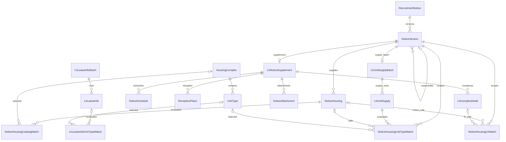

# 테이블 설계 사전

## 1. 문서 목적

이 문서는 프로젝트를 처음 보는 개발자가 18개 테이블의 역할과 연결 방식을 빠르게 찾기 위한 사전이다. 각 테이블은 다음 순서로 설명한다.

1. 행 하나가 무엇을 뜻하는가
2. 왜 별도 테이블로 나뉘었는가
3. 어느 테이블과 연결되고 어떤 키로 식별하는가
4. 각 속성은 어디에서 왔는가

HTTP 요청·응답과 원천 필드 계약은 [원천 API 명세](원천-API-명세.md)에서 이어서 본다. 이 문서의 테이블명과 관계는 실제 DB 기준이며, 모든 FK의 DB 갱신·삭제 규칙은 `NO ACTION`이다. JPA cascade는 이 규칙과 별개다.

## 2. 데이터의 네 층

### 2.1 최신 주택 카탈로그

`HousingComplex → UnitType`은 마이홈 15110581이 현재 알려 주는 단지·공급유형·주택형을 보관한다. 공급유형과 기관은 별도 마스터 테이블 없이 단지 행의 속성으로 저장하고, 같은 `hsmpSn`이라도 공급유형이 다르면 단지 행을 중복 생성한다.

### 2.2 불변 공고·버전 이력

`RecruitmentNotice`는 원공고와 정정·취소 버전의 체인을 묶는다. `NoticeVersion`과 `NoticeHousing`은 마이홈 15108420이 각 버전에서 말한 공고 내용과 공급행을 보존하며, 내용이 바뀌어도 기존 버전을 수정하지 않는다.

### 2.3 LH 보충 원천 스냅샷

`LhNoticeSupplement`와 네 자식은 LH 15057999 응답을, `LhUnitSupplyBatch`와 `LhUnitSupply`는 LH 15056765 응답을 공고버전에 붙여 보존한다. `LhLeaseInfoBatch`와 `LhLeaseInfo`는 LH 15059475의 전국 단지·주택형 카탈로그 스냅샷을 별도로 보존한다. 세 API는 요청 키가 같거나 비슷해도 별도 호출이므로 각각 독립된 aggregate다.

### 2.4 재계산 가능한 파생 매칭

네 match 테이블은 서로 다른 원천의 행을 연결한 판단 결과다. 원천 행은 그대로 두고 후보 수, 상태, 근거, 판정 시각, matcher 버전을 저장한다. 규칙이 바뀌면 이 층만 다시 계산한다.

원천값에서 결정적으로 얻는 PNU 앞 10자리나 enum 정규화는 원천 층에 둔다. 여러 후보 중 어느 행을 연결할지 고르는 판단은 match 테이블에만 둔다.

## 3. 전체 ER 구조

`NoticeVersion.supersedesVersion`은 직전 버전을 가리키는 nullable self FK다. match 테이블의 선택 대상 FK도 실패나 모호 상태를 표현하기 위해 nullable이다.

## 4. 18개 테이블 관계 요약

| DB 테이블 | Java 엔티티 | 데이터 층 | 행의 단위 | 부모 |
| --- | --- | --- | --- | --- |
| `housing_complex` | `HousingComplex` | 최신 카탈로그 | 원천 시스템 × 원천 단지 ID × 공급유형 | 없음 |
| `unit_type` | `UnitType` | 최신 카탈로그 | 단지 × 주택형명 × 두 면적 | `housing_complex` |
| `recruitment_notice` | `RecruitmentNotice` | 공고 이력 | 원공고와 정정·취소 체인 | 없음 |
| `notice_version` | `NoticeVersion` | 공고 이력 | 마이홈 `pblancId` 스냅샷 | `recruitment_notice`, 이전 버전(선택) |
| `notice_housing` | `NoticeHousing` | 공고 이력 | 공고버전 × `houseSn` | `notice_version` |
| `lh_notice_supplement` | `LhNoticeSupplement` | LH 스냅샷 | 공고버전의 15057999 응답 | `notice_version` |
| `notice_schedule` | `NoticeSchedule` | LH 스냅샷 | `dsSplScdl` 일정 행 | `lh_notice_supplement` |
| `reception_place` | `ReceptionPlace` | LH 스냅샷 | `dsCtrtPlc` 접수처 행 | `lh_notice_supplement` |
| `lh_complex_detail` | `LhComplexDetail` | LH 스냅샷 | `dsSbd` 단지 상세 행 | `lh_notice_supplement` |
| `notice_attachment` | `NoticeAttachment` | LH 스냅샷 | 공고문·단지 파일 행 | `lh_notice_supplement` |
| `lh_unit_supply_batch` | `LhUnitSupplyBatch` | LH 스냅샷 | 공고버전의 15056765 응답 | `notice_version` |
| `lh_unit_supply` | `LhUnitSupply` | LH 스냅샷 | 단지 × 주택형 공급행 | `lh_unit_supply_batch` |
| `notice_housing_catalog_match` | `NoticeHousingCatalogMatch` | 파생 매칭 | 공고 공급행 × matcher 버전 | `notice_housing`, 단지(선택) |
| `notice_housing_lh_match` | `NoticeHousingLhMatch` | 파생 매칭 | 공고버전 × matcher 버전 × 결과 순번 | 공고버전, 양쪽 후보(선택) |
| `notice_housing_unit_type_match` | `NoticeHousingUnitTypeMatch` | 파생 매칭 | LH 공급행 × matcher 버전 | 공급행, 공고행·주택형(선택) |
| `lh_lease_info_batch` | `LhLeaseInfoBatch` | LH 카탈로그 스냅샷 | 15059475 전국 응답 | 없음 |
| `lh_lease_info` | `LhLeaseInfo` | LH 카탈로그 스냅샷 | 지역 × 단지 × 전용면적 행 | `lh_lease_info_batch` |
| `lh_lease_info_unit_type_match` | `LhLeaseInfoUnitTypeMatch` | 파생 매칭 | 15059475 원천행 × matcher 버전 | 원천행, 주택형(선택) |

## 5. 최신 주택 카탈로그

마이홈 15110581의 건설형 공공임대 범위를 공급기관, 단지, 공급유형, 주택형으로 나눈 최신 상태 모델이다.

### 5.1 `housing_complex`

**행 하나**는 `source_system + source_complex_id + supply_type`으로 식별되는 현재 단지·공급유형 조합 하나다. 이름이나 주소가 아니라 마이홈 `hsmpSn`과 공급유형이 원천 정체성이다.

같은 `hsmpSn`에 공급유형이 여러 개면 이름·주소·PNU·준공·기관 같은 물리적 단지 속성을 각 행에 그대로 중복 저장한다. 이 행은 최신 카탈로그이며 공고 당시 상태는 `lh_complex_detail`에서 찾는다.

**관계/키:** PK `id` · UNIQUE `(source_system, source_complex_id, supply_type)` · 자식 `unit_type`

| 속성(DB 컬럼) | 의미 | 출처/비고 |
| --- | --- | --- |
| `id` | 내부 단지 PK | DB 생성 |
| `district_code` | 시군구 코드 | 15110581 `signguCode` |
| `district_name` | 시군구명 | 15110581 `signguNm` |
| `legal_dong_code` | 법정동코드 10자리 | 유효한 `pnu` 앞 10자리 |
| `pnu` | 필지고유번호 | 15110581 `pnu`; 유효한 19자리만 저장 |
| `province_code` | 광역시도 코드 | 15110581 `brtcCode` |
| `province_name` | 광역시도명 | 15110581 `brtcNm` |
| `road_address` | 단지 도로명주소 | 15110581 `rnAdres` |
| `completion_date` | 준공일 | 15110581 `competDe` 파싱 |
| `completion_year` | 준공연도 | `completion_date`에서 파생 |
| `corridor_type` | 계단식·복도식 등 건물 형태 원문 | 15110581 `buldStleNm` |
| `elevator_installation` | 승강기 설치 여부 원문 | 15110581 `elvtrInstlAtNm` |
| `heating_type` | 표준 난방 분류 | `heatMthdDetailNm`을 `HeatingType`으로 변환 |
| `heating_type_name` | 난방 원문 | 15110581 `heatMthdDetailNm` |
| `house_type` | 표준 주택유형 | `houseTyNm`을 `HouseType`으로 변환 |
| `house_type_name` | 주택유형 원문 | 15110581 `houseTyNm` |
| `name` | 단지 표시명 | `hsmpNm`; 없으면 지역명 또는 주소 |
| `parking_spaces` | 주차 가능 대수 | 15110581 `parkngCo` |
| `source_complex_id` | 원천 단지 ID | 15110581 `hsmpSn` |
| `source_system` | 원천 ID 네임스페이스 | 현재 `MYHOME_PORTAL` |
| `supply_type` | 표준 공급유형 enum | 15110581 `suplyTyNm` 변환 |
| `supply_type_name` | 공급유형 원문 | 15110581 `suplyTyNm` |
| `unit_count` | 이 단지·공급유형의 전체 세대수 | 15110581 `hshldCo` |
| `supply_institution_name` | 공급기관명. FK 없이 단지 행에 저장 | 15110581 `insttNm` |

### 5.2 `unit_type`

**행 하나**는 한 `housing_complex`(단지·공급유형) 안에서 주택형명·전용면적·주거공용면적이 같은 카탈로그 주택형 하나다.

주택형명만으로 다른 면적을 구분할 수 없으므로 면적을 자연키에 포함한다. 공급유형은 부모 `housing_complex`에 있으므로 이 테이블에 다시 저장하지 않는다.

**관계/키:** PK `id` · FK `housing_complex_id` · UNIQUE `(housing_complex_id, type_name, exclusive_area, residential_common_area)`

| 속성(DB 컬럼) | 의미 | 출처/비고 |
| --- | --- | --- |
| `id` | 내부 주택형 PK | DB 생성 |
| `base_convertible_deposit_limit` | 기본 전환보증금 한도(원) | 15110581 `bassCnvrsGtnLmt` |
| `base_deposit` | 기본 임대보증금(원) | 15110581 `bassRentGtn` |
| `base_monthly_rent` | 기본 월임대료(원) | 15110581 `bassMtRntchrg` |
| `exclusive_area` | 전용면적(㎡) | 15110581 `suplyPrvuseAr`; 소수 4자리 |
| `residential_common_area` | 주거공용면적(㎡) | 15110581 `suplyCmnuseAr`; 소수 4자리 |
| `type_name` | 주택형명 | 15110581 `styleNm` |
| `housing_complex_id` | 소속 단지·공급유형 FK | 같은 `hsmpSn`·공급유형의 `housing_complex` |
| `total_unit_count` | 이 전용면적 주택형의 단지 전체 세대수 | 15059475 `HSH_CNT`; 유일 매칭 때만 갱신 |

## 6. 핵심 값 객체

값 객체는 별도 테이블이 아니라 소유 엔티티의 컬럼으로 펼쳐진다. `CatalogDetails`와 `NoticeSnapshot`은 JPA 내장 타입이 아닌 논리 record다.

### 6.1 `Address`

`HousingComplex.address`의 `@Embeddable`이다. `road_address`, `legal_dong_code`, `pnu`, `province_code`, `province_name`, `district_code`, `district_name`으로 평탄화된다. 도로명주소를 중심으로 단지 주소를 묶고, 유효한 PNU만 보존한다.

### 6.2 `BaseRentTerms`

`UnitType.baseRentTerms`의 `@Embeddable`이다. `base_deposit`, `base_monthly_rent`, `base_convertible_deposit_limit`을 함께 다룬다. 특정 공고의 임대조건이 아니라 최신 카탈로그의 기준값이다.

### 6.3 `CatalogDetails`

`HousingComplex`의 변경 가능한 상세를 비교·복사하는 논리 record다. 준공일·난방·주차·복도·승강기·주택유형을 묶지만 별도 테이블이나 `@Embedded` 경계는 없다.

### 6.4 `NoticeSnapshot`

같은 `pblancId`를 다시 읽었을 때 공고 내용이 달라졌는지 비교하고 새 `NoticeVersion`을 만들기 위한 논리 record다. 공고 상태, 게시일, 제목, URL, 접수일, 당첨일, 기관·주택·공급유형 원문, 문의처를 묶는다.

### 6.5 `SuppliedHousing`

`NoticeHousing.suppliedHousing`의 `@Embeddable`이다. 공고가 말한 단지명, 주소, PNU, 도로·법정동·지역명, 난방 원문, 전체 세대수를 `supplied_*` 컬럼으로 보존한다. 최신 카탈로그와 연결돼도 덮어쓰지 않는다.

### 6.6 `RentTerms`

`NoticeHousing.rentTerms`의 `@Embeddable`이다. 이번 공고의 `deposit`, `down_payment`, `balance`, `monthly_rent`를 묶는다. `BaseRentTerms`와 시간과 의미가 다르다.

### 6.7 `NoticeHousingLhMatchEvidence`

`NoticeHousingLhMatch.evidence`의 `@Embeddable`이다. 양쪽 주소 원문·정규화값, 세대수, 후보 LH 상세 ID, 판정 이유를 보존해 주소 matcher 결과를 설명한다.

## 7. 불변 공고·버전 이력

마이홈 15108420의 `pblancId`별 내용을 버전 스냅샷과 공급행으로 나눈다.

### 7.1 `recruitment_notice`

**행 하나**는 원공고와 뒤이은 정정·취소 공고를 묶는 버전 체인 하나다.

정정공고마다 새 `pblancId`가 발급되므로, 여러 원천 ID가 같은 공고의 시간 순서임을 표현하려고 변하지 않는 루트를 분리했다.

**관계/키:** PK `id` · UNIQUE `(source_system, source_root_notice_id)` · 자식 `notice_version`

| 속성(DB 컬럼) | 의미 | 출처/비고 |
| --- | --- | --- |
| `id` | 내부 공고 체인 PK | DB 생성 |
| `source_root_notice_id` | 체인을 시작한 원천 공고 ID | 최초 `pblancId`; 끊긴 체인은 현재 ID |
| `source_system` | 원천 네임스페이스 | 현재 `MYHOME_PORTAL` |

### 7.2 `notice_version`

**행 하나**는 마이홈 `pblancId` 하나가 표현한 불변 공고 스냅샷이다. 정정·취소는 새 행이 된다.

현재값으로 덮어쓰면 과거 공고 내용과 공급행을 복원할 수 없어 루트와 분리했다. `supersedes_version_id`가 직전 버전을 잇는다.

**관계/키:** PK `id` · FK `recruitment_notice_id`, `supersedes_version_id`(선택) · UNIQUE `(source_system, source_notice_id)`, `(recruitment_notice_id, version_number)`

| 속성(DB 컬럼) | 의미 | 출처/비고 |
| --- | --- | --- |
| `id` | 내부 공고버전 PK | DB 생성 |
| `application_begin_on` | 접수 시작일 | 15108420 `beginDe` |
| `application_end_on` | 접수 종료일 | 15108420 `endDe` |
| `before_source_notice_id` | 직전 공고 ID 원문 | 15108420 `beforePblancId` |
| `contact` | 문의처 | 15108420 `refrnc` |
| `detail_url` | 공고 원문 URL | 15108420 `url`; LH 요청 키를 포함할 수 있음 |
| `house_type` | 표준 주택유형 | `houseTyNm` 변환 |
| `house_type_name` | 주택유형 원문 | 15108420 `houseTyNm` |
| `notice_change_status` | 원공고·정정·취소 상태 | 15108420 `sttusNm` 변환 |
| `published_at` | 게시 시각 | `rcritPblancDe` 날짜의 자정 |
| `source_notice_id` | 이 버전의 원천 ID | 15108420 `pblancId` |
| `source_system` | 원천 네임스페이스 | 루트에서 복사 |
| `supply_institution_name` | 공급기관명 | 15108420 `suplyInsttNm` |
| `supply_type` | 표준 공급유형 | `suplyTyNm` 변환 |
| `supply_type_name` | 공급유형 원문 | 15108420 `suplyTyNm` |
| `title` | 공고명 | 15108420 `pblancNm` |
| `version_number` | 루트 안의 1부터 시작하는 순번 | 직전 버전 + 1 |
| `winner_announced_on` | 당첨자 발표일 | 15108420 `przwnerPresnatnDe` |
| `recruitment_notice_id` | 공고 체인 FK | 소속 루트 |
| `supersedes_version_id` | 대체한 직전 버전 FK | `beforePblancId`로 찾음; 없으면 `NULL` |

### 7.3 `notice_housing`

**행 하나**는 한 공고버전의 `houseSn` 공급행 하나다. 공고 시점의 대상 주택, 공급 수, 실제 임대조건을 보존한다.

15108420 한 행에는 공고 공통값과 공급행 값이 함께 반복된다. 공통값은 `notice_version`에 두고 주택별 사실만 자식으로 분리했다.

**관계/키:** PK `id` · FK `notice_version_id` · UNIQUE `(notice_version_id, house_sn)`, `(notice_version_id, display_order)`

| 속성(DB 컬럼) | 의미 | 출처/비고 |
| --- | --- | --- |
| `id` | 내부 공고 공급행 PK | DB 생성 |
| `detail_url` | PC 상세 URL | 15108420 `pcUrl` |
| `display_order` | 공고 안 표시 순서 | 유효 원천 행 순서, 0부터 시작 |
| `house_sn` | 공고 안 주택 일련번호 | 15108420 `houseSn` |
| `mobile_detail_url` | 모바일 상세 URL | 15108420 `mobileUrl` |
| `balance` | 임대보증금 잔금 | 15108420 `surlus` |
| `deposit` | 임대보증금 | 15108420 `rentGtn` |
| `down_payment` | 계약금 | 15108420 `enty` |
| `monthly_rent` | 월임대료 | 15108420 `mtRntchrg` |
| `supplied_complex_name` | 대상 단지명 | 15108420 `hsmpNm` |
| `supplied_district_name` | 시군구명 | 15108420 `signguNm` |
| `supplied_full_address` | 전체 주소 | 15108420 `fullAdres` |
| `supplied_heating_type_name` | 난방 원문 | 15108420 `heatMthdNm` |
| `supplied_pnu` | 필지고유번호 | 15108420 `pnu` |
| `supplied_province_name` | 광역시도명 | 15108420 `brtcNm` |
| `supplied_reference_legal_dong_name` | 참고 법정동명 | 15108420 `refrnLegaldongNm` |
| `supplied_road_name` | 도로명 | 15108420 `rnCodeNm` |
| `supplied_total_unit_count` | 대상 주택 전체 세대수 | 15108420 `totHshldCo` |
| `supply_count` | 이번 공고 공급 수 | 15108420 `sumSuplyCo` |
| `notice_version_id` | 소속 공고버전 FK | 같은 `pblancId`의 버전 |

## 8. LH 15057999 보충 스냅샷

15057999의 서로 다른 데이터셋을 한 루트 아래 일정, 접수처, 단지 상세, 첨부파일로 보존한다.

### 8.1 `lh_notice_supplement`

**행 하나**는 한 공고버전에 대해 받은 15057999 응답 묶음 하나다. 요청 키와 응답 메타데이터도 함께 보존한다.

자식마다 반복되는 요청·수집 정보를 한 번만 저장하고, 15056765와 독립된 호출 생명주기를 유지하려고 별도 루트로 뒀다.

**관계/키:** PK `id` · FK/UNIQUE `notice_version_id` · 자식 일정·접수처·단지 상세·첨부파일

| 속성(DB 컬럼) | 의미 | 출처/비고 |
| --- | --- | --- |
| `id` | 내부 보충 스냅샷 PK | DB 생성 |
| `complex_detail_dataset_present` | `dsSbd` 키 존재 여부 | 빈 배열과 데이터셋 누락을 구분 |
| `correction_reason` | 정정·취소 사유 | `dsEtcInfo.CRC_RSN` |
| `fetched_at` | 애플리케이션 수집 시각 | 적재 시각 |
| `requested_announcement_type_code` | 요청 공고유형코드 | URL `aisTpCd` |
| `requested_connection_system_division_code` | 요청 접속시스템코드 | URL `ccrCnntSysDsCd` |
| `requested_supply_info_type_code` | 요청 공급정보구분코드 | 공고 공급유형에서 변환 |
| `requested_upper_announcement_type_code` | 요청 상위공고유형코드 | URL `uppAisTpCd` |
| `source_pan_id` | LH 공고 ID | URL `panId` |
| `source_responded_at` | LH 응답 생성 시각 | `resHeader.RS_DTTM` |
| `source_system` | 원천 | `LH_CHEONGYAK_PLUS` |
| `notice_version_id` | 대상 공고버전 FK | 호출 대상 버전 |

### 8.2 `notice_schedule`

**행 하나**는 `dsSplScdl` 일정 행 하나다. 단지별 신청·서류·계약 일정을 원천 순서로 보존한다.

한 공고에 여러 일정이 있고 신청 기간은 날짜 하나로 축약할 수 없는 원문이라 ordered child로 분리했다.

**관계/키:** PK `id` · FK `lh_notice_supplement_id` · UNIQUE `(lh_notice_supplement_id, display_order)`

| 속성(DB 컬럼) | 의미 | 출처/비고 |
| --- | --- | --- |
| `id` | 내부 일정 PK | DB 생성 |
| `application_period_text` | 신청 기간·시간 원문 | `dsSplScdl.ACP_DTTM` |
| `complex_label` | 대상 단지 라벨 | `dsSplScdl.SBD_LGO_NM` |
| `contract_begin_on` | 계약 시작일 | `dsSplScdl.CTRT_ST_DT` |
| `contract_end_on` | 계약 종료일 | `dsSplScdl.CTRT_ED_DT` |
| `display_order` | 표시 순서 | 유효 원천 행 순서, 0부터 시작 |
| `document_submission_begin_on` | 서류 제출 시작일 | `dsSplScdl.PPR_ACP_ST_DT` |
| `document_submission_end_on` | 서류 제출 종료일 | `dsSplScdl.PPR_ACP_CLSG_DT` |
| `document_target_announced_on` | 서류 대상자 발표일 | `dsSplScdl.PPR_SBM_OPE_ANC_DT` |
| `lh_notice_supplement_id` | 보충 스냅샷 FK | 소속 15057999 응답 |

### 8.3 `reception_place`

**행 하나**는 `dsCtrtPlc` 현장 접수처 안내 행 하나다. 주소, 운영시간, 전화번호, 안내문을 장소 단위로 보존한다.

접수처가 여러 곳일 수 있고 안내도 장소별로 달라 단일 공고 문자열 대신 ordered child로 분리했다.

**관계/키:** PK `id` · FK `lh_notice_supplement_id` · UNIQUE `(lh_notice_supplement_id, display_order)`

| 속성(DB 컬럼) | 의미 | 출처/비고 |
| --- | --- | --- |
| `id` | 내부 접수처 PK | DB 생성 |
| `address` | 기본 주소 | `dsCtrtPlc.CTRT_PLC_ADR` |
| `detail_address` | 상세 주소 | `dsCtrtPlc.CTRT_PLC_DTL_ADR` |
| `display_order` | 표시 순서 | 유효 원천 행 순서 |
| `guidance` | 방문·운영 안내 | `dsCtrtPlc.SIL_OFC_GUD_FCTS` |
| `operation_begin_text` | 운영 시작 원문 | `dsCtrtPlc.TSK_ST_DTTM` |
| `operation_end_text` | 운영 종료 원문 | `dsCtrtPlc.TSK_ED_DTTM` |
| `phone` | 전화번호 원문 | `dsCtrtPlc.SIL_OFC_TLNO` |
| `lh_notice_supplement_id` | 보충 스냅샷 FK | 소속 15057999 응답 |

### 8.4 `lh_complex_detail`

**행 하나**는 `dsSbd`가 공고 시점에 안내한 LH 단지 상세 하나다. 단지명·주소·세대수·난방·면적범위·입주예정월의 스냅샷이다.

최신 마이홈 카탈로그와 원천·수집 시점이 다르고 PNU도 없으므로 직접 합치지 않는다. 연결은 주소 matcher가 별도로 계산한다.

**관계/키:** PK `id` · FK `lh_notice_supplement_id` · UNIQUE `(lh_notice_supplement_id, display_order)`

| 속성(DB 컬럼) | 의미 | 출처/비고 |
| --- | --- | --- |
| `id` | 내부 LH 단지 상세 PK | DB 생성 |
| `complex_label` | LH 단지 라벨 | `dsSbd.LCC_NT_NM` |
| `display_order` | 표시 순서 | 유효 원천 행 순서 |
| `exclusive_area_range_text` | 전용면적 범위 원문 | `dsSbd.DDO_AR` |
| `expected_move_in_year_month` | 입주 예정 연월 | `dsSbd.MVIN_XPC_YM`, `yyyy-MM` |
| `guidance_text` | 단지 공급 안내문 | `dsSbd.SPL_INF_GUD_FCTS` |
| `heating_description` | 난방 설명 원문 | `dsSbd.HTN_FMLA_DESC` |
| `lot_address` | 지번 기본 주소 | `dsSbd.LGDN_ADR` |
| `lot_detail_address` | 지번 상세 주소 | `dsSbd.LGDN_DTL_ADR` |
| `total_unit_count` | 공고 시점 단지 세대수 | `dsSbd.HSH_CNT` |
| `lh_notice_supplement_id` | 보충 스냅샷 FK | 소속 15057999 응답 |

### 8.5 `notice_attachment`

**행 하나**는 공고문 파일 또는 단지 이미지 파일 하나다. `dsAhflInfo`와 `dsSbdAhfl`의 유효 파일을 한 순서로 잇는다.

두 데이터셋이 파일명·종류·URL이라는 같은 구조를 가져 한 테이블로 합치고, 종류와 단지 라벨로 의미 차이를 남겼다.

**관계/키:** PK `id` · FK `lh_notice_supplement_id` · UNIQUE `(lh_notice_supplement_id, display_order)`

| 속성(DB 컬럼) | 의미 | 출처/비고 |
| --- | --- | --- |
| `id` | 내부 첨부파일 PK | DB 생성 |
| `complex_label` | 이미지 대상 단지 라벨 | `dsSbdAhfl.LCC_NT_NM`; 공고문은 `NULL` |
| `display_order` | 두 데이터셋을 이은 순서 | 공고문 뒤 단지 파일 |
| `kind` | 파일 종류 원문 | 두 데이터셋의 파일 구분명 |
| `name` | 파일명 | `CMN_AHFL_NM` |
| `url` | 다운로드·이미지 URL | `AHFL_URL`; 유효한 HTTP(S)만 저장 |
| `lh_notice_supplement_id` | 보충 스냅샷 FK | 소속 15057999 응답 |

## 9. LH 15056765 공급 스냅샷

15056765의 `dsList01`은 공고가 실제로 공급하는 단지별 주택형과 세대수를 준다.

### 9.1 `lh_unit_supply_batch`

**행 하나**는 한 공고버전에 대해 받은 15056765 응답 묶음 하나다. 요청 키와 데이터셋 존재 여부를 보존한다.

공급행마다 반복되는 요청·수집 메타데이터를 한 번만 저장하고, 15057999의 성공·실패와 독립적으로 관리하려고 루트를 분리했다.

**관계/키:** PK `id` · FK/UNIQUE `notice_version_id` · 자식 `lh_unit_supply`

| 속성(DB 컬럼) | 의미 | 출처/비고 |
| --- | --- | --- |
| `id` | 내부 공급 배치 PK | DB 생성 |
| `fetched_at` | 애플리케이션 수집 시각 | 적재 시각 |
| `requested_announcement_type_code` | 요청 공고유형코드 | URL `aisTpCd` |
| `requested_connection_system_division_code` | 요청 접속시스템코드 | URL `ccrCnntSysDsCd` |
| `requested_supply_info_type_code` | 요청 공급정보구분코드 | 공고 공급유형에서 변환 |
| `requested_upper_announcement_type_code` | 요청 상위공고유형코드 | URL `uppAisTpCd` |
| `source_pan_id` | LH 공고 ID | URL `panId` |
| `source_responded_at` | LH 응답 생성 시각 | `resHeader.RS_DTTM` |
| `source_system` | 원천 | `LH_CHEONGYAK_PLUS` |
| `unit_supply_dataset_present` | `dsList01` 키 존재 여부 | 빈 배열과 데이터셋 누락을 구분 |
| `notice_version_id` | 대상 공고버전 FK | 호출 대상 버전 |

### 9.2 `lh_unit_supply`

**행 하나**는 `dsList01`의 단지 × 주택형 공급행 하나다. 이번 공고 공급 수의 기준 원천이다.

한 응답에 여러 단지와 주택형이 반복되므로 배치 메타데이터와 분리했다. 카탈로그 연결이 실패해도 이 원천 행은 조회에서 유지한다.

**관계/키:** PK `id` · FK `lh_unit_supply_batch_id` · UNIQUE `(lh_unit_supply_batch_id, display_order)`

| 속성(DB 컬럼) | 의미 | 출처/비고 |
| --- | --- | --- |
| `id` | 내부 LH 공급행 PK | DB 생성 |
| `complex_label` | LH 단지명 원문 | `dsList01.SBD_LGO_NM` |
| `display_order` | 배치 안 표시 순서 | 유효 원천 행 순서 |
| `exclusive_area` | 전용면적(㎡) | `dsList01.DDO_AR` |
| `supplied_unit_count` | 이번 공고 공급 세대수 | `dsList01.NOW_HSH_CNT` |
| `supply_area` | 공급면적(㎡) | `dsList01.SPL_AR` |
| `total_unit_count` | 해당 주택형 전체 세대수 | `dsList01.HSH_CNT` |
| `type_name` | LH 주택형명 원문 | `dsList01.HTY_NNA` |
| `lh_unit_supply_batch_id` | 소속 공급 배치 FK | 같은 15056765 응답 |

### 9.3 `lh_lease_info_batch` / `lh_lease_info`

15059475의 전국 LH 임대단지 주택형 카탈로그를 보존하는 현재 스냅샷이다.
공고버전에 종속되지 않으며, 유효한 전국 응답을 받았을 때 이전 배치와 자식 행을 함께 교체한다.

`lh_lease_info_batch`의 행 하나는 한 번에 받은 응답 묶음이다. `source_responded_at`과
`fetched_at`을 분리해 원천 응답 시각과 애플리케이션 수집 시각을 구분한다.

**관계/키:** `lh_lease_info_batch` PK `id` · 자식 `lh_lease_info`; `lh_lease_info` PK `id` · FK `lh_lease_info_batch_id` · UNIQUE `(lh_lease_info_batch_id, display_order)`

| 테이블·컬럼 | 의미 | 원천 필드/비고 |
| --- | --- | --- |
| `lh_lease_info_batch.source_system` | 원천 네임스페이스 | 고정 `LH_LEASE_INFO` |
| `lh_lease_info_batch.source_responded_at` | 원천 응답 시각 | `resHeader.RS_DTTM` |
| `lh_lease_info_batch.fetched_at` | 수집 시각 | 애플리케이션 `Clock` |
| `lh_lease_info.area_name` | 지역명 | `ARA_NM` |
| `lh_lease_info.supply_type_name` | 공급유형명 | `AIS_TP_CD_NM` |
| `lh_lease_info.complex_label` | LH 단지명 | `SBD_LGO_NM`; 안정적인 단지 ID가 없어 원문 보존 |
| `lh_lease_info.complex_total_unit_count` | 단지·공급유형 전체 세대수 | `SUM_HSH_CNT`; `HousingComplex.unit_count` 검증 |
| `lh_lease_info.exclusive_area` | 전용면적(㎡) | `DDO_AR`; 주택형 매칭 키 |
| `lh_lease_info.total_unit_count` | 해당 전용면적 주택형 전체 세대수 | `HSH_CNT`; 확정 매칭 때 `unit_type.total_unit_count`로 복사 |
| `lh_lease_info.deposit` | 현재 카탈로그 주택형 임대보증금 | `LS_GMY`; 숫자로 파싱 가능한 경우만 저장 |
| `lh_lease_info.monthly_rent` | 현재 카탈로그 주택형 월임대료 | `RFE`; 숫자로 파싱 가능한 경우만 저장 |
| `lh_lease_info.display_order` | 스냅샷 내 원천행 순서 | 페이지를 합친 순서 |

`dsList`가 누락되거나 모든 행이 비면 스냅샷을 교체하지 않는다. 단지명·지역·공급유형·
`SUM_HSH_CNT`가 카탈로그 단지·공급유형 하나로 좁혀지고 `DDO_AR`가 `UnitType.exclusive_area`와
정확히 하나 일치할 때만 `HSH_CNT`를 반영한다. 소수 자릿수 차이는 허용하지만 ±0.05㎡ 근사는 쓰지 않는다.

## 10. 재계산 가능한 파생 매칭

### 10.1 `notice_housing_catalog_match`

**행 하나**는 한 공고 공급행을 한 matcher 버전으로 카탈로그 단지에 연결한 PNU 판정 하나다.

PNU 후보 선택은 원천 사실이 아니라 규칙의 판단이므로 `notice_housing`의 nullable FK로 숨기지 않고 별도 결과로 분리했다.

**관계/키:** PK `id` · FK `notice_housing_id`, `housing_complex_id`(선택) · UNIQUE `(notice_housing_id, matcher_version)`

| 속성(DB 컬럼) | 의미 | 출처/비고 |
| --- | --- | --- |
| `id` | 내부 판정 PK | DB 생성 |
| `candidate_count` | 같은 PNU 단지 후보 수 | 카탈로그 조회 결과 |
| `compared_pnu` | 비교에 쓴 PNU | 공고 공급행에서 복사 |
| `evaluated_at` | 판정 시각 | matcher 실행 시각 |
| `matcher_version` | PNU matcher 버전 | 실행 인자 |
| `status` | `MATCHED_PNU`, `UNMATCHED`, `AMBIGUOUS` | 후보 수로 계산 |
| `housing_complex_id` | 선택한 단지 FK | 후보가 정확히 하나일 때만 존재 |
| `notice_housing_id` | 평가한 공고 공급행 FK | matcher 대상 |

### 10.2 `notice_housing_lh_match`

**행 하나**는 공고 공급행과 LH 단지 상세의 주소·세대수 판정 하나다. LH 쪽에만 남은 상세도 결과 행으로 표현한다.

LH 상세에는 PNU가 없어 주소 정규화와 양방향 후보 수, 세대수를 함께 봐야 한다. 이 판단과 근거를 원천 두 테이블에서 떼어내 재계산 가능하게 했다.

**관계/키:** PK `id` · FK `notice_version_id`, `notice_housing_id`(선택), `lh_complex_detail_id`(선택) · UNIQUE `(notice_version_id, matcher_version, result_order)`

| 속성(DB 컬럼) | 의미 | 출처/비고 |
| --- | --- | --- |
| `id` | 내부 판정 PK | DB 생성 |
| `evaluated_at` | 판정 시각 | matcher 실행 시각 |
| `candidate_lh_complex_detail_ids` | 후보 LH 상세 ID 목록 | 잔여 LH 행은 자기 ID |
| `lh_address_normalized` | 공백 제거한 LH 주소 | `lh_address_raw` 정규화 |
| `lh_address_raw` | LH 주소 원문 | 기본·상세 지번주소 조립 |
| `lh_unit_count` | LH 단지 세대수 | `lh_complex_detail`에서 복사 |
| `notice_address_normalized` | 공백 제거한 공고 주소 | `notice_address_raw` 정규화 |
| `notice_address_raw` | 공고 주소 원문 | `notice_housing`에서 복사 |
| `notice_unit_count` | 공고 대상 전체 세대수 | `notice_housing`에서 복사 |
| `reason` | 판정 이유 | matcher 생성 |
| `lh_candidate_count` | 공고 행이 찾은 LH 후보 수 | 주소 후보 조회 결과 |
| `matcher_version` | 주소 matcher 버전 | 실행 인자 |
| `notice_candidate_count` | LH 후보를 가리킨 공고 행 수 | 역방향 후보 수 |
| `result_order` | 실행 범위 안 결과 순번 | 재현 가능한 순서 |
| `status` | 주소·세대수 판정 상태 | 아래 상태표 참고 |
| `lh_complex_detail_id` | 상대 또는 잔여 LH 상세 FK | 확정·충돌·잔여일 때 존재 가능 |
| `notice_housing_id` | 평가한 공고 공급행 FK | LH 잔여 행은 `NULL` |
| `notice_version_id` | 판정 범위 공고버전 FK | matcher 대상 버전 |

### 10.3 `notice_housing_unit_type_match`

**행 하나**는 한 LH 공급행을 한 matcher 버전으로 카탈로그 `UnitType`까지 연결한 판정 하나다.

LH와 카탈로그가 직접 단지 ID를 공유하지 않아 주소/PNU 판정을 거쳐야 한다. 이 긴 경로를 원천에 덮어쓰지 않고 실패·모호 상태까지 별도 행으로 보존한다.

**관계/키:** PK `id` · FK `notice_version_id`, `lh_unit_supply_id`, `notice_housing_id`(선택), `unit_type_id`(선택) · UNIQUE `(notice_version_id, matcher_version, result_order)`

| 속성(DB 컬럼) | 의미 | 출처/비고 |
| --- | --- | --- |
| `id` | 내부 판정 PK | DB 생성 |
| `candidate_count` | 마지막 면적 후보 수 | 공급유형과 ±0.05㎡ 조회 결과 |
| `evaluated_at` | 판정 시각 | matcher 실행 시각 |
| `matcher_version` | 주택형 matcher 버전 | 실행 인자 |
| `reason` | 경로 단절·후보 근거 | matcher 생성 |
| `result_order` | 실행 범위 안 결과 순번 | 공급행 순서 |
| `source_complex_label` | LH 단지명 근거 복사본 | `lh_unit_supply` |
| `source_exclusive_area` | LH 전용면적 근거 복사본 | `lh_unit_supply` |
| `source_type_name` | LH 주택형명 근거 복사본 | `lh_unit_supply` |
| `source_total_unit_count` | LH 주택형 전체 세대수 근거 복사본 | `lh_unit_supply.total_unit_count` |
| `status` | 주택형 연결 상태 | 아래 상태표 참고 |
| `supplied_unit_count` | 이번 공고 공급 수 복사본 | `lh_unit_supply` |
| `notice_deposit` | 공고 공급행 임대보증금 | `notice_housing.rent_terms.deposit` 반복 복사; 주택형별 독립 산출값 아님 |
| `notice_down_payment` | 공고 공급행 계약금 | `notice_housing.rent_terms.down_payment` 반복 복사 |
| `notice_balance` | 공고 공급행 잔금 | `notice_housing.rent_terms.balance` 반복 복사 |
| `notice_monthly_rent` | 공고 공급행 월임대료 | `notice_housing.rent_terms.monthly_rent` 반복 복사 |
| `catalog_deposit` | 현재 카탈로그 주택형 임대보증금 | 확정 `unit_type.baseRentTerms.deposit`; 15059475 `LS_GMY` |
| `catalog_monthly_rent` | 현재 카탈로그 주택형 월임대료 | 확정 `unit_type.baseRentTerms.monthlyRent`; 15059475 `RFE` |
| `catalog_convertible_deposit_limit` | 현재 카탈로그 전환보증금 한도 | 기존 `unit_type.baseRentTerms` 값 복사 |
| `lh_unit_supply_id` | 평가한 LH 공급행 FK | matcher 주어 |
| `notice_housing_id` | 주소 단계에서 확정한 공고행 FK | 경로 도달 시 존재 |
| `notice_version_id` | 판정 범위 공고버전 FK | matcher 대상 버전 |
| `unit_type_id` | 선택한 카탈로그 주택형 FK | `MATCHED`일 때 존재 |

### 10.4 `lh_lease_info_unit_type_match`

**행 하나**는 15059475 원천행을 한 matcher 버전으로 `UnitType`에 연결한 판정 하나다.
15059475에는 단지 ID·PNU·주소가 없으므로 이 테이블은 원천행과 카탈로그 사이의
이름·공급유형·총세대수·전용면적 검증 결과를 별도로 보존한다.

**관계/키:** PK `id` · FK `lh_lease_info_id`, `unit_type_id`(선택) · UNIQUE `(lh_lease_info_id, matcher_version)`

| 속성(DB 컬럼) | 의미 | 출처/비고 |
| --- | --- | --- |
| `lh_lease_info_id` | 평가한 15059475 원천행 FK | matcher 주어 |
| `unit_type_id` | 선택한 카탈로그 주택형 FK | `MATCHED`일 때만 존재 |
| `status` | `MATCHED`, `AMBIGUOUS`, `UNMATCHED`, `CONFLICT_PROGRAM_UNIT_COUNT` | 후보·총세대수 판정 |
| `candidate_count` | 해당 단계 후보 수 | 공급유형·면적 후보 또는 중복 원천행 수 |
| `matcher_version` | 매칭 규칙 버전 | 현재 `lh-lease-info-area-v1` |
| `evaluated_at` | 판정 시각 | matcher 실행 시각 |
| `reason` | 판정 근거 | 이름·면적·총세대수 검증 결과 |

동일 `UnitType`을 가리키는 원천행이 여러 건이면 모든 판정을 `AMBIGUOUS`로 남기고
`unit_type_id`를 채우지 않는다. 따라서 같은 스냅샷 안에서 마지막 `HSH_CNT`가 앞선 값을 덮어쓰지 않는다.

## 11. 네 matcher의 연결 원리와 상태

공고 주택형 matcher는 앞 단계의 확정 결과를 다음 단계의 경로로 사용한다. 15059475 카탈로그 matcher는 공고 체인과 독립적으로 최신 `UnitType` 카탈로그를 보강한다.

1. **카탈로그 PNU matcher:** `NoticeHousing.supplied_pnu`와 `HousingComplex.pnu`를 비교한다. 후보 1개면 `MATCHED_PNU`, 0개면 `UNMATCHED`, 여러 개면 `AMBIGUOUS`다.
2. **LH 주소 matcher:** 공고 주소와 LH 지번주소를 공백 제거 후 비교하고 양방향 후보 수를 확인한다. 유일 후보면 세대수까지 비교한다.
3. **공고 주택형 matcher:** LH 단지명을 같은 공고의 LH 상세에 연결하고, 확정된 주소 matcher와 PNU matcher를 지나 카탈로그 단지에 도달한다. 같은 공급유형에서 전용면적 차이 ±0.05㎡인 `UnitType`을 고른다.
4. **LH 카탈로그 matcher:** 15059475의 지역·단지명·공급유형·`SUM_HSH_CNT`를 카탈로그 `HousingComplex`와 비교한 뒤, `DDO_AR`가 정확히 같은 `UnitType`에 `HSH_CNT`를 반영한다.

| matcher | 확정 상태 | 그 밖의 상태 의미 |
| --- | --- | --- |
| PNU | `MATCHED_PNU` | `UNMATCHED`: 후보 없음, `AMBIGUOUS`: 여러 후보 |
| LH 주소 | `MATCHED_ADDRESS_AND_UNIT_COUNT`, `MATCHED_ADDRESS_ONLY` | `CONFLICT_UNIT_COUNT`: 주소는 유일하지만 세대수 충돌, `AMBIGUOUS`: 주소 후보 다수, `UNMATCHED`: 한쪽 잔여, `SOURCE_DETAIL_MISSING`: `dsSbd` 없음 |
| 주택형 | `MATCHED` | `AMBIGUOUS`: 면적 후보 다수, `UNMATCHED`: 면적 후보 없음, `NO_CATALOG_PATH`: 앞 연결 단절, `SOURCE_DATA_MISSING`: 공급 데이터 없음 |
| LH 카탈로그 | `MATCHED` | `AMBIGUOUS`: 단지·공급유형 또는 원천행 중복, `UNMATCHED`: 정확한 면적 후보 없음, `CONFLICT_PROGRAM_UNIT_COUNT`: `SUM_HSH_CNT`와 `HousingComplex.unit_count` 충돌 |

선택 대상 FK가 채워져 있어도 확정 상태가 아니면 조회 연결로 사용하지 않는다. 특히 `CONFLICT_UNIT_COUNT`의 LH FK는 조사 근거다. 결과 행이 아예 없으면 미매칭으로 단정하지 말고 matcher 실행 여부와 원천 데이터셋 존재 여부를 먼저 확인한다.

## 12. 주요 조회 경로

### 12.1 공고 → 주택형별 공급 사실

`RecruitmentNotice → 조회 정책이 고른 NoticeVersion → LhUnitSupplyBatch → LhUnitSupply`

`lh_unit_supply.type_name`이 LH 주택형명 원문이고 `supplied_unit_count`가 이번 공고 공급 수다. 카탈로그 매칭이 없어도 공급행은 결과에 포함한다. `RecruitmentNotice`에 current 플래그는 없으므로 최신 버전 선택은 `version_number`, 게시일, 취소 포함 여부를 정한 조회 정책의 몫이다.

### 12.2 공급행 → 카탈로그 UnitType·임대조건 보강

`LhUnitSupply → NoticeHousingUnitTypeMatch(선택한 matcher_version, MATCHED) → UnitType → BaseRentTerms`

조회 시작점은 `lh_unit_supply`이며 match는 left join으로 다룬다. `MATCHED`면 카탈로그 주택형명·면적·기준 임대조건을 붙이고, 그 밖의 상태나 결과 없음이면 원천 공급행은 유지한 채 보강값만 비운다.

### 12.3 LH 카탈로그 → UnitType 총세대수 보강

`LhLeaseInfo → LhLeaseInfoUnitTypeMatch(선택한 matcher_version, MATCHED) → UnitType`

`MATCHED`일 때만 `lh_lease_info.total_unit_count(HSH_CNT)`가 `UnitType.total_unit_count`에 기록된다.
이 값은 `HousingComplex.unitCount(SUM_HSH_CNT)`와 다르며, 공고의 이번 회차 공급 수와도 다르다.

## 13. 현재 상태

아래 값은 **2026-08-13 스냅샷**이며 수집이나 matcher 재실행에 따라 달라진다.

| 항목 | 값 |
| --- | ---: |
| `housing_complex` | 2,969 |
| `unit_type` | 11,170 |
| `notice_version` | 56 |
| `lh_unit_supply` | 290 |
| 주택형 match `MATCHED` | 202 |
| 주택형 match `AMBIGUOUS` | 30 |
| 주택형 match `NO_CATALOG_PATH` | 58 |
| `lh_lease_info` (15059475) | 6,710 |
| LH 카탈로그 match `MATCHED` | 1,487 |
| LH 카탈로그 match `AMBIGUOUS` | 76 |
| LH 카탈로그 match `CONFLICT_PROGRAM_UNIT_COUNT` | 8 |
| LH 카탈로그 match `UNMATCHED` | 5,139 |
